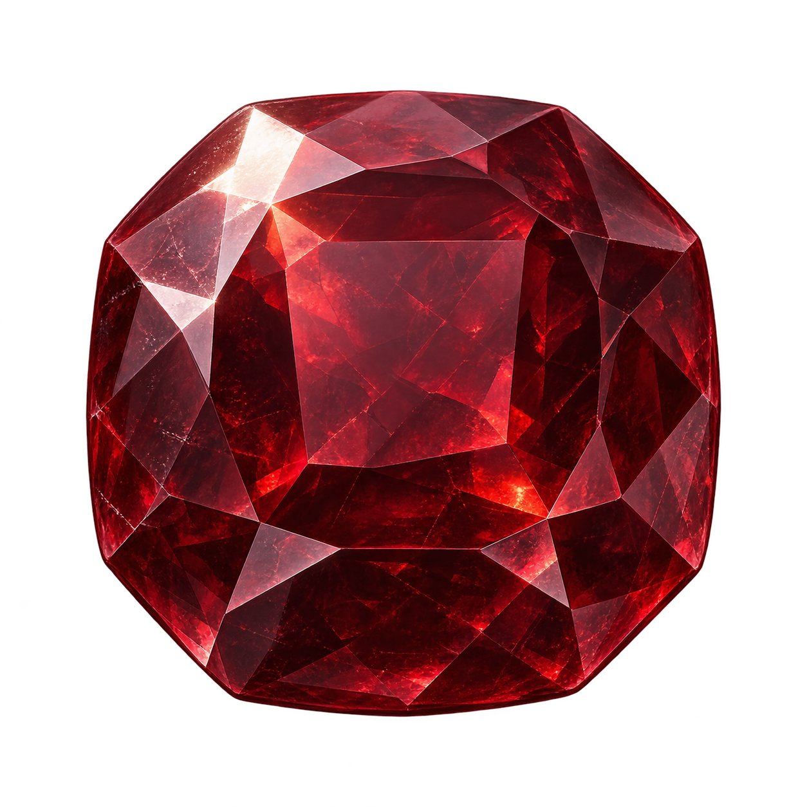
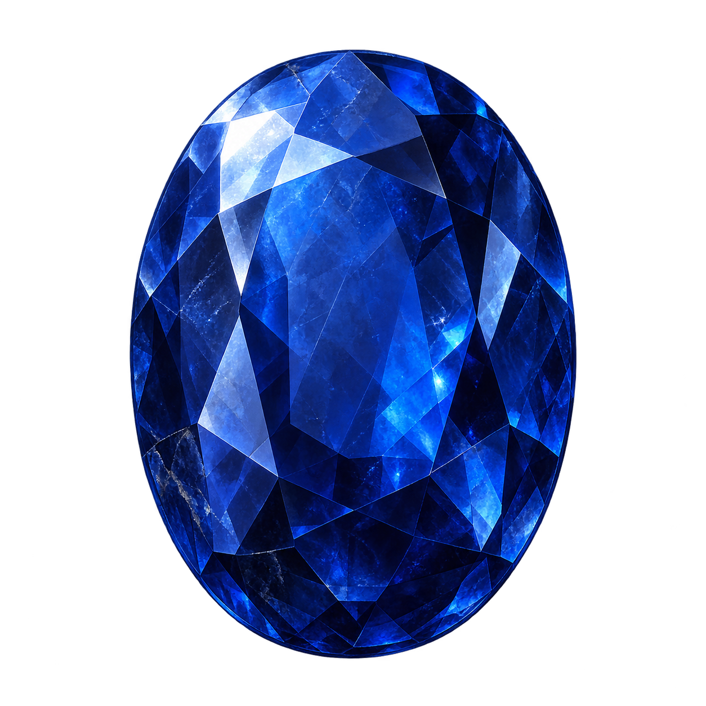
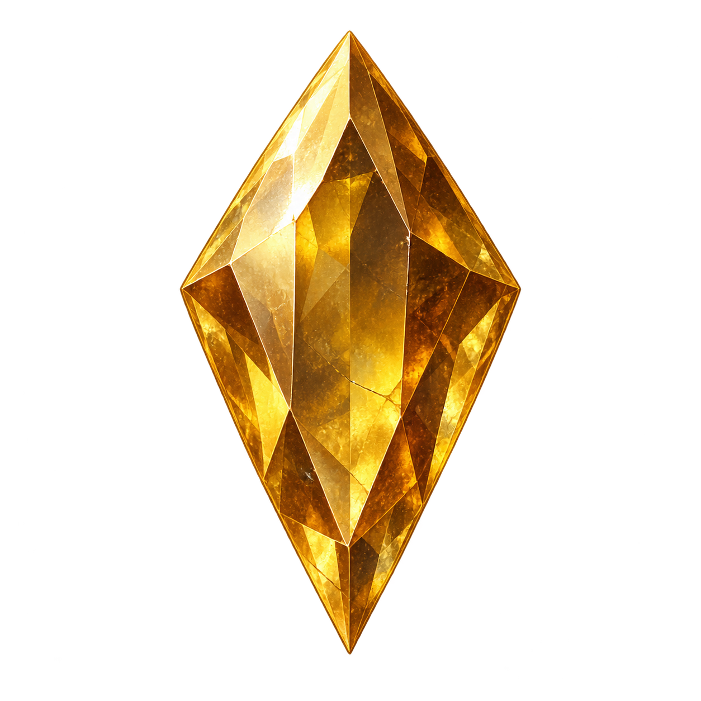
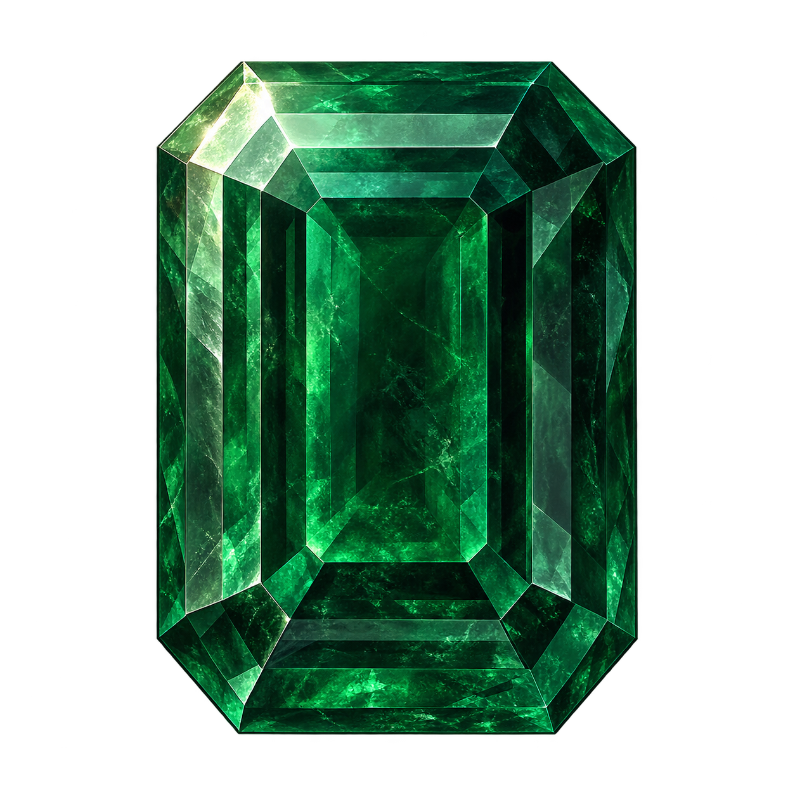
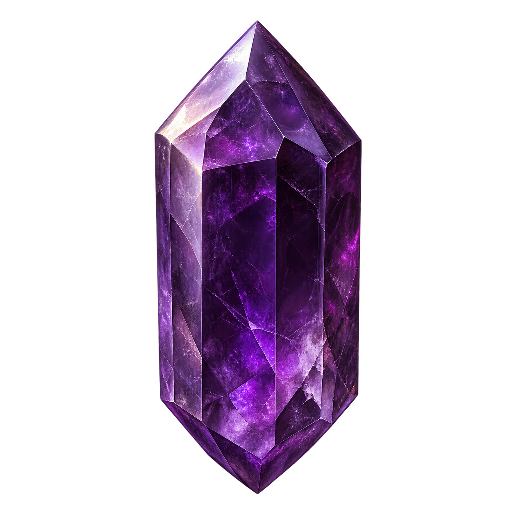
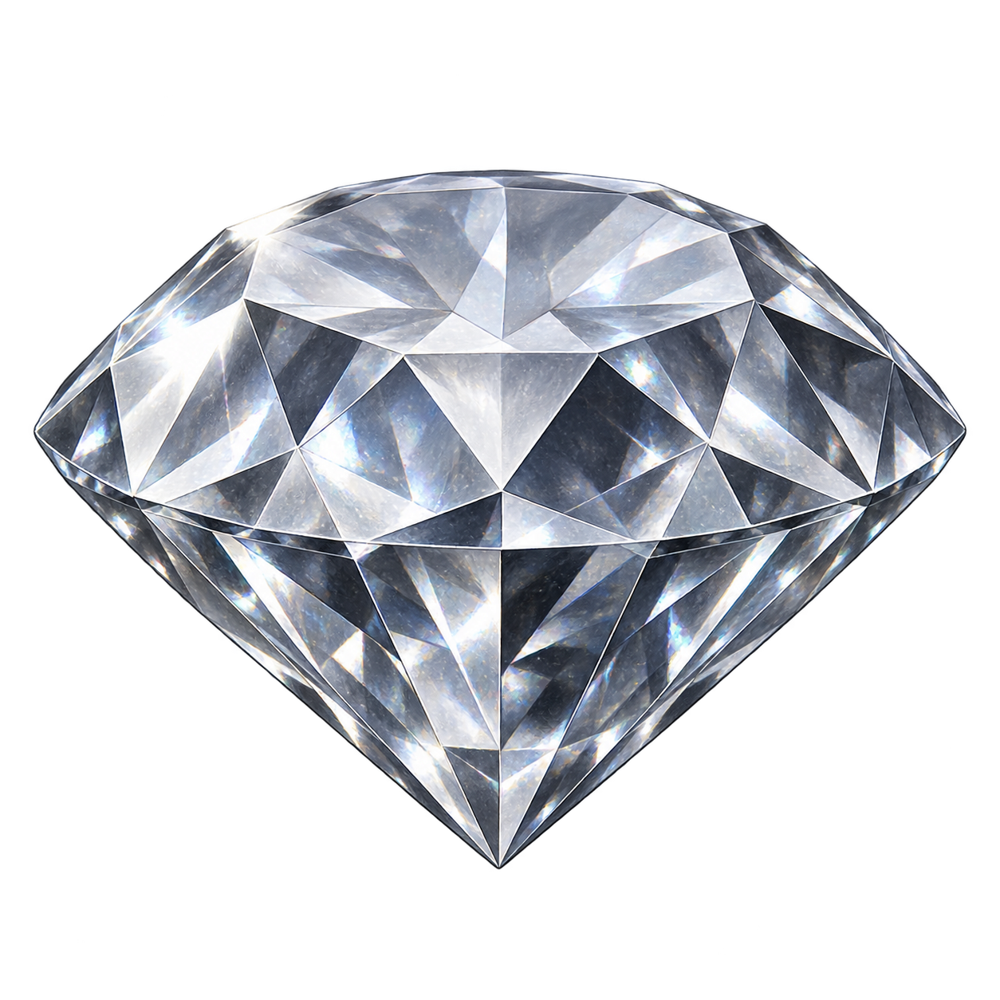

# 보석 6종 이미지 / Six gemstone icon candidates

갱신일: 2026-09-23 · Updated: 2026-09-23

해골을 제외한 홍옥·청옥·황옥·취옥·자수정·금강석의 종류별 대표 이미지 6개다. 게임의 6단계 등급은 유지하며, 이 묶음은 등급별 이미지 36개를 제작한 결과가 아니다.

Six representative icons: Ruby, Sapphire, Topaz, Emerald, Amethyst and Diamond. Skull is excluded. The six gameplay tiers remain; this package does not contain 36 tier-specific images.

| ID | 종류 / Type | 이미지 / Image |
|---|---|---|
| G01 | 홍옥 / Ruby |  |
| G02 | 청옥 / Sapphire |  |
| G03 | 황옥 / Topaz |  |
| G04 | 취옥 / Emerald |  |
| G05 | 자수정 / Amethyst |  |
| G06 | 금강석 / Diamond |  |

## 형식과 출처 / Format and provenance

- 여섯 파일 모두 1254×1254 PNG이며 RGBA 채널과 완전히 투명한 픽셀이 실제로 존재한다. 내장 생성 도구가 반환한 원본을 그대로 복사했으며 색상 키, 배경 제거, 재채색, 알파 재작성은 수행하지 않았다.
- All six files are 1254×1254 RGBA PNGs with fully transparent pixels. They are byte-identical copies of built-in image-generation outputs. No chroma key, background removal, recoloring or alpha rewriting was performed.
- 내장 `image_gen`으로 제작했다. 사용자의 기본 모델 요청은 `gpt-image-2`이나, 호출 인터페이스에는 모델 선택 인자가 없고 반환값에도 모델명이 없다. 따라서 해당 모델로 만들었다고 검증할 수 없으며 **검토용 시안**으로 보관한다. Unity의 정식 리소스로 채택하거나 런타임 화면에 연결하지 않았다.
- Generated with built-in `image_gen`. The requested default is `gpt-image-2`, but the interface exposes no model selector and returns no model identity. Model provenance is unverified, so these remain **review candidates**, not adopted Unity production assets.
- 외부 작품의 이미지를 입력하거나 복제하지 않고 보석의 이름·색·외형을 서술한 프롬프트로 생성했다. 사용 조건은 생성에 사용된 서비스의 약관을 따른다. 별도의 제3자 원본 라이선스나 모델 출처 인증은 제공되지 않았다.
- Generated from text descriptions without third-party source images. Usage remains subject to the generating service's terms; no separate third-party source license or model-provenance certificate was supplied.

[원문 프롬프트 / Prompts](prompts.json) · [파일 해시와 알파 검사 / Hashes and alpha checks](validation.json) · [밝고 어두운 배경 미리보기 / Preview](preview.html)

밝고 어두운 배경에서 220px·48px 미리보기를 확인했다. 확인한 크기에서는 보석의 색과 실루엣을 구분할 수 있었으며 단색 배경이나 눈에 띄는 테두리 오염은 보이지 않았다. 원본 전체 픽셀 검사, 생성 모델 출처 확인, Unity 적용은 남아 있다.

The 220px and 48px previews were reviewed on light and dark surfaces. Colors and silhouettes were distinguishable, with no visible solid backdrop or edge matte at those sizes. Full-resolution pixel review, model provenance and Unity adoption remain unverified.
