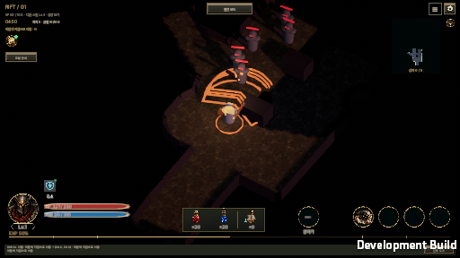
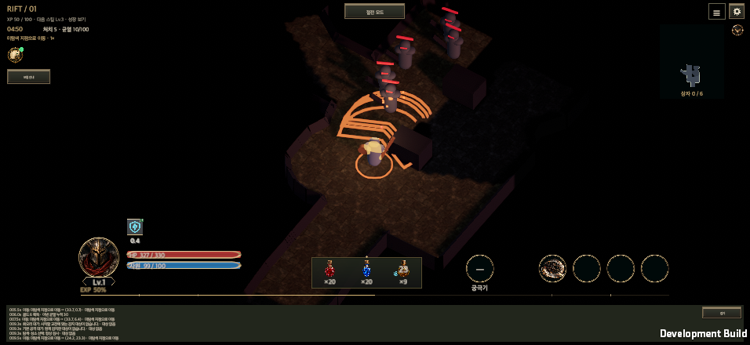
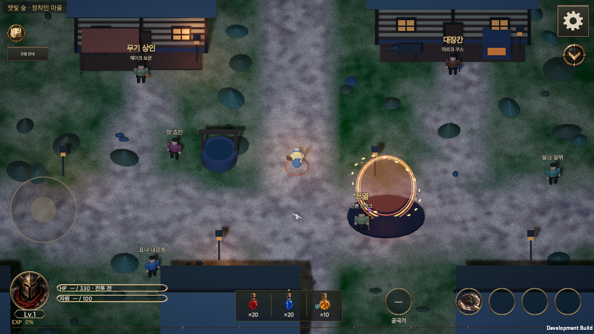

# 전체 워크트리·브랜치 통합 — 2026-09-28

작성일: 2026-09-28 · [English](All_Work_Integration_20260928.en.md)

사용자가 HELLSCRIPT의 모든 워크트리와 브랜치를 `main`에 병합하고 커밋·푸시하도록 요청했다. 기존 완료분과 진행 중인 아트 작업, 남아 있던 미커밋 문서를 함께 보존해 통합한다. 이 기록은 [9월 27일 완료분 통합](Feature_Integration_20260927.md)에서 제외했던 작업까지 포함하는 후속 기록이다.

## 통합 범위와 보존

- 시작 기준은 `origin/main`의 `97ed8510`이다. 등록된 워크트리는 36개였고, 실제 폴더 35개와 이미 경로가 사라진 등록 1개를 확인했다. 최초 조사에서 미병합 고유 커밋은 222개였다.
- 장비 추천·교체품 창고 처리, 장비 외형 확장, 전투 로그 높이, 균열 결과·회복/보호 기여도·받은 피해 순위, ElevenLabs 음향, NPC 초상화·대화, 절전 사냥, 출석창, 스킬 트리, 지도 표시 설정을 포함한다.
- 다크 고딕 렌더링·조명·셰이더·가져오기·리그, 필드 6종·적 20종·보스 5종, 절차적 모델 제작법·모델 자산과 이펙트 라이브러리도 포함한다. 기존 후보 자산의 출처·승인 상태는 유지한다.
- 원본 폴더의 전투 로그 변경과 Unity Pipeline `0.8.0-exp.1` 변경은 별도 커밋으로 보존했다. 다른 작업이 사용하던 폴더의 미커밋 문서는 별도 스냅샷 커밋으로 보존해, 그 폴더의 파일이나 인덱스를 바꾸지 않고 통합했다.
- 전체 Git 참조의 검증된 번들, 미커밋 파일 사본·바이너리 패치·SHA-256 기록을 저장소 밖에 보관했다. 워크트리와 브랜치는 삭제하지 않았다. [통합 대상 기록](AllWorkIntegration20260928Evidence/branch-inventory.json)을 함께 보존한다.

## 충돌 해결

최초 미병합 참조 62개는 중복을 제외하면 끝 커밋 33개이며 모두 통합 커밋의 조상임을 확인했다. 수집 이후 완료된 아트·공격 예고 게이지 검증 문서도 포함했다. 그 뒤 별도 작업에서 시작한 일반 적 공격 동작의 미완성 변경은 해당 작업 폴더와 백업 참조에 보존하고 이번 검증에 섞지 않는다.

균열 결과의 최신 통계와 기존 장비 처리 개선을 함께 유지했다. 공통 창에는 입력 복원·전투 차단 여부·NPC 대화의 하단 배치 옵션을 모두 남겼다. 절전 진입 버튼과 미니맵·보스 정보의 배치를 결합했다. 새 배경음 재생기 전체를 절전 중 정지하고, 오디오의 앱 복귀가 절전 정지를 우회하지 않도록 연결했다. 절전 진입 때 이전 카메라 흔들림도 종료한다.

위키 데이터 검사는 장비 60종·일반 적 20종·보스 5종을 함께 반영한다. 번역 키 중복은 실제 사용 문맥을 확인해 정리했다. 문서 이력은 양쪽의 서로 다른 본문을 보존하고 같은 본문의 중복을 제거했다. Unity 가져오기가 자동으로 확장한 메타와 설정은 GUID가 바뀌지 않았음을 확인하고 원본으로 복원했다.

## 검증

화면을 줄이면 글자와 UI가 함께 줄어들고, 물약·스킬·인장·상태바는 한 세트로 유지한다. 물약은 스킬 왼쪽에 나란히 놓는다. 전투 로그는 화면 맨 아래이며, 펼치고 접을 때 HUD 전체가 높이 변화만큼 이동한다. 절전 가로 화면은 중앙 선으로 나눈 두 열이고 장비 변경은 작은 슬롯과 한 줄 텍스트를 쓴다. 미수령 출석 보상에는 초록빛을 표시하며 이벤트 진입은 달력·보상 상자 아이콘을 사용한다. 자세한 기준은 [창 축소와 하단 HUD 통일](Responsive_Hud_20260928.md)에 있다.

전체 Edit Mode 검사는 4,479개 중 4,430개 통과, 49개 실패였다. 47개는 기존 기준선 실패이며, 새 실패 2개는 보상 검사의 스키마 18 고정값이었다. 현재 버전 상수로 바꾼 뒤 해당 검사 묶음이 통과했다. [전체 검사 비교](AllWorkIntegration20260928Evidence/full-suite-summary.json)를 보존하며 전체 검사가 모두 통과했다고 보고하지 않는다.

후속 UI·출석·보상·공격 예고 검사 163개 중 162개가 통과했다. 남은 출석 아이콘의 큐브맵 가져오기 문제는 2D 형식을 명시해 고쳤고, 출석 이미지 검사 7개가 재실행에서 모두 통과했다. 앞선 HUD·절전 검사 75개와 공통 UI 계약·회귀 검사 9개도 통과했다. 최신 로그 검사는 440×956, 956×440, 1600×900, 1600×1000, 2100×900, 512×288에서 한국어·영어, 100%·140%, 접힘·펼침을 조합한 48개 화면을 확인한다. 로그를 펼쳐도 HUD 크기와 내부 간격은 같고 위치만 이동한다.

최종 검사 수치, 소스 기준과 실행 결과는 [검증 기록](AllWorkIntegration20260928Evidence/validation.json)에 기록한다. 연결된 MCP Editor 인스턴스가 없어 Unity 6000.6.0f1의 기존 배치 검사와 macOS 개발 빌드를 사용했다. 검증 저장은 전부 별도 경로를 사용한다.

통합 빌드에서는 절전과 재실행, 균열 승리·유틸리티 기여도·패배와 상세창, 미니맵, 출석, 스킬 트리, NPC 대화, 아트 갤러리, 오디오와 장비 처리의 관련 스모크를 실행한다. 기존 `main` 실패와 통합으로 생긴 실패는 별도로 비교한다.

## 남은 범위와 공개 게시

일부 절차적 3D 모델은 자산과 제작법이 포함된 상태이며 실제 게임 화면 연결은 후속 작업이다. 라이브러리 병합이나 갤러리 캡처를 전체 아트의 런타임 연결 완료·품질 승인으로 해석하지 않는다. 원래 브랜치의 미완성 기능을 이번 병합만으로 완성했다고 보고하지 않는다.

macOS의 합성 포인터·해상도·안전 영역 검사는 모바일 실기기 터치·배터리·발열 검증과 구분한다. iOS/Android 실기기 검증은 수행하지 않았다.

공개 위키는 병합된 `main`에서 생성·검사한 전체 읽기 전용 사본을 배포한다. 소스 푸시, Pages 배포 성공, 비로그인 내장 브라우저 확인을 각각 확인한다. 공개 주소: [HELLSCRIPT Wiki](https://dakrdong.github.io/HELLSCRIPT-Wiki/#/tree).
