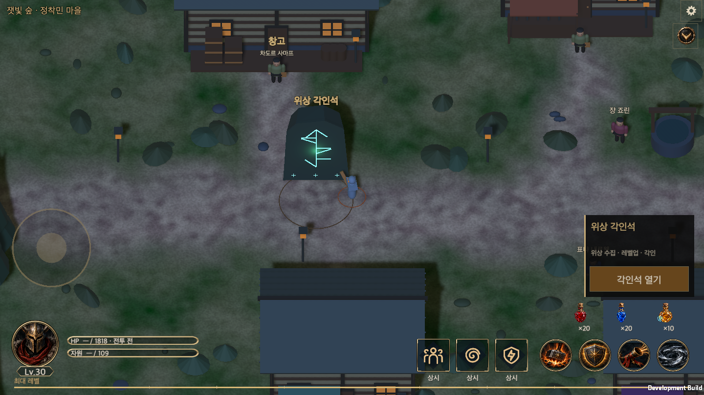

# 위상 각인석 게임 적용

갱신일: 2026-09-22
영어판: [Aspect Runestone implementation](Aspect_Runestone_Implementation.en.md)
기획: [위상 각인석과 123종 성장 수치](../Design/Aspect_Runestone.md)

## 적용 범위

마을 왼쪽 중앙의 각인석에서 실제 착용 장비와 계정 위상 도감을 다룬다. 기존 전설 123종을 그대로 사용하며 별도 시연용 목록을 만들지 않는다. 전설 분해는 첫 위상을 Lv.1로 활성화하고 이후 같은 위상을 누적한다. 2·4·8·16개에서 가능한 레벨업은 사용자가 한 단계씩 실행한다. 미수령 레벨이 있으면 빨간 점을 유지한다.

희귀·전설 착용품에 현재 도감 레벨을 각인한다. 희귀는 전설로 바뀌지만 접사 3개를 포함한 다른 상태는 유지한다. 기존 위상은 새 위상으로 교체되며 같은 위상을 여러 부위에 착용하면 가장 높은 레벨 하나만 적용한다. 계정 도감의 레벨업은 이미 각인한 장비를 변경하지 않는다.

추가 자원은 사용하지 않는다. 각인된 희귀를 분해해 위상을 복제하지 못하도록 수집 대상은 자연 획득한 전설의 원래 위상으로 정했다. 자연 전설을 덮어쓴 뒤 분해하면 원래 위상을 수집한다. 장비 상세와 분해 확인에 이 결과를 표시한다.

## 소유 코드와 저장

| 책임 | 구현 |
| --- | --- |
| 원본 위상 목록·누적 수·수동 레벨·각인 거래 | `Runtime/Core/AspectStone.cs` |
| 123종의 단계별 효과와 설명·지연 효과 레벨 조회 | `Runtime/Core/AspectGrowth.cs` |
| 분해 수집·저장 확정·실패 복구 | `Economy.Dismantle`, `InventorySalvagePlan`, `GameStore.Transact` |
| 실제 착용 효과·중복 최고 레벨 | `HeroStats`, `LegendaryPower.AtLevel`, `CombatSimulation` 각 효과 소유 코드 |
| 공통 UI 기반 화면 | `AspectStoneWindow`, `GameUI.AspectStone`, `AspectRuneGraphic` |
| 마을 위치·충돌·상호작용·기물 | `TownLayout`, `WorldView.AspectStone`, 기존 마을 이동·상호작용 경로 |

계정은 `aspects`에 ID·누적 수·수동 레벨을 저장한다. 아이템은 `aspectId`와 `aspectLevel`에 각인 결과를 저장하며 원래 전설 식별자 `special`은 생성 정보로 보존한다. 저장 스키마는 9이며 기존 계정은 빈 도감으로 이행한다. 과거 보유품에 위상을 소급 지급하지 않는다. 미래 스키마·잘못된 위상 상태는 원본을 보존하고 불러오기를 중단한다.

각인 확인은 캐릭터·아이템 원본·착용 여부·도감 레벨을 고정한다. 거래 확정 때 다시 확인하고 저장에 실패하면 변경을 적용하지 않는다. 분해는 기존 보호 규칙과 일괄 작업의 원자성을 유지하며 거래 재시도 시 중복 지급하지 않는다. 필터·장비 비교·자동 정리 보호·상점 추천은 실제 적용 위상을 사용한다.

Lv.1은 기존 전투 결과를 유지한다. Lv.2~5는 기획 표의 핵심 수치를 5%씩 상향한다. 상태 이상 시간, 끌어오기 거리, 발사각 등은 효과 성격에 맞는 항목을 사용한다. 발동 시점의 피해 스냅샷에 위상 ID와 레벨을 보존하므로 투사체·지연 타격·지속 피해가 나중의 장비 상태를 참조하지 않는다. 기존 스냅샷에 레벨이 없으면 Lv.1로 처리한다.

## 공통 UI와 필드

`tools/new_content_ui.py`로 공통 창에서 시작했다. 창·안전 영역·본문 스크롤·하단 행동은 `ContentWindowView`, 장비 칸은 `EquipmentSlotView`, 장착 배치는 `CharacterEquipmentView`, 상세는 `ItemDetailView`, 색상·글꼴·크기는 `UiTheme`/`UiFonts`를 사용한다. 실제 소유 상태는 `EquipmentViewSource.Owned`로 명시하고 저장 성공 뒤 `StoreViewBinding`으로 갱신한다.

가로 화면은 장비·도감·각인 상세의 세 영역을 각각 스크롤한다. 세로 화면은 세 단계로 전환한다. 확인 단계의 장비 교체는 같은 화면에서 착용품 목록을 열고 선택한 위상을 유지한다. 클래스·등록 여부·레벨업 필터와 이름·효과 검색을 제공한다. 미등록 위상도 조회할 수 있다. 한국어·영어와 글자 크기 설정을 따른다.

룬석 문양은 위상 ID로 결정되는 123개의 서로 다른 벡터 문양이다. 마을 기물은 기존 런타임 월드 생성 경로에서 너비 5m·높이 7m·깊이 2m의 독립된 바위로 만든다. 중심 `(-34, 4)`, 상호작용 `(-34, 1)`로 중앙 통로를 피한다. 기존 씬·프리팹·이미지의 GUID를 변경하지 않는다. 필드 배치 탭과 비용 문구는 게임 화면에 두지 않는다.

## 검증

최종 관련 Edit Mode 검사 **495개 통과, 실패 0개, 건너뜀 0개**. 수집 임계값·중복 거래·저장 실패·각인 보존·수집 복제 방지, 123종의 실제 레벨 5 전투 효과, 한·영 설명, 지연 타격 레벨 보존, 기존 전설·장비 비교·상점·인벤토리·마을·공통 UI를 검사했다. [검사 보고서](AspectRunestoneEvidence/final-focused.xml) · [최종 소스 해시](AspectRunestoneEvidence/final-source.json)

그 전에 실행한 전체 회귀 검사는 **3,216개 중 3,213개 통과, 3개 실패**였다. 기존 화염구 후속 폭발의 공격력 기준, 새 Graphic의 CanvasRenderer 선언, 번역 등록이 원인이었다. 모두 수정한 뒤 실패 항목을 포함한 위 495개를 다시 통과시켰다. 이후 전체 검사를 반복하지 않았으며 두 보고서의 수를 합산하지 않는다. [전체 검사 당시 보고서](AspectRunestoneEvidence/regression.xml)

macOS 개발 빌드와 두 실행 과정이 정상 종료했다. 실제 분해 거래로 16개를 모은 뒤 합성 uGUI 포인터 입력 14회로 마을 진입, 수동 단계별 레벨업, 빨간 점 유지·해제, 희귀 각인, 전설 위상 교체, 확인 화면의 장비 교체, 검색·미등록 상태·닫기와 재진입을 확인했다. 별도 프로세스로 재실행하여 도감과 장비 저장을 확인했다. 화면 전환 뒤 선택을 유지하며 영어 화면의 한국어 잔존, 본문 줄바꿈 겹침, 고정 행동 영역과 안전 영역도 검사했다. [실행 기록](AspectRunestoneEvidence/initial.txt) · [재실행 기록](AspectRunestoneEvidence/resume.txt) · [결과 요약](AspectRunestoneEvidence/summary.json)

공통 UI 소유 검사와 회귀 검사 9개, 위키 생성·검사, 위키 Python 검사 9개와 Node UI 검사(252페이지·24개 DB·2,329개 레코드)가 통과했다. 위키는 이 작업 브랜치의 기획·코드·근거로 생성하며 공개 배포는 병합된 `main`에서 수행한다.

### 실제 macOS 화면

| 화면 | 한국어 100% | 한국어 150% | 영어 100% | 영어 150% |
| --- | --- | --- | --- | --- |
| 440x956 | [↗](AspectRunestoneEvidence/layout-ko-100-440x956.png) | [↗](AspectRunestoneEvidence/layout-ko-150-440x956.png) | [↗](AspectRunestoneEvidence/layout-en-100-440x956.png) | [↗](AspectRunestoneEvidence/layout-en-150-440x956.png) |
| 956x440 | [↗](AspectRunestoneEvidence/layout-ko-100-956x440.png) | [↗](AspectRunestoneEvidence/layout-ko-150-956x440.png) | [↗](AspectRunestoneEvidence/layout-en-100-956x440.png) | [↗](AspectRunestoneEvidence/layout-en-150-956x440.png) |
| 1440x810 | [↗](AspectRunestoneEvidence/layout-ko-100-1440x810.png) | [↗](AspectRunestoneEvidence/layout-ko-150-1440x810.png) | [↗](AspectRunestoneEvidence/layout-en-100-1440x810.png) | [↗](AspectRunestoneEvidence/layout-en-150-1440x810.png) |
| 1440x900 | [↗](AspectRunestoneEvidence/layout-ko-100-1440x900.png) | [↗](AspectRunestoneEvidence/layout-ko-150-1440x900.png) | [↗](AspectRunestoneEvidence/layout-en-100-1440x900.png) | [↗](AspectRunestoneEvidence/layout-en-150-1440x900.png) |
| 1680x720 | [↗](AspectRunestoneEvidence/layout-ko-100-1680x720.png) | [↗](AspectRunestoneEvidence/layout-ko-150-1680x720.png) | [↗](AspectRunestoneEvidence/layout-en-100-1680x720.png) | [↗](AspectRunestoneEvidence/layout-en-150-1680x720.png) |

[레벨업 알림이 있는 도감](AspectRunestoneEvidence/02-pc-library.png) · [확인 화면에서 착용 장비 교체](AspectRunestoneEvidence/03-portrait-equipment-picker.png)

검증은 최신 `main`에서 분리한 작업 폴더와 별도 저장 경로에서 수행한다. 원본 작업 폴더의 미완료 변경과 사용자 계정을 수정하지 않는다. macOS 개발 앱의 uGUI 입력 검증이며 모바일 실기기 터치·안전 영역·성능 검증과 구분한다.
