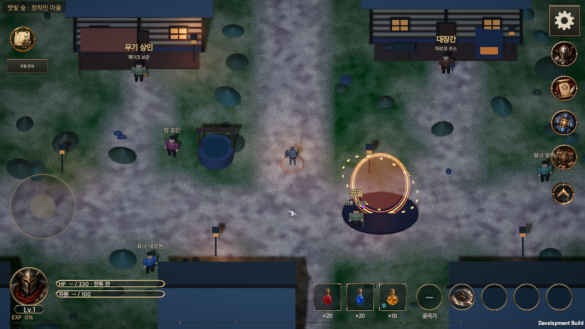

# Weekly and monthly attendance events

Updated: 2026-09-29
Korean: [7일·28일 출석 이벤트](Attendance_Events.md)

Attendance uses **00:00 Korea Standard Time (UTC+9)**. Weekly attendance resets every Monday; monthly attendance resets on the first day of each calendar month. Both tracks grant independently and share account progress across characters.

## Rules and rewards

Each distinct day played advances each active track once. A first login on Thursday starts at weekly day 1; the next Monday starts a new weekly period. Missed days do not advance progress. Earned, unclaimed rewards remain available until the period resets. Monthly progress stops at day 28 until the next month, including in 29-, 30- and 31-day months.

`Attendance.Reward` owns the reward definitions. The wiki Attendance database extracts all 35 rows from the same runtime source.

| Weekly day | Reward |
| --- | --- |
| 1 | 10 Abyssal Coins |
| 2 | 10 random-color tier 3 gems |
| 3 | 30 Abyssal Coins |
| 4 | 10,000 gold |
| 5 | 50 Abyssal Coins |
| 6 | 5 random-slot cores |
| 7 | 1 random-slot legendary chest |

| Monthly reward | Days 1–7 | Days 8–14 | Days 15–21 | Days 22–28 |
| --- | --- | --- | --- | --- |
| First day: Coins | D1: 10 | D8: 20 | D15: 30 | D22: 40 |
| Second day: Tier 3 gems | D2: 10 | D9: 20 | D16: 30 | D23: 40 |
| Third day: Coins | D3: 30 | D10: 60 | D17: 90 | D24: 120 |
| Fourth day: Gold | D4: 10,000 | D11: 20,000 | D18: 30,000 | D25: 40,000 |
| Fifth day: Coins | D5: 50 | D12: 100 | D19: 150 | D26: 200 |
| Sixth day: Cores | D6: 5 | D13: 10 | D20: 15 | D27: 20 |
| Seventh day: Legendary chests | D7: 1 | D14: 1 | D21: 1 | D28: 2 |

Monthly totals: 900 Coins, 100 tier 3 gems, 100,000 gold, 50 cores and 5 legendary chests. Each gem/core independently rolls among the six existing gem families/eight existing slots.

Chests survive period resets. Each stores its reward seed, the claiming character's class and highest cleared stage, bounded by the existing item-level rules with a minimum of 1. Opening from the event window creates one legendary item in a random slot, using those stored conditions, in the current character's bag. Full bags retain the unopened chest. No automatic equipment, salvage or sale runs.

## Interface

Entering the game opens weekly attendance first, then monthly attendance as separate popups. Visiting the monthly page from the first popup prevents a duplicate automatic monthly popup during that visit. Each page has an independent **Do not show again today** preference, persisted on the device until the next KST midnight. Unchecking re-enables it for the next entry.

The **Events** button near the upper left of town and rift fields always opens weekly attendance, even when automatic popups are hidden. The top tabs or horizontal swipes switch to monthly attendance. A red dot marks a tab and a green exclamation badge marks the Events icon while rewards remain to be claimed. Vertical drags scroll only the body. The tutorial's **Adventure journal** button sits under the Events button; when narrow battle layouts move the Events button down to clear the boss status, the guide button moves with it.

Landscape and portrait use different arrangements. On wide screens such as 21:9 the popup stays at most 900 units wide.

| Screen | Selected reward | Weekly | Monthly |
| --- | --- | --- | --- |
| Landscape (956×440, PC 16:9, 16:10 and 21:9) | Altar panel on the left | 3×2 grid on the right with a tall day-7 card | 7×4 calendar on the right |
| Portrait (440×956) | Altar panel on top | 3×2 grid with a wide day-7 card | 7×4 calendar |

At 100% text every day is visible without scrolling. Larger text enlarges the tiles and the body scrolls. The altar panel places the selected day's reward on the altar and shows its name, amount, state, check-in progress and reset date. Tapping a tile selects that day. The window opens on the earliest claimable day, or on the next day when nothing is claimable.

| State | Tile | Altar panel text | Claim button |
| --- | --- | --- | --- |
| Claimable | Green light behind the item, persistent green border and dot | Ready to claim | **Claim Reward** |
| Claimed | Darkened, crimson wax seal | Claimed | Claimed (disabled) |
| Later day | Plain tile | Check-ins needed: N | Not Yet Available (disabled) |
| Out of reach this period | Plain tile | Out of reach before the reset | Not Yet Available (disabled) |

"Out of reach" means the day cannot be earned even by checking in on every remaining day before the reset. For example, with three check-ins on a Sunday, days 4 to 7 are out of reach. Legendary-chest days (7, 14, 21 and 28) have a gold top rule and a warmer background. Tiles show compact amounts (10,000 → 10K); the altar panel shows the exact amount. Stored legendary chests appear under the reward grid and open there.

The fixed action area holds the claim button and **Do not show again today**, on one row in landscape and two rows in portrait. The left/right arrow buttons were removed because tabs and swipes cover the same paging.

The shared `ContentWindowView` provides safe area, title, navigation, scrolling body and fixed actions. Reward tiles describe attendance days, not owned equipment. Existing theme, fonts and coin/gem art are reused; `AttendanceArt` loads the gold, core, legendary-chest, altar and seal images. Compact amounts reuse the jeweler's `JewelerSession.Compact`, the pulse reuses `ForgeWorkingPulse` and the round glow reuses `TownCircleGraphic`. `ContentWindowHost` pauses combat and restores its previous state when closed.

## Popup redesign references

On 2026-09-27, attendance and login-reward screens of mobile games were reviewed. Only layout and interaction patterns were used; no artwork, logos or copy were taken.

| Reference | Pattern | Applied as |
| --- | --- | --- |
| [Honkai: Star Rail "Gift of Odyssey"](https://game8.co/games/Honkai-Star-Rail/archives/413645) | 3×2 days with a tall final-day card beside wide key art | Landscape weekly grid and the altar panel |
| [Arknights monthly and 7-day sign-in](https://www.gameuidatabase.com/index.php?scrn=124) | A 7-column month on one screen, claimed marks, details of the chosen day | 7×4 monthly calendar and the altar panel detail |
| [Bleach: Immortal Soul cumulative login](https://www.gameuidatabase.com/index.php?scrn=124) | "Claimed" stamps, a highlighted current day, a double-size final day | Wax seal, highlighted claimable tiles, the wide portrait day-7 card |
| [Call of Duty: Mobile new-player login reward](https://www.gameuidatabase.com/index.php?scrn=124) | Per-tile state text, a large final reward, the event period | State text and the reset date |
| [AFK Arena and Dragalia Lost daily rewards](https://www.gameuidatabase.com/index.php?scrn=124) | Stacked portrait layouts that feature today's reward | The portrait altar panel on top |

## Popup resources

At the user's instruction, two images were requested from GPT. Claude Code called Codex's built-in image generation through `codex exec`, received two variants of each image and chose one. The chosen originals are registered byte for byte.

| Resource | Visual | Reason for the choice |
| --- | --- | --- |
| [Attendance popup altar](../../Assets/HELLSCRIPT/Resources/Art/Attendance/popup-altar.png) | An empty stone altar under a beam of light in a gothic chapel. 1254×1254 opaque RGB | Its plain front lets the reward icon stand out. The other variant's star emblem and statues competed with the icon. |
| [Claimed seal](../../Assets/HELLSCRIPT/Resources/Art/Attendance/claimed-seal.png) | A crimson wax seal with a brass ring and a check mark. 1254×1254 RGBA | Its darker oxblood tone fits the UI. The other variant was brighter with a wider rim. |

One square altar image is cropped to each panel's aspect ratio. The crop is computed so the altar's upper face, 46% from the top of the art, meets the bottom of the reward icon. `AttendanceArtImporter` imports only the altar with a 1024 px limit; the seal and existing icons stay at 512 px. The Android budget is 1024 px ASTC 6×6 for the altar and 256 px for the other attendance images.

Codex reported that its built-in generator has no model selector and returned all four images without model information. Like the earlier icons, they are recorded as **development assets with unverified model provenance** (`candidate_model_unknown`, `productionApproved=false`). See the [request and selection record](../Art/Attendance/popup-manifest.json) and [alpha/source-hash report](../Art/Attendance/popup-validation.json). The seal's border alpha is at most 1 with 743,404 fully transparent pixels; the altar has no transparent pixels. The wiki resource database shows both images.

## Reward artwork

Dedicated transparent PNGs replace the gold, random-slot core and legendary-chest glyphs. Weekly and monthly rewards share the same assets. Reward amounts, claims and persistence remain unchanged. Existing Abyssal Coin art and the three-gem composition are preserved.

| Asset | Visual |
| --- | --- |
| [Gold](../../Assets/HELLSCRIPT/Resources/Art/Attendance/reward-gold.png) | A compact pile of weathered gold coins. |
| [Random-slot core](../../Assets/HELLSCRIPT/Resources/Art/Attendance/reward-random-core.png) | Dark mineral, a brass collar and an amber heart, distinct from polished gems. |
| [Legendary chest](../../Assets/HELLSCRIPT/Resources/Art/Attendance/reward-legendary-chest.png) | A closed dark-iron chest with brass reinforcement and an amber seal. |

The built-in `image_gen` outputs are native 1254×1254 RGBA PNGs, copied byte for byte without background removal, chroma keys or upscaling. `AttendanceArtImporter` targets only the new folder: Sprite, preserved alpha, 512px import limit, no mipmaps and no compression. UI images preserve aspect ratio and do not intercept input.

The prompts requested `gpt-image-2`, but the callable interface and returned metadata do not verify the actual model. These are therefore **development assets with unverified model provenance**, recorded as `candidate_model_unknown` and `productionApproved=false`. Runtime integration is not a production-art approval. See the [full prompts and provenance](../Art/Attendance/source-manifest.json) and [alpha/source-hash report](../Art/Attendance/alpha-validation.json). Attendance and resource database previews use these same PNGs.

## Green claimable rewards — 2026-09-28

All claimable uncollected rewards have a green light and persistent border, independently of selection. Claimed and locked tiles have no green highlight. The vector UI resource `AttendanceClaimGlow` and `UiTheme.Claimable` own this display. It uses no per-frame animation and preserves existing reward/altar artwork and account transactions. This replaces the earlier claimable pulse described above. See [window shrinking and a unified bottom HUD](Responsive_Hud_20260928.en.md).

## Persistence and verification

The original functional verification below refers to commit `9f98daa6`, before the artwork replacement. Artwork acceptance is recorded separately in the final section.

`AccountSave.attendance` owns progress, claims and unopened chests. GameStore transactions atomically commit rewards and entitlement, then notify views. Gem capacity or disk failures cannot grant partial rewards. Account/period/day seeds keep random results stable on retry. Popup preferences use a separate device file.

Save schema 12 migrates old saves to empty attendance. Future versions and invalid state preserve the original and stop loading. Stale-period claims and dates before the last recorded attendance are rejected. This remains the existing local development save/device-clock adapter; authoritative server time and account authentication are separate product boundaries.

The [official Black Desert Mobile weekly login event](https://www.world.blackdesertm.com/Ocean/News/Detail?boardNo=4064) informed event access, daily rewards, manual claiming and midnight refresh. HELLSCRIPT uses its own shared theme and account-wide weekly/monthly rules.

- Unity 6000.6.0f1: **108 related Edit Mode tests passed, 0 failed or skipped**. [Results](AttendanceEvidence/editmode.xml) cover resets, midnight, leap years and month/year boundaries, retries, character switches, storage capacity and disk failure.
- The macOS development build succeeded with zero errors. Native acceptance verifies actual uGUI raycast targets before synthetic clicks and drags, and checks rewards, popup ordering, independent suppression, chest opening, paging, scrolling, midnight behavior and combat pause restoration.
- Five resolutions (440×956, 956×440, 1440×810, 1440×900, 1680×720), two languages and 100%/150% text produce **40 page-layout checks**. Safe area, text height and fixed action access are asserted. Narrow field layouts also check the event button against boss status bounds.
- A fresh process verifies progress, balances, chest/item state and device preferences, including manual reopening while suppressed. [Native results](AttendanceEvidence/initial.txt), [restart results](AttendanceEvidence/resume.txt) and [scope/source hashes](AttendanceEvidence/validation.json) record the evidence.
- **Physical mobile devices were not tested.** Existing URP post-processing shader warnings are distinct from attendance feature failures.

[Weekly portrait](AttendanceEvidence/weekly-440x956-en-100.png) · [Monthly at 150% text](AttendanceEvidence/monthly-440x956-en-150.png) · [Field event button](AttendanceEvidence/field-button-440x956-150.png)

## Artwork acceptance

- **27 Edit Mode tests passed, with zero failures or skips**, covering the new sprite paths, distinct GUIDs, native alpha, import settings, weekly/monthly mappings and shared UI. [Test results](AttendanceArtEvidence/editmode.xml) are preserved.
- The macOS development build succeeded with zero errors. Re-running the attendance acceptance scenario verified **600 reward-sprite instances across 40 page-layout combinations**, plus 97 raycast-verified clicks and 22 drags. Assertions check correct sprites, preserved aspect ratio and disabled image raycast targets. See [art checks](AttendanceArtEvidence/art.txt), [native results](AttendanceArtEvidence/initial.txt), [fresh-process results](AttendanceArtEvidence/resume.txt) and [scope/source hashes](AttendanceArtEvidence/validation.json).
- Portrait and PC captures were visually inspected for silhouette, readability and alpha edges. **Physical mobile devices were not tested.**

[Updated weekly portrait](AttendanceArtEvidence/weekly-440x956-ko-100.png) · [English at 150%](AttendanceArtEvidence/weekly-440x956-en-150.png) · [PC weekly](AttendanceArtEvidence/weekly-1440x810-ko-100.png) · [PC monthly](AttendanceArtEvidence/monthly-1440x900-ko-100.png) · [Landscape monthly](AttendanceArtEvidence/monthly-956x440-en-150.png)

## Popup redesign acceptance

- Unity 6000.6.0f1: **169 of 170 related Edit Mode tests passed, with 0 skipped**. The one failure, `LocalizationTests.EveryKoreanLiteralInTheRuntimeHasAnEntry`, has failed on `main` since `c751d84d`: two Korean search strings in `RuntimeFirstPlayAcceptance.cs` have no table entries, unrelated to this change. New tests check the seal's native alpha and the altar's opaque square image, 1024 px limit and Android budget. [Test results](AttendancePopupEvidence/editmode.xml)
- The macOS development build succeeded. Since 2026-09-25 the attendance smoke had stopped at its first popup check because fresh accounts start with the tutorial. Like other smokes, it now starts from a tutorial-exempt QA account and waits up to 20 seconds for rift admission.
- **42 page-layout checks** passed across 440×956, 956×440, 1440×810, 1440×900 and 1680×720, Korean and English, and 100%/150% text. Besides the existing safe-area, text-height and fixed-action checks, they assert that at 100% text all 364 day tiles of both pages sit inside the unscrolled body, that every page shows the altar art, that only claimed days carry the seal (714 checks) and that 612 reward images use the right sprite.
- 97 clicks and 22 drags confirmed their raycast targets first. Login order, suppression, claims, midnight rollover, chest storage and opening, and combat pause restoration were exercised; a separate process kept progress, balances, the opened item and device preferences. [Native results](AttendancePopupEvidence/initial.txt) · [Image checks](AttendancePopupEvidence/art.txt) · [Restart results](AttendancePopupEvidence/resume.txt) · [Scope and source hashes](AttendancePopupEvidence/validation.json)
- The smoke found the Adventure journal button covering the Events button in portrait battle at 150% text; the journal button now stacks under the Events button. In landscape battle at 150% text, the journal button overlaps the character portrait and the combat-log bar covers the top-left run status. Those positions are unchanged by this work and remain a separate task.
- Unity MCP was not connected in this session, so tests ran in batch mode on a cloned project. **Physical mobile devices were not tested.**

[Portrait weekly](AttendancePopupEvidence/weekly-440x956-ko-100.png) · [Portrait monthly](AttendancePopupEvidence/monthly-440x956-ko-100.png) · [Portrait weekly, English 150%](AttendancePopupEvidence/weekly-440x956-en-150.png) · [Portrait monthly, English 150%](AttendancePopupEvidence/monthly-440x956-en-150.png) · [Portrait all claimed](AttendancePopupEvidence/weekly-claimed-440x956-ko-100.png) · [Landscape weekly](AttendancePopupEvidence/weekly-956x440-ko-100.png) · [Landscape monthly, English 150%](AttendancePopupEvidence/monthly-956x440-en-150.png) · [PC weekly](AttendancePopupEvidence/weekly-1440x810-ko-100.png) · [PC monthly](AttendancePopupEvidence/monthly-1440x810-ko-100.png) · [PC chest stash](AttendancePopupEvidence/weekly-chest-stash-1440x810-ko-100.png) · [PC 16:10 monthly, English](AttendancePopupEvidence/monthly-1440x900-en-100.png) · [21:9 weekly](AttendancePopupEvidence/weekly-1680x720-ko-100.png) · [21:9 monthly, English 150%](AttendancePopupEvidence/monthly-1680x720-en-150.png) · [Portrait battle buttons 150%](AttendancePopupEvidence/field-button-440x956-150.png) · [Landscape battle buttons 150%](AttendancePopupEvidence/field-button-956x440-150.png) · [Opened in battle](AttendancePopupEvidence/field-event.png)

## Attendance event icon — 2026-09-28

The main and combat event shortcut now shows a calendar, green check and reward chest. It shares the content-button `Emblem` component; a green exclamation badge marks pending rewards. Clicking opens the existing attendance window, retaining combat pause/restoration behavior.

The native-alpha transparent PNG is copied unchanged into runtime resources. The built-in generation surface returned no model provenance, so it is registered as model-unverified development art. Preserve the [generation manifest](../Art/Attendance/event-icon-manifest.json) and [alpha validation](../Art/Attendance/event-icon-validation.json).

## Matching left and right shortcut sizes — 2026-09-29

The left attendance icon used a fixed size of 52 in town while the right content icons grew with the viewport. `GameUI.Attendance` now reads `ContentDockView.ButtonSize`, and the town layout refreshes attendance immediately after resizing the right dock. The existing right-side calculation remains authoritative. Attendance artwork fills its source image while dock emblems include transparent padding, so attendance receives a 7% inset on each edge to match the visible circular rim. Source artwork, position, reward state and attendance navigation are unchanged.

The existing `RuntimeAttendanceSmoke` compares the actual screen rectangles of both buttons instead of a hard-coded size and checks that attendance stays inside the safe area. The same checks run through the existing viewport, Korean/English and reading-size scenarios, with separate measurements for the artwork rectangles.

All 33 focused Edit Mode tests passed, and the final macOS development build succeeded with zero errors. The player passed 56 viewport/language/reading-size page checks, 98 raycast-verified clicks and 22 drag gestures. Checks cover equal button sizes in town and combat, attendance navigation and combat pause restoration. No Unity MCP instance was connected, so validation used the established batch build and synthetic macOS pointer input. Physical mobile devices were not tested.

[Validation summary](AttendanceIconSizeEvidence/validation.json) · [Measured sizes](AttendanceIconSizeEvidence/event-icons.txt) · [Artwork padding measurements](AttendanceIconSizeEvidence/artwork-footprints.json) · [Runtime result](AttendanceIconSizeEvidence/initial.txt) · [Edit Mode results](AttendanceIconSizeEvidence/editmode.xml)

