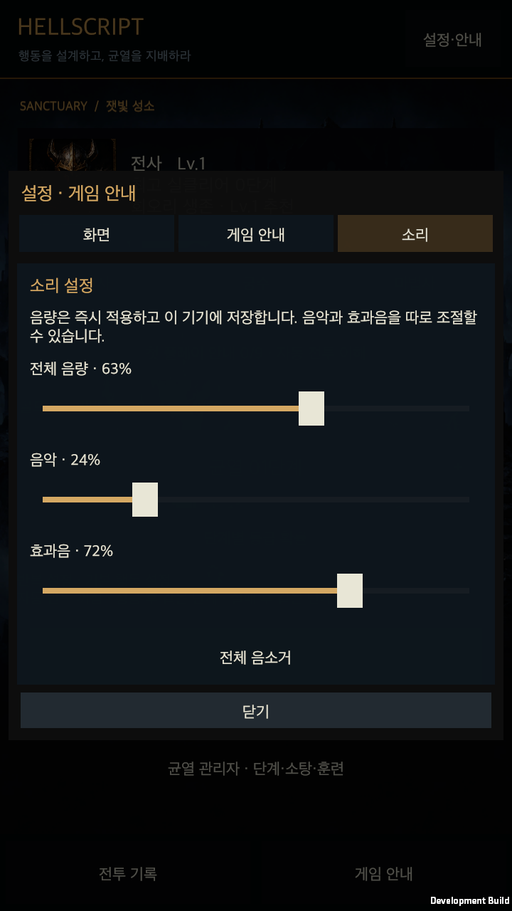
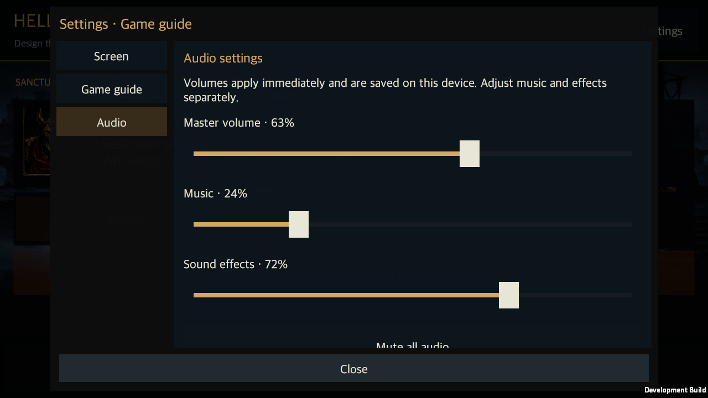

# 임시 음향과 스킬 형태 연출

작성일: 2026-09-13 · [English](Audio_Skill_Presentation.en.md)

게임 완성을 먼저 진행한다는 사용자 방침에 따라, 비어 있던 음향과 스킬을 구분할 수 있는 최소 연출을 추가했다. 새 이미지·고급 모델·애니메이션 리소스 제작 없이 기본 도형, 선, 캐릭터와 무기의 짧은 움직임을 사용한다. 밸런스 수치와 보상 추첨은 변경하지 않는다.

## 소리와 설정

UI 선택·확정, 직업별 공격 준비·발사·적중, 치명타·피격·이동기·보호 효과, 적의 위험 예고, 보스 등장, 상자 개봉, 장비 획득, 전설·세트 획득, 처치와 성공·실패에 임시 효과음을 연결했다. 성소와 균열에는 서로 다른 16초 반복 배경음을 사용하며 전환할 때 음량을 부드럽게 바꾼다.

소리는 프로젝트 코드로 직접 합성한 원본 임시 리소스다. 외부 곡·녹음·샘플을 사용하지 않았다. 출시용 음원의 제작·교체는 후속 작업이다.

설정·안내의 **소리** 탭에서 전체 음량, 음악, 효과음을 각각 조절한다. 전체 음소거, 효과음 미리 듣기, 기본 음량 복원도 제공한다. 변경은 즉시 반영하며 기기 전용 파일에 저장한다. 저장 실패 시 같은 창에서 재시도할 수 있다. 계정·캐릭터·진행 중인 균열과 별도로 저장하므로 음량 조절이 전투 데이터를 변경하지 않는다.

효과음은 최대 8개를 동시에 재생하고, 겹칠 때 위험 경고와 주요 보상을 우선한다. 전투 배속은 음악·효과음의 음높이를 바꾸지 않는다. 앱이 일시 중단되면 재생을 멈추고 설정을 저장한다. 저장된 전투를 이어 할 때 이전 기록의 소리를 다시 재생하지 않는다. 음소거 중에도 기존 위험 표시와 알림을 유지한다.

## 스킬별 최소 표현

실제 전투의 위치·발사체·장판·상태 지속 시간에 맞춰 표시한다. 아래 선과 도형은 시각 표현이며 별도의 공격 판정이나 충돌체를 만들지 않는다.

| 스킬 | 화면에서 확인할 형태 |
| --- | --- |
| W01 회오리 | 캐릭터와 호가 회전하며 주변을 베는 모습 |
| W02 도약 내려찍기 | 기존 포물선 도약과 착지 충격파 |
| W03 분쇄 일격 | 무기를 들어 휘두르고 전방 100도 부채꼴 표시 |
| W04 지면 강타 | 자기 주변으로 퍼지는 고리와 짧은 파편 |
| W05 철벽 | 남은 보호막이 있을 때 캐릭터를 감싸는 선형 보호막 |
| W06 전투 함성 | 외곽으로 퍼지는 고리와 강화 유지 표시 |
| A01 관통 사격 | 진행 방향을 향한 긴 화살과 짧은 궤적 |
| A02 다중 사격 | 실제 세 발의 진행 방향을 따라 벌어지는 화살 |
| A03 맹독 덫 | 녹색 덫 중심과 범위 고리, 발동 시 굵어진 테두리 |
| A04 후퇴 도약 | 기존 후퇴 도약과 출발·착지 지점의 작은 고리 |
| A05 사냥꾼의 표식 | 표식이 실제 남아 있는 적 머리 위의 보라색 마름모 |
| A06 그림자 화살 | 남은 강화 사격 횟수만큼 회전하는 구슬, 강화 화살의 보라색 표시 |
| M01 화염구 | 주황색 구체와 궤적, 실제 착탄 위치의 폭발 |
| M02 눈보라 | 실제 장판을 따라 회전하는 작은 냉기 조각 |
| M03 연쇄 번개 | 실제 적중 지점 사이를 연결하는 짧은 지그재그 선 |
| M04 순간이동 | 출발·도착 고리와 도착 순간의 짧은 빛 |
| M05 원소 보호막 | 남은 보호막에 맞춰 유지·해제되는 파란 선형 보호막 |
| M06 서리 폭발 | 자기 주변으로 퍼지는 파란 고리와 냉기 파편 |

기본 공격도 근접 휘두르기, 화살, 마법탄으로 구분했다. 준비·공격 후 동작에서 몸과 무기가 짧게 기울어진다. 일시정지하면 이동과 연출도 멈추며, 절전 화면에서 돌아오면 현재 전투 상태로 표시한다. 지속 연출은 효과가 끝나거나 필드를 떠날 때 정리한다.

## 확인 범위와 다음 순서

컴파일·macOS 빌드, 음량 조작과 재시작, 세 직업의 짧은 플레이를 통과했다. 화면 확인 중 음량 손잡이가 길게 늘어나는 부분을 고쳤으며 최종 빌드에서 다시 확인했다. 대규모 회귀 검사와 밸런스 반복 실험은 이번 작업에서 수행하지 않는다. 수치 조정, 출시용 음원·그래픽, 모바일 실기기의 출력·터치는 후속 단계에서 다룬다.

근거: [실행 확인 요약](../../Artifacts/Validation/AudioSkills/validation-summary.json).

