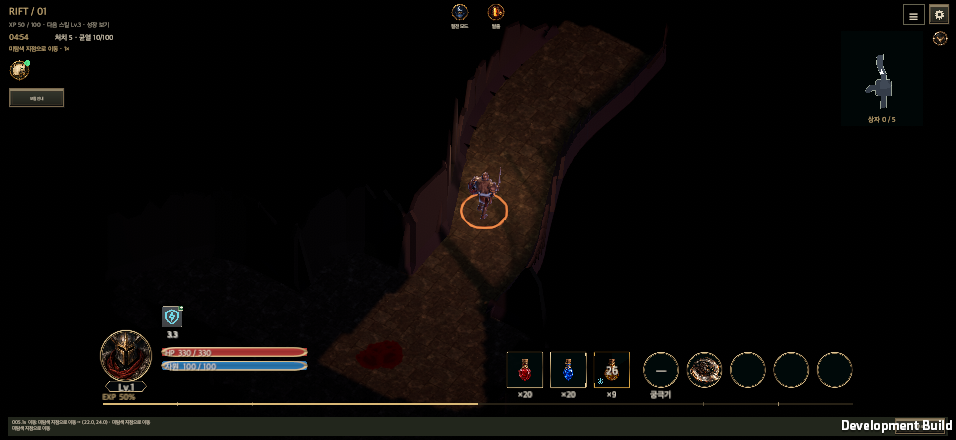
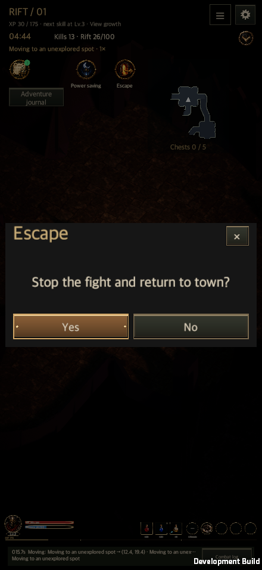

# Battle Escape and Power Saving Buttons

Updated: 2026-09-28 · [한국어](Battle_Escape.md)

The battle screen places power saving and escape icons side by side near the top, with Korean or English captions below. Their layout keeps clear of the minimap and status text as the window changes size. Power saving retains the existing automatic combat progression.

Escape opens a shared `ContentWindowView` confirmation that holds a combat pause lease. No resumes combat; Yes ends the fight and returns to town through the existing `GameController.ReturnTown` path. The mandatory first tutorial hides the escape button.

## Verification

Verified on a macOS development build of the integrated `main` code. All 24 combinations of 440×956, 956×440, 1600×900, 1600×1000 and 2100×900, Korean/English and text sizes kept the icons and captions inside the safe area without overlapping adjacent UI. EventSystem pointer checks covered power saving entry, pausing for confirmation, cancellation/resume and return to town. [Results](CompletedIntegrationEvidence/battle-escape.txt)

## Resources and verification limits

Both icons preserve the original PNG and alpha channel. The generating tool did not expose verifiable model provenance, so they retain `candidate_model_unknown` and `productionApproved: false`. [Manifest](../Art/HudButtons/hud-buttons-manifest.json)

The input checks used synthetic macOS pointers. They do not establish physical-mobile input or power-consumption results.
