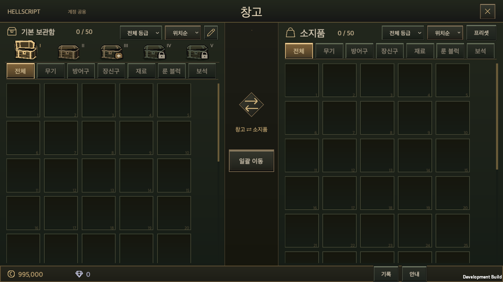
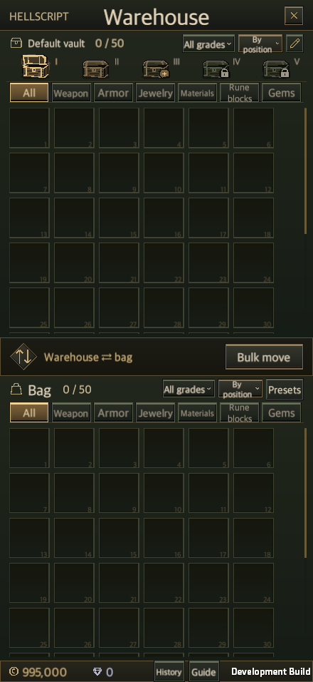
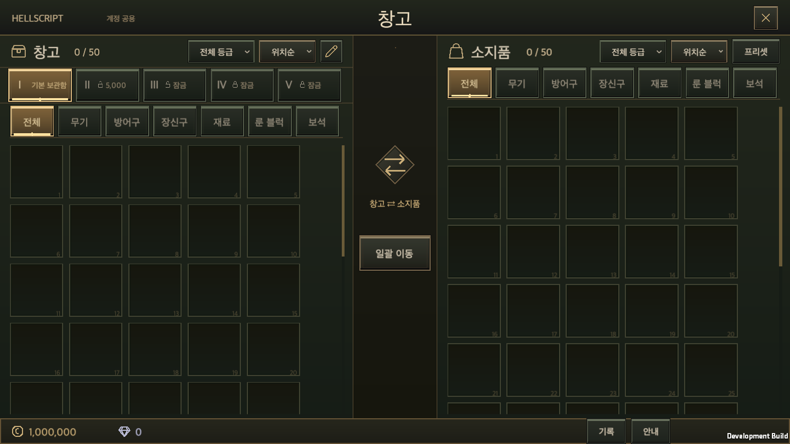
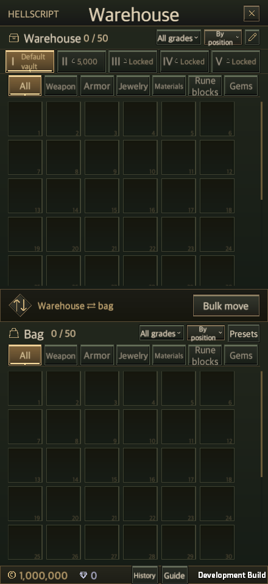
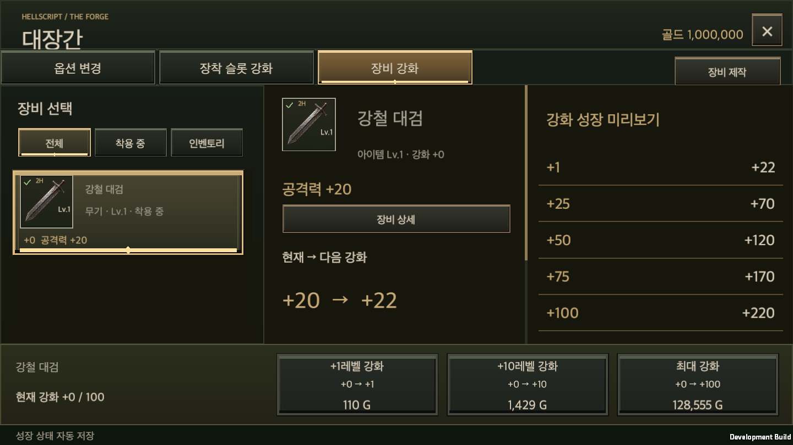
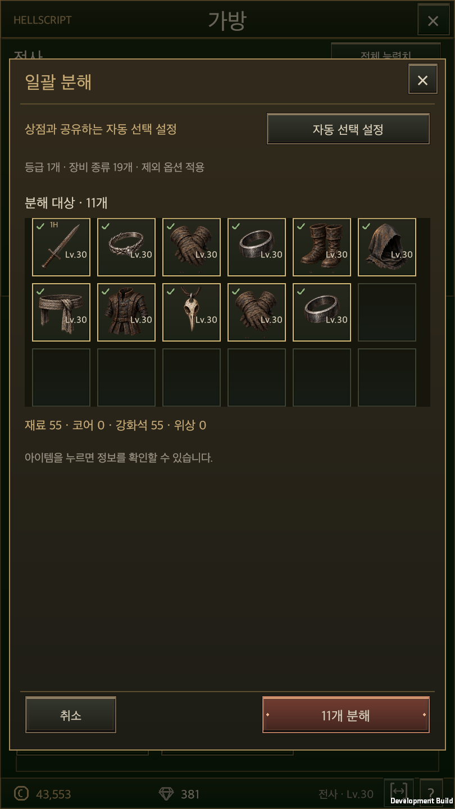
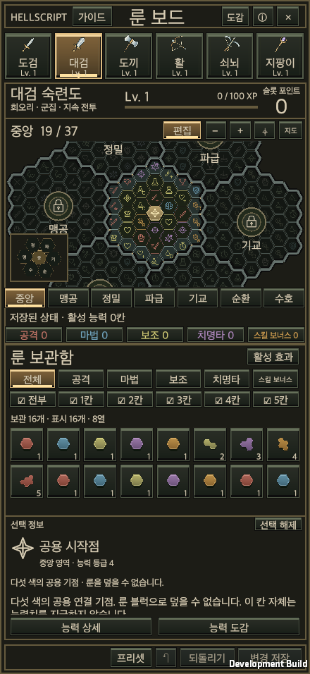
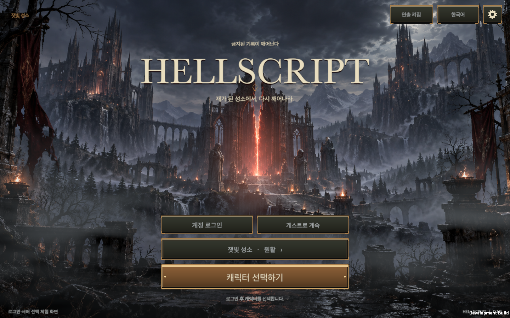

# 공통 버튼과 탭의 상호작용

갱신일: 2026-09-23
영어판: [Button and tab interaction](Button_UX.en.md)

창고의 선택 탭은 화면별 스킨을 지정한 뒤 `UiTheme.Button`이 일반 버튼 색으로 다시 칠하면서 구분이 약해졌다. 이제 화면이 현재 선택을 전달하고, 공통 부품이 입력 상태와 장식을 함께 관리한다.

## 시각 기준과 레퍼런스

[디아블로 II: 레저렉션 알파의 창고](https://interfaceingame.com/screenshots/diablo-ii-resurrected-technical-alpha-stash/), [디아블로 III 창고](https://interfaceingame.com/screenshots/diablo-iii-bank/), [디아블로 IV 창고 화면](https://mythicdrop.com/guide/diablo-4-shared-stash)을 내장 브라우저로 확인했다. 다음은 화면을 보고 HELLSCRIPT에 맞게 정한 디자인 판단이다. 각 게임의 최신 사양을 설명하는 자료로 사용하지 않는다.

- 디아블로 II의 밝은 윗모서리와 깊은 아랫모서리를 참고해 버튼이 패널에서 올라온 듯한 형태를 사용한다.
- 디아블로 III의 탭별 경계와 장식된 실행 버튼을 참고해 탐색과 실행을 구분한다.
- 디아블로 IV의 선택 면 대비를 참고해 현재 탭의 면 전체를 밝힌다. 보관함은 열린 뚜껑과 내부로 선택 상태를 표현하며, 중복되는 선택 밑줄과 마름모는 공통 렌더러에서 제거한다. 장비 목록과 선택 옵션은 바탕을 더 어둡게 유지해 등급색·보조 글자의 대비를 확보한다.

HELLSCRIPT의 올리브·황동·아이보리 테마를 유지한다. 레퍼런스의 이미지나 텍스처는 가져오지 않았다. 공통 장식은 해상도에 맞춰 그리는 Unity 메시이며 새 래스터 에셋이나 외부 패키지를 사용하지 않는다.

## 상태 계약

| 상태 | 화면 표현과 동작 |
| --- | --- |
| 일반 행동 | 어두운 면, 밝은 윗면, 어두운 아랫면과 이중 테두리로 누를 수 있는 영역을 보여 준다. |
| 주요 행동 | 황동색 면과 양쪽의 작은 장식으로 실행 버튼을 강조한다. |
| 위험 행동 | 분해 확정 계열은 붉은 갈색으로 구분한다. 실제 확인·보호·거래 검사는 기존 서비스에 남는다. |
| 현재 선택 | 화면의 선택값을 사용한다. 밝은 면이 마우스를 떼거나 초점이 옮겨도 유지된다. |
| 마우스 올림 | 면과 테두리가 약 85ms 동안 밝아진다. 선택값과 저장 상태를 바꾸지 않는다. |
| 누름 | 윗면의 음영을 뒤집어 들어간 느낌을 준다. 포인터가 밖으로 나가거나 누름이 끝나면 해제한다. 레이아웃·클릭 영역은 움직이지 않는다. |
| 키보드 초점 | 안쪽의 밝은 테두리로 표시한다. 현재 탭과 별도 상태이며 제출 입력은 기존 버튼 동작을 실행한다. |
| 사용 불가 | 면·테두리·글자의 대비를 낮추고 마우스 올림·누름·실행을 막는다. 부모 `CanvasGroup`의 사용 가능 여부도 따른다. |
| 순차 잠금 | 상자 위 자물쇠로 표시한다. 다음에 구매할 수 있는 상자는 + 표식을 표시하며, 누르면 기존 확인창을 연다. 잠긴 뒤쪽 탭은 기존 안내를 제공한다. |

## 공통 소유자와 적용 범위

`UiTheme`가 역할별 색상과 전환 시간을, `UiButton`이 Unity 입력 상태와 화면이 전달한 선택값을, `UiButtonFace`가 장식을 소유한다. `UiButton`은 기존 `Button`을 상속하므로 클릭·키보드 제출·이벤트 구독 경로를 유지한다. 선택은 `UiTheme.Choice`, 기존 스킨 어댑터는 `UiTheme.Skin`으로 전달한다.

창고·인벤토리·대장간·장비 상점·룬 마스터·사냥 칙령·위상 각인석·비교 대상 탭·룬 보드·설정·타이틀·캐릭터 선택과 `GameUI`의 공통 버튼 생성 경로에 적용한다. 이 경로를 사용하는 보석·제작·훈련·보상·도감·기록도 같은 행동 버튼을 사용한다. 창고의 보관함은 아래의 상자 아이콘 어댑터를 사용한다. 아이템 분류는 기존 탭을 유지한다.

장비·스킬·미니맵 같은 그림이 중심인 조작은 `Item` 역할을 사용한다. 평상시에는 장식을 그리지 않고 마우스·누름·초점에만 안쪽 테두리를 표시하므로 기존 등급색·아이콘을 보존한다. 팝업 바깥 닫기 영역은 `UiTheme.Backdrop`으로 장식과 키보드 탐색을 제외한다. 전투 HUD의 전용 스킬·물약 상태와 지도 토글은 기존 의미 표시를 유지한다.

장식은 입력을 받지 않고 레이아웃 계산에서 제외한다. 공통 표시 부품은 계정 저장을 읽거나 쓰지 않는다. 창고 저장 번호·정원·비용, 장비 보호, 편집본과 전투 규칙도 기존 소유자가 관리한다.

## 보관함은 상자 아이콘으로 선택한다

공통 UI는 입력과 상태의 기준을 공유한다. 모든 조작을 같은 사각 버튼으로 그리는 규칙은 아니다. 보관함은 상자의 생김새로 위치와 상태를 알 수 있으므로 `Icon` 역할과 `StorageChestGraphic`을 사용한다.

- 현재 보관함은 뚜껑이 열리고 안쪽이 보인다. 나머지는 닫힌 상자로 표시한다. 마우스를 올리거나 키보드 초점을 옮겨도 상자가 열리지 않는다.
- 상자는 앞면·옆면·뚜껑·황동 띠·그림자로 입체감을 표현한다. 공통 버튼의 누름·마우스·초점 상태를 읽으며 별도의 입력 처리를 만들지 않는다. 사각 면과 전체 테두리는 그리지 않는다.
- I–V 번호는 위치를 구분한다. 다음 구매 대상만 + 표식을 표시한다. 재화 종류와 정확한 비용은 마우스 설명과 구매 확인창에서 보여 준다. 순서상 구매할 수 없는 상자는 자물쇠를 사용하며, 누르면 기존 안내를 보여 준다.
- 현재 보관함 이름은 상단 제목에 합쳐 별도 줄을 없앤다. 상자 위에 마우스를 잠시 올리거나 키보드 초점을 두면 이름 또는 개방 조건을 임시 설명으로 보여 준다. 휴대전화에서는 탭을 선택하면 상단 이름이 바뀌며, 기존 이름 변경 버튼을 사용할 수 있다. 상자와 번호는 36 높이 안에 배치한다. 가격 전용 줄과 선택 장식을 없애고 분류 줄도 줄여 슬롯 영역을 더 확보한다.
- `StorageWindow`가 현재 탭·소유·구매 가능 상태를 전달한다. `StorageChestGraphic`은 계정에 접근하지 않는다. 구매 확인, 비용 검증, 저장, 번호, 정원과 드래그 탭 전환은 기존 소유자를 유지한다.
- 아이콘만으로 구별하기 어려운 아이템 분류·등급·정렬 조건은 문구를 유지한다. 의미가 명확한 보관함을 먼저 아이콘으로 바꿔 탐색의 글자 수를 줄인다.

### 상자 아이콘 검증

최신 기반은 병합된 `main`의 `660f0f7`이다. 아래의 이전 버튼 검증과 구분해 이번 개편의 검증 자료를 기록한다.

- 관련 Unity Edit Mode **117개 통과, 실패 0, 건너뜀 0**. 선택·초점 분리, 소유하지 않은 상자의 닫힌 상태, 공통 UI·그래픽·번역·창고 거래·장비 프리셋을 검사했다. [검사 XML](ButtonUxEvidence/Chests/editmode.xml)
- macOS 개발 빌드에서 상자 구매 취소와 정확한 비용 차감, 두 보관함 왕복 선택, 이름 변경, 저장을 바꾸지 않는 탐색을 확인했다. 아이템을 든 채 1초 머무르는 진행 표시와 열린 상자 전환, 지정한 칸에 놓는 실제 거래도 통과했다. [실행 결과](ButtonUxEvidence/Chests/runtime.txt) · [빌드](ButtonUxEvidence/Chests/build.txt) · [소스 일치 기록](ButtonUxEvidence/Chests/source-fingerprints.json)
- 창고 5개 화면 비율 × 한국어/영어 × 100%/150%의 **20조합**과 다른 6개 화면군을 다시 확인했다. 이번 실행의 캡처는 58장이다. [공통 UI 재검증](ButtonUxEvidence/Chests/shared-runtime.txt)
- 큰 상자 초안에서 보관함 이름 줄을 없애고 제목·아이콘·분류 영역을 합계 **51 UI 단위** 줄였다. 같은 배율에서 1440×810은 약 **92px**, 440×956은 약 **55px**만큼 슬롯 높이를 더 확보한다. 상자 그림 크기는 유지하며 35 높이의 클릭 영역이 아이콘 전체를 포함한다. 두 번째 축소에서는 선택 장식과 가격 전용 줄을 없애 14 단위를 더 확보했다. [축소 전](ButtonUxEvidence/Chests/before-compact.png) · [축소 후](ButtonUxEvidence/Chests/storage-pc.png)
- 화면 비율은 macOS 앱에서 재현했다. 모바일 실기기 검증과 전체 Edit Mode 재실행 결과는 아니다.

## 이전 공통 버튼 검증

- 기반: 병합된 `main`의 `12505e0`. 최신 장비 카드·드래그 강조와 룬 창 폭 개선을 포함한 별도 작업 폴더에서 검증했다. 사용자가 열어 둔 에디터와 실제 계정 저장은 변경하지 않았다.
- 1차 관련 Unity Edit Mode: **146개 통과, 실패 0, 건너뜀 0**. 버튼 입력 상태, 공통 UI, 그래픽 구성 요건, 번역, 대장간, 인벤토리를 검사했다. [검사 XML](ButtonUxEvidence/editmode.xml)
- 통합 전 전체 Edit Mode는 **3,579개 중 3,578개 통과, 1개 실패**였다. 새 버튼 그래픽의 `CanvasRenderer` 선언 누락을 수정했다. 최신 `main` 통합 후 같은 검사에서 확인한 장비 카드·드롭 장식의 선언 누락도 수정했고, 위의 146개 재검사에서 모두 통과했다. 전체 3,579개를 최종 코드로 다시 실행한 결과는 아니다. [전체 검사 원문](ButtonUxEvidence/preintegration-full-editmode.xml)

- 1차 macOS 개발 빌드 성공. **8개 실행 시나리오 모두 종료 코드 0**: 버튼 상태, 공통 UI, 저장 후 프로세스 재시작, 인벤토리, 범위 표시, 타이틀, 캐릭터 선택, 최신 장비 카드·드롭 강조. [빌드](ButtonUxEvidence/build.txt) · [시나리오 결과](ButtonUxEvidence/native-results.json) · [소스 일치 기록](ButtonUxEvidence/source-fingerprints.json)
- 버튼 검증은 마우스 올림·누름·밖으로 나가 취소·선택 유지·키보드 초점과 제출, 구매 확인 취소, 비활성 저장 차단을 확인했다. 창고는 440×956·956×440·1440×810·1440×900·1680×720 × 한국어/영어 × 100%/150%의 **20조합**, 다른 여섯 화면군은 두 모바일 비율·두 언어·150%로 확인해 총 49장을 캡처했다. [버튼 결과](ButtonUxEvidence/buttons-runtime.txt)
- 칙령 25개 그룹·130개 옵션 접근, 편집본 보존, 실제 저장과 새 프로세스 재로딩을 확인했다. 인벤토리의 장착·비교·드래그·분해, 공유 자동 선택 설정, 옵션 범위 설정과 Ctrl 임시 표시도 통과했다. [공통 UI](ButtonUxEvidence/shared-runtime.txt) · [재시작](ButtonUxEvidence/shared-resume.txt) · [인벤토리](ButtonUxEvidence/inventory-runtime.txt) · [범위 표시](ButtonUxEvidence/ranges-runtime.txt)
- 타이틀·캐릭터 선택·실제 마을 진입과 최신 장비 카드·드롭 강조를 재검증했다. [타이틀](ButtonUxEvidence/title-runtime.txt) · [캐릭터](ButtonUxEvidence/characters-runtime.txt) · [장비 카드](ButtonUxEvidence/item-polish-runtime.txt)
- 공통 UI 소유 검사와 회귀 9개, 위키 생성·검사, Python 10개·JavaScript 307개 문서/28개 DB/2,802개 레코드 경로 검사가 모두 통과했다. 공개 게시 절차는 병합된 `main`에서 수행한다.

자동화는 macOS Metal 앱의 실제 uGUI 이벤트·레이캐스트·서비스를 사용한다. 모바일 비율은 macOS 창에서 재현했으며 **모바일 실기기 터치·성능은 검증하지 않았다**.

## 초기 공통 버튼 화면

