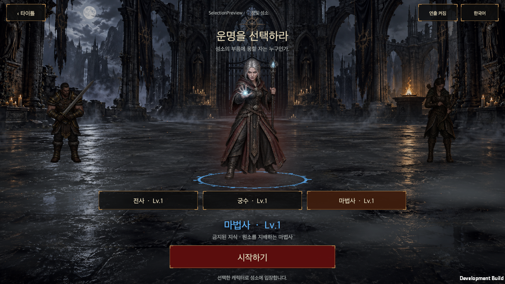

# HELLSCRIPT 캐릭터 선택 화면

작성일: 2026-09-20

[English](Character_Selection.en.md)

## 로그인부터 플레이까지

로그인 또는 게스트 입장에 성공하면 세 캐릭터가 함께 있는 선택 화면으로 이동한다. 전사는 검을 살피고, 마법사는 손안의 마력을 다루며, 궁수는 활시위를 점검한다. 캐릭터의 몸이나 아래 직업 버튼을 누르면 선택한 캐릭터가 중앙 앞으로 이동하고 나머지는 뒤로 물러나 어두워진다. 전투 준비 자세가 끝나면 하단에 **시작하기**가 나타난다. 시작하기는 선택한 저장 캐릭터를 확정하고 기존 마을 플레이 화면으로 연결된다.

직업·레벨은 실제 저장 데이터에서 읽는다. 미리 보는 동안에는 캐릭터나 장비를 저장하지 않으며, 타이틀로 돌아가도 기존 선택이 유지된다. 로그인과 서버 선택은 앞서 만든 모의 기능을 사용한다. 진행 중인 균열이 있으면 균열을 소유한 캐릭터만 선택할 수 있다. 설정 창의 캐릭터 변경으로 로그인·선택 단계를 건너뛰지 않도록 진입 경로도 맞췄다.

전용 [성소 마당 배경](../../Assets/HELLSCRIPT/Resources/Art/CharacterSelection/SelectionCourtyard.png) 위에 캐릭터와 발밑 그림자를 배치한다. 연출은 2D 원화 프레임, 위치 이동, 호흡, 바닥 문양으로 구성한다. 전투 중 사용하는 3D 모델이나 애니메이션을 교체하는 작업은 아니다. 직업당 여섯 장의 연속 준비 동작을 사용하며, 대기 구간과 전투 준비 구간을 나누어 재생한다. 연출 정지는 대기 동작과 배경을 멈추며 캐릭터를 선택하는 조작은 계속 사용할 수 있다.

## 화면과 입력

기존 타이틀과 같은 iPhone 17 Pro Max 비율의 가로·세로 화면과 PC 16:9·16:10·울트라와이드에 대응한다. 안전 영역은 기존 `UiSafeArea`를 사용한다. 창 크기나 언어가 바뀌어도 현재 미리 보는 캐릭터는 유지된다. 모바일 가로에서는 설명과 시작 버튼을 나란히 배치하고, 세로에서는 중앙 캐릭터 아래에 모은다.

캐릭터 그림의 투명한 여백은 클릭 대상에서 제외한다. PNG의 원래 알파에서 미리 계산한 작은 클릭 마스크를 사용하므로 런타임에서 원본 텍스처를 CPU로 읽지 않는다. 직업 버튼은 별도로 제공한다. PC의 좌우 방향키로 캐릭터를 고를 수 있고, Esc로 타이틀에 돌아간다. 선택된 버튼이 없을 때 Enter는 시작하기를 실행한다.

## 소유권과 에셋

- [CharacterSelectionState.cs](../../Assets/HELLSCRIPT/Runtime/Core/CharacterSelectionState.cs)는 미리 보는 대상과 균열 소유권 제한을 관리한다.
- [GameUI.CharacterSelection.cs](../../Assets/HELLSCRIPT/Runtime/Presentation/GameUI.CharacterSelection.cs)는 기존 UI의 새 페이지를 만든다. [CharacterSelectionView.cs](../../Assets/HELLSCRIPT/Runtime/Presentation/CharacterSelectionView.cs)는 화면과 입력을, [CharacterSelectionStage.cs](../../Assets/HELLSCRIPT/Runtime/Presentation/CharacterSelectionStage.cs)는 이동·자세·대기 동작을 맡는다.
- [GameController.CharacterSelection.cs](../../Assets/HELLSCRIPT/Runtime/Presentation/GameController.CharacterSelection.cs)는 시작할 때만 저장 대상을 확정한다. 저장 실패 시 이전 선택으로 복구한다. 실제 마을 진입은 기존 `GameController.EnterPlaza(true)`를 사용한다.
- [CharacterFigure.cs](../../Assets/HELLSCRIPT/Runtime/Presentation/CharacterFigure.cs)는 투명 이미지의 프레임과 클릭 영역을 표시한다.
- 원본 아틀라스: [전사](../../Assets/HELLSCRIPT/Resources/Art/CharacterSelection/Warrior.png), [마법사](../../Assets/HELLSCRIPT/Resources/Art/CharacterSelection/Mage.png), [궁수](../../Assets/HELLSCRIPT/Resources/Art/CharacterSelection/Ranger.png).
- [프롬프트](Character_Selection_Prompts.txt), [제작 정보](CharacterSelectionEvidence/provenance.json), [알파·크기 검사](CharacterSelectionEvidence/art-qc.json), [검사 도구](../../tools/inspect_character_atlases.py)를 보존한다.

아트는 기존 전사 참고 이미지의 스타일을 기준으로 내장 `image_gen`에서 생성했다. 각 PNG는 1024×1536 RGBA이며 생성된 원본 픽셀을 변경하지 않았다. 크로마키나 배경 제거를 수행하지 않았고, 원래 알파를 그대로 사용한다. 프레임마다 그림의 크기를 따로 맞추지 않고 공통 비율로 그리며, 발 위치를 기준으로 정렬한다. 궁수는 요청한 격자와 다르게 생성되어 실제 배치에 맞는 명시적 UV 영역을 기록했다. 원본의 완전한 캐릭터를 사용하며 명목상 격자선을 기준으로 검 끝을 잘라내지 않는다.

C2PA의 생성 도구 정보는 `ChatGPT / gpt-image`이다. 정확한 모델 버전은 노출되지 않아 `gpt-image-2` 사용을 확인할 수 없다. 세 캐릭터 아틀라스와 성소 마당 배경은 교체 가능한 개발용 아트로 등록한다.

## 검증

관련 Edit Mode 검사 **58/58개**를 통과했다. 캐릭터 선택 상태·균열 소유권·아틀라스 검사 10개, 기존 타이틀 검사 15개, 번역 검사 33개다. [검사 결과](CharacterSelectionEvidence/editmode.json)를 보존한다.

최종 macOS 개발 빌드에서 `HELLSCRIPT_CHARACTER_SELECTION_OK checks=11`과 `HELLSCRIPT_TITLE_RUNTIME_OK checks=10`을 확인했고 두 실행 모두 종료 코드 0으로 끝났다. 세 캐릭터의 실루엣 클릭, 직업별 대기 프레임 재생, 중앙 이동, 전투 준비 자세, 준비 후 시작 버튼 표시, 빠른 재선택, 미리 보기 중 저장 불변, 로그인·게스트·로그아웃·뒤로 가기, 균열 소유권 제한, 마법사로 실제 마을 입장과 선택 화면 해제를 검사했다. [선택 화면 결과](CharacterSelectionEvidence/validation.txt)와 [타이틀 회귀 결과](TitleScreenEvidence/validation.txt)를 보존한다.

iPhone 비율의 세로 440×956와 가로 956×440, PC 1280×720·1440×900·1720×720에서 안전 영역과 버튼 크기·겹침·문구 잘림을 확인했다. 휴대전화 비율은 Mac 창과 모의 여백을 사용한 검사다. 한국어·영어 전환과 회전 뒤에도 선택이 유지되며, 연출 정지 시 대기 시계와 자세가 고정되는 것을 확인했다.

별도 Mac 실행 창에서 실제 마우스와 키보드로 로그인 입력·Tab·Enter, 전사 실루엣 선택, 오른쪽 방향키로 궁수 변경, 시작하기 클릭과 마을 화면 전환을 확인했다. [실제 입력 범위](CharacterSelectionEvidence/native-input.json)에 기록했다. iPhone 실기기 터치·키보드·성능과 Windows 실행은 미검증이다.

[최종 빌드](CharacterSelectionEvidence/build.json)는 오류 0개로 성공했다. 전체 프로젝트 빌드 경고 384개가 남아 있으며, 캐릭터 선택 관련 Console 필터에서는 경고·오류가 없었다. 전체 게임 회귀 검사나 모바일 성능 측정을 수행했다는 의미는 아니다.

[세 캐릭터 대기 화면](CharacterSelectionEvidence/lineup-pc-ko.png) · [전사 선택](CharacterSelectionEvidence/selected-warrior-pc-ko.png) · [궁수 선택](CharacterSelectionEvidence/selected-ranger-pc-ko.png) · [iPhone 세로](CharacterSelectionEvidence/selected-iphone-portrait-ko.png) · [iPhone 가로](CharacterSelectionEvidence/selected-iphone-landscape-ko.png) · [영어 화면](CharacterSelectionEvidence/selected-iphone-portrait-en.png) · [플레이 진입](CharacterSelectionEvidence/plaza-entry-mage-en.png)

공개 위키는 작업 브랜치가 `main`에 병합될 때 병합 담당자가 생성·검사·배포한다.
