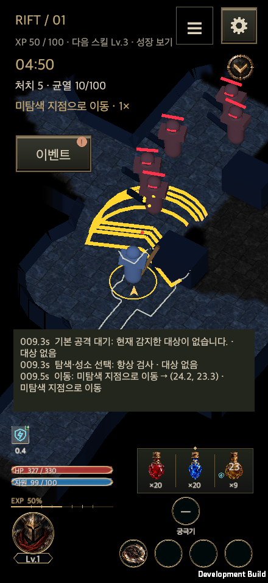
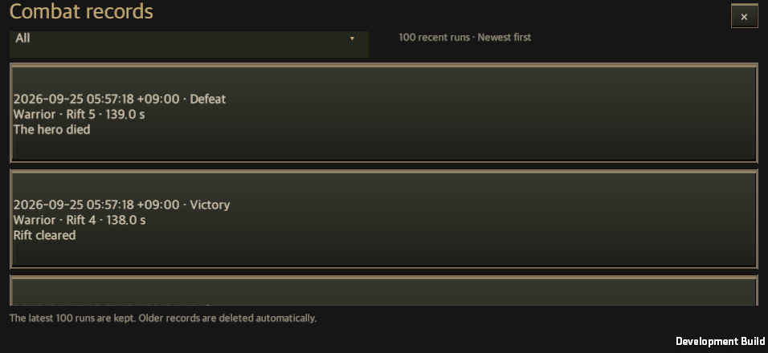

# Rift combat journal and server analytics

Updated: 2026-09-25

Korean: [균열 전투 기록과 서버 분석 수집](Combat_Journal_Server.md)

## Player experience

The rift entry screen exposes **Battle records**, a newest-first account-wide list of the last 100 runs with an **All / Victories only / Defeats only** dropdown. Rows show device-local completion time and UTC offset, class, stage, combat duration and termination reason. Legacy timestamps and outcomes remain unknown when absent; localized result strings are never used to invent an outcome.

Defeats include death, timeout and returning before defeating the boss, distinguished by their termination reasons. Leaving loot after defeating the boss remains a victory. Training creates neither owned rift history nor analytics deliveries.

During battle a live text panel sits above the persistent bottom HUD. Narrow screens retain as many complete recent messages as fit and abbreviate the preview when necessary. Completed text logs are chronological and paged in blocks of 100 entries. Existing summaries, final-five-second damage/blocked-action analysis and historical equipment/configuration remain available.

The journal joins observed movement/stop reasons, targets/destinations, rules, selected actions, cast phases, automatic/player triggers, cooldown/resource/range/position waits, hits, shield absorption, deaths, bosses, chests, potions, rewards and configuration changes. Enemy attack/hazard telegraphs retain preparation time and aim, with interruption and enrage events. Damage records retain source/target/root-cast IDs and actual HP loss separately from overkill. Death summaries use the observed final window's HP loss, largest damage source and blocked-skill reasons. Missing evidence is never reconstructed as fact.

## Ownership and persistence

`CombatSimulation` records through `CombatJournal` at existing decision, movement, damage and reward owners. UI only observes. Completed `CombatHistory` snapshots own their data. Save schema **15** preserves legacy records.

`GameStore` commits the account first. `CombatJournalArchive` then creates derived files; failed account saves create no delivery. Export failures retain full records in the account for retry. Successful exports remove detailed events from the account's record, loading them from the per-run file when requested. A crash after an ACK and before the next account save retries the canonical file's exact bytes.

| Location | Purpose and retention |
| --- | --- |
| `<save directory>/combat-records/<runId>.json` | One JSON file per completed battle, containing readable messages and structured evidence. Only the latest 100 account records are retained. |
| Account `records` | Last 100 summaries, reviews and configuration snapshots; unexported records also retain their events. |
| `<save directory>/combat-outbox/<runId>.json` | Independent delivery queue; removal requires a matching server acknowledgment. Local 100-run pruning does not delete queued uploads. |
| `*.json.rejected` | Preserved server-rejected bodies, allowing later runs to proceed. |

Detailed events are capped at 20,000 per run. The start and newest window survive; omitted counts and sequence gaps are explicit, while full aggregates remain exact. Movement records use the actual movement override and distinguish survival responses from skill positioning; stale decisions are not reused as current triggers. Movement is sampled on state changes and every two seconds, repeated identical decisions every four seconds. This is not a frame-by-frame position replay. Event `damageEvents`, `rules`, `builds` and `edicts` are zero-or-one arrays so Unity does not materialize absent inline snapshots on reload. Files use compact JSON.

The outbox, including rejected evidence, is limited to 1,000 files or 256 MiB. Player files are still created when delivery capacity is exhausted, and unexported source data remains retryable within the latest 100 runs. If such a record ages out before export, `combatTelemetryLossCount` and subsequent `LOCAL_EXPORT_LOSS` explicitly report the gap. Collection must not be described as complete in that case.

## Analytics and trust

| Category | Evidence |
| --- | --- |
| Identity | Server-authenticated account ID, separate local account identifier, hero ID/class/start and end level, local attempt ordinal. No real name or advertising identifier is collected. |
| Environment/content | App version, build GUID, platform, save/item/map versions, stage, map fingerprint and seed. |
| Timing/progression | Client UTC start/end, simulation duration, existing attendance/fatigue duration, resume count, observed start; server receipt time is generated independently. |
| Loadout | Initial build/skills/ranks/options, Hunt Edict, equipped item instances, slot levels, rune configuration, potion state and final configuration; configuration-change events also capture the build. |
| Outcomes/rewards | Outcome/reason, kills/boss completion, awarded gold, equipment/rune counts, claimed/ignored drop states and exact item snapshots. Gold uses `RiftEarnings`, not wallet deltas. |
| Combat/integrity | Event sequence, cast/target/rule IDs, position, HP/resource, damage calculation inputs/results, final-window analysis and truncation/resume/export/clock trust markers. |

Client payloads are `client_observed`. SHA-256 provides retry byte identity, not anti-cheat authenticity. The receiver binds ownership to authentication, deduplicates account/run IDs and audits conflicting bodies. Suspicious speed, outcome or reward reports are investigation signals, never automatic sanctions.

The existing `AuthoritativeRiftVerifier` replays from a server-owned admission snapshot, clock and seed. Its completed `server_replay` copy is included in `HuntAuthorityCheckpoint.combatTelemetry` and committed by the same CAS as account/replay cursors. Client HTTP ingestion rejects this provenance. An internal host adapter must pass only committed checkpoints into `Repository.attach_authority`.

## Server integration

The login host supplies an `ICombatTelemetrySession` to `GameController.Telemetry.Configure`: an HTTPS endpoint and current short-lived access token. No credential or endpoint is persisted in account files. Networking remains off until configured; loopback HTTP is allowed only in development builds.

`CombatTelemetryUploader` removes a file only when `accepted`, `runId` and the exact byte `payloadHash` match. Timeouts, authentication and transient failures use exponential retries capped at 300 seconds. Redirects are disabled.

`server/combat_telemetry.py` is an executable standard-library/SQLite reference receiver. `/v1/combat-runs` authenticates, checks bounds/schema/sequence/time/summary shape and commits runs/events/drops atomically before acknowledging. `server/combat_analytics.sql` provides account/hero/stage outcomes, clear duration/gold, skill damage, loot and authority-evidence queries.

An operational endpoint, login session adapter and production admission/reward repository are not connected in this change. Production integration must supply TLS, authentication, request limits, backups, retention and the trusted replay worker. Local HTTP proof is not production collection proof.

## Verification and delivery

Focused results and macOS evidence live in `CombatJournalEvidence/`. The original dirty checkout and its running Editor are preserved; batch verification and development builds use an isolated checkout from current `main`. macOS synthetic pointer evidence is separate from physical-mobile validation.

Feature-branch documentation is published when merged. Public wiki deployment must run from validated `main`.

### Verified results

- Unity Edit Mode passed the 488/488 expanded regression run, 155/155 journal/enemy/boss/localization follow-up and 137/137 final natural-death/localization/movement-response run. These overlap and must not be summed into a whole-project count. See [validation](CombatJournalEvidence/validation.json) and [final death tests](CombatJournalEvidence/editmode-defeat.xml).
- The macOS development build succeeded with zero build errors. Normal Update first advanced the live journal, followed by direct fixed-step simulation. An unforced stage-one victory reported approximately 102.8 simulation seconds, 43 kills, 2,276 gold and five collected items. Attendance and simulation duration are separately recorded; this is not a claim of 102.8 seconds of real-time play.
- Portrait 440×956, landscape 956×440 and PC 1600×900, 1600×1000 and 2100×900 were checked in Korean/English at 100%/140% text size: 20 live-HUD and 20 history cases with rendered-text and HUD-overlap assertions.
- One actual run and 99 labeled list fixtures exercised 100 rows. EventSystem raycasts and pointer down/up/click opened the rift records entry, all three result filters and chronological details. Synthetic list fixtures were removed before the final save.
- A separate application process restored the full journal. Edit Mode covered 101st-record pruning without deleting delivery evidence, failed saves, full queues, ACK/crash recovery and rejected-body/crash recovery.
- Unity client → localhost HTTP receiver → SQLite commit → matching ID/SHA-256 ACK → outbox removal passed. Server tests passed 9/9 and all five analytics queries executed against the received run. [Runtime evidence](CombatJournalEvidence/runtime.json) records file size and hash.
- Shared-UI contract checks and 9/9 regression tests, wiki build/check, 10/10 Python wiki tests and JavaScript wiki checks passed. Physical mobile and production service integration are outside the verified scope.

[Chronological text](CombatJournalEvidence/chronological-log.png) · [Defeat filter fixtures](CombatJournalEvidence/defeat-filter-fixtures.png) · [Separate-process restore](CombatJournalEvidence/restart-records.png)

Implementation sources: [CombatJournal.cs](../../Assets/HELLSCRIPT/Runtime/Core/CombatJournal.cs) · [combat_telemetry.py](../../server/combat_telemetry.py) · [combat_analytics.sql](../../server/combat_analytics.sql) · [SHA-256](CombatJournalEvidence/source-digests.json)
