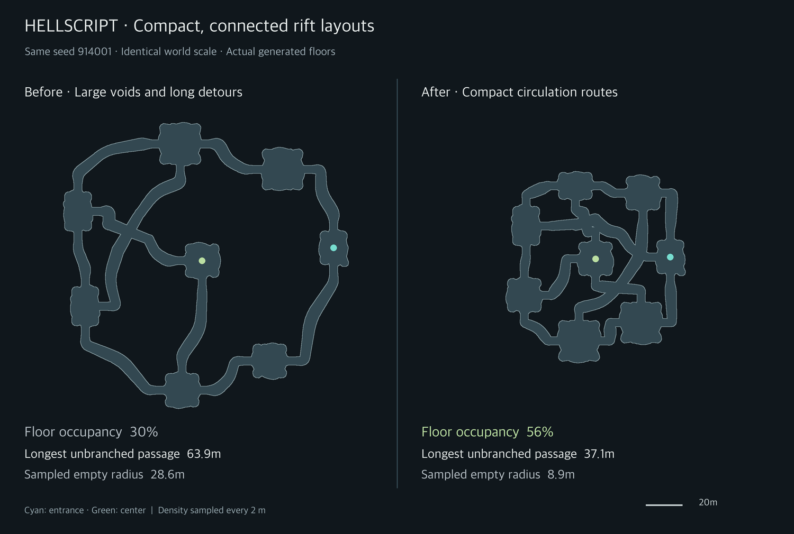
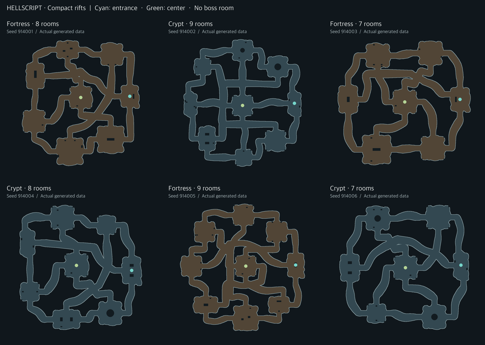

# HELLSCRIPT Compact Rift Layouts and Shorter Choice Gaps

Date: 2026-09-14 · Layout version: 7

[한국어](Compact_Rift_Expansion.md)

## Purpose

Version 6 guaranteed circulation but placed rooms around a large ring, leaving large interior voids and long passages without a choice. Version 7 reduces room spacing and gives every perimeter room an inward route. The user's compressed map sketch supplies the shape reference for these two requirements.

This record supersedes the spacing, transverse connections, crossing clearance and chest-distance rules in the [version 6 record](Organic_Rift_Expansion.en.md). Organic contours, the central room, full circulation and nearby boss spawning remain.

## Enforced generation limits

| Property | Version 7 requirement |
|---|---|
| Interior density | Floor occupies at least 48% of its convex envelope. |
| Large voids | Every empty interior sample is at most 14 m from a floor sample. |
| Unbranched passage | At most 40 m of corridor centerline between room exits and real junctions. Bends do not reset the distance. |
| Room choices | Every room, including the entrance and center, has at least three independently connected doors. |
| Interior routes | Six to eight perimeter rooms plus one central room. Every perimeter room has an inward connection; radial and transverse routes meet at a real X crossing. |
| X geometry | Four 4 m arms, a 60–120 degree crossing angle, and 1.2 m movement clearance. |
| Circulation | No dead-end wings, bridge corridors or articulation rooms; one complete tour visits every room once and returns to the entrance. |

Density and empty-space distance use a fixed 2 m world-space sample grid over the actual polygon floor. Preview zoom and rectangular room bounds are not substitutes. Decorative pillars are excluded from the density metric and checked separately by navigation clearance. The 14 m limit describes sampled distance, not an exact continuous largest-inscribed-circle calculation.

The 40 m limit applies to **passages outside rooms**. It does not include travel or combat inside a room or promise a travel time. A junction requires separate routes meeting physically with at least three distinct outgoing directions. Parallel overlap, duplicate route IDs and simple bends do not split the measured length.

[RiftDensity.cs](../../Assets/HELLSCRIPT/Runtime/Core/RiftDensity.cs) rejects failing candidates before content placement. The six fixed fallback layouts obey the same checks after the generator tries 24 random candidates. No fallback bypasses these requirements.

## Placement and routing

The base perimeter radius falls from 62–66 m to 41.2–43.6 m, with less positional jitter. Combat room space and passage widths remain. Door approaches shrink from 9 m to 5.5 m and each X arm from 9 m to 4 m so a crossing does not require a large empty core.

[RiftCrossRoutes.cs](../../Assets/HELLSCRIPT/Runtime/Core/RiftCrossRoutes.cs) evaluates perimeter door assignments together and penalizes routes obstructed by neighboring rooms. It reserves inward doors and tries offset positions when an obstacle blocks a wall's center. The mandatory X location balances the two transverse legs.

Three or four perimeter rooms connect to the center; the remaining rooms pair across the interior. Radial and transverse paths form multiple circulation routes, allowing repeated transitions from the perimeter into the interior. Navigation, world floors, the overlay and the full map still consume the same polygon geometry.

## Rewards, bosses and persistence

Budgets remain 110 normal enemies, eight elites, five to seven chests, two equipment rewards and unchanged total gold/materials. New maps allow chest anchors at least 26 m from the start so compact rooms remain eligible. Chests still avoid the entrance and require a room-graph distance of at least two; tests require an actual path of at least 24 m to their opening position. Legacy arena generation retains its 45 m constraint.

A full 100-point kill meter still summons a boss on nearby safe floor, without reserving a boss room. Spawn-distance and reward rules are unchanged.

New entries save version 7. Existing version 6 and older runs retain their saved geometry, bosses and exploration rather than being regenerated or compacted. Current sight, remembered terrain and overlay preferences remain intact.

## Actual geometry comparison

Six identical seeds are compared with the previously saved version 6 layouts. Both sides of the comparison image use the same metres-to-pixels scale.

| Mean across six matching seeds | Version 6 | Version 7 |
|---|---:|---:|
| Floor occupancy | 30.4% | 54.9% |
| Envelope area | 17,978m² | 8,989m² |
| Largest empty-sample distance | 28.2m | 9.7m |
| Longest unbranched passage | 62.8m | 36.1m |

[Comparison measurements](CompactRiftEvidence/comparison.json) and [six generated layouts](CompactRiftEvidence/sample-layouts.json) are preserved. Different candidates may be selected, so this compares the result of the same input seed rather than identical room-template ordering.

## Verification

All [83 relevant Edit Mode tests](CompactRiftEvidence/final-tests.xml) passed in Unity 6000.6.0f1, covering geometry, circulation, bosses, combat movement, chest budgets, old saves, visibility and localization. After adding serialization for measurement evidence, all [six density tests](CompactRiftEvidence/serialization-tests.xml) passed again. These reports do not represent 89 distinct tests.

Seeds 914001–914036 all used random candidates, with zero fixed fallbacks. The [36-map audit](CompactRiftEvidence/density-audit.csv) recorded 49.0–58.8% floor occupancy, 8.0–12.2 m maximum empty-sample distance and 33.6–39.3 m longest unbranched passages. All six fixed fallback structures passed with five reward seeds each, totaling 30 geometry/navigation/reward combinations. Regression cases reject fake choices created by bends or parallel overlaps.

The final macOS development build completed without compilation errors. All 377 C# files matched between the workspace and validation project; [key source hashes](CompactRiftEvidence/source-sha256.json) and the [build/test summary](CompactRiftEvidence/verification.json) are preserved. No package, scene, prefab or project-setting change is included.

The native app was closed and relaunched, preserving the layout, health, time, RNG and remembered terrain. A Warrior completed stage 1, seed 91367, at 1× speed. At meter 100 one boss appeared approximately 9.7 m away. Four chests opened and the run cleared after 129.00 seconds. Evidence includes the [runtime record](CompactRiftEvidence/runtime.txt), [native map screen](CompactRiftEvidence/runtime-map.png), [nearby boss](CompactRiftEvidence/runtime-boss.png) and [result screen](CompactRiftEvidence/runtime-result.png). The overview capture temporarily overrides only the display mask, then restores it without changing explored cells or combat.

The fixture uses a level-30 Warrior, eight rare item-level-30 pieces and chest exploration settings. This validates flow, not natural progression balance or mobile-device performance. Existing suspended rifts remain intact; the compact rules take effect on the next new entry.
