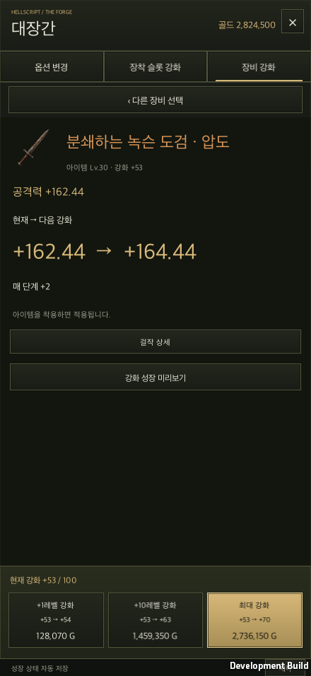
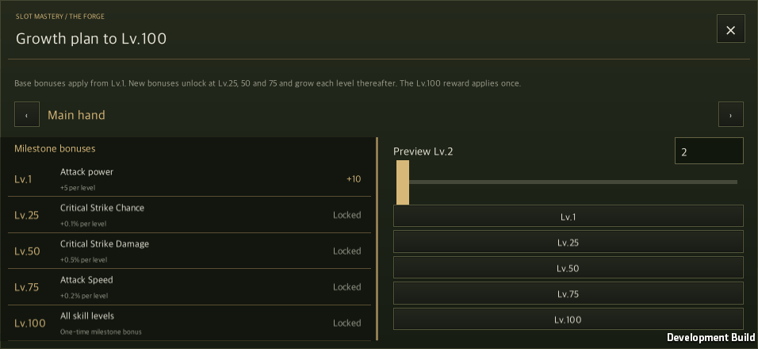
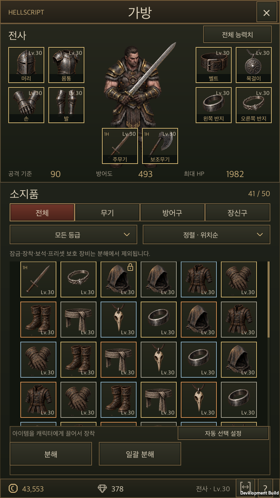
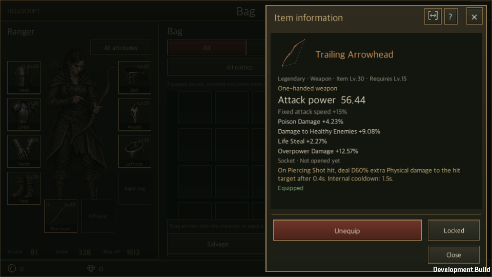

# Completed development integration

The completed development branches were integrated in an isolated checkout on 2026-09-22. The original working directory and its uncommitted changes are preserved. Shared UI migration starts from this baseline.

## Scope

The baseline retains main `96e8094` (title, character selection, town, HUD, runes, Hunt Edict and set planning), shop/storage `665448b`, inventory/ranges `68e7373`, blacksmith HTML `0389d6d`, blacksmith runtime `1b56ef0`, and completed legendary expansion `5b083ab`. Ongoing game skill design, wiki registration and generated outputs from `codex/class-skill-design` are excluded. The Unity CLI development skill is preserved separately from game skill design.

The integrated catalog contains 30 equipment bases, 58 attributes, 54 affixes, 123 legendary items and 24 set items. Equipment positions, range display, enhancement stones, slot progression and transaction persistence coexist.

## Compatibility fixes

- Use Unity-aware component validity checks for inventory range text height.
- Select a valid main hand in legendary test fixtures rather than accidentally generating a dependent offhand with no main weapon. Production compatibility checks stay enforced.
- Compare the legendary 80% health threshold at stored float precision.
- Do not advertise a local macOS app build directory as a portable wiki download.

## Evidence and limits

The initial full Edit Mode run executed 3,062 cases: 3,030 passed, 32 failed, none skipped. After corrections, all 128 focused cases passed, including every initial failure. These reports overlap and must not be added together; the initial full report remains a failed historical report.

The Unity 6000.6.0f1 macOS development build succeeded. Native acceptance covered inventory ownership/equipment, common range preferences and temporary Ctrl display, blacksmith upgrades/rerolls/jobs/NPC access, and three classes' legendary damage. A separate process restored legendary state and verified deterministic continuation. Korean/English portrait and landscape were inspected; blacksmith also covers PC 16:9, 16:10 and 21:9.

This is native macOS evidence with automated input and explicit state checks. It is not physical mobile touch or performance evidence. This baseline does not claim the subsequent shared UI migration is complete.

- [Machine-readable summary](IntegrationEvidence/summary.json)
- [Initial full tests](IntegrationEvidence/baseline-editmode.xml), [corrected focused tests](IntegrationEvidence/compatibility-editmode.xml)
- [Inventory](IntegrationEvidence/inventory-result.txt), [ranges](IntegrationEvidence/ranges-baseline-result.txt), [blacksmith](IntegrationEvidence/blacksmith-result.txt)
- [Initial legendary runtime](IntegrationEvidence/legendary-initial-result.txt), [separate-process resume](IntegrationEvidence/legendary-resume-result.txt)

