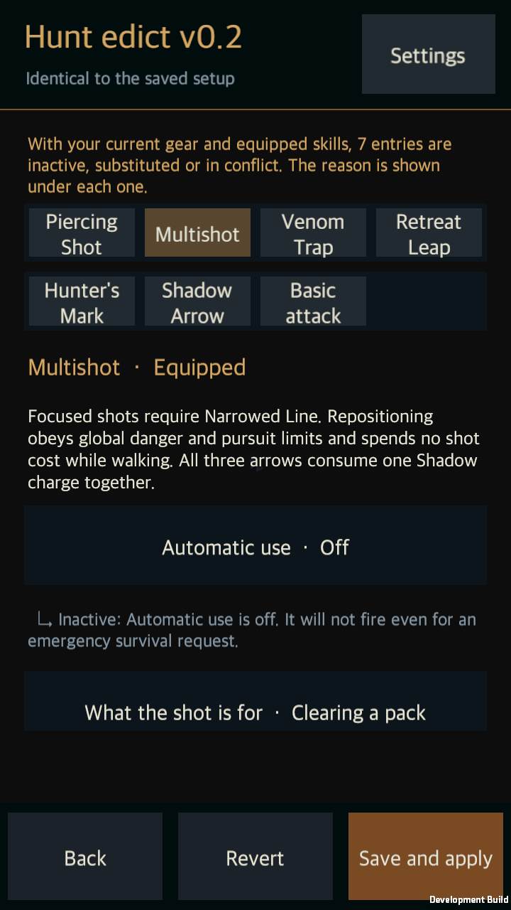

# Ranger skill and basic-shot hunt edicts

Date: 2026-09-13 · [한국어](Edict_Ranger_Expansion.md)

Status: **All 30 core options for Pierce, Multi Shot, Poison Trap, Retreat, Hunter Mark, Shadow Arrow and ranged BASIC are connected to actual combat.**

## Scope and ownership

This continues `d3814c2` using the [option catalog](../Design/HELLSCRIPT_Hunt_Edict_Skill_Option_Catalog.md) and [screen-layout specification](../Design/HELLSCRIPT_Screen_Layout_Detail.md). Work remains on `main`; Claude's attribute, affix and balance commits are preserved.

The saved v0.2 document produces equipped active candidates and BASIC directly. Read-only planners evaluate observed targets, geometry, purpose and actual costs before the existing preparation, release, collision and recovery pipeline runs. Missing, disabled or duplicate legacy rows cannot suppress or duplicate a core action. Original rows and characters that opt out retain legacy behavior.

## The 30 options

| Action | Count | Connected decisions and effects |
|---|---:|---|
| Pierce A01 | 4 | Automatic, one/two/elite-or-group purpose, global/current/elite/own-trap-poison target and target/best-piercing ray. The selected target must fall within the actual 10 m, 0.6 m width and five-victim cap, or seven with AP03. Real LA01, set and Shadow hits remain physical projectile effects. |
| Multi A02 | 4 | Automatic, immediate/group/focus purpose, global/current/elite target and global/far/focus position. Focus requires actual LA02. Movement obeys global hazard and pursuit limits without paying early. Real ray intersections distinguish unique victims and multiple arrows on one victim; the whole volley consumes one Shadow charge. |
| Trap A03 | 5 | Direct automatic installation, target/dense/path/self placement, count/ambush purpose, keep/replace at two traps and allow/new-target overlap. Own direct and retreat traps share the arming/waiting/triggered cap. New-target eligibility filters locations before maximizing population. Ambush needs SELF, at least one second without perceived enemies and no own trap. |
| Retreat A04 | 4 | Automatic, off/distance/trap-link/pierce-link ordinary purpose, four landing preferences and global/desired-distance follow-up walking. Real travel is 2–6 m and checks terrain, hazards and bodies. Ordinary distance recovery needs an initial error of at least 2 m and a smaller final error. Global emergencies do not wait for an ordinary link purpose. |
| Mark A05 | 4 | Automatic, global/current/elite/highest-remaining-HP target, immediate/long-fight timing and keep/strictly-higher/new-target transfer. Elite-only does not fall back to ordinary enemies. Long-fight ordinary targets need at least half HP; highest HP uses absolute remaining health. Same-target early refresh and ID-only priority changes are rejected. |
| Shadow A06 | 4 | Automatic, any/elite/poison-spread encounter, BASIC/Pierce/Multi reference and four target policies. Real reference equipment, unlock, cooldown, range, ray and sequential affordability are checked. LC02/AP05 consumed by the buff cannot discount the following paid shot again. Reference purposes are not recursively required, and no next shot is reserved. |
| Ranged BASIC | 5 | Automatic, fill/resource/discount role, global/current/low-HP/elite target, global/until-death/until-discount holding and allow/hold during Shadow. Resource recovery requires actual resource shortage for a physically ready, higher-priority paid attack. Only a real hit grants six resource and LC02 hit progress; misses grant neither. |

Direct traps install within 6 m, arm for 0.5 s and trigger on entry. Overlapping own trap damage does not stack. With real LA03 and equipped A03, automatic direct placement can be OFF while a retreat still leaves its takeoff trap. AP04, LA03 duration and existing set effects use actual equipment and passives.

LA03 triggers at takeoff; AP02 speed and the six-second SAB4 Pierce charge require actual landing. Jump displacement cannot earn AP05 walking credit. Follow-up walking ends at the desired distance, target/path loss or the next main action and never delays a ready attack or emergency. Failure of a future link does not refund an executed effect or cost.

A Mark removes the old own Mark only after successful release on its new target. Death, range or sight failure preserves the prior Mark without refunding cooldown. Zero-cost Mark consumes no discount. Shadow preserves three actual charges for eight seconds, consumes one at launch and cannot overwrite remaining charges. Poison spread needs actual LA04 and own A03/LA03 poison.

## Persistence and UI

Versioned `EdictRangerState` stores BASIC holding and post-landing target/distance. A committed retreat snapshots its follow-up and desired distance. Memory from another hero/run is discarded; unsupported versions and invalid distances are rejected while retaining the original save. Committed preparation, projectiles, traps and charges resume once even after automatic use is turned off.

Seven screens have KO/EN explanations using the established scrolling body and fixed Back/Revert/Save-and-apply footer. The native player traversed every choice of each of the 30 options through actual button events, saved changed values and compared fresh disk reads.

## Evidence and limits

| Check | Final result |
|---|---|
| Full Unity Editor suite | **2,079 passed**, zero failures or skips. |
| Ranger-specific fixture | **98 passed**, covering legacy-row independence, read-only planning, geometry, hazard/cost/equipment boundaries, actual effects and persistence. |
| Native macOS player | **13 independent launches/restarts passed**: trap preparation/arming/poison, Shadow preparation, focus approach, saved three-arrow volley and Pierce; retreat takeoff/landing/walking, Mark and actual SAB4 afterimage; BASIC preparation, saved two-hit count and earned third-hit discount. |
| Visual review | **31 screenshots reviewed**: direct inspection of 31 images from the preceding run, decoded-pixel comparison against all 31 final images, and direct reinspection of six representative final images. Coverage includes KO/EN, 1280×720, 720×1280, 640×360 and 140% text. |
| Actual costs and rewards | Controlled fixtures paid 20 for Trap, 10 for Shadow, 30 for Multi and 20 for Pierce, or 17 with real SAB2. Three real BASIC hits earned eighteen resource and one LC02 charge; the next Pierce paid ten, leaving eight. These are controlled functional results, not balance recommendations. |

Earlier failures distinguished an enabled new BASIC from a single-skill fixture, and an unreachable post-retreat point from a valid corridor. Both continuing and no-path stopping are now checked. An out-of-range Multi with insufficient resource now approaches before BASIC recovery becomes eligible. Native validation exposed that LA03 and the fourth SAB piece both occupy boots; separate legal builds replaced the impossible combined fixture. Two obsolete translations were removed. A later full run found an old LA04 message in shared availability; both consumers now use the same current Black Contagion key and translation. Earlier failed results remain in the evidence folder.

See the [summary](../../Artifacts/Validation/EdictRanger/validation-summary.json), [visual review](../../Artifacts/Validation/EdictRanger/visual-review.json), [source/player comparison](../../Artifacts/Validation/EdictRanger/validated-source.json) and [player](../../Builds/macOS-EdictRanger/HELLSCRIPT.app). Isolated project copies and dedicated saves protected user data. No scene, prefab or package changed. Concurrent unrelated settings, wiki tools/documents and repository instructions were separately recorded and preserved.

Multi-seed generated-rift survival, growth and farming utility, remaining content/services and mobile-device input/performance still require work. This phase proves functional, persistence and UI integration; it does not establish whole-game completion or improved balance.
