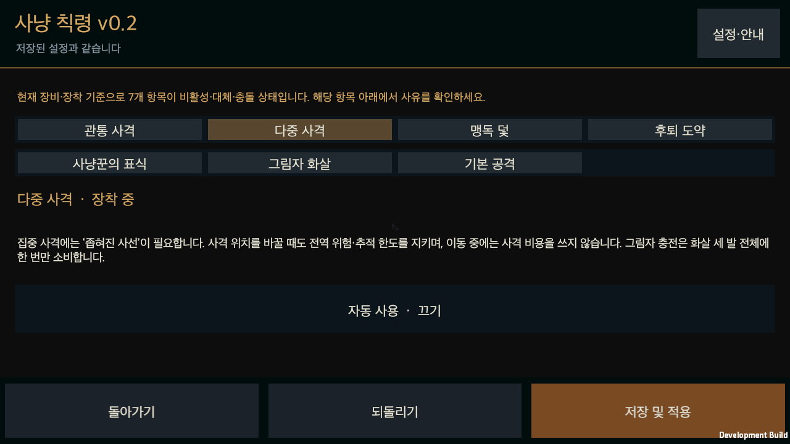
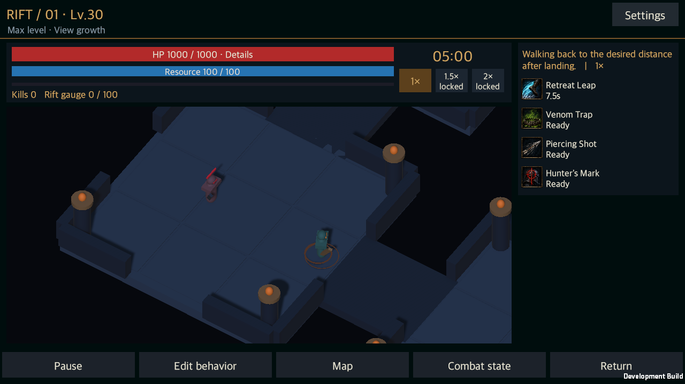

# 궁수 스킬·기본 사격 사냥 칙령 연결

작성일: 2026-09-13 · [English](Edict_Ranger_Expansion.en.md)

상태: **관통 사격·다중 사격·맹독 덫·후퇴 도약·사냥꾼의 표식·그림자 화살·기본 사격의 핵심 옵션 30개를 실제 전투에 연결했다.**

## 적용 범위와 실행 구조

전사 지원 스킬 구현을 마친 `d3814c2`에서 이어서 [스킬별 옵션 기획](../Design/HELLSCRIPT_Hunt_Edict_Skill_Option_Catalog.md)과 [화면 배치 상세안](../Design/HELLSCRIPT_Screen_Layout_Detail.md)을 적용했다. 작업 위치는 `main`이며 클로드의 능력치·접사·밸런스 커밋을 보존한다.

영웅의 v0.2 문서에서 장착한 액티브와 기본 사격의 후보를 직접 만들고, 선택 대상·사거리·용도·비용을 평가한 뒤 기존 준비·발사·적중·회복 처리로 넘긴다. 옛 규칙이 없거나 꺼져 있거나 중복되어도 실행 후보는 한 번만 생성된다. 원본 규칙과 v0.2 사용을 끈 영웅의 기존 동작은 보존한다. 계획 함수는 관측된 적과 실제 장비를 읽으며 저장 상태를 미리 바꾸지 않는다.

## 연결한 30개 옵션

| 행동 | 옵션 수 | 적용한 판단과 실제 효과 |
|---|---:|---|
| 관통 사격 A01 | 4 | 자동 사용, 한 명·두 명·정예/무리 용도, 전역·현재·정예·자기 덫 중독 대상, 대상 방향·다수 관통 사선을 적용한다. 실제 10m 사거리·0.6m 폭·5명 또는 AP03의 7명 상한 안에 선택 대상을 포함한다. 실제 LA01 후속 관통·세트·그림자 적중은 기존 투사체에서 처리한다. |
| 다중 사격 A02 | 4 | 자동 사용, 즉시·무리·단일 집중, 전역·현재·정예 대상, 전역·먼 거리·집중 명중 위치를 적용한다. 집중에는 실제 LA02가 필요하다. 이동할 때 전역 위험·추적 한도를 지키며 비용을 미리 쓰지 않는다. 세 발의 실제 교차와 같은 적의 명중 수를 비교하고, 한 발사에 그림자 충전을 한 번만 소비한다. |
| 맹독 덫 A03 | 5 | 직접 자동 설치, 발밑·밀집·추격 경로·자신 아래, 적 수·매복, 두 덫 유지·교체, 겹침·새 적을 적용한다. 직접 덫과 자기 후퇴 덫의 무장·대기·발동 상태를 합쳐 최대 두 개다. 새 적을 덮는 후보를 먼저 걸러 설치점을 찾는다. 매복은 자신 아래·인지한 적 없이 1초 이상·자기 덫 없음이 필요하다. |
| 후퇴 도약 A04 | 4 | 자동 사용, 일반 전투의 사용 안 함·거리 복구·덫 연계·관통 연계, 네 착지 선호, 착지 후 전역·희망 거리 보행을 적용한다. 실제 2~6m 이동과 지형·위험·몸체를 확인한다. 일반 거리 복구는 현재 거리 오차 2m 이상에서 오차를 줄여야 하며, 긴급 생존은 일반 연계 목적을 기다리지 않는다. |
| 사냥꾼의 표식 A05 | 4 | 자동 사용, 전역·현재·정예·남은 HP 최대 대상, 즉시·장기 교전, 유지·높은 우선순위·새 대상 이전을 적용한다. 정예 전용은 일반 적으로 대체하지 않으며 장기 교전의 일반 적은 HP 50% 이상이어야 한다. 높은 HP는 실제 잔여량이다. 동일 대상 조기 갱신과 ID 동률만으로의 이전을 막는다. |
| 그림자 화살 A06 | 4 | 자동 사용, 일반·정예·독 전염 교전, 기본·관통·다중 기준 사격, 전역·현재·정예·자기 덫 중독 기준 대상을 적용한다. 기준 사격의 실제 장착·해금·쿨다운·사거리·사선과 순차 비용을 확인한다. 강화에서 쓴 LC02/AP05 할인을 다음 유료 사격에 다시 쓰지 않는다. 후속 용도를 재귀 검사하거나 다음 사격을 예약하지 않는다. |
| 기본 사격 | 5 | 자동 사용, 보완·자원 보충·절제 할인 준비, 전역·현재·낮은 HP·정예 대상, 전역·처치까지·할인까지 대상 유지, 그림자 강화 중 사용·보류를 적용한다. 자원 보충은 자기보다 먼저 선택할 수 있는 유료 공격의 실제 자원 부족일 때만 사용한다. 실제 적중 한 번에 자원 6과 LC02 적중 횟수를 얻으며 빗나감에는 지급하지 않는다. |

덫은 6m 안에 설치하며 0.5초 무장 뒤 적의 진입으로 발동한다. 겹친 자기 덫의 독 피해를 합산하지 않는다. 직접 설치를 꺼도 장착한 LA03와 A03가 만드는 후퇴 덫은 출발점에 남을 수 있다. AP04 제어·LA03 지속시간과 기존 세트 효과는 실제 장비·패시브를 따른다.

후퇴의 LA03 덫은 이륙 때, AP02 가속과 SAB4의 6초 관통 충전은 실제 착지 때 생긴다. 도약 이동량을 AP05 보행으로 세지 않는다. 착지 후 보행은 지정한 거리 도달·목표 상실·경로 상실·다음 주 행동에 종료되며 가능한 공격이나 긴급 행동을 미루지 않는다. 후속 연계를 못 하게 되었다고 이미 지불하거나 발동한 효과를 되돌리지 않는다.

표식은 준비 뒤 새 대상에게 실제 부여했을 때만 자기의 이전 표식을 제거한다. 대상 사망·범위·시야 실패에서는 이전 표식을 보존하며 이미 쓴 재사용 대기시간을 환불하지 않는다. 비용이 0인 표식은 할인 충전을 소비하지 않는다. 그림자는 실제 3충전·8초를 유지하며 발사 때 한 충전을 쓰고, 남아 있는 충전을 새 강화로 덮지 않는다. 독 전염 교전은 실제 LA04와 자기 A03/LA03 독을 요구한다.

## 저장 복원과 화면

버전이 있는 `EdictRangerState`에 기본 사격의 유지 대상과 착지 후 보행 대상·희망 거리를 저장한다. 진행 중인 후퇴에는 확정 당시의 후속 방침과 거리를 기록한다. 다른 영웅·균열의 기억을 재사용하지 않으며 지원하지 않는 버전과 잘못된 거리 값은 원본 저장을 보존한 채 거부한다. 이미 확정한 준비·투사체·덫·충전은 이후 자동 사용을 꺼도 한 번만 이어진다.

일곱 설정 화면에 한국어·영어 설명을 추가했다. 긴 본문은 스크롤하고 하단의 돌아가기·되돌리기·저장 및 적용은 계속 접근할 수 있도록 기존 배치 구조를 사용한다. 실제 앱의 버튼 이벤트로 30개 옵션 각각의 모든 선택지를 순환하고 다른 값으로 저장한 뒤, 저장 파일을 새로 읽어 일치 여부를 검사했다.

## 검증 근거와 한계

| 항목 | 최종 결과 |
|---|---|
| 전체 Unity Editor 검사 | **2,079개 통과**, 실패·건너뜀 0개. |
| 이번 단계 전용 검사 | **98개 통과**. 기존 규칙으로부터의 독립, 순수 계획, 사거리·위험·비용·장비 경계, 실제 효과와 저장 복원을 포함한다. |
| 실제 macOS 앱 | **독립 실행·재시작 13회 통과**. 덫 준비·무장·중독 → 그림자 준비 → 집중 위치 접근 → 세 화살의 저장 복원 → 관통 적중, 후퇴 이륙 → 착지 → 보행 복원 → 표식 → 실제 SAB4 잔영, 기본 사격 준비 → 두 번 적중 저장 → 세 번째 적중과 할인 소비를 확인했다. |
| 화면 | **31장 검토**. 앞선 실행본의 31장을 직접 확인하고 최종 실행본의 31장과 픽셀을 대조했으며, 최종 대표 화면 6장을 다시 직접 확인했다. 한국어·영어, 1280×720·720×1280·640×360, 140% 글자 설정을 포함한다. |
| 실제 자원·충전 | 통제한 캐릭터에서 덫 20, 그림자 10, 다중 사격 30, 관통 20 또는 실제 SAB2의 17을 지불했다. 기본 세 번 적중으로 자원 18과 할인 한 번을 얻고, 다음 관통에서 실제 10을 지불해 8이 남았다. 이는 기능 검증용 통제 조건의 결과다. |

첫 집중 검사의 한 실패는 새 기본 사격을 끄지 않은 단일 스킬 검사였으며, 다음 실패는 보행 목적지가 벽 밖에 놓인 지형이었다. 단일 스킬과 기본 사격을 분리하고, 열린 통로의 보행·벽에서 멈춤을 각각 검증했다. 자원이 부족하고 다중 사격의 사거리 밖인 경우에는 먼저 접근하도록 판단 순서를 고쳐 기본 사격으로 회복할 수 있게 했다. 실제 앱에서는 LA03와 SAB4가 모두 신발을 쓰는 장비 충돌을 확인해, 불가능한 동시 장착 검사 대신 두 합법적인 빌드를 따로 검증했다. 이후 사용하지 않는 번역 두 줄도 제거했다. 전체 재검사에서 발견한 공통 사용 조건의 옛 LA04 문구도 현재 장비명인 ‘검은 전염’과 같은 번역 키로 맞췄다. 수정 전 결과는 그대로 보관한다.

[검증 요약](../../Artifacts/Validation/EdictRanger/validation-summary.json), [화면 검토](../../Artifacts/Validation/EdictRanger/visual-review.json), [소스·앱 대조](../../Artifacts/Validation/EdictRanger/validated-source.json), [실행본](../../Builds/macOS-EdictRanger/HELLSCRIPT.app)을 보관한다. 별도 복제 프로젝트와 전용 저장 폴더에서 검증했으며 씬·프리팹·패키지를 바꾸지 않았다. 다른 작업에서 변경 중인 프로젝트 설정과 위키 도구·문서·작업 규칙은 별도 기록으로 보존했다.

생성 균열 여러 시드에서의 장기 생존·성장·장비 파밍 효용, 남은 게임 콘텐츠와 온라인 서비스, 모바일 실기기의 입력·성능 검증은 계속 남아 있다. 이 단계는 기능·저장·화면의 연결을 입증하며 전체 게임 완성이나 밸런스 개선의 근거로 확대하지 않는다.
