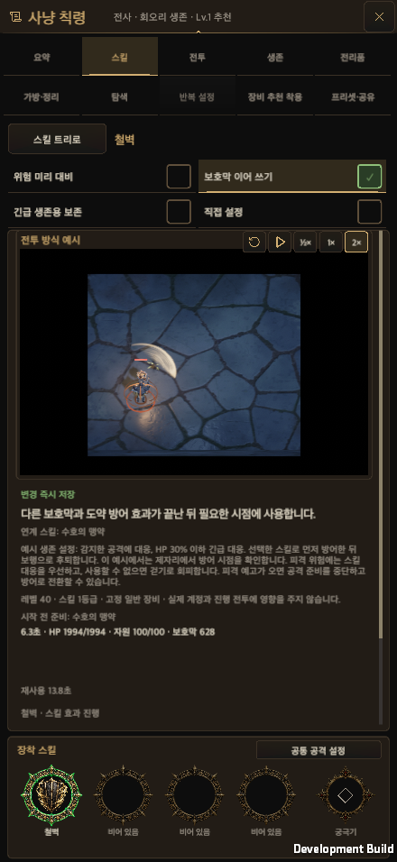

# 전체 검사 실패 수정 근거 / Full-suite repair evidence

작성일: 2026-10-04. [수정 설명](../EditMode_Regression_Repair_20261004.md) / [Repair notes](../EditMode_Regression_Repair_20261004.en.md). Unity 6000.6.0f1, macOS development player. 실제 uGUI와 합성 포인터 입력이며 모바일 실기기 검사는 아니다. / Actual uGUI with synthetic pointers; physical mobile was not tested.

## 검사 보고서 / Test reports

- [집중 검사 최신 결과 / Latest focused results](focused-summary.json): 서로 다른 130개 모두 통과 / all 130 distinct cases pass.
- [첫 원인 진단 / First root diagnosis](root-focused.xml): 51 total, 27 passed, 24 failed.
- [그래프 수정 재검사 / Graph rerun](graph-recheck.xml): 24 total, 23 passed, 1 failed.
- [남은 원인 수정 재검사 / Remaining repairs](remaining-focused.xml): 80 total, 79 passed, 1 failed.
- [철벽 예시 수정 / Iron Wall example repair](shield-example-recheck.xml): 1 passed, 0 failed.
- [공통 UI와 저장 갱신 검사 / Shared UI and refresh checks](static-validation.json).
- [이전 실패 분류 / Historical failure classification](original-failure-classification.json).
- [최종 전체 검사 / Final full suite](final-editmode.xml): 5,122 passed, 0 failed, 0 skipped, 0 inconclusive.
- [최종 결과·소스 일치 / Final result and source identity](final-validation.json).
- [최종 전체 검사 계획 / Final full-suite plan](final-validation-plan.json).

## 실제 저장·재개 / Real save and fresh-process resume

[비교 결과 / Comparison summary](native-validation.json) · [체크포인트 실행 / Checkpoint run](native-ui/repair-checkpoint.txt) · [별도 프로세스 재개 / Fresh-process run](native-ui/repair-restart.txt)

| 균열 / Rift | 200틱 저장 / 200-tick checkpoint | 300틱 연속 실행 / Uninterrupted 300 ticks | 새 프로세스 100틱 재개 / Fresh-process continuation |
| --- | --- | --- | --- |
| 1 | [JSON](native-ui/rift-checkpoint-1.json) | [JSON](native-ui/rift-expected-1.json) | [JSON](native-ui/rift-actual-1.json) |
| 5 | [JSON](native-ui/rift-checkpoint-5.json) | [JSON](native-ui/rift-expected-5.json) | [JSON](native-ui/rift-actual-5.json) |
| 12 | [JSON](native-ui/rift-checkpoint-12.json) | [JSON](native-ui/rift-expected-12.json) | [JSON](native-ui/rift-actual-12.json) |

[첫 재개 비교의 언어 조건 차이 / First comparison language mismatch](native-restart-first-attempt.json) · [첫 실패 로그 / First failure](native-restart-first-attempt-failure.txt). KO 대조와 EN 재개를 비교한 검사 조건을 KO로 맞춘 뒤 실패한 범위만 재실행했다. / Match KO control and resumed fixture language, then rerun only the failed continuation scope.

## 철벽 자동 방어와 화면 / Iron Wall automatic defense and screens

[실제 전투 상태 / Actual combat state](native-ui/W05-combat.json)

| 화면 / Viewport | 한국어 / Korean | 영어 / English |
| --- | --- | --- |
| 440×956 | [PNG](native-ui/W05-chain-440x956-ko.png) | [PNG](native-ui/W05-chain-440x956-en.png) |
| 956×440 | [PNG](native-ui/W05-chain-956x440-ko.png) | [PNG](native-ui/W05-chain-956x440-en.png) |
| 1600×900 | [PNG](native-ui/W05-chain-1600x900-ko.png) | [PNG](native-ui/W05-chain-1600x900-en.png) |
| 1600×1000 | [PNG](native-ui/W05-chain-1600x1000-ko.png) | [PNG](native-ui/W05-chain-1600x1000-en.png) |
| 2100×900 | [PNG](native-ui/W05-chain-2100x900-ko.png) | [PNG](native-ui/W05-chain-2100x900-en.png) |
| 가로 안전 영역 모의 / Simulated landscape safe area | — | [PNG](native-ui/W05-chain-safe-area.png) |

## 빌드 근거 / Build evidence

[빌드 결과·실행 파일 해시 / Build result and binary hashes](native-build-proof.json) · [입력 소스 지문 / Source fingerprint](source-fingerprint.json) · [명령 / Command](native-build-command.json) · [로그 발췌 / Log excerpts](native-log-summary.json) · [복원한 빌드 설정 변경 / Restored build-generated settings](native-build-settings.patch)

비교용 실행 파일은 위키에 포함하지 않는다. 작업 전용 폴더에 보존하며 수명과 검토일은 수정 설명과 작업의 `artifact-lifecycle.json`에 기록한다. / The comparison binary stays outside the wiki in the task-owned artifact directory; the repair notes and artifact lifecycle manifest record its purpose and review date.
