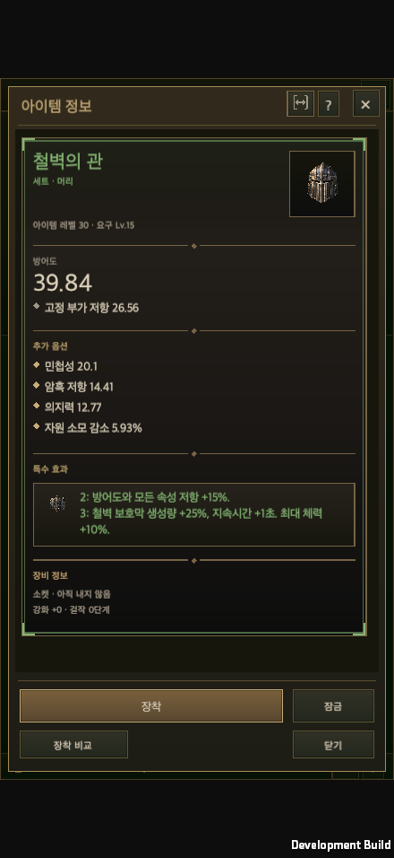
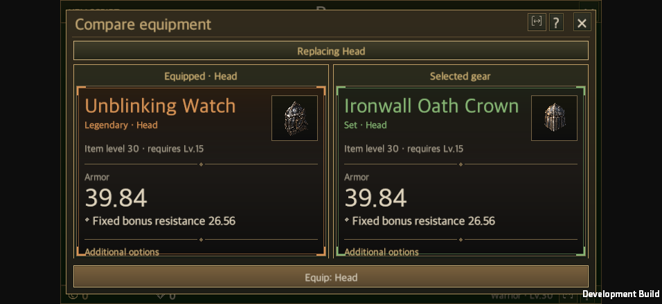

# Legendary and set equipment artwork integration and coverage

Updated: 2026-09-23

[한국어](Equipment_Art_Integration.md)

The 105 equipment images and 24 emblems from the [set artwork task](https://chatgpt.com/s/cx_6ab3635913b88191a19efd3dc7f17785) are connected to shared equipment presentation. Their original commit `7417c9f` was already included in baseline main `4768bb5`, so its images were reused unchanged. The 141 delivered legendary images use the same lookup path. This change generates no images and does not copy another set's artwork to fill gaps.

## Ownership and behavior

- [EquipmentArt](../../Assets/HELLSCRIPT/Runtime/Presentation/EquipmentArt.cs) resolves the original definition in `Item.special`. Imprinting a different power does not change the equipment's visual identity. Missing dedicated images keep the existing base atlas or vector fallback.
- [EquipmentSlotView](../../Assets/HELLSCRIPT/Runtime/Presentation/EquipmentSlotView.cs) shares that rendering across inventory, storage, shops, blacksmith, equipped slots and item details. Dedicated PNGs use their full UV rectangle and preserve opacity and input pass-through.
- [ItemDetailView](../../Assets/HELLSCRIPT/Runtime/Presentation/ItemDetailView.Style.cs) displays the set's emblem beside its existing effect text. It reuses the existing wording and calculations and measures wrapped text after reserving emblem space.
- Item data, saves, combat, drops, existing images, metadata and GUIDs are unchanged. The additional class catalog remains `playerEnabled=false`; artwork integration does not enable these sets in ordinary play.

The production tool's exact model remains `unknown`, as recorded by the original production task. Existing candidate images are used at the user's request; integration does not establish new model provenance. Historical production manifests retain their original verification scope. This document records subsequent integration separately.

## File coverage

The [complete file audit](EquipmentArtEvidence/file-audit.json) compares catalog IDs with actual PNGs and alpha. File checks are separate from Unity runtime checks.

| Category | Definitions | Dedicated images present | Missing |
| --- | ---: | ---: | ---: |
| Legendary equipment | 141 | 141 | 0 |
| Equipment in 24 new sets | 105 | 105 | 0 |
| Equipment in 6 existing sets | 24 | 0 | 24 |
| Set emblems | 30 | 24 | 6 |

The 141 legendaries include 123 established definitions and 18 additional class definitions. The 246 equipment images have distinct file hashes. All 270 delivered equipment/emblem PNGs decode and have transparent pixels. This is file and alpha verification, not an independent repeat of artistic review.

| Class | Set without dedicated artwork | Equipment IDs | Slots |
| --- | --- | --- | --- |
| Warrior | Whirlwind Watcher | SW1, SW2, SW3, SW4 | Head, body, hands, feet |
| Warrior | Executioner of the Falling Star | SWB1, SWB2, SWB3, SWB4 | Head, body, hands, feet |
| Ranger | Venom Gravekeeper | SA1, SA2, SA3, SA4 | Head, body, hands, feet |
| Ranger | Stalker of Long Shadows | SAB1, SAB2, SAB3, SAB4 | Head, body, hands, feet |
| Mage | Oath of Winter | SM1, SM2, SM3, SM4 | Head, body, hands, feet |
| Mage | Resonating Storm | SMB1, SMB2, SMB3, SMB4 | Head, body, hands, feet |

Emblems `SW`, `SWB`, `SA`, `SAB`, `SM`, and `SMB` also have no dedicated files. New set IDs were not arbitrarily assigned to these existing sets.

Reproduce with `python3 tools/audit_equipment_art.py --output Docs/Implementation/EquipmentArtEvidence/file-audit.json`. Known unproduced items remain in the report; missing delivered assets, invalid PNG/alpha and duplicate equipment file hashes fail the audit.

## Validation

- Shared UI ownership checks and 9 related checks pass.
- Unity 6000.6.0f1 focused Edit Mode: **63 passed, 0 failed, 0 skipped**. This includes 10 artwork checks, 23 shared UI checks, 16 equipment comparison checks and 14 detail-setting checks. Artwork checks load all 246 equipment images, resolve emblems for all 24 new sets, and verify full UVs, input pass-through, original item identity and fallback behavior. [XML](EquipmentArtEvidence/editmode.xml)
- The macOS Metal development build completed with zero errors. The actual app passed **20 presentation/interaction combinations**: 440×956, 956×440, 1440×810, 1440×900 and 1680×720; Korean/English; 100%/150% text. Synthetic pointers passed through actual uGUI raycasts and click handlers to open details and comparisons. Checks covered texture identity, emblems, text bounds and immutable saved equipment. [Runtime log](EquipmentArtEvidence/equipment-art-runtime.txt) · [Detailed results](EquipmentArtEvidence/equipment-art-audit.json)
- Validation used a separate worktree and isolated save directory. It did not change the user's save or the original Editor's Play Mode. A full game regression and physical mobile validation were not performed.

