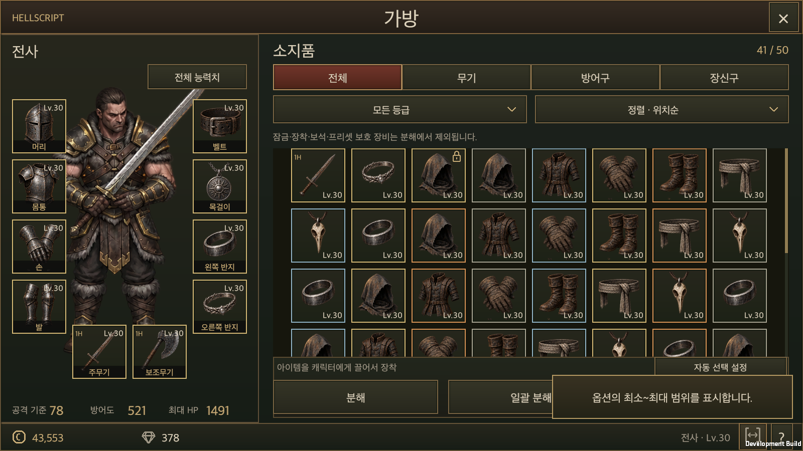
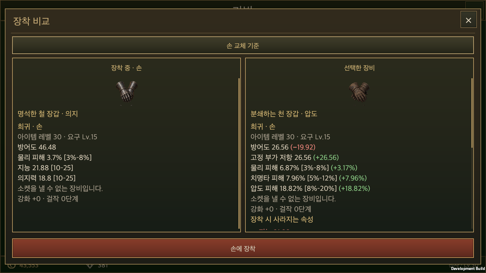
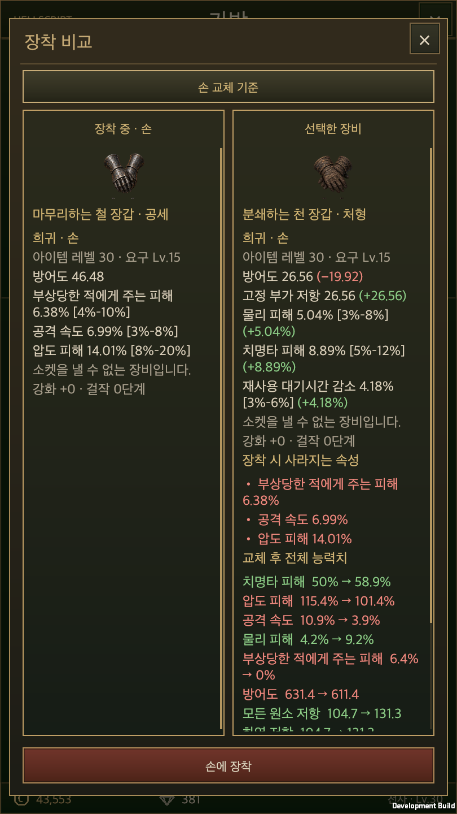
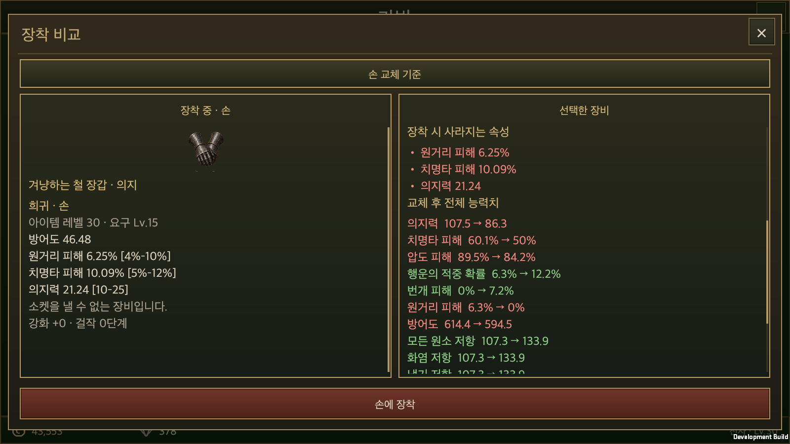
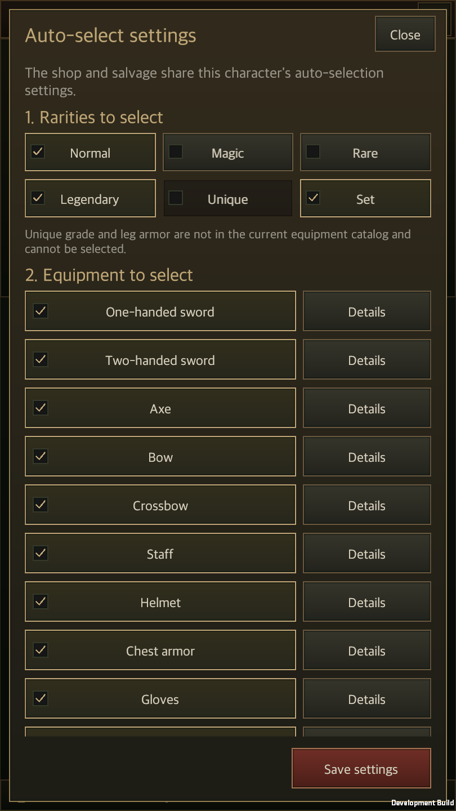
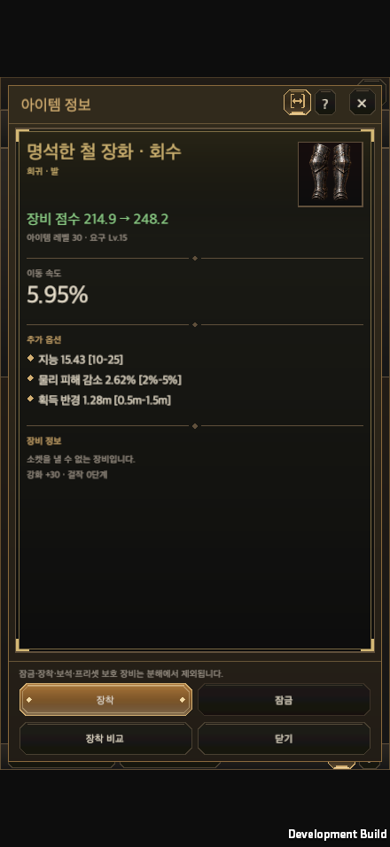
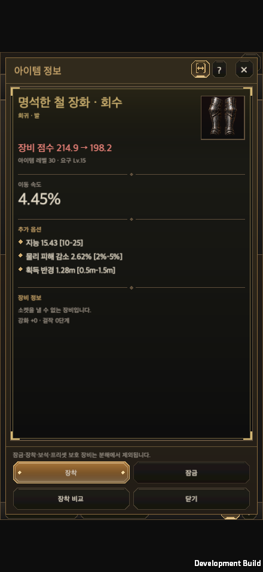
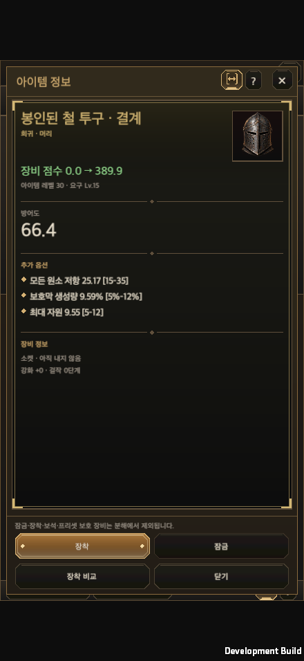
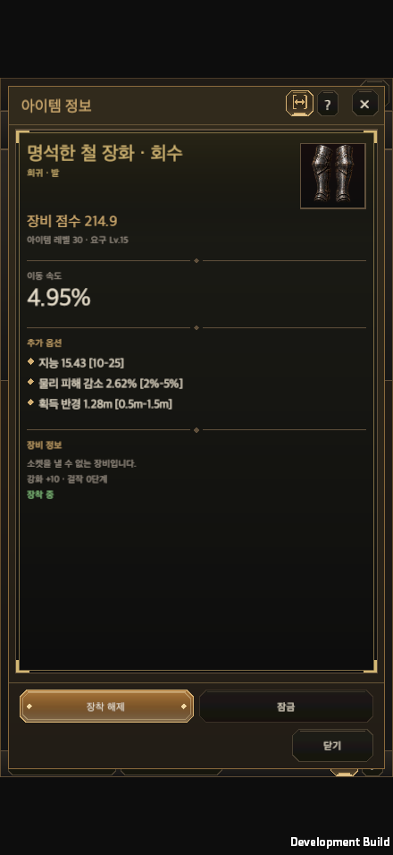
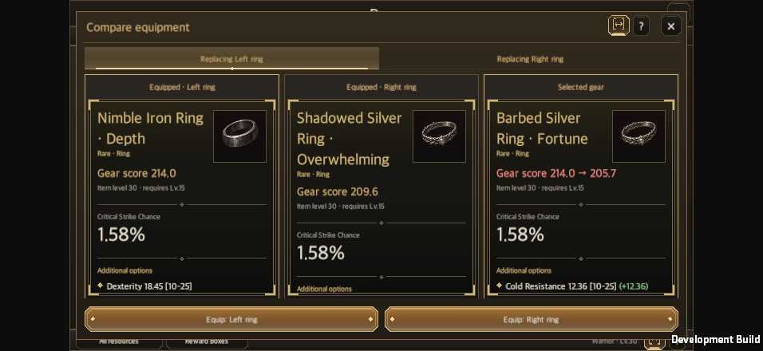

# Shared equipment comparison and salvage selection

Updated: 2026-10-02 · First written: 2026-09-22 · [한국어](Equipment_Comparison.md) · [Display contract](../Design/Equipment_Comparison_Rules.en.md)

Inventory, storage and merchant comparisons previously used separate ordering and calculation paths. A shared model and renderer now put equipped gear left and the candidate right, append candidate deltas, and list missing outgoing properties in red. Repository instructions require the same contract for future content.

## Ownership

| Concern | Owner |
| --- | --- |
| Properties and roll ranges | `ItemComparison.Properties` reads actual bases, affixes, quality and gems. |
| Outgoing equipment | `ItemComparison.Preview` runs `EquipmentSlots.Plan` on copies. |
| Deltas, lost properties and resulting attributes | `ItemTooltip.Lines` supplies consistent order, units, colors and wording. |
| Paired cards, target selection and scrolling | `EquipmentComparisonView` occupies a fixed region supplied by each content window. |
| Equipping and transactions | Existing `GameStore`, `EquipmentSlots`, storage and merchant services. |

Consumers include native inventory, storage comparison, merchant buy/sell/buyback, gambling reward comparison, legacy equipment details and training candidates. Single-item reward details omit context-free deltas and offer Compare to open the shared view. Training passes its frozen runes and chosen destination.

Each occupied ring remains visible while its replacement baseline can be selected without resizing the window. Two-handed and incompatible-offhand removal follows the real equipment plan and never double-counts an instance. Item-local differences remain distinct from resulting character values.

## Shared shop and salvage settings

The existing `Hero.equipmentShop.auto` remains the save owner. `ShopAutoSelect.MatchesFilters` evaluates rarity AND equipment type plus attribute exclusions. Sale and salvage add their respective final protection checks. `InventorySalvagePlan.Eligible` and approval-time instance/value/protection revalidation remain intact.

- Auto-select in dismantle selection mode changes checkboxes only, without opening a modal or consuming items.
- Auto-selection settings reuses the shop's draft editor, not a second saved settings object. Changes saved in either context apply to the other.
- Closing without saving discards the draft. Other characters, equipment and currencies remain intact.
- Legacy `AccountSave.salvage` is preserved for compatibility but no longer participates in filtering.
- Equipped, locked, preset-referenced and gem-socketed equipment is always excluded. An empty result clears previous checks.
- Review dialogs keep a three-row target viewport with internal overflow scrolling. Destruction occurs only after approval of the displayed list.

## Verification

### Optional ranges — 2026-09-22

A compact range icon and adjacent `?` help button sit beside the class/level label in the inventory footer. The toggle is 28×27, with gold highlighting and an underline when enabled. Help briefly says `Shows the minimum and maximum option values.` Detail, comparison and quick-info windows use the same icon and help controls. The default is Off. `hellscript-item-tooltip-v1.json` stores the device preference; all equipment text in inventory, storage, shops, rewards, training and blacksmith services shares it across characters. No account field or content-specific copy is added.

Either Ctrl key temporarily displays ranges on desktop. Releasing it or losing focus restores the saved preference without writing a file. Mouse hover shows `Hold Ctrl to show ranges temporarily`; touch does not show this hint. Text reserves its expanded height once, and `ItemRangeText` changes only the text, preserving window bounds, controls, scrolling and comparison targets.

`ItemComparison.Affix` calculates values and ranges using actual level, awakening, greater affixes and masterwork factors. Unknown legacy ranges remain omitted. Detail and comparison surfaces now use the same calculation.

The initial shared-range implementation completed **96 focused Edit Mode tests: 96 passed, 0 failed, 0 skipped**. The macOS development build and isolated-account runtime checks passed. Actual UI handler clicks and synthetic left/right Ctrl events verified global inventory/storage/shop/reward ranges, preference reload, Korean/English, and landscape/portrait windows. Temporary Ctrl preserved account data, preference bytes and modification time, text-row geometry, content size and scroll position.

[Current validation](ItemRangeEvidence/validation.json) · [Edit Mode results](ItemRangeEvidence/editmode.xml) · [macOS runtime results](ItemRangeEvidence/runtime.txt)

This is not physical-mobile or full-project regression evidence. Training and blacksmith reuse the shared formatter and compile successfully; their complete UI flows were not exercised. Focus-loss restoration is covered by the state-policy unit tests.

[Original text-button interface](ItemRangeEvidence/ranges-detail-on-landscape-ko.png)

[Disabled](ItemRangeEvidence/ranges-detail-off-landscape-ko.png) · [Portrait hover hint](ItemRangeEvidence/ranges-hint-portrait-en.png) · [Portrait comparison](ItemRangeEvidence/ranges-comparison-on-portrait-en.png) · [Shared shop preference](ItemRangeEvidence/ranges-shop-on-landscape-ko.png) · [Temporary Ctrl in rewards](ItemRangeEvidence/ranges-reward-ctrl-portrait-en.png)

### Footer icon and help verification — 2026-09-22

The text control is replaced by a range icon and adjacent `?` button, beside the class/level label in the inventory footer. Help opens upward and stays inside the frame. **62 focused Edit Mode tests passed, with 0 failures and 0 skipped**, followed by a successful macOS development build and runtime checks. Korean landscape and English portrait checks verified the enabled indicator, help opening and outside-click dismissal in inventory/detail/quick-info, without changing preference, account or layout. Existing cross-content range and temporary Ctrl checks passed as well. Physical-mobile hardware was not tested.

[Icon validation](RangeIconEvidence/validation.json) · [Edit Mode results](RangeIconEvidence/editmode.xml) · [Runtime results](RangeIconEvidence/runtime.txt)

[Portrait layout](RangeIconEvidence/ranges-help-portrait-en.png) · [Item detail help](RangeIconEvidence/ranges-detail-help-landscape-ko.png)

### Earlier shared-comparison validation

On 2026-09-22, Unity 6000.6.0f1 completed **157 focused Edit Mode tests: 157 passed, 0 failed, 0 skipped**. The macOS development build succeeded. Isolated-account runtime checks exercised identical inventory/storage/shop comparisons, ring target switching, reward comparison and rotation, and shared settings in both directions through UI input handlers and disk reload. Korean/English and portrait/landscape window sizes were checked. This was not the full project regression suite or physical-mobile validation. The training adapter compiled and its related logic tests passed; the complete training UI flow was not exercised.

Executed counts and scope are recorded in [validation](EquipmentComparisonEvidence/validation.json), [Edit Mode results](EquipmentComparisonEvidence/editmode.xml) and [macOS runtime results](EquipmentComparisonEvidence/runtime.txt). Fixtures use an isolated save directory. Desktop window-size and synthetic input evidence is not physical-mobile input or performance proof.

[Storage comparison](EquipmentComparisonEvidence/storage-portrait-en.png) · [Shop comparison](EquipmentComparisonEvidence/shop-landscape-ko.png) · [Right-ring baseline](EquipmentComparisonEvidence/right-ring-baseline-portrait-en.png) · [Reward comparison](EquipmentComparisonEvidence/reward-comparison-portrait-en.png)

## Scores in every single-item detail (2026-10-02)

Shared `ItemTooltip.Score` owns score text and color. Inventory, salvage, storage, merchants, forge, gems, aspects, tutorials, reward boxes, rift results, recommendations, idle history and training details only supply the comparison hero. No content-specific score calculation or color policy is added. Existing Korean/English score wording and semantic colors are reused.

Equipped identity is checked by item ID in the supplied hero, so a historical snapshot's equipped flag cannot suppress a required comparison. Empty slots show `0.0 → candidate score`; gains are green, losses red, ties neutral. Property deltas and resulting character attributes remain in the explicit comparison view.

### Final validation

- Related Edit Mode: 142/142 passed (comparison 30, recommendations/scores 73, display settings 14, merchant 25). [Raw results](EquipmentScoreEvidence/related-editmode.xml)
- Shared UI ownership and all 11 validator regression tests passed. The native macOS development build succeeded with zero errors.
- Forty standalone higher/lower/empty/equipped cases passed in Korean/English at 440×956, 956×440, 1440×810, 1440×900 and 1680×720. Shared cards, scrolling, close input, clipping, inventory, salvage, storage, merchant, forge and paired rings passed. [Native record](EquipmentScoreEvidence/native-runtime.txt) · [Validation and source hashes](EquipmentScoreEvidence/validation.json)
- Concurrent town/rift main integration was preserved. Common gear sources and score localization remained identical, so successful tests and smoke were reused. The attempted full Edit Mode run was stopped before completion because unrelated long combat simulations exceeded this change's necessary validation scope; no full-suite pass is claimed. Physical mobile was not tested.

