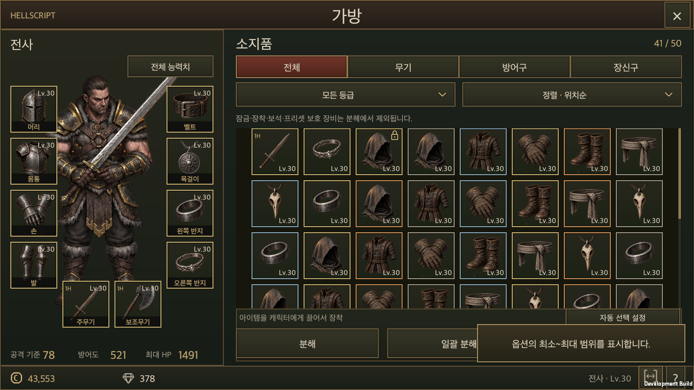
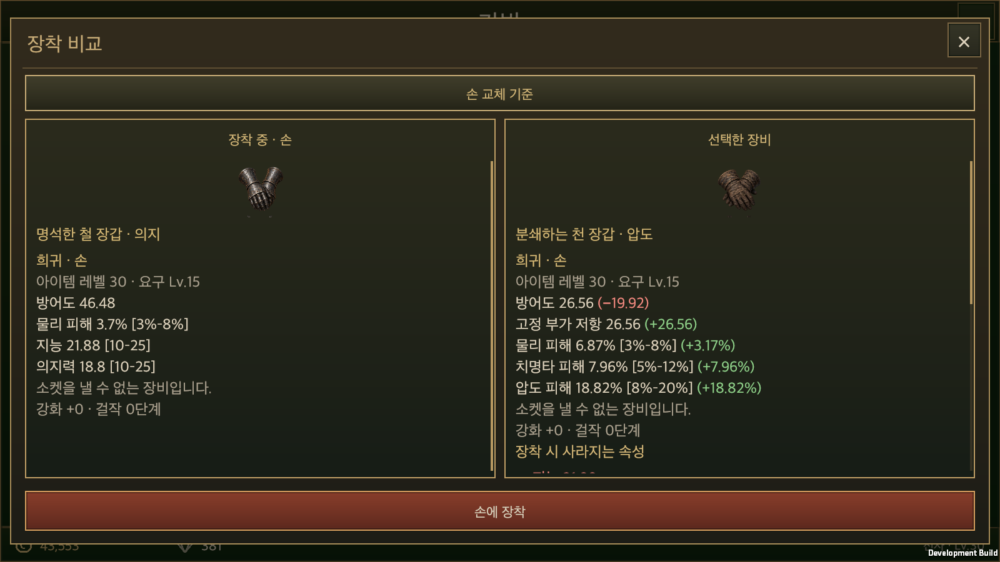
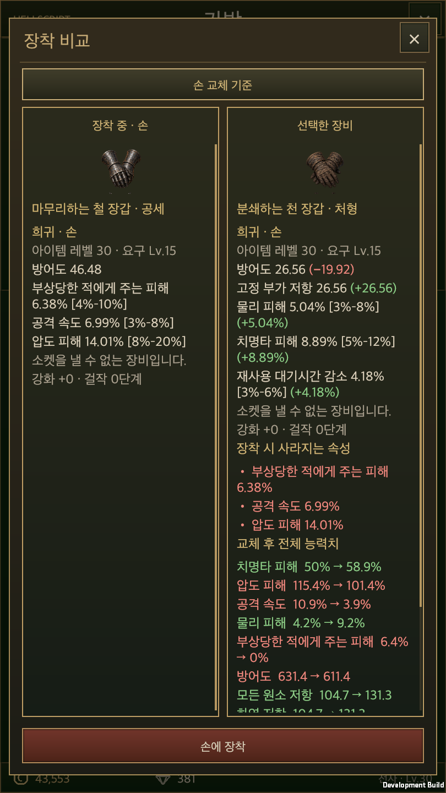
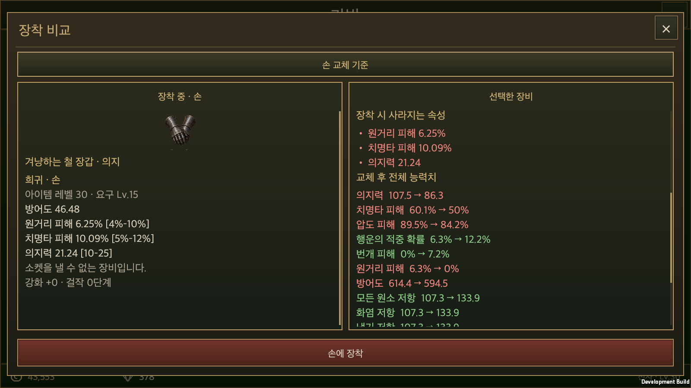
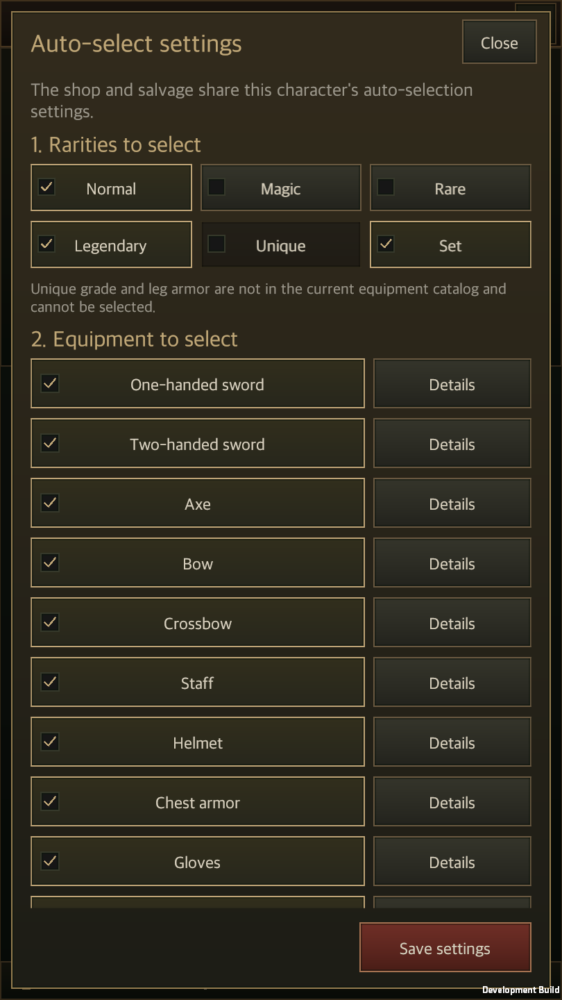

# 공통 장비 비교와 분해 자동 선택 연결

작성일: 2026-09-22 · [English](Equipment_Comparison.en.md) · [공통 표시 규칙](../Design/Equipment_Comparison_Rules.md)

인벤토리·창고·상점에서 같은 아이템을 비교했을 때 좌우 순서와 계산 결과가 달랐던 문제를 공통 계산·표시 코드로 정리했다. 착용품은 왼쪽, 후보는 오른쪽에 표시하고 후보의 각 수치에 증감을 붙인다. 후보에 없는 기존 속성은 별도 붉은 목록으로 표시한다. 향후 콘텐츠도 같은 코드를 사용하도록 저장소 작업 규칙에 명시했다.

## 공통 소유자

| 구분 | 담당 |
| --- | --- |
| 아이템 속성·범위 | `ItemComparison.Properties`가 실제 베이스·접사·품질·보석 데이터를 읽는다. |
| 교체 대상 | `ItemComparison.Preview`가 `EquipmentSlots.Plan`을 복사본에서 실행한다. |
| 후보 증감·사라지는 속성·전체 능력치 | `ItemTooltip.Lines`가 같은 순서·단위·색·문구를 만든다. |
| 좌우 카드·비교 기준·본문 스크롤 | `EquipmentComparisonView`를 각 콘텐츠의 고정 영역에 배치한다. |
| 실제 장착·거래 | 기존 `GameStore`, `EquipmentSlots`, 창고·상점 서비스를 유지한다. |

공통 화면은 `InventoryWindow.ShowComparison`, `StorageWindow`의 비교창, `EquipmentShopWindow`의 구매·판매·되사기 상세, 갬블 보상의 비교 버튼, 기존 장비 상세와 훈련 후보에 연결했다. 갬블 연출의 단일 상세에는 비교 기준 없는 증감을 붙이지 않고, `장착 비교`를 누르면 같은 공통 화면을 연다. 훈련은 동결한 룬과 선택한 장착 위치를 전달한다.

반지 두 개는 각각의 교체 기준을 선택할 수 있다. 선택한 기준만 바뀌고 창 크기는 유지된다. 양손 무기·호환되지 않는 보조 무기의 해제는 실제 장착 계획을 따르며 중복 계산하지 않는다. 전체 캐릭터 값과 개별 아이템 수치 차이는 같은 값으로 취급하지 않는다.

## 상점과 분해의 설정 공유

저장 위치는 기존 `Hero.equipmentShop.auto`를 유지한다. `ShopAutoSelect.MatchesFilters`가 등급 AND 장비 종류와 능력치 제외 조건을 판정하고, 판매와 분해가 각자의 최종 보호 검사를 추가한다. `InventorySalvagePlan.Eligible`과 승인 시 인스턴스·수치·보호 상태 재검증은 유지했다.

- 분해 선택 모드에서 `자동 선택`을 누르면 체크 목록만 바뀐다. 창을 자동으로 열거나 아이템을 분해하지 않는다.
- `자동 선택 설정`은 상점의 같은 초안 편집 화면을 사용한다. 설정을 복사해 별도로 저장하지 않는다. 상점에서 저장한 값은 분해에, 분해에서 저장한 값은 상점에 적용된다.
- 저장하지 않고 닫으면 초안을 버린다. 다른 캐릭터 설정, 장비 및 재화는 유지한다.
- 기존 `AccountSave.salvage` 필드는 저장 호환성을 위해 보존하지만 필터 판정에는 쓰지 않는다.
- 장착·잠금·프리셋 참조·보석 장착 아이템은 자동 선택에서 제외한다. 자동 선택 결과가 빈 목록이면 기존 체크도 해제한다.
- 선택/일괄 분해 확인창의 대상 슬롯은 세 줄 크기를 유지하고 초과 내용만 스크롤한다. 분해는 표시된 목록을 승인한 후에만 실행한다.

## 검증

### 옵션 범위 표시 확장 — 2026-09-22

인벤토리 하단의 직업·레벨 옆에 작은 범위 아이콘과 `?` 도움말 버튼을 배치했다. 범위 아이콘은 28×27 크기이며 켜지면 금색과 밑줄로 구분한다. 도움말에는 `옵션의 최소~최대 범위를 표시합니다.`라고 짧게 안내한다. 상세·비교·빠른 정보창에서도 같은 아이콘과 도움말을 사용한다. 기본값은 Off다. 켠 상태는 `hellscript-item-tooltip-v1.json`에 기기 설정으로 저장하며, 다른 캐릭터와 인벤토리·창고·상점·보상·훈련·대장장이의 장비 본문도 같은 선택을 따른다. 별도의 계정 필드나 콘텐츠별 설정 사본은 만들지 않는다.

PC에서 왼쪽·오른쪽 Ctrl을 누르고 있는 동안은 임시로 범위를 표시한다. 키를 놓거나 포커스를 잃으면 원래 설정을 사용하며, 키 입력은 설정 파일에 기록하지 않는다. 버튼에 마우스를 올리면 `컨트롤 키로 일시 활성화` 말풍선을 표시하고, 터치에는 이 안내를 띄우지 않는다. 범위를 포함한 본문의 최대 높이를 미리 확보하고 `ItemRangeText`가 글자만 갱신하므로 창 크기·버튼·스크롤·비교 기준은 유지된다.

수치와 최저·최대는 `ItemComparison.Affix`에서 계산한다. 전 콘텐츠가 현재 레벨·각성·상위 접사·걸작 배율을 적용하며, 범위를 알 수 없는 기존 이관 옵션은 추정 범위를 표시하지 않는다. 일반 상세와 비교가 각각 계산하던 경로를 같은 계산으로 통합했다.

공통 범위 표시의 최초 구현에서는 관련 Edit Mode 검사 **96개 통과, 실패 0개, 건너뜀 0개**를 확인했다. macOS 개발 빌드와 분리 계정 실행 검사도 통과했다. 버튼 클릭과 좌우 Ctrl 입력 전후를 비교해 인벤토리·창고·상점·보상의 범위 표시, 설정 재로드, 한국어·영어 및 가로·세로 화면을 확인했다. Ctrl 입력으로 계정이나 설정 파일이 바뀌지 않고, 본문 높이·스크롤 위치가 유지되는지도 검사했다.

[이번 검증 기록](ItemRangeEvidence/validation.json) · [Edit Mode 결과](ItemRangeEvidence/editmode.xml) · [macOS 실행 결과](ItemRangeEvidence/runtime.txt)

모바일 실기기와 전체 프로젝트 회귀 검사는 수행하지 않았다. 훈련·대장장이의 전체 UI 흐름은 실행 검사에 포함하지 않았으며, 공통 표시 연결과 컴파일을 확인했다. 포커스 해제 시 복귀는 상태 판정 단위 검사로 확인했다.

[최초 구현의 문자 버튼 화면](ItemRangeEvidence/ranges-detail-on-landscape-ko.png)

[꺼진 상태](ItemRangeEvidence/ranges-detail-off-landscape-ko.png) · [세로 안내 말풍선](ItemRangeEvidence/ranges-hint-portrait-en.png) · [세로 비교](ItemRangeEvidence/ranges-comparison-on-portrait-en.png) · [상점의 공통 설정](ItemRangeEvidence/ranges-shop-on-landscape-ko.png) · [획득 보상에서 Ctrl 임시 표시](ItemRangeEvidence/ranges-reward-ctrl-portrait-en.png)

### 하단 아이콘과 도움말 검증 — 2026-09-22

문자 버튼을 범위 아이콘과 `?` 버튼으로 줄이고, 인벤토리에서는 직업·레벨 옆 하단 줄로 옮겼다. 도움말은 위쪽에 열리고 창 밖으로 나가지 않는다. 관련 Edit Mode 검사 **62개 통과, 실패 0개, 건너뜀 0개**와 macOS 개발 빌드·실행 검사를 통과했다. 한국어 가로 화면과 영어 세로 화면에서 아이콘의 활성 표시, 인벤토리·상세·빠른 정보창의 도움말 열기와 바깥 클릭 닫기를 확인했다. 도움말은 설정·계정·창 크기를 바꾸지 않는다. 기존 전 콘텐츠 범위 표시와 Ctrl 임시 표시 검사도 함께 통과했다. 모바일 실기기 검증은 수행하지 않았다.

[아이콘 검증 기록](RangeIconEvidence/validation.json) · [Edit Mode 결과](RangeIconEvidence/editmode.xml) · [실행 결과](RangeIconEvidence/runtime.txt)

[세로 배치](RangeIconEvidence/ranges-help-portrait-en.png) · [아이템 상세 도움말](RangeIconEvidence/ranges-detail-help-landscape-ko.png)

### 기존 공통 비교 검증

2026-09-22, Unity 6000.6.0f1에서 관련 Edit Mode 검사 **157개 통과, 실패 0개, 건너뜀 0개**를 확인했다. macOS 개발 빌드가 성공했고, 분리한 계정으로 인벤토리·창고·상점의 비교 내용 일치, 반지 기준 변경, 갬블 보상 비교 진입과 화면 회전, 자동 선택 설정의 양방향 저장을 실제 UI 입력 처리와 저장 파일 재로드로 확인했다. 한국어·영어 및 가로·세로 창 크기에서 검사했다. 전체 프로젝트 회귀 검사와 모바일 실기기 검사는 수행하지 않았다. 훈련은 공통 화면 연결의 컴파일과 관련 로직 검사까지 확인했으며 전체 UI 흐름은 이번 실행 검사에 포함하지 않았다.

검증 수치와 실행 결과는 [검증 기록](EquipmentComparisonEvidence/validation.json), [Edit Mode 결과](EquipmentComparisonEvidence/editmode.xml), [macOS 실행 결과](EquipmentComparisonEvidence/runtime.txt)에 기록한다. 실행 검사는 분리한 저장 폴더를 사용하며 사용자의 실제 계정에 테스트 아이템을 넣지 않는다. macOS 창 크기를 바꾼 확인은 모바일 실기기 입력·성능 검증이 아니다.

[창고 비교](EquipmentComparisonEvidence/storage-portrait-en.png) · [상점 비교](EquipmentComparisonEvidence/shop-landscape-ko.png) · [오른쪽 반지 기준](EquipmentComparisonEvidence/right-ring-baseline-portrait-en.png) · [갬블 보상 비교](EquipmentComparisonEvidence/reward-comparison-portrait-en.png)
