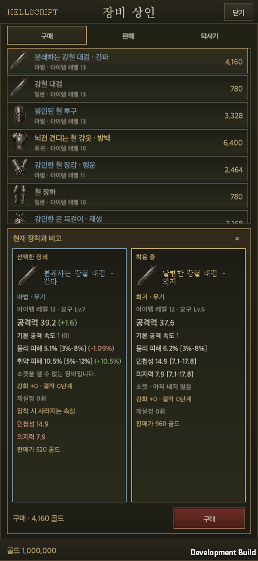

# Equipment merchant integration

Date: 2026-09-21 · [한국어](Equipment_Shop.md) · [Approved shop design](../Design/HELLSCRIPT_Equipment_Shop_Proposal.en.md)

Approaching the equipment merchant reveals **Buy** and **Sell** choices. Each opens its corresponding tab; proximity alone never opens the window. Closing returns to the same merchant, and town movement is blocked while the shop is open. The separate [gambling merchant](Gamble_Shop.en.md) also offers Buy and Sell; other residents retain their existing interaction button.

## Real ownership and transactions

The native uGUI `EquipmentShopWindow` reads the real `GameStore`, hero inventory and `ItemCatalog`. It reuses warehouse `StorageSurface`, `StorageGlyph` and `EquipmentAtlas` assets. No HTML fixture account or sample gold is imported.

- Buy shows stock and equipped comparison, deducts real gold and places the purchased item in a free bag slot. Purchased offers remain sold until restock.
- Sell shows the actual bag in eight columns, with item details, individual sale, manual selection and reviewed bulk sale.
- Buyback uses one item per row and restores the original ID, affixes, quality, enhancement, masterwork and reroll data at the original sale price. Only the last 12 items remain; sales exceeding that limit require confirmation of permanent oldest-entry eviction.

All transactions validate a staged account and commit only after a successful disk write. Repeated requests cannot duplicate ownership or charges. Bulk sale revalidates the quoted item fingerprints and ownership/protection and rejects the entire operation if anything changed. Equipped, locked, preset-referenced and gemmed equipment is protected. Insufficient gold, full bags and ongoing rifts also block transactions.

## Comparison and layout

Since 2026-09-22, every equipment comparison uses the [shared comparison contract](../Design/Equipment_Comparison_Rules.en.md): equipped items left, candidate right, with the same ring/paired-weapon plan. Gambling reward details open the shared view through Compare. Auto-selection settings share the same per-character save object with inventory salvage. Saving settings is separate from selecting or transacting items.

The comparison area is empty until selection. The selected item and currently equipped item appear side by side, with a parenthesized delta after each base attribute and affix. Lost affixes, special powers, fixed resistance and socket effects appear below. There is no enhancement forecast or best-owned comparison; existing upgrade records are displayed as stored.

Landscape places the item list on the left and comparison on the right. Portrait purchase places approximately 6.5 item rows above the comparison. Lists and both detail bodies scroll independently; the transaction action stays fixed. Layout reads `UiSafeArea.Current` and responds to orientation, safe-area and text-size changes.

## Automatic selection

Checked grades and checked equipment types are combined with AND. Common and Magic are the default grades. Detailed filters are optional per type and expose its real main attribute and valid affixes. An item is kept when N enabled thresholds match values greater than or equal to their configured values. N ranges from zero to the enabled-condition count; zero disables exclusions. An absent attribute never matches a zero threshold.

Disabling details preserves their values while ignoring their conditions. Settings persist per hero. **Auto-select only updates the checks: it never opens settings or enters manual selection.** Inspecting an automatically selected item preserves the selection. Selling requires a separate review step.

### Compact detailed options (2026-09-22)

Each equipment type initially shows a small set of common options. **＋ Add exclusion** opens a height-limited, independently scrolling list for adding other options one at a time. Weapons show attack, critical chance, critical damage, attack speed and a primary attribute; boots show armor, movement speed, dodge chance and physical damage reduction. Ranged weapons use Dexterity and staff families use Intelligence. The list contains actual allowed affixes and excludes common or already-added options.

Unchecking an additional option removes its row and returns it to the list; unchecked common options remain visible. Threshold values are retained when options are removed and added again. Previously saved enabled custom conditions stay visible and keep protecting items. Disabling detailed rules also disables addition and value inputs.

Removing a condition clamps the required-match count to the remaining enabled count. Enabling the first condition sets a zero match count to one; an explicitly chosen zero is preserved when other conditions already exist. Edits remain a draft until Save settings is pressed; closing discards unsaved edits.

All 64 focused Edit Mode tests passed. A native macOS development player verified addition, removal, duplicate prevention, value retention, match-count correction, save/reopen and disk reload through 29 button interactions. Opening the list scrolls it into view; choosing an option reveals its new settings row. Korean, English and 1600×900, 440×956 and 956×440 windows were checked; physical mobile hardware was not tested. [Validation](ShopAutoOptionsEvidence/validation.json) · [PC common options](ShopAutoOptionsEvidence/01-common-options-pc-ko.png) · [Portrait common options](ShopAutoOptionsEvidence/02-common-options-portrait-ko.png) · [Additional option list](ShopAutoOptionsEvidence/03-option-list-portrait-ko.png) · [English landscape list](ShopAutoOptionsEvidence/05-option-list-landscape-en.png).

The runtime uses the 19 actual equipment types and the 54 slot-specific affix definitions. Leg armor and a separate Unique grade do not exist in the current catalog. Existing special powers keep their actual Legendary or Set classification.

## Progression bounds

Existing generation creates Common, Magic and Rare items only. The item-level cap is `min(60, hero level × 2, max(1, highest clear) + 2)`. Up to 128 candidates per stock slot are evaluated on copied real `HeroStats`, including rune contributions. The policy prefers roughly 2–5% improvement in basic attack expectation or defensive sheet power, without more than 1% loss in the other metric. It never fabricates illegal rolls to fill a stock row.

These are **basic attack and defensive sheet metrics**, not guaranteed combat win rates or clear times. Special powers, sockets and weapon-family changes do not receive a generic upgrade classification. The proposal's fixed-seed normal/elite/boss encounter evaluator and multi-stage skip simulation remain separate balance-validation work.

Earned equipment and purchased equipment are persisted separately. Purchases, buyback, equipping weaker items and hourly restock cannot raise earned progress. Persistent per-slot purchase budgets cannot be lowered by selling gear or buying weaker replacements. New earned gear or real level/clear advancement updates the progression basis. Legacy items with unknown provenance are captured once when first loading the feature.

Stock refreshes hourly or on actual level/highest-clear changes, never merely on reopening, buying or equipping. Common prices use the larger of the existing town price and twice resale value. The Rare reference price is `640 × item level × slot factor`; Magic costs half that reference. Factors are weapon/chest 1.0, head/ring 0.8, hands/feet 0.7, belt 0.6 and neck 0.9. Gambling uses the same Rare reference. These are initial tuning values.

## Ownership and validation

`TownWalk`, `GameController.InteractEquipmentMerchant` and `GameUI.Plaza` own proximity and explicit choices. `EquipmentShop` owns stock and progression bounds; `ShopAutoSelect` owns filters; `GameStore.EquipmentShop` owns persistence and atomic trades. `EquipmentShopWindow` and its partial files own the native UI. `EquipmentShopTests` and `RuntimeEquipmentShopSmoke` provide regression and runtime acceptance coverage.

Verified on 2026-09-21 with Unity 6000.6.0f1. All 538 related Edit Mode cases have passing latest results. The first run passed 536 and failed one missing English price label; after adding the translation, all 33 localization cases passed on rerun. A final set of 95 routing, gambling, unlock and localization cases also passed after preserving the existing unlock and unifying the legacy entry. The [validation summary](EquipmentShopEvidence/validation.json) records both runs.

A native macOS development player used an isolated real save account to verify proximity, Buy/Sell routing, comparison, purchase, automatic selection, reviewed bulk sale, original-item buyback, settings and reload. Including the separate gambler and reveal flow, 41 UI-raycast/pointer-event clicks verified before/after ownership, gold and persistence. See the [runtime report](EquipmentShopEvidence/runtime-equipment-shop-smoke.txt).

Layouts were checked at PC 1600×900 and 1920×1080, plus iPhone 17 Pro Max example ratios 440×956 and 956×440. These are macOS window-size checks, not physical iPhone/Android touch, notch or performance verification.

[PC comparison](EquipmentShopEvidence/02-purchase-comparison-pc-ko.png) · [Landscape comparison](EquipmentShopEvidence/04-purchase-landscape-ko.png) · [Eight-column sale](EquipmentShopEvidence/05-sell-auto-portrait-ko.png) · [Portrait detailed filters](EquipmentShopEvidence/07-auto-settings-portrait-ko.png) · [English landscape settings](EquipmentShopEvidence/08-auto-settings-landscape-en.png)

This document records work-branch validation. Public wiki deployment is performed when these changes merge into `main`.

### Inventory weapon integration (2026-09-21)

The native inventory adds wand, orb, scroll, shield, arrows and dagger filters. New filters start disabled, preserve existing saved choices, and do not inherit the staff auto-sale setting. Shield detail and thresholds show armor; new items use their vector symbols. Shop power previews now use the actual paired-slot equipment replacement rules. See [Native inventory](Native_Inventory.en.md).
