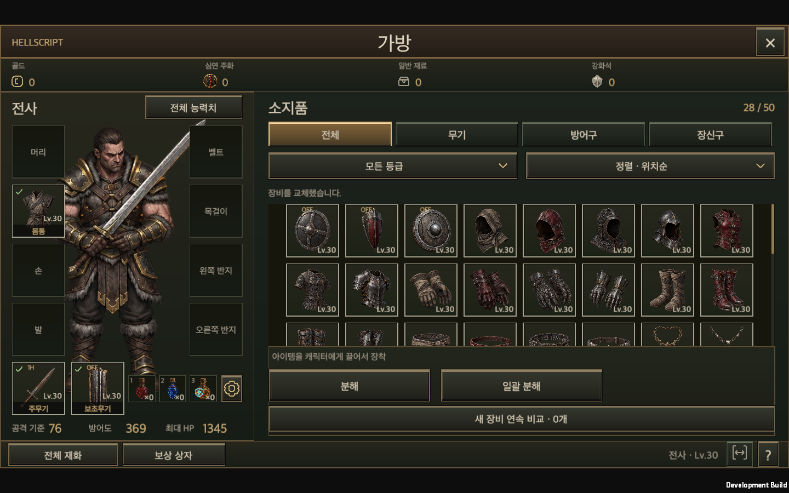
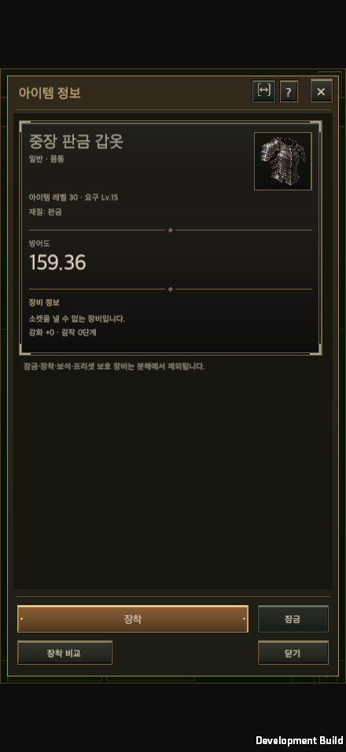
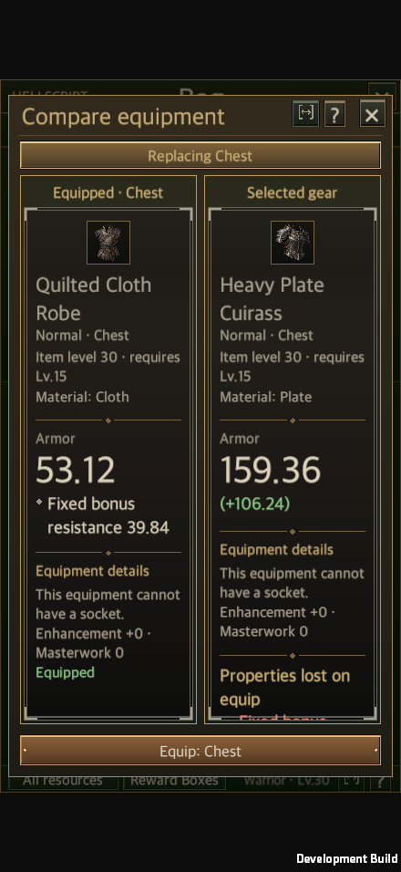
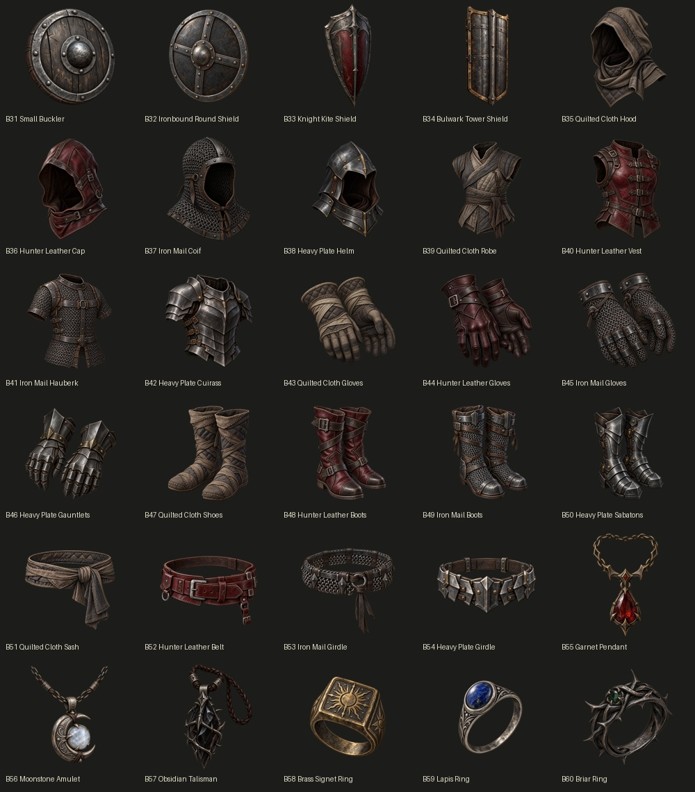

# Equipment base and artwork variations

Updated: 2026-09-27 · [한국어](Equipment_Variants.md)

B31–B60 add 30 bases while preserving B01–B30, their IDs, indices and existing values: four shields, four materials for each of head/chest/hands/feet/waist (20), three amulets and three rings. They participate in the existing monster/elite/boss `Economy.CreateRiftItem` → `ItemGenerator.Create` path, also shared by shops and reward boxes.

Cloth trades armor for the most all-element resistance. Leather adds 1 percentage point of dodge, with moderate armor and resistance. Iron mail provides higher armor and a little resistance. Plate provides the most armor but no inherent resistance or dodge. No movement penalty or new class restriction is introduced. Gloves retain attack speed, boots retain movement speed, and belts retain life as their primary stats; material armor on those slots is an additional fixed trait.

| Shield | Level 1 armor | Block chance | Damage reduction on block |
| --- | ---: | ---: | ---: |
| B31 Small Buckler | 16 | 24% | 18% |
| B32 Ironbound Round Shield | 24 | 20% | 26% |
| B33 Knight Kite Shield | 32 | 16% | 36% |
| B34 Bulwark Tower Shield | 40 | 12% | 50% |

Smaller shields block more often; larger shields have more armor and mitigate more damage per successful block. Existing combat caps still apply. The total shield-family drop weight is preserved, then divided equally among B28 and the four new bases. Normal/magic/rare shields remain eligible; legendary generation retains its existing offhand exclusion.

The three amulets add 35 life, 8 maximum resource, or 8 thorns. The rings add 1.5 percentage points of attack speed, 0.6 resource generation per second, or 1.5 percentage points of dodge. Fixed life, armor and thorns scale by `1 + 0.08 × (item level - 1)`; percentage and resource bonuses remain fixed. Traits do not consume affix slots and cannot be rerolled.

The references are Blizzard's [Diablo III 2.0.1 Loot 2.0 notes](https://news.blizzard.com/en-gb/article/12671560/patch-2-0-1-now-live) and [Diablo IV December 2020 development update](https://news.blizzard.com/en-gb/article/23583664/diablo-iv-quarterly-updatedecember-2020). They support differentiated stats, class-appropriate loot and fixed base characteristics such as shield blocking. They do not establish a universal four-material advantage table. These material rules and numbers are HELLSCRIPT adaptations, not a claim about current Diablo III/IV material rules or live balance. Existing damage formulas are unchanged. A full Rift 1–1000 progression balance audit is outside this change.

`ItemCatalog.Bases` owns identity, material and fixed bonuses. `ItemBaseBonus.Value` feeds both `HeroStats` and shared `ItemComparison`/`ItemTooltip` presentation. Content version 6 lets older clients reject saves containing new items without silently discarding them; the save schema and account keys are unchanged. Existing transactions own pickup, hand compatibility, ring positions, equipment changes and persistence.

Original unique/set artwork takes precedence. New base art resolves to `Resources/Art/EquipmentVariants/B31.png`–`B60.png`; the legacy B28 shield shares B32 art. Existing PNGs, GUIDs and atlases are preserved.

The [manifest and prompts](../Art/EquipmentVariants/manifest.json) record built-in `image_gen`, `transparent_background=true`, unverified model provenance (`candidate_model_unknown`) and no production art approval. Native alpha is preserved without background removal, chroma keys or recoloring. The scoped Unity importer uses a 512-pixel maximum, alpha transparency, uncompressed textures and no mipmaps.

The [native art audit](EquipmentVariantEvidence/native-art-audit.json) checks all 30 files for RGBA, fully transparent and opaque pixels, transparent corners and distinct hashes. Low native alpha is preserved. Visible bounds are measured at alpha 16 or greater; faint alpha and RGB values underneath fully transparent pixels remain documented and untouched. The [52-pixel preview](EquipmentVariantEvidence/icon-scale-preview.png) shows every icon against light and dark backgrounds.

## Validation and integration status

- [Unity Edit Mode](EquipmentVariantEvidence/editmode.xml): 122 equipment, generation, artwork, comparison, localization and inventory cases passed, zero failed or skipped. All three classes receive all 30 new bases through the actual monster death reward path; pickup is exactly once and survives disk reload. Training remains reward-free. Material stats, shield compatibility and legacy IDs are covered.
- [macOS Development Player](EquipmentVariantEvidence/build-result.txt): Unity 6000.6.0f1 build succeeded with zero build errors. The existing editor belonged to another checkout, so the established Unity batch test/build path ran in the isolated worktree.
- [Runtime evidence](EquipmentVariantEvidence/equipment-variants-runtime.json): 440×956, 956×440, 1440×810, 1440×900 and 1680×720, each in KO/EN at 100/150% text size: 20 combinations. Actual uGUI raycasts and pointer handlers open details and comparisons, check bounds and artwork, and preserve read-only previews. The equip button replaces the offhand shield; combat block stats and disk reload are verified. This is synthetic input in a macOS player, not physical mobile validation.
- Shared `ItemDetailView` gives the primary value and comparison delta separate lines so enlarged text does not leave a closing parenthesis on its own line. Calculation still uses `ItemTooltip.Delta`. Two missing English keys for existing first-play acceptance phrases were also added.
- Shared UI ownership and nine contract tests, wiki build/check, ten Python tests, and JavaScript checks of 379 pages, 32 databases and 4,209 record details are included. The [browser audit](EquipmentVariantEvidence/local-wiki-browser.json) covers the tower shield and leather gloves, images, fixed stats and zero visible write controls in the local public mirror.

The branch is `codex/equipment-variants`. Unrelated changes in the original checkout are excluded. These results do not claim a merge into `main` or deployment to the [public wiki](https://dakrdong.github.io/HELLSCRIPT-Wiki/#/tree). Publication must use merged `main`. Actual image-model provenance and production art approval remain unverified.

