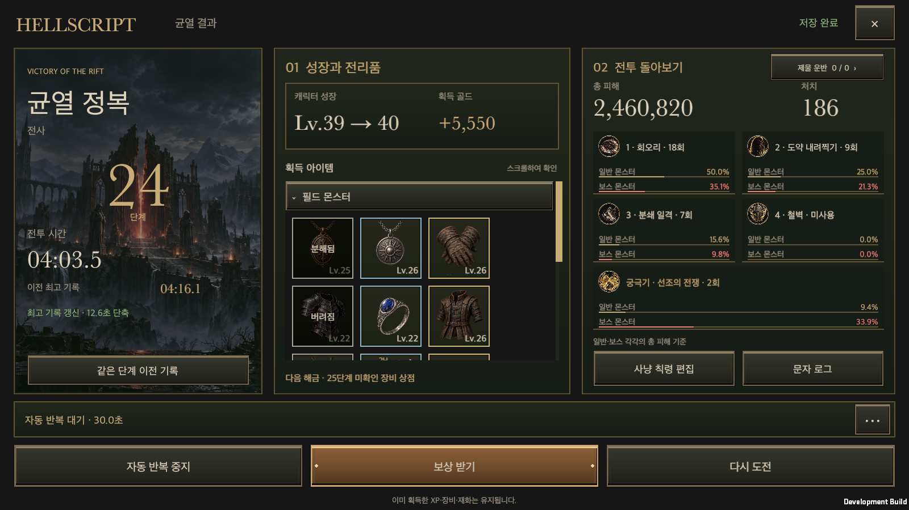
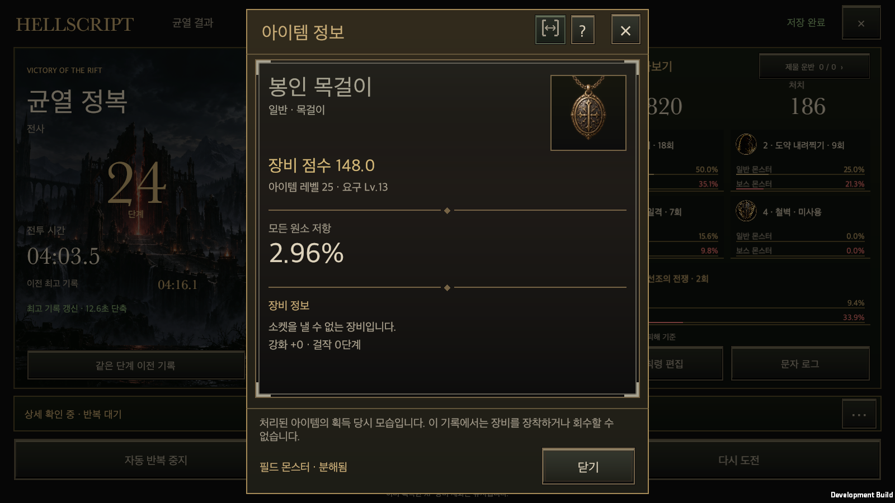
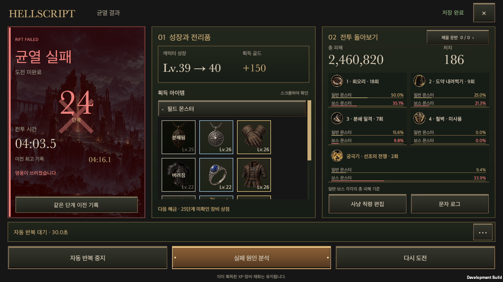
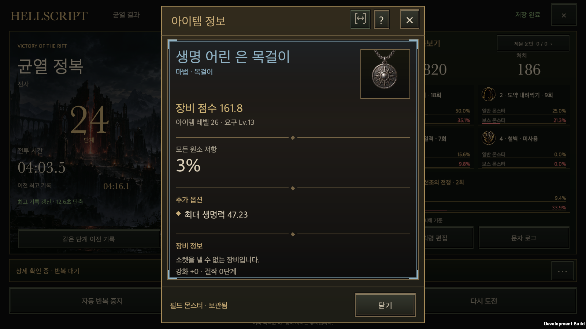
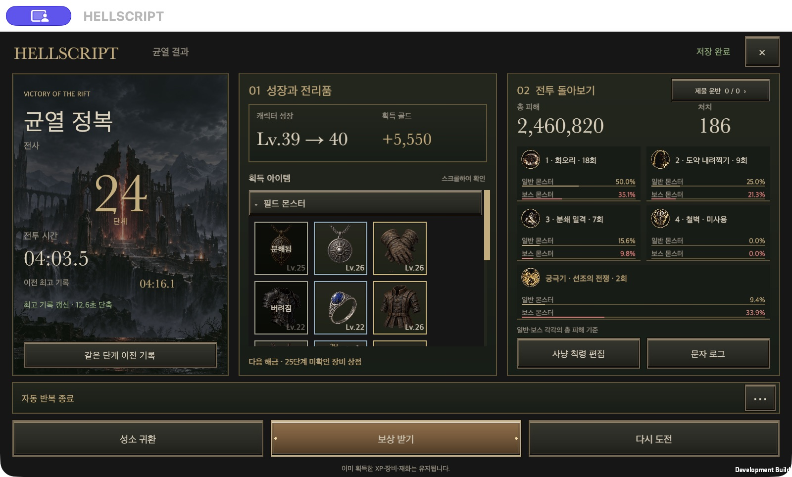

# 균열 결과창·장비·오디오 개발 통합

작성일: 2026-09-27 · [English](Feature_Integration_20260927.en.md)

사용자가 완료된 개발분의 main 병합과 푸시를 요청했다. 아래 5개 브랜치를 하나의 통합 작업 폴더에서 병합했다. 이전 [main 통합 기록](Main_Integration_20260927.md)에 이어지는 별도 통합이다.

## 포함 범위

| 개발분 | 원본 브랜치 | 원본 커밋 |
| --- | --- | --- |
| 균열 결과창과 공통 아이템 상세창 | `codex/rift-victory-preview` | `7912623a` |
| 추천 착용과 교체 장비·창고 자동 처리 | `codex/recommended-equipment` | `bc71ab3f` |
| 장비 30종과 실제 드롭·전투 특성 | `codex/equipment-variants` | `cb7a51bb` |
| 최종 효과음·배경 음악과 구형 파일 정리 | `codex/elevenlabs-audio` | `23317191` |
| 화면 높이에 맞춘 전투 로그 표시 | `codex/combat-log-height` | `43b11224` |

균열 결과창은 일반 스킬 4개와 궁극기 1개, 출처별 스크롤 전리품, 분해·버림 표시, 전투 기록, 반복 중단, 보상 수령을 유지한다. 아이템 클릭은 인벤토리와 같은 `ItemDetailPopup`과 `ItemDetailView`를 사용한다. 사냥 칙령 편집은 기존 칙령 창의 스킬 탭으로 이동한다.

## 최종 결과창 보완

- 스킬 5개는 클릭 버튼 대신 정보 카드다. 일반 몬스터와 보스 몬스터의 총 피해를 각각 100%로 두고 해당 스킬의 비중을 표시한다. 해당 분류의 피해가 없으면 0%, 분류 기록이 없는 기존 저장은 ‘기록 없음’이다. 실제 피해 발생 시 대상 분류를 기록하고, 누적 집계·전투 기록·저장 복원에 같은 값을 사용한다.
- 인벤토리와 균열의 상세창은 제목·범위 설정·본문뿐 아니라 하단 배치와 높이 계산도 `ItemDetailPopup`으로 통일했다. 일반 아이템은 출처·상태와 닫기를 한 줄에 배치해 하단 높이를 논리 좌표 94에서 50으로 줄였다. 분해·버림 안내가 있을 때만 필요한 높이를 추가한다.
- 상세창을 닫을 때 공통 창 관리자가 원래 입력 방식을 복원한다. 마우스로 연 슬롯에는 키보드 포커스 테두리를 붙이지 않고, 키보드 탐색으로 선택한 슬롯에는 포커스를 유지한다. 등급 테두리는 그대로 표시한다.
- 실제 실패도 같은 결과창으로 이동한다. 왼쪽에는 짙은 적색 배경과 큰 ‘균열 실패’ 제목·실패 표식·종료 원인이 표시된다. 이전 최고 기록을 보존하며 중앙 행동은 기존 실패 분석 창을 여는 버튼으로 바뀐다. 새 래스터 이미지는 추가하지 않았다.

## 통합 과정의 연결 보완

- 장비 상세에 추천 점수와 신규 장비 재질을 함께 표시한다. 번역 키는 중복을 제거하고 두 기능의 문구를 보존했다.
- 자동 착용 시 획득 당시 아이템 복사본을 유지한다. 장착·강화로 현재 장비가 바뀌어도 결과창의 획득 기록을 다시 쓰지 않는다.
- 교체 장비의 분해·판매·창고 보관과 창고 자리 확보를 위한 판매를 균열 처리 내역에 반영한다. 실제 처리는 기존 `GameStore` 거래 안에서 수행하며 저장 실패 시 획득·처리 상태를 함께 되돌린다.
- 신규 장비의 고정 방어력·회피·방패 막기 등도 `EquipmentScore` 2판에서 같은 능력치의 기존 옵션 기준값으로 평가한다. 추가 옵션과 고정 특성을 각각 한 번만 반영한다.
- 공통 UI 문서의 두 브랜치 이력을 모두 보존하고 통합 본문을 새 이력으로 생성한다.
- 저장 스키마를 19로 올린다. 기존 18판 저장 파일의 설정·균열 기록·창고 순서를 유지하고, 이전 실행 파일이 새 정보를 덮어쓰지 않도록 버전 경계를 둔다.
- 균열 창의 Unity 객체 확인 방식을 공통 검사 규칙에 맞춘다. 8개 부위를 사용하는 밸런스 검사에서는 보조 장비만 주무기 자리에 생성되지 않도록 검사 장비 생성 경로를 통일한다. 실제 게임의 드롭 규칙은 유지한다.

## 제외한 작업과 보존

클로드가 작업 중인 `claude/diablo-art-overhaul`, `claude/art-*`, `claude/overhaul-*`의 17개 브랜치는 제외한다. 모델, 리깅, 셰이더, 조명, 필드·보스 연계와 제작 도구를 포함한 진행 중인 3D 개편 묶음이다. 해당 브랜치와 작업 폴더를 수정하거나 제거하지 않는다.

현재 프로젝트의 미커밋 파일 6개는 전투 로그 브랜치 완료본과 바이트 단위로 일치했다. 병합 전 패치와 파일 사본·해시를 로컬 `Artifacts/MainIntegration20260927/`에 보존했다. 이미 main에 포함된 브랜치와 같은 커밋의 분리 작업 폴더는 중복 병합하지 않는다. 이번 요청은 통합이며 브랜치·워크트리 삭제를 포함하지 않는다.

## 검증과 공개 반영

초기 전체 Edit Mode 검사는 **4,214개 중 4,164개 통과, 50개 실패, 건너뜀 0개**다. 실패 중 47개는 변경하지 않은 기존 main `c751d84d`에서도 다시 재현했다. 추가 실패 3개는 칙령 항목 수 검사, Unity 객체 확인 방식, 밸런스 검사 장비 구성에 관한 것이었으며 수정했다. 수정 후 관련 **311개 검사가 모두 통과**했다. 전체 검사를 다시 통과한 것으로 표시하지 않는다.

[전체 검사 XML](FeatureIntegration20260927Evidence/editmode-full.xml), [기존 main 재현 XML](FeatureIntegration20260927Evidence/baseline-current-main.xml), [실패 목록 대조](FeatureIntegration20260927Evidence/full-baseline-comparison.json), [수정 후 311개 검사 XML](FeatureIntegration20260927Evidence/editmode-final.xml)을 보존했다. 전체 검사 당시 파일 해시는 [소스 기록](FeatureIntegration20260927Evidence/full-suite-source.json)에, 최종 검증 범위는 [검증 요약](FeatureIntegration20260927Evidence/validation.json)에 기록한다.

macOS 개발 빌드는 오류 0개로 성공했다. 임시 계정으로 실행·재시작 검사 11개를 통과했다. 마지막 결과창 보완 뒤 승리·실패·재실행·공통 상세·옵션 범위의 5개 경로를 다시 실행했다. 균열 결과·이전 기록·분해와 버림·공통 상세창, 추천 착용과 창고 거래·저장 복원, 신규 장비, 인벤토리·창고·상점·대장간의 공통 상세, 옵션 범위 On/Off와 Ctrl 임시 표시, 오디오 연결·설정 복원, 전투 로그를 확인했다. 세로 440×956, 가로 956×440, PC 16:9·16:10·21:9와 한국어·영어·확대 글자를 각 기능의 실행 검사 범위에 따라 확인했다. [실행 결과](FeatureIntegration20260927Evidence/native-results.json)에 각 검사 범위가 적혀 있다.

마지막 보완의 관련 Edit Mode 검사 **147개도 모두 통과**했다. [추가 검사 XML](FeatureIntegration20260927Evidence/editmode-result-refinements.xml)과 [추가 실행 결과](FeatureIntegration20260927Evidence/native-refinements.json)를 보존한다. 승리·실패 각각 20개 네이티브 배치와 HTML 실패 시안 20개 조합에서 다섯 정보 카드·열 개 비중·하단 행동의 경계를 확인했다. 공통 하단 검증에는 실제 최상위 uGUI 레이캐스트와 저장 데이터 불변성 검사를 사용했다.

마지막 포커스 복원 수정은 [관련 Edit Mode 검사 42개](FeatureIntegration20260927Evidence/editmode-focus-restoration.xml)와 [승리·재실행 검사](FeatureIntegration20260927Evidence/native-focus-restoration.json)를 통과했다. macOS 개발 실행 파일에서 실제 포인터로 아이템을 열고 공통 닫기를 눌러, 원래 등급 테두리만 남는 화면까지 확인했다. [포인터 검증 기록](FeatureIntegration20260927Evidence/native-pointer-status.json)을 보존한다. 키보드 탐색 포커스 유지와 중첩 창 복원도 함께 검사했다.

공통 UI 소유 검사와 계약 검사 9개, 오디오 도구 검사 7개, 신규 장비 30종 감사도 통과했다. 검사 전용 계정은 콘텐츠를 개방하고 출석 팝업을 숨긴다. 안내 기록 갱신을 기다린 뒤 읽기 전용 동작 전후의 저장 데이터 전체를 비교하며, 대장간 상세 검사는 기존 마을 검사와 같은 경로 진행 방식으로 NPC 접근 조건을 준비한다.

라이브 Unity MCP 인스턴스가 없어 Unity 배치 검사와 독립 macOS 개발 빌드로 검증했다. 이 결과는 모바일 실기기 터치·성능 검증이나 사람의 청음 승인을 뜻하지 않는다.

공개 위키는 병합된 main에서 생성·검사한 전체 읽기 전용 사본을 배포한다. 대상은 [HELLSCRIPT 공개 위키](https://dakrdong.github.io/HELLSCRIPT-Wiki/#/page/feature-integration-20260927)이며, 배포 성공과 비로그인 화면의 실제 내용·읽기 전용 상태를 별도로 확인한다.

