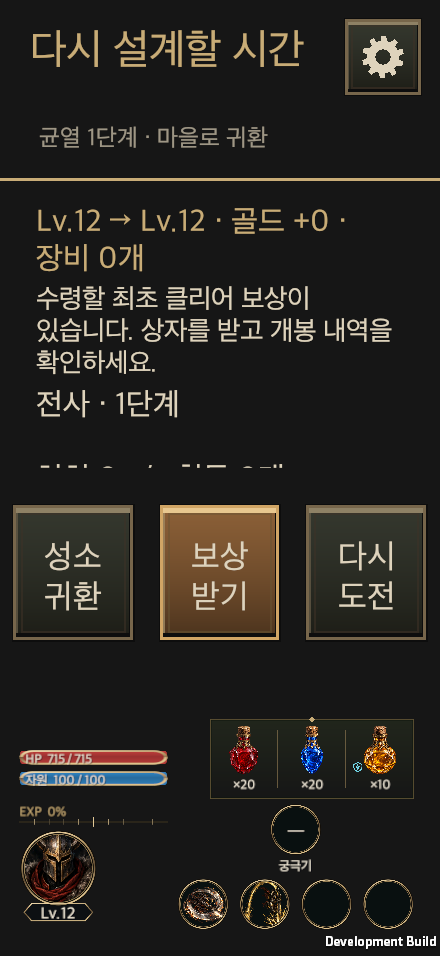
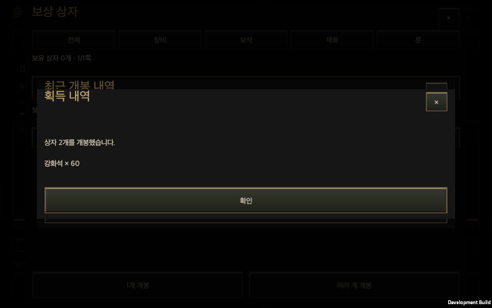

# HELLSCRIPT 첫 플레이 개선 구현

작성일: 2026-09-27

## 목표와 적용 범위

신규 이용자가 장비와 스킬을 바꾸고, 사냥 결과에서 변화를 읽은 뒤 다음 행동을 선택하는 흐름을 개선한다. 기준 커밋은 `246940407ea4ac3914285f4d59b27f2b91ea562c`이며, 작업 브랜치는 `codex/first-play-improvements`다. [포털 복귀 수정](First_Play_Recovery.md)은 별도로 기록했다.

일반 메뉴와 일시정지 중 피로도 차감, 피해량·적 체력·가격·드롭률·해금 단계는 유지한다. 기존 수동 공격 순서를 불러오기 과정에서 바꾸지 않는다. 이후 운영 보상·효과음·용량 최적화와의 병합은 [2026-09-27 통합 기록](Main_Integration_20260927.md)에서 확인한다. 세 직업 균열 20 자연 성장 검증은 진행 중이다.

## 구현과 소유 코드

| 작업 | 바뀐 동작 | 소유 코드 |
| --- | --- | --- |
| D02 스킬 장착 | 새 기술은 기본 공격 앞에 넣고, 교체 기술은 기존 위치를 이어받는다. 수동 순서·기존 자동 사용 해제는 유지한다. | `ClassSkillTree.Equip`, `ClassSkillDisplay`, `HuntEdictWindow.Skills`, `GlobalHudSnapshot`, `RiftEntryWindow.Popups` |
| D03 전투 피드백 | 실제 판단 지점의 사용 방해와 중단 사유, 배타적인 주 행동 시간, 실제 보조 효과를 기존 기록에 저장한다. | `CombatFeedback`, `CombatSimulation`, `CombatStatistics`, `GameUI.History` |
| D04 결과 | 레벨·획득·해금·다음 행동을 먼저 보여 준다. 전체 로그와 반복 조건은 세부 화면에서 확인한다. | `FirstPlayRecommendation`, `GameUI.FirstPlay`, `GameUI.Repeat` |
| D05 안내·실습 | 진행 중/완료/나중에 보기 탭, 현재 가능한 다음 행동, 직업별 한 조건 A/B 실습, 대장간 후보 목록을 제공한다. | `Tutorials`, `ClassPracticeLesson`, `GameUI.Tutorials`, `GameUI.TutorialPractice`, `GameUI.Comparison` |
| D06 장비 정리 | 미확인 장비를 획득 순서로 연속 비교하고 잠금·장착·보관한다. 원래 필터와 스크롤을 보존한다. | `InventoryWindow.Review`, `InventoryQuery`, 기존 장비·창고 거래 |
| D07 보상 | 실제 지급 내역을 거래와 함께 저장하고, 개봉 직후 이름·수량·장비 비교를 유지한다. | `RewardBoxReceipt`, `RewardBoxes`, `GameStore.RewardBoxes`, `RewardBoxesWindow` |
| D08 전투 표시 | 상세 로그를 기본 접힘으로 바꾸고 현재 행동을 표시한다. 신규 기기의 전체 지도 겹쳐 보기를 기본 해제한다. 가려진 영웅의 실루엣과 크기·형태를 보완한다. | `GameUI.CombatJournal`, `OverlayMapSettings`, `WorldView`, `HeroOcclusion.shader` |
| D09 입장 | 목표와 물약·스킬 준비를 먼저 보여 주고, 일반 1배속 입장을 주 행동으로 둔다. 피로도 상세와 유료 입장 확인은 유지한다. | `RiftEntryWindow`, `RiftEntryRules` |

## 결과 화면의 공통 UI 적용

결과 화면은 기존 `GameUI`의 결과·기록 어댑터를 유지한다. 추천 행동은 본문 아래에 묻히지 않도록 고정 행동 영역에 놓고, 보상 받기·장비 정리·스킬 확인처럼 목적을 표시한다. 높이가 낮은 가로 화면에서는 같은 행동 영역을 오른쪽 세로 열로 배치해 전역 HUD, 성장 요약, 확대 글자를 함께 유지한다. 장비 표시나 거래 소유자를 별도로 만들지 않는다.

균열 입장과 최초 보상 화면의 다음 콘텐츠는 계정 전체의 최고 진행도와 이미 보존된 개방 상태를 기준으로 표시한다. 다른 직업으로 교대해도 이미 열린 콘텐츠를 새 목표로 안내하지 않는다. 캐릭터별 입장 가능 단계는 기존 규칙을 유지한다. 결과의 새 콘텐츠는 보스 처치 때 실제로 개방한 ID를 `CombatJournalData.openedContent`에 기록해 보여 준다. 다른 직업의 같은 단계 완료나 오래된 기록에 새 개방 내역을 추정해 붙이지 않는다. 계정 공유·기존 개방 보존·중복 처치·저장 왕복 관련 집중 검사 79개를 통과했다. 후속 초반 궁수 실습·번역 검사 42개도 통과했다.

가로 입장 화면의 준비 목록은 자동 저장 알림으로 다시 그릴 때 기존 스크롤 위치를 보존한다. 피로도·물약·스킬의 저장 반영을 생략해 위치 문제를 감추지 않는다. 실제 저장 후에도 하단 서비스 버튼을 읽고 누를 수 있는지 별도 확인한다.

## 스킬 수치와 기록의 의미

현재 수치 설명은 기존 `SkillProgressionInfo`와 클래스 스킬 등급 계산을 재사용한다. 실제 등급과 추가 등급, 자원 비용, 기본 등급 설명을 구분한다. 장착된 기술이 기본 공격 뒤에 있으면 검사 기회를 얻지 못할 수 있음을 설명하고, 순서 변경은 편집본에만 적용한다.

`CombatStatistics.feedback`는 선택 필드이며 형식 버전은 1이다. 이전 기록에 값이 없으면 ‘기록 없음’으로 표시한다. 원인 목록은 기술당 최대 32종류, 적용 대상은 256개, 효과 종류는 160개로 제한한다. 회오리의 발동은 각 유지 공격에서 첫 실제 공격 판정이 발생한 때 한 번만 세며, 유지 판정 수를 따로 표시한다. 저장한 공격 ID를 이어받아 복구 후 중복 집계하지 않는다. 스킬이 아닌 내부 이벤트를 시전 횟수로 세지 않는다. 시간과 보조 효과 수치는 기존 전투 상태와 같은 부동소수점 저장 형식을 사용한다. 한도 초과 여부를 남긴다. 상위 행동이 선택된 뒤 검사하지 않은 기술은 ‘상위 행동으로 검사 기회 없음’으로 집계한다. 조건을 다시 계산하거나 난수를 추가로 소비하지 않는다.

공격·회피·이동·획득 행동·대기는 전투 틱마다 하나만 집계한다. 메뉴 시간과 전투 종료 후 정리 시간은 제외한다. 효과 유지 시간은 동시에 겹칠 수 있으므로 주 행동 합계와 합산하지 않는다. 표식의 대상 수와 지속 시간, 실제 회복·보호막 흡수·자원 회복을 표시하며, 표식으로 늘어난 피해를 임의로 역산하지 않는다. 판단 횟수는 기술 사용 가능 횟수나 시도 횟수와 다르다.

## 안내와 실습의 완료 조건

결과와 안내 목록은 같은 추천을 사용한다. 진행 차단과 가방 정리, 미수령 보상, 새 기술, 직전 실패, 미사용 포인트 순으로 실제 소유·해금 상태를 확인한다. 숨기거나 미룬 선택형 안내는 해당 상태를 존중한다. 읽기만으로 실습을 완료하지 않는다. 현재 설정으로 이동하더라도 보관된 전투 스냅샷을 바꾸지 않는다.

직업 실습은 현재 캐릭터의 복사본을 사용한다. 전사는 장판 회피 방침, 궁수는 다중 사격의 우선순위 위치, 마법사는 눈보라 유지/위치 갱신 중 한 조건만 바꾼다. 지도·레벨·장비·난수를 유지한 60초 A/B 결과를 비교한다. 필요한 기술이 잠기거나 자동 사용이 꺼져 있으면 시작할 수 없다. 실제 발동 또는 행동 차이가 관측되어야 H17 실습 완료를 기록할 수 있다. 결과가 같으면 완료 처리하지 않는다. 설정 저장·실제 적용은 별도 명시적 선택이다. 결과를 편집안으로 불러올 때 시험한 클래스 스킬 순서·등급·선택 옵션도 함께 가져온다. 짧은 튜토리얼과 개봉 내역은 공통 창이 내용 높이에 맞춰 줄어들고, 긴 내용은 고정 행동 아래에서 스크롤된다.

실제 Lv.4 궁수의 첫 실습에서는 다중 사격이 기본 공격보다 앞에 있어도 관통 사격이 자원을 먼저 소비해 두 시도 모두 발동하지 않았다. 이 결과는 완료 처리하지 않고 보존했다. 궁수의 제안은 다중 사격 위치 하나를 공격 순서 맨 앞으로 옮기며, 이미 맨 앞이면 기본 공격 뒤로 옮기도록 보완했다. 다른 기술의 상대 순서는 유지한다. B 조건 화면은 내부 기술 ID를 나열하는 대신 A와 B의 실제 조건을 한국어·영어로 구분해 보여 준다. 전체 일지가 없는 A/B 훈련에서도 접힌 로그와 현재 행동을 배치하도록 수정했다.

## 보상·장비 상태와 저장

연속 비교는 시작 시 아이템 ID 목록을 고정하고, 이후 장착·보관된 물품을 건너뛴다. 비교와 이동만으로 장비를 자동 장착하거나 분해하지 않는다. 잠금·장착·보관은 기존 `GameStore` 거래가 재검증한다. 상세와 비교는 `ItemDetailView`, `EquipmentComparisonView`, `ItemComparison.Preview`를 공유한다.

영수증은 잔액의 전후 차이가 아니라 실제 지급 분기에서 만들어진다. 장비·보석·룬·강화석·제작 재료·골드·심연 주화·부위 코어와 운영 보상에서 지급하는 물약을 기록한다. 마지막 20건을 기존 보상 상태에 보관하며, 재실행 뒤에도 보상 상자의 ‘최근 개봉 내역’에서 다시 확인할 수 있다. 같은 요청의 재시도는 기존 영수증을 반환하며 다시 지급하지 않는다. 저장 실패 시 지급·상자 소비·영수증을 모두 커밋하지 않는다. 보관 한도 밖의 오래된 요청에는 획득 내역을 새로 추정하지 않는다.

## 전투 가독성과 남은 아트 작업

문제의 긴 흰 선은 `RiftAutomap` 경계 겹쳐 보기였다. 내비게이션 디버그 선으로 단정해 제거하지 않았다. 기존 이용자의 명시적인 지도 표시 선택은 보존한다. 접힌 로그는 기기의 표시 설정이며 전투 기록 수집은 계속된다. 가림 실루엣은 영웅의 기존 메시만 사용하며 적이나 미발견 지도를 드러내지 않는다.

| 남은 자산 | 현재 상태 | 후속 제작 조건 |
| --- | --- | --- |
| 전사·궁수·마법사 전투 외형 | 기본 메시와 직업별 무기·색·실루엣 개선 | 전투 시점에 맞는 승인된 모델 또는 방향별 스프라이트 필요 |
| 이동·준비·공격·피격·사망 애니메이션 | 기존 절차적 표현과 실제 효과 타이밍 유지 | 실제 판정 이벤트와 프레임 대응표 필요 |
| 초반 적 역할과 보스 외형 | 역할별 색·형태, 보스 크기 차이 유지·정돈 | 일반·원거리·지원·돌진 역할을 식별하는 전투 자산 필요 |
| 스킬 효과 | 기존 발동·명중 이벤트 연결 유지 | 범위와 시야를 가리지 않는 승인된 효과·성능 예산 필요 |

선택 화면의 일러스트는 전투용 애니메이션 자산으로 전용하지 않았다. 이번 변경을 전체 아트 교체로 보고하지 않는다. 신규 이미지 생성은 수행하지 않았다.

## 검증 상태

[검사 범위와 결과 원본의 해시](FirstPlayEvidence/verification.json)를 보존했다. 서로 겹치는 집중 검사 수를 합산하지 않는다.

- 기준 관련 검사 159개 통과.
- 포털 복구 집중 검사 10개 통과. 전사·마법사의 보존된 차단 세이브 복사본을 macOS UI로 재개·정산했다.
- 스킬 장착 집중 검사 8개 통과.
- 전투 피드백·보상·훈련·기록·인벤토리 관련 검사 127개 통과.
- 전체 Edit Mode 검사는 4,009개 중 3,957개 통과, 52개 실패였다. 기준 커밋의 별도 작업 폴더에서 관련 334개를 실행해 47개가 기존 실패임을 확인했다. 이번 변경에서 발생한 부동소수점 저장 왕복 관련 4개와 불필요한 번역 키 1개는 수정했다. 최종 집중 확인 89개와 결과 화면의 번역·공통 UI 검사 33개는 모두 통과했다. 전체 검사를 모두 통과한 것으로 보고하지 않는다.
- macOS 별도 검증 계정에서 장비 5개 연속 비교, 잠금·보관, 일괄 개봉 내역, 프로세스 재실행 후 보존을 확인했다. 5개 화면 비율 × 한국어/영어 × 100/150% 글자 크기의 20개 조합을 촬영했다. 캡처 검토에서 찾은 접힌 로그 여백을 수정하고 현재 행동의 표시를 확인했다. 최종 빌드의 20개 조합 모두에서 성장 요약과 고정 행동의 실제 표시 범위, 버튼 글자 잘림, 권장 행동의 화면 이동을 확인했다. 재실행한 개봉 내역도 실제 버튼으로 다시 열었다. [화면·조작 검사](FirstPlayEvidence/checks.txt)와 [재실행 검사](FirstPlayEvidence/restart.txt)를 보존했다.
- 새 공유 계정의 전사→궁수→마법사 순환 자연 성장 검증을 진행 중이다. 세 직업 균열 20 완료로 판정하지 않았다.

macOS 합성 입력 검증과 모바일 실기기·물리 입력·사운드·사람의 이해도 평가는 구분한다. 이번 기록은 모바일 실기기 통과나 출시용 빌드 성능을 주장하지 않는다.

## 대표 화면

## 같은 기기에서 측정한 실행 비용

Apple M3 Pro의 macOS Development Mono 빌드에서 1280×720, 1배속, 같은 균열 30 지도·장비·난수·운영 설정으로 20초씩 각 3회 측정했다. 수치는 회차별 지표의 중앙값이다. [측정 요약](FirstPlayEvidence/performance.json)을 보존했다. 측정 도구가 만든 Lv.30 전투는 자연 성장 증거에 포함하지 않는다.

| 지표 | 수정 전 | 수정 후 |
| --- | ---: | ---: |
| 프레임 시간 중앙값 | 16.82ms | 16.70ms |
| 프레임 시간 95백분위 | 24.75ms | 23.99ms |
| UI 처리, 프레임당 평균 | 0.189ms | 0.050ms |
| 전투 처리, 프레임당 평균 | 1.031ms | 1.206ms |
| 월드 표시, 프레임당 평균 | 0.241ms | 0.260ms |
| 프레임당 GC 할당 평균 | 229.4KiB | 221.6KiB |
| 프로세스 최대 RSS | 630.0MiB | 614.9MiB |

각 회차에 실제 전투 401틱을 확인했다. 전투 처리 비용 증가를 전체 프레임 시간 감소와 별도로 기록한다. 짧은 데스크톱 표본이므로 발열·배터리·모바일 성능이나 메모리 누수 부재를 증명하지 않는다. Draw Calls와 Batches 카운터는 0만 반환해 판단에 사용하지 않았다. 기존 측정 도구의 비동기 입장 대기와 보조무기 장착 구성을 두 빌드에 동일하게 수정했다. 기준 게임 코드는 유지했으며 두 측정 도구 소스의 SHA-256이 같다.
