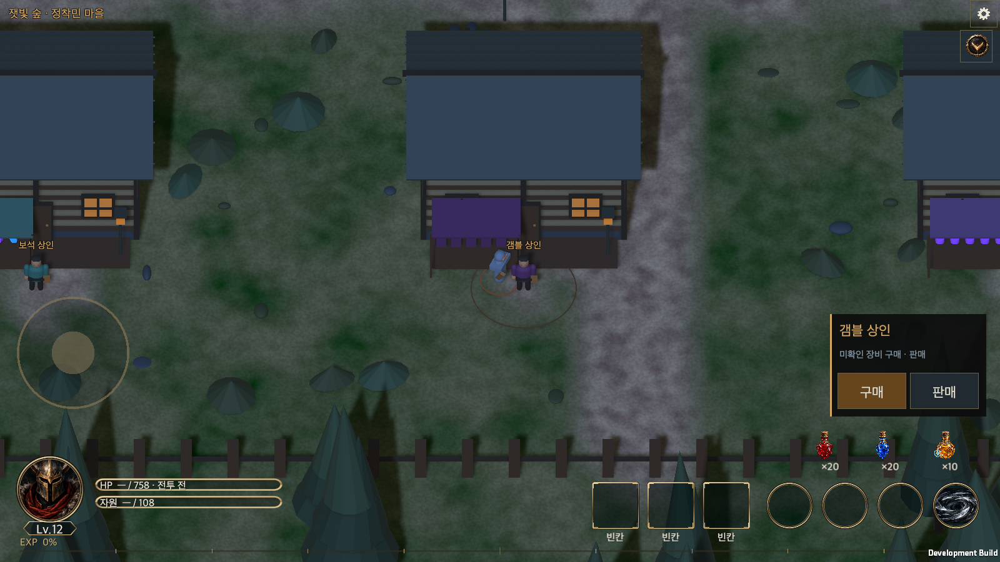
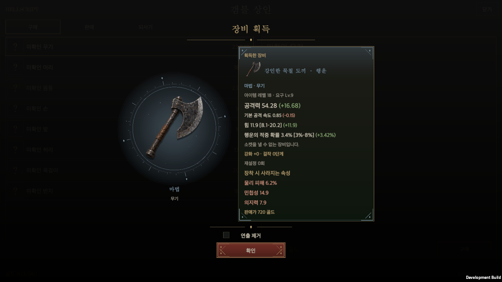

# Gambling shop

Date: 2026-09-21 · [한국어](Gamble_Shop.md) · [Equipment shop](Equipment_Shop.en.md)

## Dedicated NPC

A **separate gambling merchant** stands on the southern village road between the gem and rune merchants, with a purple canopy and sealed parcels. Approaching reveals Buy and Sell choices. Buy opens unidentified stock; Sell opens the inventory sale tab. Proximity alone never opens the shop. The existing account unlock is preserved: clearing rift stage 10 with any hero enables purchases. Locked offers show the unlock condition. The former unidentified-purchase button on the crafting screen now says **Visit the gambler** and routes to this same NPC.

The UI reuses the equipment shop and warehouse's olive surfaces, brass borders and real item atlas. Selling, buyback and auto-selection settings use the same native window and actual inventory. Buyback records and automatic-selection preferences are shared between both merchants per hero.

## Hidden information and fixed prices

Eight offers represent weapon, head, chest, hands, feet, belt, neck and ring. Before purchase only a question-mark icon, slot, item level and price are shown. Actual names, rarity, attributes, affixes and special powers remain hidden. Weapons use the buying hero's real compatible weapon families.

The price is fixed at **twice the equipment shop's Rare reference for the same slot and item level**, independent of hidden rarity, rolls or current rotating offers. The Rare reference avoids changing a quote whenever stock changes. Purchases use gold and recheck the quoted level, funds and bag space before committing.

`Rare reference = 640 × item level × slot factor`

| Slot | Factor | Level 10 Rare reference | Level 10 gambling price |
| --- | ---: | ---: | ---: |
| Weapon | 1.0 | 6,400 | 12,800 |
| Head | 0.8 | 5,120 | 10,240 |
| Chest | 1.0 | 6,400 | 12,800 |
| Hands | 0.7 | 4,480 | 8,960 |
| Feet | 0.7 | 4,480 | 8,960 |
| Belt | 0.6 | 3,840 | 7,680 |
| Neck | 0.9 | 5,760 | 11,520 |
| Ring | 0.8 | 5,120 | 10,240 |

These are initial tuning values. Item level uses the vendor cap: `min(60, hero level × 2, max(1, highest clear) + 2)`. Generation reuses the established unidentified-equipment distribution: Magic 60%, Rare 38%, Legendary/Set combined 2%. Random gambling rewards do not guarantee an improvement and do not use the ordinary shop's 2–5% upgrade-candidate preference. They cannot raise the shop's earned-loot anchor.

## Transaction and reveal

1. Purchase generates the actual item, charges gold, places it in the bag and saves everything as one transaction. Failed persistence grants nothing and deducts nothing.
2. Only after saving, a dimmed overlay shows a sealed icon with two pulses. At approximately 1.7 seconds, a short glow and scale pop reveal the result. Presentation never rerolls the item.
3. The actual icon sits at the left center. The right side reuses the standard equipment detail card, including its small icon and name row, rarity, level, main attribute, affixes/ranges, powers, sockets, existing upgrade records and resale value. Differences from the equipped item appear in parentheses after each value, with attributes lost on replacement below. Details remain scrollable.
4. **Skip animation**, centered below, is a device preference. When checked, subsequent purchases immediately show the result window without the pulse or reveal animation. The result itself still appears.
5. **Confirm** below the checkbox, or a click outside the card, dismisses it. Clicking inside or scrolling details does not dismiss. Closing during animation cannot remove an already saved reward.

PC, mobile landscape and portrait share the same behavior. Landscape puts stock left and purchase information right. Portrait shows approximately 6.5 stock rows above the purchase information. The result retains icon-left/details-right in both directions and respects the safe area. After buying, the Sell tab and normal inventory expose the actual item details.

## Reveal visual treatment

A compact central arrangement replaces the large outer plate, with stronger dimming over the shop. A subtle rarity-colored halo and small light accents sit behind the item; its square slot background is removed. Fine olive/brass ornamentation unifies the title rule, detail-card corners and confirmation button. Skip animation suppresses pulses, rotation and the reveal flash; the decorative treatment remains static.

The detail card never stretches with a wide desktop viewport. Its maximum reference width is 304 units, capped at 66% of the portrait viewport. Height fits the actual content, with independent internal scrolling and a thin scrollbar when vertical space is limited. Physical dimensions follow the existing shop canvas scale. Content and equipped-item comparisons still come from the shared detail-card component.

Visual references were the narrow proportions and metallic corners of [Blizzard’s official Diablo IV item cards](https://news.blizzard.com/en-gb/article/24292852/the-3-2-0-ptr-what-you-need-to-know), and the circular ornamentation in [official Diablo Immortal screens](https://news.blizzard.com/en-us/article/24244451/deliver-sanctuary-from-madness). These informed an original treatment using HELLSCRIPT’s existing palette and real equipment icons. External images were not imported as game assets; decorations are original vector UI geometry.

## Implementation and validation

`TownWalk` and `WorldView.Town` create the dedicated NPC and building. `GameUI.Plaza` and `GameController.InteractEquipmentMerchant` route to the nearby merchant. `GambleShop` owns pricing, generation and purchase; `EquipmentShopWindow.Gamble` owns hidden offers and reveal presentation. Existing `GameStore.Transact` handles duplicate requests and disk-write failures.

On 2026-09-21, all 538 related Edit Mode cases had passing latest results, including the localization rerun. Six gambling tests cover fixed prices, idempotency, saved real items and reload, stale quotes/funds/space/run guards, atomic disk failure and class/slot generation bounds and the existing account unlock. See the [run summary](EquipmentShopEvidence/validation.json).

The native macOS development player verified travel to the separate gambler, Buy/Sell choices, hidden pre-purchase stats, saved rewards before animation, hidden/visible detail state before/after reveal, persistent animation skipping, confirm/outside dismissal, inventory inspection and Korean/English. The [runtime report](EquipmentShopEvidence/runtime-equipment-shop-smoke.txt) also covers the ordinary vendor. Example mobile layouts used macOS windows at 440×956 and 956×440, not physical phones.

After the reveal UI revision on 2026-09-21, all **54 focused Edit Mode tests passed**. The macOS development player verified the transparent outer surface and border, the standard detail card’s icon row and equipped-item deltas, and preserved hidden pre-reveal details, animation skipping, confirm and outside-click dismissal. See the [revision validation record](GambleRevealEvidence/validation.json) for the exact scope and results.

A second visual pass on the same date refined proportions and ornamentation. All 54 focused Edit Mode tests passed; after the final spacing and lighting adjustment, the native macOS development player verified 42 UI clicks and independent detail scrolling. Assertions cover bounded card width, content-fit height, icon separation and on-screen confirmation controls. Captures cover 1600×900, 1920×1080, 440×956 and 956×440; these do not constitute physical-mobile testing. See the [final visual validation record](GamblePolishEvidence/validation.json).

[Unidentified stock](EquipmentShopEvidence/11-gamble-stock-portrait-ko.png) · [Portrait result](GamblePolishEvidence/12-gamble-reveal-portrait-ko.png) · [English PC result](GamblePolishEvidence/15-gamble-reveal-pc-en.png) · [Landscape result](GamblePolishEvidence/14-gamble-reveal-landscape-ko.png)

Public wiki deployment occurs when the work branch merges into `main`.
