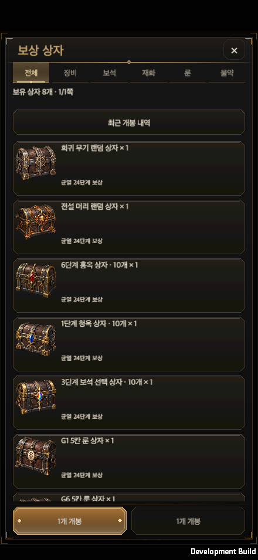
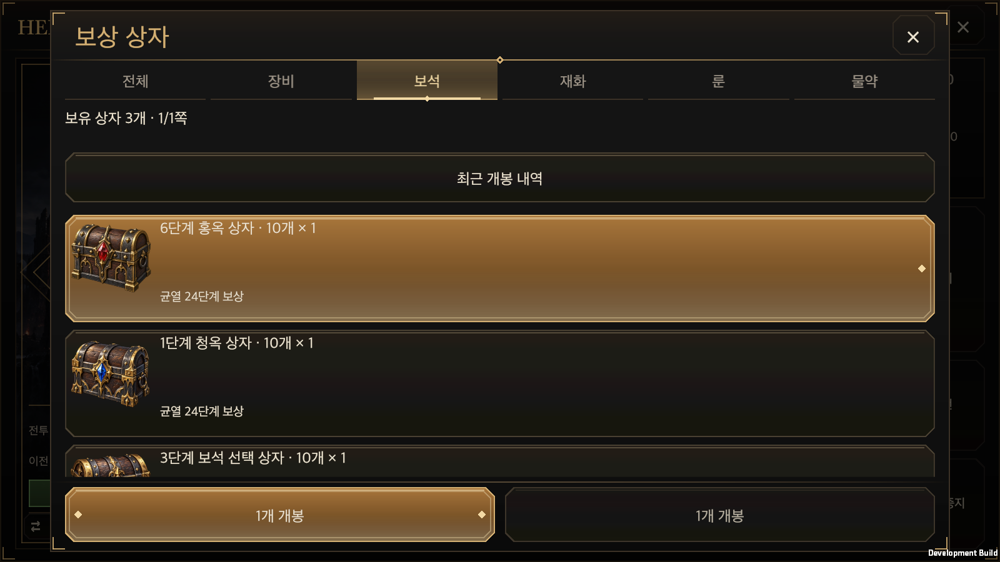
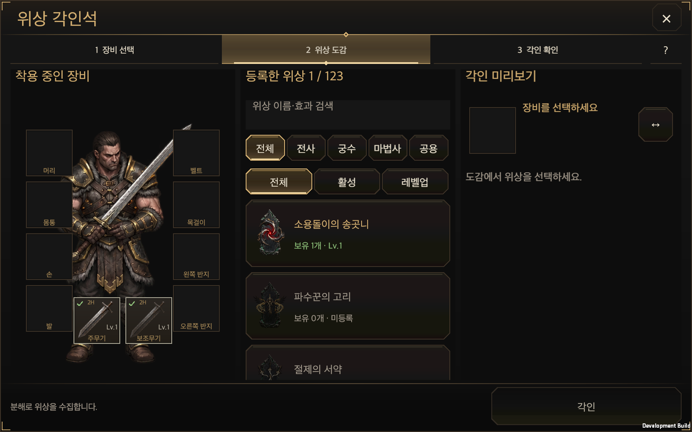
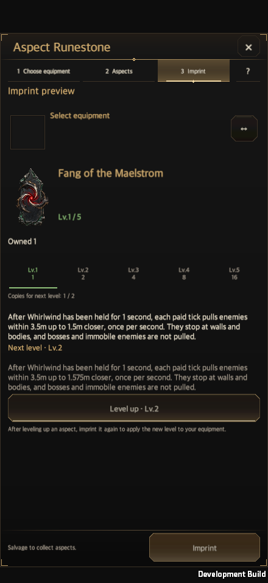
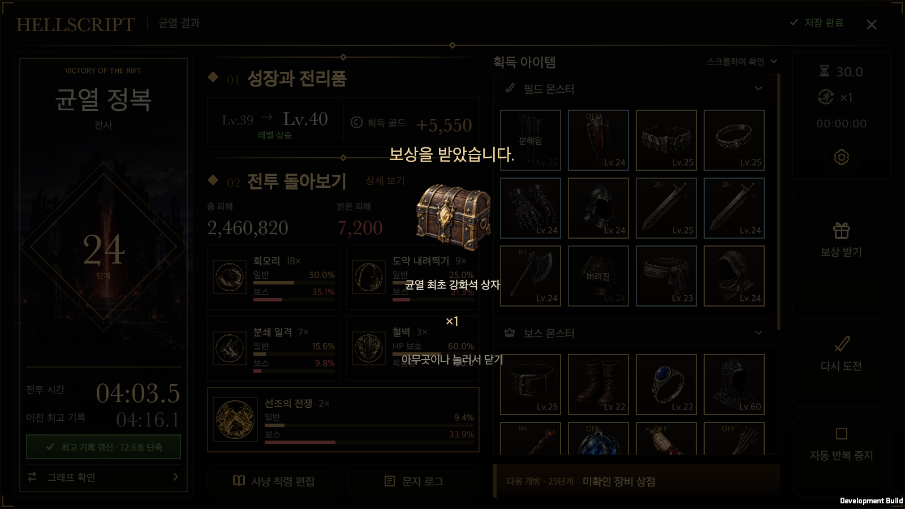
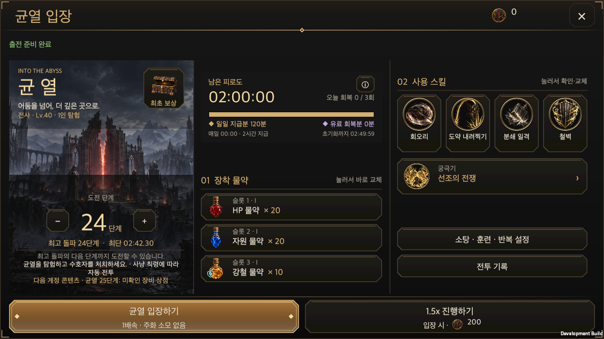

# 콘텐츠 그림의 생성 원화 적용

갱신일: 2026-10-01 · [English](Generated_Game_Art.en.md)

코드로 만든 콘텐츠 그림을 생성 원화로 연결했다. 작은 버튼 그림은 코드로 유지하고, 3D는 실제 품질 개선을 입증할 수 있는 것만 바꾸라는 사용자 조건을 따른다.

- 보상 상자: 새로 생성한 50종을 기존 85개 PNG 리소스 경로에 적용한다. 148개 상자의 ID·지급 내용·이름·수량·단계·개봉·저장은 최신 `main`의 데이터를 유지한다. 같은 보석 종류의 단계별 상자는 그림을 공유하며 단계와 수량은 기존 텍스트가 표시한다. 보관함·최초 보상·균열 결과·수령 연출은 같은 리소스를 읽는다.
- 균열 입장의 큰 상자: `RiftRewardChest`가 창고의 기존 생성 원화 `chest-closed/open`을 재사용한다. 잠김·수령 가능·수령 완료의 판정과 흔들림 시점은 유지한다.
- 위상 그림: 기존에 생성됐지만 화면에 연결되지 않았던 원화 123개를 `AspectRuneGraphic`의 도감·상세 표시로 연결한다. 출시되지 않은 기획 ID 18개는 런타임에 추가하지 않는다. 위상 효과·수집·각인 거래는 바꾸지 않는다.
- 보존: 작은 조작 아이콘, 상태 기호, 빈 장비 칸, 실시간 DPS 그래프·게이지·지도·룬 모양, 창틀·마스크·선택 효과는 기능용 코드 표시를 유지한다. 캐릭터·적·보스·배경·기물의 3D 모델과 텍스처, 필드 위상 기물의 코드 문양도 변경하지 않는다. 현재보다 좋아졌다는 검증 없는 3D 교체는 하지 않았다.

`RewardBoxesWindow`, `RiftRewardList`, `RiftRewardRevealWindow`, 기존 공통 슬롯·안전 영역·창 관리자를 그대로 사용한다. 새로운 UI 틀이나 저장 소유자를 만들지 않는다. 래스터만 교체한 표시 변경이며 기존 전문 화면의 배치는 보존한다.

## 제작·재생성 경계

[요청·원본 해시·적용 경로](../Art/GeneratedGameArt/requests.json), [상자 리소스 목록](../Art/RewardBoxes/manifest.json), [위상 제작 기록](../Art/ClassAspectIcons/manifest.json)을 남겼다. 네이티브 투명 PNG를 바이트 그대로 복사하며 배경 제거·색 키·픽셀 재작성은 하지 않는다. RGBA, 완전 투명 픽셀, 원본 해시를 검사한다. 일부 네이티브 파일의 모서리에 알파 1/255 픽셀 하나가 있어 수치를 기록하며 원본을 손대지 않는다. QA 모아보기의 축소·합성은 검사 자료에만 사용한다.

`tools/generate_reward_boxes.py`는 기존 JSON과 네이티브 PNG를 읽어 목록과 검사 모아보기만 갱신한다. 예전 도형 생성·런타임 PNG 덮어쓰기·상자 데이터 재작성 경로는 제거했다. 이전 SVG는 역사 자료로 보관한다. 상자와 위상 모두 플랫폼 텍스처 상한 256을 적용하며 기존 상자의 `.meta`·GUID는 보존한다.

내장 이미지 생성 도구는 모델 선택·실제 모델명을 검증할 수 있는 응답을 제공하지 않는다. `gpt-image-2`를 사용했다고 주장하지 않으며 모든 원화는 `candidate_model_unknown`, `productionApproved=false`로 기록한다. 런타임 개발 적용과 모델 출처·출시 승인 상태는 별개다. 사용자가 제외한 작은 버튼용 생성 후보는 적용하지 않았다.

## 검증 범위

공통 UI 계약과 계약 검사 11개를 통과했다. 등록 검사는 173개 그림 기록의 네이티브 알파·복사 해시·Unity 메타와 보존 경로를 확인했다. 관련 Edit Mode 검사 8개가 종료했고 최초 임포트의 크기 제한 검사 1개가 실패했다. 새 위상 PNG 123개만 기존 임포터로 다시 임포트한 뒤 해당 검사 1개가 통과했다. 실패한 MCP 작업은 전체 통계를 반환하지 않으므로 최초 실행을 8/8 통과로 표기하지 않는다. [검증 기록](GeneratedGameArtEvidence/validation.json), [최초 검사](GeneratedGameArtEvidence/edit-mode-initial.json), [해당 검사 재확인](GeneratedGameArtEvidence/edit-mode-aspect-reimport.json)에 근거를 보존했다.

macOS Development Player 빌드는 오류 0으로 완료했고, 한국어·영어와 440×956, 956×440, 1600×900, 1600×1000, 2100×900의 기본 글자 크기 및 안전 영역에서 10개 조합을 통과했다. 실제 uGUI 레이캐스트를 거친 합성 포인터로 필터·위상 선택을 실행했고, 조회 중 계정 스냅샷이 유지됐다. 실제 보상 수령 저장과 큰 상자의 세 상태도 확인했다. 53개 캡처를 남겼으며 페이드 완료 시점을 기다리는 검증 도구 수정 뒤 수령 연출과 상자 상태 3개 장면만 재확인했다. [런타임 결과](GeneratedGameArtEvidence/runtime.txt), [수령 장면 재확인](GeneratedGameArtEvidence/reveal-runtime.txt), [최종 빌드](GeneratedGameArtEvidence/build-final.json), [캡처 해시](GeneratedGameArtEvidence/captures.json)를 보존했다. 모바일 안전 영역은 시뮬레이션이며 모바일 실기기 검증으로 보고하지 않는다.

