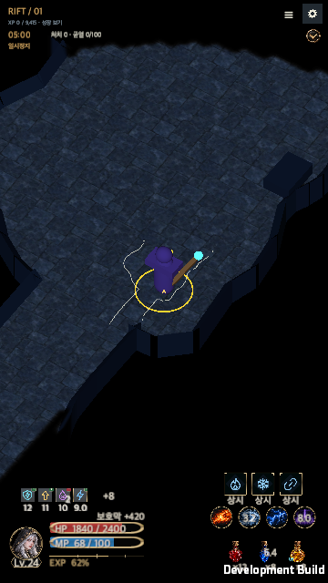
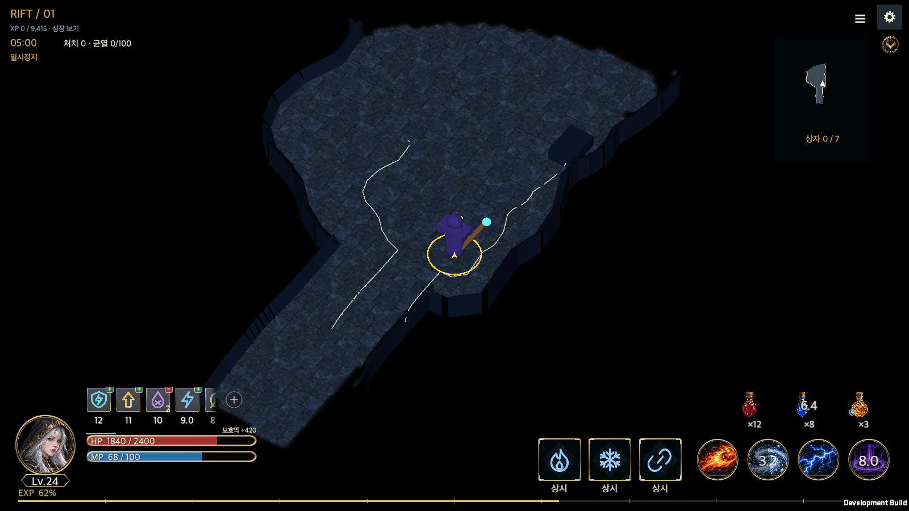

# Global HUD, Potions and Hunting Edicts

Date: 2026-09-14
갱신일: 2026-09-17 · 작성일: 2026-09-14

## Implemented behavior

The existing Unity 6000.6.0f1 uGUI now displays three separate passives, four active skills, three potion slots, the selected class seal, HP, class resource, level, XP and player status effects. The wide footer and camera exclusion have been removed. The camera uses the entire selected aspect frame; black unexplored areas belong to the existing visibility system.

This implements the [approved contract](../Design/GlobalHUD/HELLSCRIPT_GlobalHUD_Implementation_Plan.en.md). Original concept images used different passive counts and example artwork, so the production captures below form the updated three-passive reference. No new UI package or scene/prefab rewrite is required.

## Layout and resources

| Area | Implementation |
|---|---|
| Single source | [GlobalHudLayout.json](../../Assets/HELLSCRIPT/Resources/Data/GlobalHudLayout.json) controls positions, gaps, sizes, colors and font sizes. The [documentation copy](../Design/GlobalHUD/Resources/v2/layout-profile.json) matches. |
| Landscape | At 1600×900, skills are 76.8 and bottle art is 45 logical units. Three passives, a 24-unit group gap and four actives occupy the lower right, with potions above. |
| Portrait | At 900×1600, skills are 64 and bottles 60. Passives, actives and potions have separate rows, while survival information and short XP remain on the left. |
| Small windows | Verify 50/100/150% interface settings. Wrap entire groups without hiding slots; minimum HUD scale is 0.4. Use ∞ if “Always” exceeds a small passive slot; inspection retains the full description. |
| Experience | Landscape side margins 32, bottom 16, thickness 3; nine internal ticks at 10–90%, with a longer 50% tick. Percentage text floors the real ratio. |
| Status strip | Landscape icons 44, gaps 8, collapsed width 230, expanded maximum 408 and 0.18-second expansion. Scroll every effect, including those beyond eight. Portrait exposes four plus the remaining count and full inspection. |
| Alpha edges | `RectMask2D` and the [fade shader](../../Assets/HELLSCRIPT/Resources/GlobalHudFade.shader) apply matching alpha to icons, frames, timers and stacks over at most 22 logical units. Expand/collapse buttons stay outside the mask. |
| Art | Import 67 PNGs from the [approved resources](../Design/GlobalHUD/HELLSCRIPT_GlobalHUD_Resources.en.md) byte-for-byte and reuse the existing atlas. Native bottle bounds exclude transparent padding without changing pixels or alpha. Size means the longest artwork dimension. |

[Resource verification](GlobalHudEvidence/resource-verification.json) confirms the 67 source hashes and RGBA output. One white tint primitive is intentionally opaque; the other 66 have fully transparent pixels. `GlobalHudResourceTests` checks importer settings, stable GUID/meta on reimport and vital-bar sliced borders.

Preview and production share `GlobalHudView`. Only acceptance previews inject `GlobalHudSnapshot.Sample`; live play reads the selected hero/session. Sample inventory is never written to the account.

## Architecture and persistence

| Component | Responsibility |
|---|---|
| `GlobalHudSnapshot` | Supply one hero/session's vitals, three passives, four actives, three potions, progression and effects for display. |
| `GlobalHudView` / `StatusStripView` | Persist outside page clearing on Canvas 105. Inspection uses 108; retain the existing map integration. Only inspection, scrolling and expansion receive input. |
| `PotionDefinition` | Read eight definitions from [Potions.json](../../Assets/HELLSCRIPT/Resources/Data/Potions.json); the public potion database uses the same source. |
| `PotionInventory` | Per-hero stock, one-time initialization, visit identity and cumulative visit spending, outside equipment bag space. |
| `PotionPolicy` | Interpret active hunting-edict use, buying and departure choices without toggling the existing edict mode. |
| `PotionRuntimeState` | Store combat-clock cooldowns, captured totals, equipped utility and active-effect duration. |

HP and resource restore 35% of their maximum with separate 20-second cooldowns. Sprint, Assault, Resistance, Iron, Haste and Focus last eight seconds with 30-second cooldowns. See the [potion specification](../Design/GlobalHUD/HELLSCRIPT_GlobalHUD_05_Potions.en.md) for exact effects and conditions. Applying the effect, decrementing stock and starting cooldown happen in one simulation step. Do not consume when no benefit applies or an existing utility effect remains. Preserve existing stat caps and the HP potion's LC03 shield interaction.

Use toggles, purchase targets and departure policies are independent. Disabling automatic use does not suppress restocking; set a target to zero to stop buying that type. “Wait if no HP potions” checks zero HP stock regardless of the use toggle, while “Wait for targets” checks all three saved targets.

Restock only on sanctuary visits and next-run preparation in HP→resource→utility order. Defaults are stock 20/20/10, prices 5/5/15, a cumulative 500-gold visit budget and 200-gold reserve. Stage the transaction on disk before adopting gold, inventory and visit state. Save failure preserves the previous state; repainting never buys supplies. Waiting reevaluates changed gold, stock or edicts without aborting a current battle.

Account schema is 5, potion inventory/runtime version 1 and edict global options version 2. Grant each hero 20 HP, 20 resource and 10 Iron once. Legacy suspended battles finish under their old unlimited-HP contract, then transition at sanctuary. HED1 and old HED2 import, comparison, application and export preserve old choices and supplement new defaults. Training and A/B comparison copy inventory and do not consume real gold or stock.

## Observation and page navigation

The upper-right observation menu provides pause, speed selection, build/edict editing, map, combat details, growth, return and idle display. Existing speed entitlements still apply. Closing inspection restores its previous pause state. Keep the HUD in town, inventory and results; reserve scrolling space in non-combat lists. Move the existing town movement control above the left HUD so they do not overlap. In small windows, boss names and action descriptions grow to their actual line count and move the health bar below them.

## One shared skill icon

Active skills use circular frames and passive skills square ones, the convention the user confirmed for the whole game. HUD slots, the skill buffs in the status list and the inspection panels all draw through `SkillIconView`, the same component the Hunt Edict window uses, and `SkillIconAssets` reads the existing eighteen active and eighteen passive images rather than a separate HUD icon set. The cooldown sweep follows the same shape mask, potion slots keep their bottle art, and a status entry falls back to its own icon when its effect is not a skill. When the hunt edict document's slots match the loadout being fought with, the HUD shows the document's slot order, empty slots included.

## Reopening a suspended rift

The reason the hunt edict is blocked is reported once per rift. That "already reported" state lived in a field on the simulation rather than in the run, so reopening a suspended rift wrote the line again and the reopened run's log no longer matched the original. It surfaced once a new account's hero began fighting through the unified edict. The state moved to `RunState.edictBlockLogged`, which is saved with the run and kept when it is reopened; a real change of the document or the loadout still reports the next block.

## Text rows that hold their own font line

The shield amount in the global observation HUD sat in a row 12 logical units high while it drew at font size 16, the same size as the slot captions. This font needs roughly 0.9 times the font size for one line, so the row could not hold it. Each runtime smoke checks every label's `preferredHeight` against its rectangle on every captured screen. An empty label still reports one line of height, so the row was flagged as clipped even with no shield up, and every screen failed regardless of the feature under test.

Between widening the row and shrinking the text, the text was shrunk. The [HP screen design](../Design/GlobalHUD/HELLSCRIPT_GlobalHUD_02_HP.en.md) specifies the shield as a thin cyan line and an amount above the HP bar, and the layout already reserves exactly 16 units above the HP bar for the status strip, so the row height of 12 is the intended value. A dedicated `shieldFont` of 12 now matches the row height.

On small windows the font stops shrinking at its legible floor, so a row that only follows the scale still cannot hold one line. The HP bar already floors its own pixel height with `12/scale+2`, and the same idea now applies to text rows. A `Row(height, clampedFont)` helper in the layout makes the shield row, the level badge and the XP text hold their own clamped font in pixels. The status strip's vertical position now follows the top of the shield row, so a grown row never runs into it. At the 1600×900 reference nothing moves; the rows only grow below roughly 0.63 scale.

The level badge and the XP text carried the same defect. At 360×640, where the scale reaches its 0.4 minimum, the level badge row is 9.6 pixels while its minimum font of 12 needs 11 pixels for one line. Neither surfaced because the battle layout smoke excluded the HUD from its clipping check. That exclusion arrived in `d8d5405`, the same commit that introduced the HUD. All three rows now hold one line, so the exclusion was removed and the HUD is checked again.

The HUD preview sample now carries a shield of 420. The sample left the shield at zero, so the global HUD smoke drew twenty screens without ever rendering the shield text, which is why its own check never caught this.

## Verification and evidence

The [verification summary](GlobalHudEvidence/verification.json) distinguishes the original run from subsequent focused checks.

| Check | Result and evidence |
|---|---|
| Full Edit Mode | [2,638 of 2,639 passed](GlobalHudEvidence/final-all-tests.xml). The sole failure hardcoded old save schema 4. Update that assertion to the current schema constant. |
| Focused checks after fixes | [109 of 109 passed](GlobalHudEvidence/final-delta-tests.xml), covering potions, layout, importing, localization, persistence and unlocks. Combined evidence covers 2,640 distinct cases with zero unresolved failures. This is a combination of runs, not a claim that the entire suite was rerun once more. |
| macOS development build | [Zero build errors](GlobalHudEvidence/build.txt). Compare all 775 Runtime, Resources and Editor files between the build copy and submitted source using [hashes](GlobalHudEvidence/runtime-source-hashes.json). |
| HUD runtime | Preserve [runtime results](GlobalHudEvidence/runtime.txt) and [geometry records](GlobalHudEvidence/geometry.txt). Check Korean/English × 50/100/150% × five window sizes, 30 cases within two logical pixels for key positions and sizes. Separately exercise the safe area, 0/4/5/8/12/40 effects, start/middle/end, expansion, expiry, rotation, inspection and drag-release rejection. |
| Live potions and repeat hunting | Simultaneous HP/resource/utility activation deducts one of each from real stock and starts independent cooldowns plus the utility buff. Paused values remain unchanged; 100 ticks with or without HUD presentation are identical. Verify HP-shortage waiting, saved departure-policy changes, a 350-gold sanctuary purchase and no duplicate purchase on repaint. |
| Existing screen regression | A [separate native run](GlobalHudEvidence/battle-layout/runtime-battle-layout-smoke.txt) covers 16 macOS sizes, five boss layouts, combat detail inspection, build/settings return, hidden enemy/hazard filtering and 120 identical training ticks. |
| Skill icons and reopened runs | The 2026-09-17 rerun refreshed the [runtime result](GlobalHudEvidence/runtime.txt) and the [build record](GlobalHudEvidence/build-skill-icons.txt). The smoke now checks the shared component's kind, clipping mask and border sprite on every passive and active HUD slot. The existing check that copies a live rift and ticks both for a hundred steps, then requires the run and the hero to match exactly, passes. Five [restore fidelity tests](../../Assets/HELLSCRIPT/Tests/Editor/RestoreFidelityTests.cs) were added in Edit Mode. |
| HUD text rows | On 2026-09-17 a [build](GlobalHudEvidence/TextRows/build.txt) ran the [rune smoke](GlobalHudEvidence/TextRows/rune-initial-result.txt), its [restart stage](GlobalHudEvidence/TextRows/rune-resume-result.txt), the [global HUD smoke](GlobalHudEvidence/TextRows/global-hud-runtime.txt) and the [battle layout smoke](GlobalHudEvidence/TextRows/battle-layout-checks.txt). All four exited zero with no clipping reported. The battle layout smoke covered 16 window sizes with the HUD included, among them 360×640 and 640×360. [All 2,718 Edit Mode tests passed](GlobalHudEvidence/TextRows/editmode.xml). One added Edit Mode test measures five rows with the real font; it fails if the font goes back to 16 or if the minimum pixel height is removed. |
| Map and restart | The [map runtime check](GlobalHudEvidence/visibility/runtime.txt) verifies a nonblocking overlay, pointer interaction with settings, both languages and orientations. A [separate process restart](GlobalHudEvidence/visibility/restart.txt) preserves explored terrain and the disabled-map preference. |

These landscape, expanded and portrait captures use the same production component. Reference captures inject sample HUD values; the live potion-use image reads actual gameplay state.

More evidence: [middle scroll](GlobalHudEvidence/03-landscape-middle.png), [end scroll](GlobalHudEvidence/04-landscape-end.png), [small English at 150%](GlobalHudEvidence/12-small-english-large.png), [effect inspection](GlobalHudEvidence/14-effect-inspection.png), [live potion use](GlobalHudEvidence/17-real-potion-use.png), [departure waiting](GlobalHudEvidence/19-departure-wait.png), [sanctuary purchase](GlobalHudEvidence/20-sanctuary-supplies.png).

Nine reward-related failures were reproduced on unchanged baseline `33ed9b1`. Those old assertions assumed immediate currency payment and ignored resource-drop IDs. The updated fixtures compare cash plus unclaimed rewards, account for gem-acquisition unlocks, and check item identity separately from fixed random results. Duplicate rewards and records remain guarded; gameplay reward amounts and settlement code are unchanged. A visibility migration bounds guard also skips obsolete corridor references in old synthetic layouts.

More evidence: [minimum-scale portrait](GlobalHudEvidence/TextRows/hud-small-portrait.png), [rune board screen](GlobalHudEvidence/TextRows/rune-board-ko.png), [battle layout portrait](GlobalHudEvidence/TextRows/battle-720x1280.png), [global HUD geometry record](GlobalHudEvidence/TextRows/global-hud-geometry.txt).

## Release checks

Physical Android/iOS touch, home gestures, notches, app resume, fonts and compression quality remain release checks. Native macOS and automated checks do not establish mobile input, performance or battery quality. Low-health emphasis, HP fill interpolation and level-badge emphasis remain optional visual refinements outside the required functionality.

한국어: [구현 기록](Global_HUD_Potions.md).
