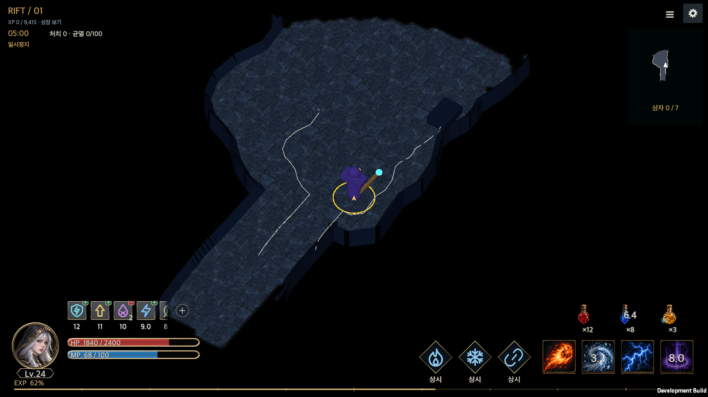
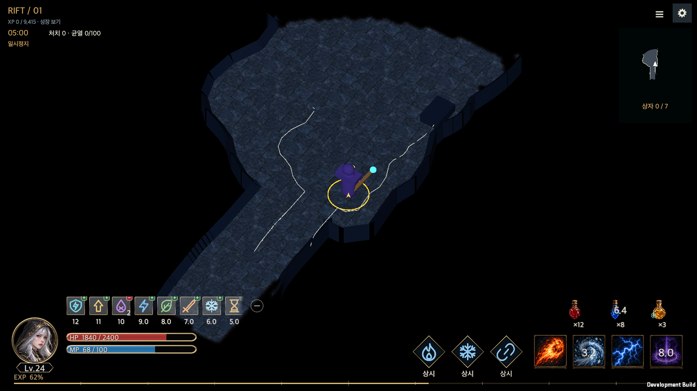
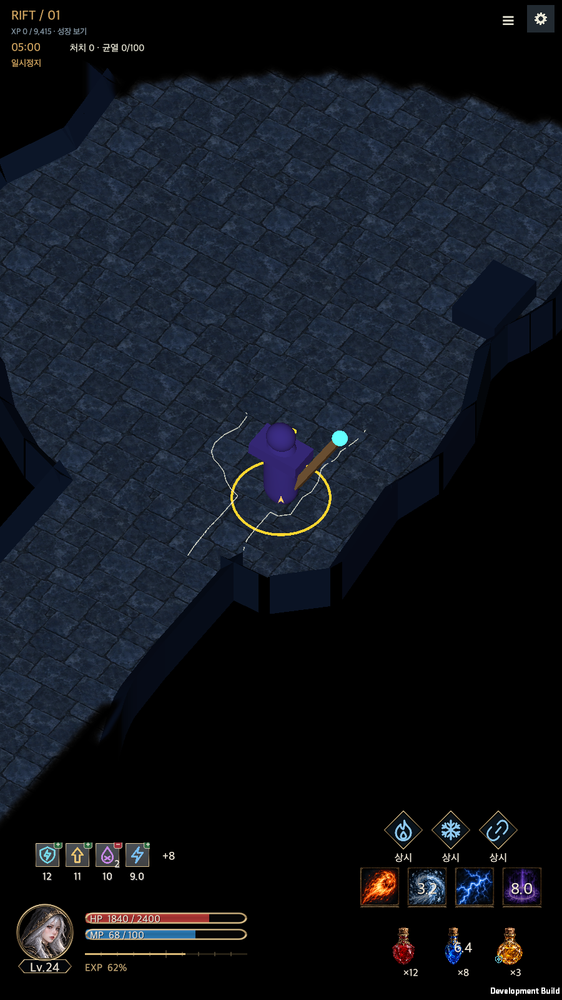

# 전역 HUD·물약·사냥 칙령 구현 기록

작성일: 2026-09-14

## 구현 결과

전역 HUD를 Unity 6000.6.0f1의 기존 uGUI에 연결했다. 패시브 3개·액티브 4개·물약 3슬롯과 캐릭터 인장·HP·직업 자원·레벨·경험치·상태 효과를 표시한다. 넓은 하단 패널과 카메라 예약 영역을 없앴다. 카메라는 사용자가 선택한 화면 비율 전체를 사용하며, 미탐색 지역의 검은 영역은 기존 시야 시스템이 그린다.

이 문서는 [확정 배치·기능 기준](../Design/GlobalHUD/HELLSCRIPT_GlobalHUD_Implementation_Plan.md)의 구현 결과다. 초기 시안은 패시브 수와 예시 그림이 다르므로, 패시브 3개를 반영한 아래 실행 캡처를 현재 기준으로 삼는다. 새 UI 패키지나 씬·프리팹 재작성은 없다.

## 화면과 리소스

| 항목 | 실제 적용 |
|---|---|
| 배치 원본 | [GlobalHudLayout.json](../../Assets/HELLSCRIPT/Resources/Data/GlobalHudLayout.json)에 위치·간격·크기·색상·글자 크기를 모았다. [문서용 사본](../Design/GlobalHUD/Resources/v2/layout-profile.json)과 값이 같다. |
| 가로 | 1600×900에서 스킬 76.8, 병 그림 45다. 패시브 3개→24 간격→액티브 4개를 오른쪽 아래에 놓고 물약을 위에 둔다. |
| 세로 | 900×1600에서 스킬 64, 병 그림 60이다. 패시브·액티브·물약을 각 줄로 배치하고 왼쪽에 생존 정보와 짧은 XP 바를 유지한다. |
| 작은 창·글자 | 50·100·150%를 검사한다. 슬롯을 숨기지 않고 그룹 단위로 줄을 바꾼다. HUD 배율의 하한은 0.4다. 상시 문구가 좁은 슬롯을 넘으면 ∞로 표시하며 설명은 조회창에 유지한다. |
| 경험치 | 가로는 좌우 32, 하단 16, 두께 3이다. 10~90%의 눈금 9개 중 50%를 더 길게 표시한다. 비율 숫자는 내림한다. |
| 상태 목록 | 가로는 44 크기·8 간격, 접힘 230·최대 펼침 408, 0.18초 확장이다. 숨은 효과를 끝까지 좌우 스크롤하고 세로는 4개와 추가 개수로 전체 목록을 연다. |
| 경계 | `RectMask2D`와 [알파 감쇠 셰이더](../../Assets/HELLSCRIPT/Resources/GlobalHudFade.shader)를 함께 쓴다. 최대 22 범위에서 아이콘·프레임·지속시간·중첩 숫자에 같은 감쇠를 적용한다. +/− 버튼은 마스크 밖에 있다. |
| 원본 그림 | [기존 리소스](../Design/GlobalHUD/HELLSCRIPT_GlobalHUD_Resources.md) 중 PNG 67개를 바이트 변경 없이 임포트하고 기존 아틀라스를 재사용한다. 병은 투명 여백을 제외한 그림 영역의 긴 변에 크기를 맞추며 원본 알파를 유지한다. |

[PNG 무결성·알파 검사](GlobalHudEvidence/resource-verification.json)는 67개 파일의 원본 해시와 RGBA를 확인한다. 색을 입히는 흰색 채움 1개는 의도적으로 불투명하며, 나머지 66개에는 완전히 투명한 픽셀이 있다. `GlobalHudResourceTests`는 임포트 설정, 재임포트 시 GUID·메타 불변, HP 바의 9-slice 경계를 확인한다.

미리보기와 실제 게임은 같은 `GlobalHudView`를 사용한다. 화면 검증용 값만 `GlobalHudSnapshot.Sample`로 주입하며 실제 플레이에서는 선택 영웅과 현재 전투의 데이터를 읽는다. 초기 시안의 예시 수치를 실제 재고처럼 저장하지 않는다.

## 데이터·전투·저장 연결

| 구성 | 책임 |
|---|---|
| `GlobalHudSnapshot` | 동일 영웅·세션의 생존 정보, 3개 패시브, 4개 액티브, 3종 물약, 성장과 상태 목록을 표시용으로 전달한다. |
| `GlobalHudView` / `StatusStripView` | Canvas 105에서 페이지 교체와 관계없이 유지된다. 조회창은 108이며 기존 지도 연결을 보존한다. 표시 그림은 입력을 가로채지 않고 조회·스크롤·펼침만 입력을 받는다. |
| `PotionDefinition` | [Potions.json](../../Assets/HELLSCRIPT/Resources/Data/Potions.json)의 8종 효과·가격·시간·문양을 읽는다. 같은 원본에서 공개 위키 물약 DB를 만든다. |
| `PotionInventory` | 영웅별 별도 재고, 첫 지급 여부, 방문 식별자와 방문당 누적 지출을 보관한다. 장비 가방은 사용하지 않는다. |
| `PotionPolicy` | 활성 칙령의 사용·구매·출정 조건을 해석한다. 기존 칙령 모드를 임의로 켜거나 끄지 않는다. |
| `PotionRuntimeState` | 실제 전투 시계를 따르는 대기시간·이번 사용의 총 대기시간·장착 보조·활성 효과·잔여 지속시간을 저장한다. |

HP와 자원은 최대값의 35%를 회복하며 대기는 각각 20초다. 질주·맹공·저항·강철·속공·집중은 8초 지속, 30초 대기다. 효과 수치와 조건은 [물약·칙령 명세](../Design/GlobalHUD/HELLSCRIPT_GlobalHUD_05_Potions.md)를 따른다. 효과 적용·수량 차감·대기시간 시작을 한 시뮬레이션 단계에서 처리한다. 효과가 적용되지 않거나 같은 보조 효과가 남아 있으면 소모하지 않는다. 기존 능력치 상한과 HP 물약의 LC03 보호막 연계를 보존한다.

자동 사용과 자동 구매, 출정 지침은 서로 독립적이다. 자동 사용을 꺼도 저장된 목표 수량까지 구매한다. 해당 종류를 구매하지 않으려면 목표 수량을 0으로 설정한다. ‘HP가 없으면 대기’는 HP 자동 사용 여부와 관계없이 HP 재고가 0이면 기다린다. ‘목표 수량까지 대기’는 3슬롯의 저장된 목표를 확인한다.

실제 성소 방문과 다음 반복 사냥의 출정 준비에서 HP→자원→보조 순서로 구매한다. 기본 목표 20·20·10개, 가격 5·5·15금화, 방문당 예산 500과 최소 잔액 200을 함께 적용한다. 거래를 디스크에 기록한 뒤 재고·금화를 반영하므로 저장 실패 시 이전 상태를 유지한다. 화면 재구성은 구매를 발생시키지 않는다. 대기는 금화·재고·칙령이 바뀔 때만 다시 평가하며 진행 중 전투를 재고 부족으로 중단하지 않는다.

저장 스키마는 5, 물약 재고·전투 상태 버전은 1, 칙령 전역 옵션 버전은 2다. 영웅마다 첫 HP 20·자원 20·강철 10개를 한 번 지급한다. 구버전의 진행 중 전투는 기존 무한 HP 규칙으로 끝낸 후 성소에서 전환한다. HED1·구형 HED2 가져오기·비교·적용·내보내기는 이전 설정을 보존하면서 새 옵션을 보충한다. 훈련과 A/B 비교는 재고를 포함한 복사본을 쓰며 실제 금화·재고를 소모하지 않는다.

## 관찰 메뉴와 화면 이동

우상단 관찰 메뉴에서 일시정지·배속 선택·행동 수정·사냥 칙령·지도·전투 상태·성장·귀환·절전에 접근한다. 기존 배속 접근 제한은 유지한다. 조회창을 닫으면 열기 전의 일시정지 상태로 돌아간다. 마을·가방·결과에서도 HUD를 유지하고 비전투 목록에는 하단 스크롤 여백을 둔다. 마을의 기존 이동 조작은 왼쪽 HUD 위로 옮겨 겹침을 막았다. 작은 창의 보스 이름과 행동 설명은 실제 줄 수에 맞춰 높이를 늘리며 아래 체력 바도 함께 이동한다.

## 검증과 실행 증거

[검증 집계](GlobalHudEvidence/verification.json)에 원본 검사와 재검사 결과를 구분해 보관했다.

| 검사 | 결과와 근거 |
|---|---|
| 전체 Edit Mode | [2,639개 중 2,638개 통과](GlobalHudEvidence/final-all-tests.xml)했다. 실패한 1개는 저장 버전을 4로 고정한 기존 검사였다. 현재 스키마 상수를 검사하도록 수정했다. |
| 수정 후 관련 검사 | [109개 모두 통과](GlobalHudEvidence/final-delta-tests.xml)했다. 물약·배치·임포트·현지화·저장·해금 검사를 포함한다. 전체 실행과 재검사의 중복을 제외한 2,640개에서 미해결 실패는 0개다. 이는 여러 실행을 합친 결과이며 전체를 한 번 더 실행했다는 뜻은 아니다. |
| macOS 개발 빌드 | [오류 0개로 빌드](GlobalHudEvidence/build.txt)했다. 빌드용 복사본과 제출 소스의 Runtime·Resources·Editor 775개 파일이 같은지 [해시](GlobalHudEvidence/runtime-source-hashes.json)로 확인했다. |
| HUD 실행 | [실행 결과](GlobalHudEvidence/runtime.txt)와 [배치 기록](GlobalHudEvidence/geometry.txt)을 보관했다. 한영×50·100·150%×5개 화면의 30개 조합에서 주요 위치·크기를 2 논리 픽셀 이내로 검사했다. 별도로 노치 안전 영역과 상태 0·4·5·8·12·40개, 시작·중간·끝·확장·만료·회전·설명·드래그 종료를 검사했다. |
| 실제 물약·반복 사냥 | HP·자원·보조가 함께 발동하면 실제 재고가 각각 1개 줄고 독립된 대기시간과 버프가 시작됐다. 일시정지 중 값이 유지됐고 HUD 표시 유무에 따른 100틱 결과가 같았다. HP 부족 대기, 저장된 출정 지침 변경, 성소의 350금화 구매, 다시 그리기 시 중복 구매 방지를 확인했다. |
| 기존 화면 회귀 | [별도 실행 검사](GlobalHudEvidence/battle-layout/runtime-battle-layout-smoke.txt)에서 macOS 창 16종, 보스 화면 5종, 전투 상태 조회, 행동 편집·설정 복귀, 보이지 않는 적·위험 표시의 차단, 훈련 120틱의 동일 결과를 확인했다. |
| 지도·재시작 | [지도 실행 검사](GlobalHudEvidence/visibility/runtime.txt)에서 오버레이의 입력 비차단, 설정 포인터 조작, 한영·가로세로 전환을 확인했다. [별도 프로세스 재시작](GlobalHudEvidence/visibility/restart.txt) 뒤 탐색 기록과 지도 끄기 설정도 유지됐다. |

가로 기준과 상태 확장, 세로 기준은 같은 실행 컴포넌트를 사용한 아래 캡처로 확인한다. HUD 수치 예시를 주입한 기준 캡처와 실제 물약 사용 화면을 구분했다.

추가 증거: [스크롤 중간](GlobalHudEvidence/03-landscape-middle.png), [스크롤 끝](GlobalHudEvidence/04-landscape-end.png), [영문·150% 작은 창](GlobalHudEvidence/12-small-english-large.png), [상태 설명](GlobalHudEvidence/14-effect-inspection.png), [실제 물약 사용](GlobalHudEvidence/17-real-potion-use.png), [출정 대기](GlobalHudEvidence/19-departure-wait.png), [성소 구매](GlobalHudEvidence/20-sanctuary-supplies.png).

원래 전체 검사에서 보상 관련 9개 실패를 발견했고, 변경 전 `33ed9b1`에서도 같은 9개가 실패함을 확인했다. 현재의 ‘재화 드롭 후 수집’ 규칙에 맞게 검사에서 보유 재화와 미수집 보상을 합산하고, 보석 수집에 따른 해금을 허용했다. 아이템의 실제 드롭 ID와 고정 난수 결과를 각각 검사하며 중복 보상·중복 기록 방지는 유지한다. 게임의 보상 수치나 지급 경로는 바꾸지 않았다. 오래된 테스트 지형의 통로 참조가 범위를 넘는 경우에는 시야 이관에서 건너뛰도록 방어 처리를 추가했다.

## 남은 출시 검증

Android·iOS 실기기의 물리 터치, 홈 제스처·노치·앱 복귀, 글꼴과 압축 품질은 별도 출시 조건이다. 이번 macOS 실행과 자동 검사를 모바일 실기기 또는 성능·배터리 검증으로 해석하지 않는다. 저체력 강조·HP 채움 보간·레벨 표지 강조는 선택적인 시각 개선 후보이며 현재 필수 기능에 포함하지 않는다.

English: [Implementation record](Global_HUD_Potions.en.md).
