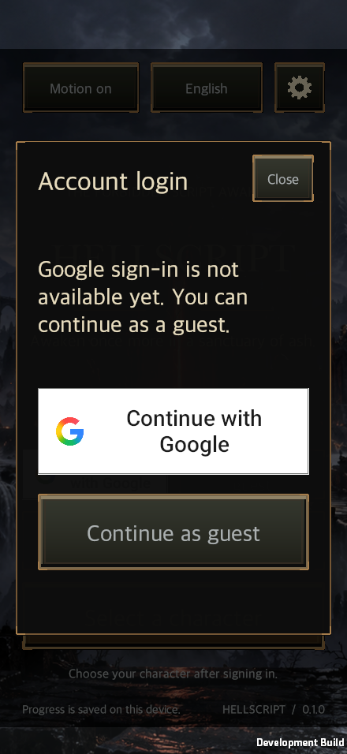
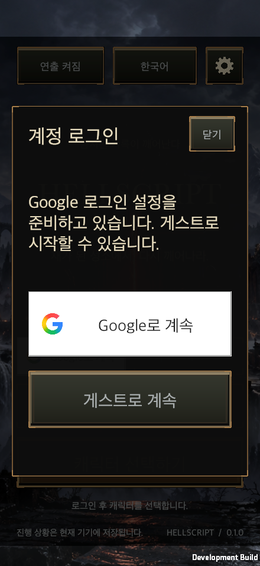

# Google sign-in and device-local account saves

Updated: 2026-09-26

[한국어](Google_Login.md) · [Server operations](Live_Operations.en.md)

Google sign-in replaces the title screen's mock username/password form. Guest entry remains available. After server verification, the player selects a character; new accounts follow the existing first-game tutorial.

**This implementation provides identity verification and separate saves on the current device.** It does not upload guest progress, synchronize cloud saves or restore another device's progress. A Google player session grants neither operations-tool access nor QA telemetry permissions.

## Player flow

1. Choose **Continue with Google**. Google credentials are entered on Google's browser page.
2. On the first login on this device, choose **Link guest progress** or **Start a new game**. A previously linked account opens its existing save directly.
3. Choose a character and enter gameplay. Signing out switches to a separate guest save.

Each game launch starts at the sign-in screen. Game sessions stay in memory for at most 12 hours. Replacing a server session does not remotely interrupt an existing local game; future server features must validate the session on every request.

## Save ownership

`GameController.Accounts` switches `GameStore` only on the title screen, with no active combat, pending entry or common panel. It saves the current store and verifies the destination can be opened and saved before binding ownership.

`AccountProfiles` stores a hash of the server origin and opaque account ID in `account-profiles-v1.json`, mapped to a local directory. It does not store email addresses or authentication tokens.

| Choice | Storage behavior |
| --- | --- |
| Existing guest | Without an index, use the original save location. |
| Link guest | Atomically transfer the directory reference. Do not copy, merge or delete saves or combat records. Allocate a new guest directory. |
| New game | Use a separate Google account directory and retain the guest save. |
| Returning account | Open the existing binding; never overwrite it with another guest. |
| Invalid index or failed save | Stop entry and preserve originals. Do not silently fall back to a guest after losing account ownership information. |

The registry rejects duplicate accounts/directories, path traversal, missing fields and unsupported versions. Writes use an exclusive lock, temporary file, atomic replacement and backup. Language, text size, audio and display settings remain device preferences. Account changes reset tutorial, attendance and offline-supply view caches and switch the combat archive target.

## Authentication and configuration

The Google OAuth client type is **Web application**. Its authorized redirect URI is `https://hellscript-production.up.railway.app/auth/google/callback`. Keep its secret exclusively on the server. Requested scopes are `openid` and `https://www.googleapis.com/auth/userinfo.email`. The latter is the canonical name for the same permission as `email`. The Google Console publishing status remains Testing, but requests limited to these basic identity scopes are exempt from the test-user list and seven-day authorization expiry, as documented in [Google’s audience guidance](https://support.google.com/cloud/answer/15549945). Brand verification for the app name/logo and mobile distribution are separate steps.

| Server variable | Meaning |
| --- | --- |
| `HELLSCRIPT_GOOGLE_CLIENT_ID` | Client ID issued by Google Cloud |
| `HELLSCRIPT_GOOGLE_CLIENT_SECRET` | Matching server secret; never store it in Git, game builds or documentation |
| `HELLSCRIPT_AUTH_ORIGIN` | `https://hellscript-production.up.railway.app` |

With all three values absent, Google sign-in is disabled and guest entry remains available. Partial or malformed configuration prevents server startup. `accounts.sqlite` sits on the existing persistent volume, separate from operations and telemetry databases. Include it in server backups: preserving account IDs requires restoring this database.

The game keeps a PKCE verifier in memory and obtains a browser entry URL from the server. The server binds its state to an HttpOnly browser cookie and uses separate PKCE and nonce values with Google. Google's callback is verified with official `google-auth`, including signature, issuer, audience, expiry and an explicit nonce check. Stable Google `sub` identifies the account; email does not.

The code returned to the game expires after 60 seconds and can be exchanged once, with the original PKCE verifier and application state. Google access/refresh tokens are never persisted or sent to the game. The server stores hashed game session tokens and revokes them on sign-out. Authentication responses are not cached, and existing disabled access logging is retained.

Desktop uses a random loopback port on `127.0.0.1`. Android/iOS use `hellscript://auth/google`. `GoogleLoginBuild` adds this route once to generated manifests while preserving existing entries. Windows and physical mobile behavior require separate validation.

## UI ownership and validation

The existing title adapter owns the full screen before gameplay. Its login modal reuses `UiFonts`, `UiTheme`, `UiButton` and the existing safe area; content scrolls while close remains fixed. `GoogleLoginClient` owns authentication, and `GameController.Accounts`/`AccountProfiles` own save selection. UI components do not create identities or modify directory ownership directly. Following the [official branding guide](https://developers.google.com/identity/branding-guidelines), Google buttons use the official logo and light palette, with input handled by shared `UiButton` and rendering owned by `UiTheme`/`UiButtonFace`. `UiFonts.GoogleSignIn` supplies Roboto Medium for English and the shared font for Hangul. See the [asset notice](../../Assets/HELLSCRIPT/Resources/Authentication/NOTICE.txt) for sources and the font license.

- Server unit tests cover exchange, cancellation, expiry, replay, incorrect PKCE/cookies, and official verification rejection for invalid signatures, audiences, issuers, expiry and nonce. Test Google responses/certificates are fixtures, not evidence of a real account login.
- Unity Edit Mode checks directory ownership, restart, actual `GameStore` separation, exact callback/state checks, title entry, translations, and idempotent mobile manifest registration.
- `RuntimeTitleSmoke` checks actual macOS rendering and pointer interaction at 440×956, 956×440, PC 16:9, 16:10 and 21:9 in Korean/English at 100%/140% text size.
- `RuntimeGoogleLoginSmoke` performs two real Google logins to verify guest linking, sign-out, fresh guest isolation, returning-account progress and actual gameplay entry. There is no identity injection or authentication bypass. Development-only `-hellscriptAuthBrowserHandoff` writes the browser launch URL to a separate file for controlled browser testing.

[PR #12](https://github.com/dakrdong/HELLSCRIPT/pull/12) was merged into `main`, and the Google credentials were registered with the existing Railway service on 2026-09-26. Commit `64a9a18a` aligns the email scope with the canonical name returned by Google; deployment `8b2ba0b3-0815-43a6-9da9-1ef3dc9bced7` succeeded. Two real Google logins from the macOS game verified guest linking, sign-out, fresh guest isolation, returning-account progress and Mage gameplay entry. [Live authentication evidence](../../Artifacts/Validation/GoogleLogin/real-google/acceptance.json) · [Native runtime result](../../Artifacts/Validation/GoogleLogin/real-google/validation.txt)

## Verification for this change

| Check | Result |
| --- | --- |
| Server | 80 passed, including canonical email-scope exchange and rejection of additional scopes; separate from the real-account row below. |
| Focused Unity Edit Mode | 101 passed, 0 failed/skipped; not a full-project suite result. |
| macOS development build | Succeeded with 0 build errors. |
| Native title acceptance | 31 claims, including 20 login-dialog combinations, guest/sign-out, character selection and actual gameplay entry. |
| Native character selection | 11 claims, including selection, saving, rotation and suspended-rift ownership. |
| Real Google sign-in | Two successful logins against the public server, including guest linking, sign-out, progress restoration and gameplay entry. Native macOS validation exited with code 0. |
| Windows and physical Android/iOS | Not tested. macOS viewport simulation is not physical-mobile evidence. |

[Summary](../../Artifacts/Validation/GoogleLogin/validation-summary.json) · [Edit Mode results](../../Artifacts/Validation/GoogleLogin/editmode-integrated.xml) · [Title acceptance](../../Artifacts/Validation/GoogleLogin/title-ui-final/validation.txt) · [Character-selection acceptance](../../Artifacts/Validation/GoogleLogin/character-ui/validation.txt)

