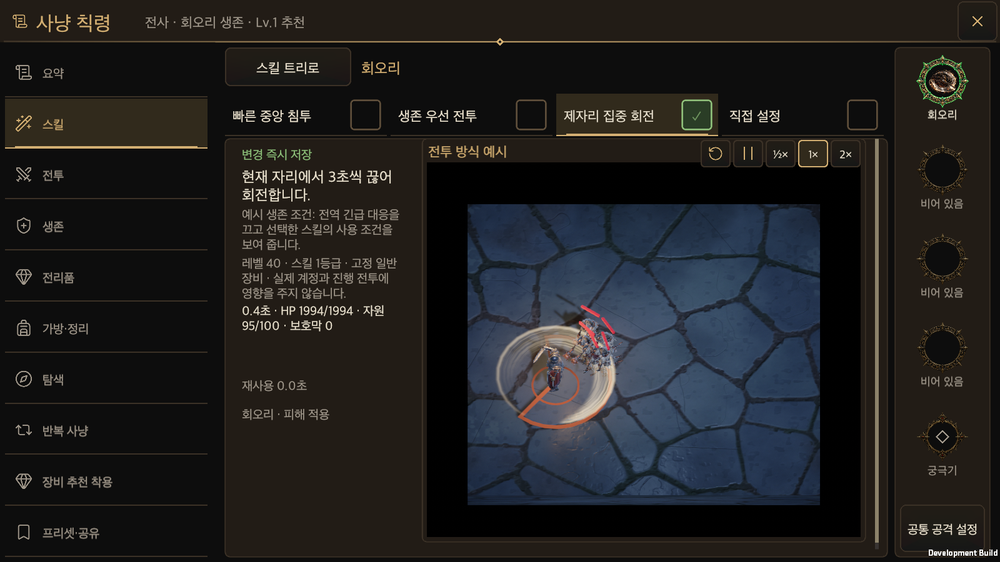
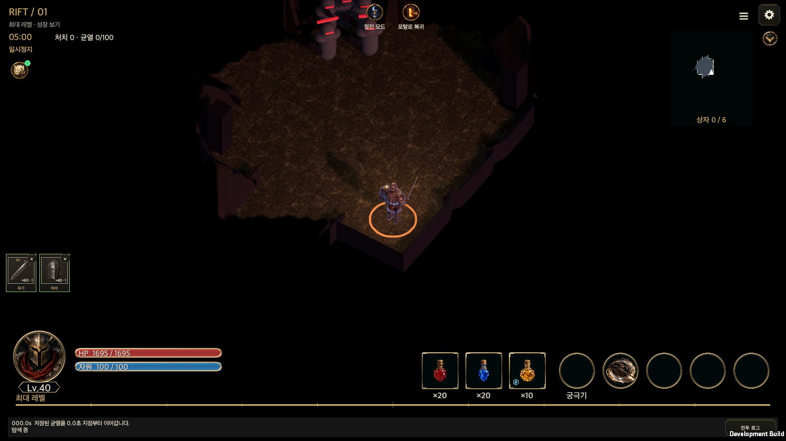

# Hunt Edict controls and Rift equipment recommendations

Updated: 2026-10-01 · [한국어](Hunt_Edict_Control_Refinement.md)

Outside taps close every Hunt Edict dialog and skill bubble exactly like X. The tap is consumed, without activating the screen behind it. Unapplied local selections and save confirmations are cancelled while the existing draft remains intact.

## Automatic equipment

- The master capsule toggle sits beside **Auto-equip recommended gear**. ON is green with the thumb on the right; OFF is gray with the thumb on the left.
- OFF dims and disables the common settings below the toggle and the per-position editors. Their values remain intact when ON is restored.
- Replaced equipment uses a compact anchored list for warehouse, salvage or sale. The warehouse-full shortcut appears only when warehouse storage is selected.
- Exclusions list ten physical positions with checkboxes, including both hands and both rings. Checked positions cannot be automatically filled, replaced or indirectly evicted by a two-handed or incompatible off-hand change. Manual equipment remains available.
- The old effect-preservation and equipment-score help controls are removed. Locks, sale/salvage protections and the score in shared item details remain.

`autoEquip.excludedSlots` is saved in global edict version 5. Versions 1–4 are validated before defaults are added. The deprecated preservation field remains known for canonical legacy save/share validation, but no longer controls automatic replacements.

## Equipment offers during Rift combat

The existing acquisition transaction checks whether an equippable new item increases the currently equipped configuration's score. Weapons use the shared whole-hand `EquipmentScore.Replacement` calculation. Auto-equipped, incompatible and lower-score drops do not enter the manual offer queue. Training and tutorial runs do not show these offers.

Small equipment tiles show one highest-item-score unseen candidate per equipment part. The existing `BattleHudTopOnPage` reservation keeps them above the persistent character/skill HUD and reflows them when the combat journal expands or collapses. All weapon/hand families share one group and both rings share another. Different parts appear together. Opening a tile uses shared details, read-only comparison, equip and close actions; equipped items stay left and the candidate right.

Successful equip or user close acknowledges the item and advances to the next unseen candidate. Acquisition eligibility is retained, so after equipping the highest score, the player can still inspect each already queued candidate once. Closing because of page cleanup or reflow does not acknowledge an offer.

`DropState.gearRecommended` records acquisition eligibility and `gearHandled` records acknowledgement. Existing `GameStore` transactions persist acquisition, equipment and acknowledgement atomically. Failed saves preserve the offer. A resumed Rift does not repeat acknowledged items; old saves default both new flags to false.

## Preset activation

The separate activation action is replaced by a single-choice box at the right of every tab. Exactly one active tab has a green check. Pressing a box opens and immediately saves that skill's policy. Pressing the tab body only browses its preview. Custom Settings follows the same rule. Unrelated pending allocation/global edits are not included in the policy save.

## Owners and verification

`HuntEdictWindow` owns shared modal and skill-bubble dismissal. Its Equipment and SkillPresets partials own the controls. `EquipmentRecommendation` owns exclusion decisions; `RiftGearRecommendations` and `GameStore` own the queue and persistence; `GameUI.GearRecommendations` owns combat tiles.

`RiftRecommendationWindow` uses the generated common content entry point and reuses `ContentWindowView`, `EquipmentSlotView`, `ItemDetailView`, `EquipmentComparisonView`, `UiTheme` and `UiFonts`. Display components do not directly mutate saves.

Final integrated validation is recorded below as one stage. Only default font size is tested; macOS synthetic pointers are separate from physical mobile verification.

### Validation on 2026-10-01

- [Evidence](HuntEdictControlsEvidence/validation.json): 261 related Edit Mode cases initially yielded 258 passes and three failures. Only the three failed cases were repaired and rerun; all 261 unique cases now pass. Shared UI ownership and its 11 validator tests also pass.
- The macOS development Player used actual EventSystem raycasts and pointer event dispatch. ON/OFF, the anchored list, per-tab selection, preview/save isolation and shared detail actions were checked at 440×956, 956×440, 1600×900, 1600×1000 and 2100×900 in Korean and English.
- After correcting the tile/HUD overlap, only the affected gear layout and queue coverage was rerun. All ten combinations retain the tiles above the HUD and inside the safe area with the journal expanded or collapsed. A fresh native process also confirmed saved exclusions, active preset, acknowledged items and the next pending offer.
- The existing full Edit Mode job completed 4,960 cases and was reused. Its 25 returned failures match the known ActionContinuity baseline; the failure list was capped and final pass/fail/skip totals were unavailable. This is not an overall pass, and the full suite was not rerun.
- Validation used an isolated save. No text-size matrix was run. Physical mobile devices remain untested.

