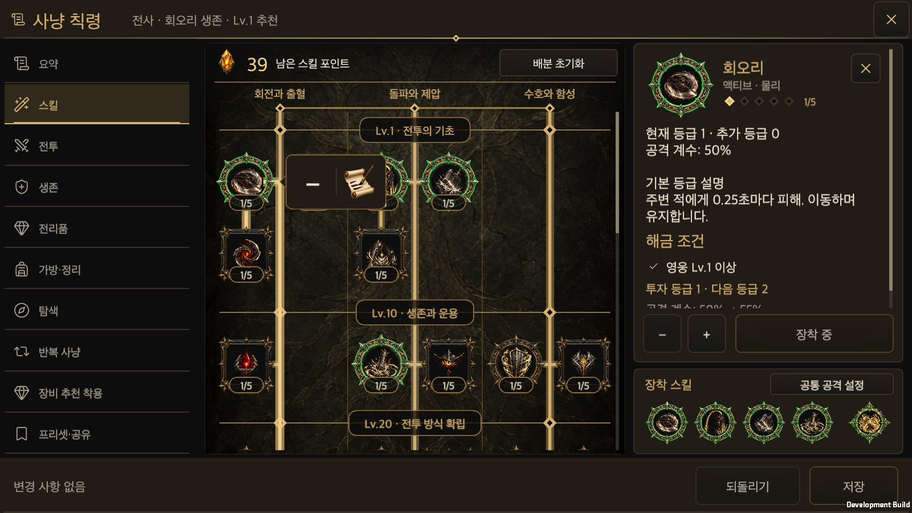
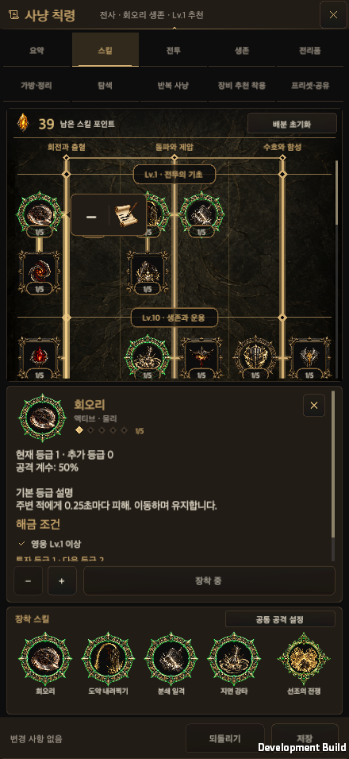

# 사냥 칙령 장착 스킬의 초록 인장

갱신일: 2026-10-01 · [English](Hunt_Edict_Equipped_Seals.en.md)

## 표시

장착한 일반 액티브와 궁극기는 기존 금속 인장의 형태를 따라 초록빛 가장자리가 있는 이미지로 표시합니다. 일반 액티브의 여덟 갈래 원형 인장과 궁극기의 네 갈래 문장을 각각 참조해 만들었습니다. 번호 배지와 코드로 그리던 장착 원은 제거했습니다.

트리, 장착 칸, 설명 머리글이 같은 인장 이미지와 배치를 사용합니다. 장착하면 초록 인장, 해제하면 기존 청동 인장으로 바뀝니다. 빈칸도 청동 인장입니다. 패시브는 등급 배분으로 상시 적용하는 기존 규칙을 유지하므로 장착 표시를 붙이지 않습니다. 선택한 미장착 스킬의 선택 표시는 유지하며, 장착 스킬에 겹치던 금색 배경 광채는 표시하지 않습니다.

인장 이미지는 기존 중앙 정렬 사각 영역 안에서 교체합니다. 아이콘의 위치, 크기, 인장 안쪽 폭, 누름 영역을 바꾸거나 별도 원을 겹쳐 그리지 않습니다. 스킬의 실제 등급은 기존처럼 아래에 표시합니다. 장착·해제는 편집본을 바꾸고 저장·되돌리기는 기존 거래를 사용합니다.

## 그림과 출처

내장 이미지 생성기의 참조 이미지 편집으로 제작했습니다. 원본 PNG를 가공하지 않고 그대로 복사해 생성된 알파를 보존했습니다. 코드로 테두리를 그리거나 배경을 제거하지 않았습니다.

| 그림 | 참조 | 원본 |
| --- | --- | --- |
| [초록 액티브 인장](../../Assets/HELLSCRIPT/Resources/Art/SkillTree/node-frame-active-equipped.png) | 기존 액티브 인장 | 1254×1254 RGBA |
| [초록 궁극기 인장](../../Assets/HELLSCRIPT/Resources/Art/SkillTree/node-frame-ultimate-equipped.png) | 기존 궁극기 인장 | 1254×1254 RGBA |

[생성 문구·해시·출처 기록](../Art/SkillTreeUi/equipped-frame-provenance.json)에 프롬프트 전체와 원본 참조를 남겼습니다. 호출 결과가 정확한 모델명을 제공하지 않아 `candidate_model_unknown`으로 기록하며, 특정 모델이나 최종 미술 승인을 주장하지 않습니다.

두 그림의 네 모서리와 중심은 알파 0이며, 완전히 투명한 픽셀은 각각 1,022,465개와 1,180,976개입니다. 안쪽에는 기존 인장처럼 눈에 보이지 않는 1/255 알파 잔여값이 일부 있습니다. 원본 알파를 그대로 보존했습니다.

`measure.py`로 안쪽 폭과 기존 배치 상수의 차이가 0.015 이하인지 확인합니다. Unity 임포터는 알파 입력·전체 사각 스프라이트·중앙 피벗·Clamp·Bilinear·mipmap 없음, 최대 512를 사용하며 기존 `ResourceTextureBudget`을 공유합니다.

## 검증

통합 코드 `e26da6b4`의 관련 소스와 리소스를 확인했습니다. [검증 기록](HuntEdictEquippedSealsEvidence/validation.json) · [리소스 Edit Mode 보고서](HuntEdictEquippedSealsEvidence/editmode.xml) · [macOS 입력 결과](HuntEdictEquippedSealsEvidence/menu-runtime.txt) · [새 프로세스 복원](HuntEdictEquippedSealsEvidence/menu-restart.txt).

- 공통 UI 계약 검사와 Python 검사 11개, 관련 리소스 Edit Mode 검사 3개가 통과했습니다. 실패·건너뜀 0입니다. 무관한 전체 전투 검사는 실행하지 않았습니다.
- Unity 6000.6.0f1 macOS 개발 빌드가 오류 0으로 완료됐습니다. 기본 글자 크기의 세로·가로·PC 다섯 화면과 한국어·영어를 한 번의 최종 조작 검증으로 확인했습니다. 글자 크기별 검사는 실행하지 않았습니다.
- 모든 트리 노드에서 장착 여부에 맞는 원형·궁극기·패시브 인장, 기존 아이콘과 같은 중심·배치 크기, 입력을 가로채지 않는 그림을 확인했습니다. 장착·교체·해제·되돌리기·저장 후 표시를 확인했으며 새 Player 프로세스에서도 상태가 복원됐습니다.
- 기본 세팅 On/Off, 구경 중 편집본·원본 불변, 안전 영역·회전도 같은 조작 묶음에서 확인했습니다. 전체 캡처는 39장입니다. 물리 모바일 기기와 OS 마우스 입력 검증으로 표시하지 않습니다.
- CoplayDev로 원본 Editor의 프로젝트·컴파일 완료와 두 그림의 임포트 설정을 다시 조회했습니다. C# 오류는 없으며 별도의 Unity AI `NoSubscription` 콜백 예외 5개는 이번 UI 실패로 합산하지 않습니다.

실제 게임 화면입니다. [전체 원본 캡처](HuntEdictEquippedSealsEvidence/native-captures.zip).

추가 화면: [가로 영어](HuntEdictEquippedSealsEvidence/tree-bubble-956x440-en.png) · [해제 후 기존 인장 복원](HuntEdictEquippedSealsEvidence/equipped-after-remove.png) · [새 프로세스](HuntEdictEquippedSealsEvidence/menu-restart.png).

2026-10-01: 일반 액티브 인장은 장착 칸에 따라 초록·파랑·호박색·보라로 표시하고 트리·장착 칸·설명 머리글·세부 칙령 레일이 같은 색을 사용합니다. 빈칸이 생겨도 뒤 칸의 색을 당기지 않습니다. [칸별 색과 검증](Hunt_Edict_Slot_Seals.md).
