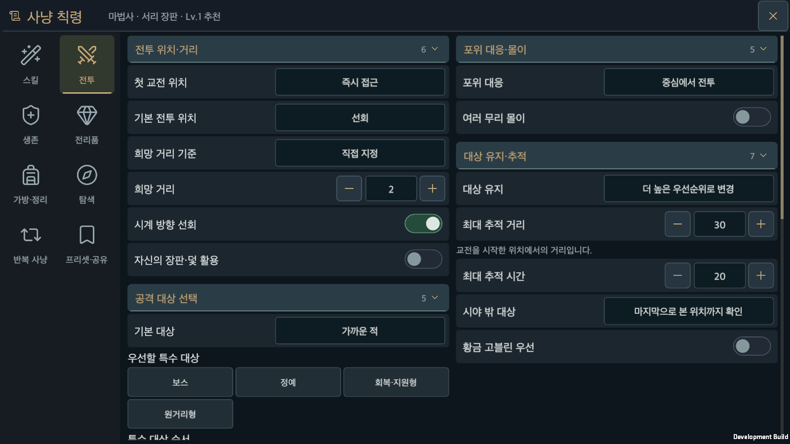
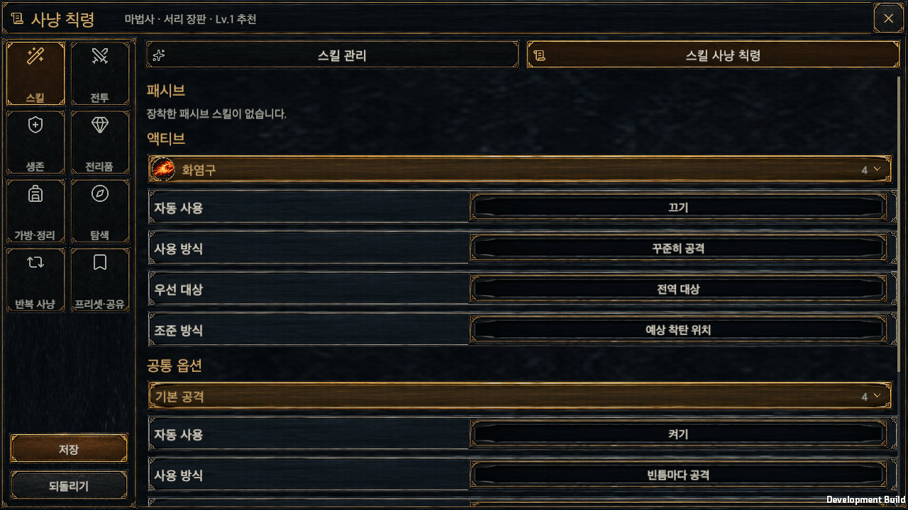
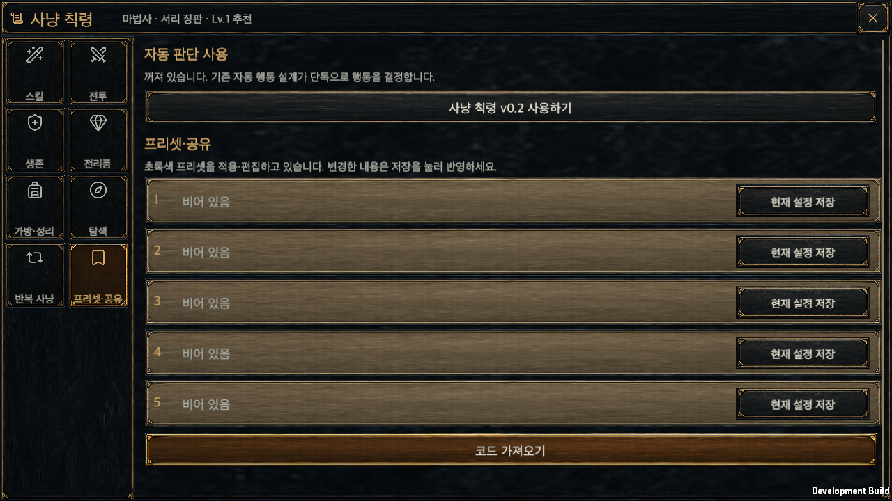

# HELLSCRIPT 사냥 칙령 게임 UI 구현

갱신일: 2026-09-20 · 작성일: 2026-09-15

## 목표와 상태

승인한 세로형·가로형 시안과 공통 리소스를 실제 Unity 게임에 구현한다. 화면 조작뿐 아니라 스킬 성장, 전투 판단, 프리셋 저장·공유, 황금 고블린 콘텐츠, 기존 저장 이관, 개발 빌드와 런타임 검증까지 포함한다.

상태: 아래 [구현 단계와 완료 조건](#구현-단계와-완료-조건)의 6단계를 모두 마쳤다. macOS 개발 빌드와 배치모드 Edit Mode 검사로 검증했고, 휴대폰·태블릿 실기기에서는 확인하지 않았다. 수행한 검증과 수행하지 않은 검증은 [검증](#검증)에 구분해 적었다.

브랜치는 `codex/hunt-edict-game-ui`이다. 기존 사용자 변경과 패키지 버전은 유지한다. 게임의 실제 화면 소유자는 `Hellscript.unity`에서 시작하는 `GameController → GameUI`이며, 기존 uGUI 런타임 화면 구성 방식을 확장한다.

## 확정한 화면과 기능

- 주 탭은 스킬, 전투, 생존, 전리품, 가방·정리, 탐색, 반복 사냥, 프리셋·공유의 8개다. 세로형은 4열×2행, 가로형은 왼쪽 2열×4행이며 모든 탭이 스크롤 없이 보인다.
- 기준 크기는 세로 430×840, 가로 844×390이다. 헤더 높이 34, 제목 16, 보조 글자 11을 기준으로 제목과 `직업 · 프리셋 이름`을 한 줄에 배치하고 오른쪽에 닫기 버튼을 둔다. 가로형 탭 영역은 논리 너비 128을 기준으로 한다.
- 스크롤 내용의 간격을 조밀하게 유지한다. 저장·되돌리기는 변경된 내용이 있을 때만 작은 버튼으로 고정하고, 넓은 하단 뒷판을 두지 않는다. 마지막 옵션은 버튼에 가려지지 않아야 한다.
- 가로형은 두 버튼을 왼쪽 탭 열 아래의 빈 자리에 놓고 저장을 위, 되돌리기를 아래로 두 줄로 쌓는다. 옵션 영역을 가리지 않으므로 가로형에서는 목록 아래 여백을 두지 않는다. 세로형은 기존의 오른쪽 아래 한 줄을 유지한다. 근거는 `HuntEdictSaveLayoutEvidence/`에 있다.
- 사냥 칙령과 장착 스킬은 항상 자동 사용한다. 사용 여부 토글은 제공하지 않는다. 스킬의 실제 사용 조건과 일반 방침 옵션은 유지한다.
- 스킬 탭에는 아이콘을 가진 `스킬 관리`, `스킬 사냥 칙령` 하위 탭이 있다. 상단에 남은 포인트와 초기화를 표시한다.
- 스킬 관리는 패시브 6종 다음 액티브 6종을 표시한다. 아이콘 하단에는 현재/최대 레벨, 아래에는 이름, 오른쪽에는 세로로 +/−를 표시한다. 최대 레벨이나 포인트 부족 시 +를 숨긴다. 최소 레벨에서는 −를 비활성화한다.
- 사용자의 추가 확정에 따라 모든 스킬 표시는 액티브 원형, 패시브 정사각형 테두리로 통일한다. 패시브 3칸을 액티브 4칸 위에 가운데 정렬한다. 전투 HUD, 스킬 버프, 상세창과 사냥 칙령에서 같은 표시 부품을 사용한다. 장착된 아이콘은 초록 테두리와 별도의 오른쪽 위 해제 버튼을 표시한다. 빈 장착 칸도 저장할 수 있다.
- 스킬 아이콘은 설명을 표시하고 빈칸에 장착한다. 장착 칸이 가득 차면 교체할 칸을 선택한다. 설명 위치는 고정하며 이름, 레벨, 소모 자원과 재사용 대기시간, 현재/다음 능력치를 표시한다.
- 스킬 사냥 칙령은 장착된 스킬의 옵션만 장착 순서대로 표시하고 공통 공격 순서를 제공한다. 숨긴 스킬의 옵션 값도 저장 원본에는 유지한다.
- 변경 상태에서 닫기·다른 탭을 선택하면 되돌리고 나가기 또는 저장하고 나가기를 선택한다. 경고창의 닫기는 편집을 계속한다.
- 순서 항목 5종인 공격 순서, 생존 순서, 특수 적 우선순위, 탐색 순서, 공통 행동 순서를 모두 드래그 카드로 바꾼다. 이동 미리보기·삽입 위치·가장자리 자동 스크롤·취소를 제공한다. 배경 드래그 스크롤과 버튼 조작이 충돌하지 않아야 한다.
- 하위 옵션을 여닫는 제목은 일반 옵션과 다른 색으로 표시한다. 터치 조작 영역은 기존 최소 48dp 규칙을 따른다.

## 화면 장식 정리 (2026-09-20)

배경, 카드, 버튼마다 겹쳐 있던 거친 질감과 금속 장식 테두리를 없애고, 사냥 칙령 창 전체를 어두운 단색 면과 얇은 구분선으로 정리했다. 글자 크기와 배치, 스크롤 영역, 저장·공유·스킬 편집 기능은 유지한다.

- 제목·탐색·설명·장착 영역은 명도 차이로 구분한다. 선택한 탭만 옅은 금색 밑줄을 쓰고, 일반 탭에는 테두리를 두지 않는다.
- 가로형 왼쪽 탭의 아이콘은 논리 크기 22에서 30으로 키운다. 아이콘과 이름 사이 간격은 2로 두고, 둘을 묶어 버튼의 가로·세로 중앙에 배치한다. 탭 버튼 크기와 2열×4행 배치는 유지한다.
- 스킬 카드와 레벨 표시는 단순한 배경으로 바꾼다. 기존 스킬 그림과 액티브 원형·패시브 정사각형 표기는 그대로 사용한다. 장착 해제 버튼에는 초록 바탕 위에 어두운 `−`를 표시한다.
- 펼칠 수 있는 옵션 제목은 청회색으로 구분하고, 선택한 값과 드래그 삽입 위치는 초록색으로 강조한다. 프리셋은 선택한 슬롯의 초록색과 나머지 저장 슬롯의 베이지색을 유지한다.
- 숫자 입력, 선택 버튼, 순서 카드, 공유 코드와 확인창에도 같은 스타일을 적용한다. 설정 스위치는 손잡이 위치와 색으로 켜짐·꺼짐을 함께 구분한다. 누름·비활성 상태는 밝기를 바꿔 표현한다.

화면 바탕은 `HuntEdictSurface`가 Unity UI 메시로 그린다. 크기에 따라 장식 이미지가 늘어나거나 테두리가 뭉개지지 않으며, 기존 `Image`의 마스킹·입력·버튼 색상 전환을 유지한다. 기존 `edict-ui-skins` 아틀라스와 정책 스위치 이미지는 삭제하지 않지만 이 창에서는 더 이상 사용하지 않는다. 스킬 그림과 탐색 아이콘은 기존 리소스를 계속 사용한다.

검증: 관련 Edit Mode 검사 35개가 모두 통과했고([결과](HuntEdictCleanUiEvidence/NavAlignment/editmode.xml)), macOS 개발 빌드와 사냥 칙령 런타임 스모크도 통과했다([빌드](HuntEdictCleanUiEvidence/NavAlignment/build.txt), [실행 기록](HuntEdictCleanUiEvidence/NavAlignment/runtime.txt)). 24개 화면을 캡처해 8개 탭, 설명·확인창, 세로·가로 배치, 영어와 150% 글자 크기를 확인했다. 저장·재조회·공유·순서 드래그 외에 각 화면 크기에서 8개 탭이 실제 포인터 적중 대상인지도 검사한다. 이번 변경에서는 전체 회귀 검사, Play Mode 검사, Android·iOS 빌드와 모바일 실기기 검증은 수행하지 않았다.

## 스킬 성장 기준

영웅 레벨 상승마다 공통 스킬 포인트 1개를 얻는다. 현재 총 포인트는 `영웅 레벨 − 1`이다. 기존 해금 조건을 유지하고, 배운 스킬은 무료 Lv.1에서 시작해 Lv.5까지 포인트를 1개씩 투자한다. 초기화는 레벨 배분만 되돌리며 장착과 칙령 옵션은 유지한다. 기존 캐릭터에게는 투자되지 않은 포인트를 제공한다.

현재 효과를 Lv.1 기준으로 유지한다. 피해와 일반 수치 효과는 추가 투자 레벨마다 기존 효과의 10%씩 증가시킨다. 후퇴 도약과 순간이동은 추가 투자 레벨마다 재사용 대기시간 5% 감소 및 이동거리 5% 증가를 적용한다. 패시브는 자신의 고유 효과를 강화한다. 관통 대상 수와 연쇄 번개 타격 수를 늘리는 패시브는 추가 투자 레벨마다 대상 수를 1씩 더한다. 그 밖의 패시브는 보너스 수치가 레벨마다 10% 증가한다. 조건·내부 대기시간은 유지한다.

룬의 추가 스킬 레벨과 강화는 별도 계산한다. 기존 룬의 상한과 효과를 유지하고, 투자한 스킬 레벨과 함께 실제 피해·예측·설명에 같은 계산을 사용한다. 이미 발사한 투사체와 생성한 효과는 당시 능력치를 유지한다.

### 전투 연결 (3단계 구현)

레벨이 바꾸는 모든 수치는 `Assets/HELLSCRIPT/Runtime/Core/SkillEffects.cs` 한 곳에서 계산한다. 전투, 예측, 스킬 설명이 같은 함수를 읽는다.

| 대상 | 계산 | 적용 지점 |
|---|---|---|
| 액티브 피해 | 스킬 파워에 레벨당 +10%p를 룬 파워와 **가산**한다 (`SkillEffects.Power`). | `CombatSimulation.CaptureDamage`가 스냅샷의 `runeSkillPower`에 더하고, `Hit`가 정의 ID(W01~M06)로 배율을 적용한다. 회오리 틱, 도약 착지, 분쇄, 강타, 관통, 다중, 덫 독, 화염구, 눈보라 틱, 연쇄, 서리 폭발이 모두 이 경로를 지난다. 전설·세트 추가 피해(SWB4, LW02 등)는 대상이 아니다. |
| 패시브 18종 | Lv.1 값 × `Magnitude(레벨)` (`SkillEffects.Passive`). 관통 대상(AP03)과 연쇄 타격(MP03)은 레벨당 +1 (`PierceTargets`, `ChainHits`). | `Damage.cs`(WP01·WP06·AP01·AP06), `CombatSimulation.cs Cost`(WP02·AP05), `Passives.cs`(WP04 처치 회복), `Field.cs`·`Incoming.cs`(WP03 피해 감소, AP02 이동속도), `Areas.cs`·`Effects.cs`(MP02 추가 둔화), `Projectiles.cs`(MP01 폭발 가산, AP04 속박 시간, AP03 관통 수), `Forecast.cs`(관통·연쇄 예측 수), `EdictRangerTrap.cs`(AP04 제압 추정), `Economy.cs HeroStats`(WP05·MP04 보호막 생성, MP05 자원 회복). |
| 후퇴 도약·순간이동 | 재사용 대기시간 × `EscapeCooldown`, 이동거리 × `EscapeDistance`. | `Actions.cs StartHeroAction`의 쿨타임, `CombatSimulation.SkillRange`를 읽는 `EdictTeleport.cs`, `EdictRangerMovement.cs`, `EdictResponse.cs`, 레거시 `Rules.cs MovementDestination`. |
| 철벽·원소 보호막 | 최대 HP 30%·35% × 배율. | `ResolveSkill` Shield 분기. |
| 전투 함성 | 자원 40 × 배율, 가산 피해 20% × 배율. 시전 시점의 배율을 `RunState.shoutBonus`에 저장한다. | `ResolveSkill` Shout 분기, `CaptureDamage`. |
| 사냥꾼의 표식 | 취약 피해 기준 25 × 배율 (레인저만). | `HeroStats.DeriveExtendedStats`. |
| 그림자 화살 | 추가 피해 25% × 배율. 시전 시점 값을 `RunState.shadowFraction`에 저장한다. | `ResolveSkill` Shadow 분기, `Damage.cs Hit`. |
| 설명 | `SkillProgressionInfo.Compare`가 위와 같은 함수로 현재/다음 값을 만든다. | 사냥 칙령 창의 스킬 상세 패널. |

레벨 이전에 저장된 균열이나 스냅샷은 레벨 배열이 없으므로 Lv.1로 읽는다(`SkillEffects.Rank`). 눈보라·덫·투사체는 생성 시점의 스냅샷을 그대로 사용하므로 전투 중 레벨을 바꿔도 이미 만든 효과의 수치는 변하지 않는다.

## 저장·공유 계약

`HuntEdictLoadout`은 기존 HED2 옵션 문서, 순서가 있는 패시브 3칸, 패시브 6종·액티브 6종의 투자 레벨 12개를 묶는다. HED2의 옵션 ID와 번호는 그대로 유지하고 새 화면에서 사용하는 실행 원본은 자동 사용을 켠 상태로 만든다. 예전 코드의 자동 사용 해제는 변환 내역에 표시한다.

`HuntEdictEditSession`은 저장된 상태와 편집 중 상태, 선택한 프리셋을 분리한다. `CommitHuntEdict`는 적용 가능 여부와 전투 상태를 미리 검사하고 계정 복사본을 파일에 저장한 후 실제 영웅과 전투에 반영한다. 저장 실패 시 편집안, 라이브 상태, 프리셋과 기존 파일을 보존한다.

프리셋은 캐릭터별 5개다. 선택한 슬롯은 초록색, 나머지 저장된 슬롯은 베이지색으로 표시한다. 저장 버튼은 실제 설정과 선택한 슬롯을 함께 갱신한다. 슬롯별 공유 코드는 해당 슬롯에 저장된 스킬 레벨·장착·옵션을 포함한다. 로컬 장비 참조, 계정 식별자와 원본 이력은 공유 코드에 넣지 않는다.

새 형식은 HED3이며 정규화 JSON, Base64URL, SHA-256 검증을 사용한다. HED1/HED2는 기존 해석기를 유지한다. 입력 크기·중첩·버전·누락·추가·중복·직업·범위·정규 표현을 검사한다.

코드 입력 → 확인·변환 내역 → 5개 슬롯 선택 → 필요한 경우 덮어쓰기 확인 순서로 가져온다. 가져오기는 저장만 하고 실제 설정을 즉시 적용하지 않는다. 현재 슬롯을 덮어쓰면 실제 설정은 유지하고 현재 슬롯 연결을 해제한다. 미해금 장착은 빈칸으로 표시하고 원본 코드를 보존한다. 포인트가 부족한 배분도 보관할 수 있지만 적용 전에는 직접 조정해야 한다.

계정 저장은 스키마 5에서 6으로 확장한다. 이전 파일은 이관 전 별도로 보관한다(`.schema<n>-before-hunt-edict.json`). 정확히 대응하지 않는 기존 행동 규칙과 프리셋은 전체 원본과 확인 필요 상태를 남기며, 검토 없이 없애지 않는다.

새 계정의 영웅은 통합 사냥 칙령으로 싸운다. 추천 레거시 빌드가 문서의 장착 칸을 채우고, 저장되는 빌드는 그 문서의 투영이다(`GameStore.NewAccount → HuntEdictStorage.InitializeNewHero`). 레거시 규칙 엔진은 기존 저장을 위해 남아 있으며, 이를 검사하는 Edit Mode 검사는 `ContentTestAccounts.Legacy`로 이전 방식의 영웅을 명시적으로 만든다. 칙령이 꺼진 영웅이 투영된 규칙을 만나면 `InspectRule`이 `EDICT_OFF`로 건너뛰고 예외를 던지지 않는다.

## 전투·콘텐츠 범위

전역 옵션은 기존 시안의 119개에 현재 게임의 물약 옵션 11개를 생존 탭에 포함한 130개다. 스킬 옵션은 3직업 합계 68개이며 자동 사용 토글 21개는 화면에서 제거한다.

### 전역 옵션 연결 현황 (5단계 구현)

이번 작업 전에는 저장만 되던 22개 옵션을 실제 판단에 연결했다. 나머지 108개는 기존 `EdictPolicyBridge`, `EdictLootPolicy`, `EdictTargetPolicy`, `EdictCleanupPolicy`, `RepeatHuntPolicy`, `PotionPolicy`, 생존·회피 실행기가 이미 읽는다. 새 옵션은 문서를 한 번 컴파일하는 `EdictFieldPolicy`가 담고, `CombatSimulation.EdictField.cs`가 판단한다.

| 옵션 | 실제 동작 |
|---|---|
| `position.engage` | 조용한 상태에서 적이 나타난 뒤 3초 또는 첫 피해까지의 교전 시작 구간에 적용한다. 즉시 접근은 기본 위치 방침, 제자리는 이동 없이 맞이, 거리 유지는 희망 거리보다 가까우면 물러남, 길목 유인은 현재 방의 진입 방향 반대로 물러난다. |
| `position.ownArea` | 대상이 자기 눈보라(마법사)·덫(레인저) 안에 있으면 자리를 지키고, 6m 안에 자기 영역이 있으면 영역이 대상과 자신 사이에 오도록 이동한다. |
| `position.surrounded` | 3m 안 3명 이상이 세 방향 이상을 막으면 포위로 본다. 외곽 이동은 생존 실행기의 보행 회피(`SURROUNDED_EDGE`), 회피기 이탈은 지정 회피기 우선(`SURROUNDED_ESCAPE`)으로 처리하므로 공격 중에도 회피 규칙과 같은 방식으로 끼어든다. 중심 전투는 변경 없음. |
| `position.gather`, `gatherCount`, `gatherTime` | 교전 시작 시 보이는 적이 목표 인원보다 적고 14m 안에 기억한 미확인 적이 있으면 몰이를 시작한다. 몰이 중에는 공격을 `GATHERING`으로 보류하고 기억한 위치로 걸어간다. 목표 인원 도달, 최대 시간, 체력 위기·시간 부족, 후보 소진 중 하나로 끝난다. 숨은 적의 현재 위치는 읽지 않는다. |
| `target.goblin`, `goblinDistance`, `goblinTime` | 켜면 보스전 밖에서 황금 고블린을 모든 일반 대상보다 먼저 고르고, 고블린 추적에는 일반 추적 한도 대신 고블린 거리·시간을 쓴다. |
| `bag.trigger`, `bag.freeSlots` | 정리 시작 조건이 `빈칸 n칸 이하`이면 가방이 차기 전에도 부족으로 본다. 귀환 정책은 미리 마을로, 무시 정책은 새 장비를 줍지 않는다. |
| `bag.replacementRank`, `bag.replacementFail` | 등급만 비교하면 동률에서 기존 장비를 유지한다(`Economy.AddItem rarityOnly`). 교체 실패 시 `마을 정리`이면 귀환한다. |
| `explore.order` | `ENEMIES`보다 앞선 전리품·상자·성소는 마지막 관측 위치 확인보다 먼저 목표가 된다. 상자와 성소가 같은 공통 순서 범주에서 준비되면 이 순서가 우열을 정한다. |
| `explore.bossUnlocked` | 보스 이동 즉시, 현재 회수 대상·상자 처리 후, 남은 방 탐색 후 중 하나로 보스 방 이동 시점을 정한다. |
| `explore.lowTime`, `lowTimeSeconds`, `lowTimeLoot` | 남은 시간이 기준 이하면 상자·성소 우회와 몰이를 멈추고, 지정 등급 외 전리품은 지나가며만 줍는다. |
| `explore.cursedHpPercent`, `cursedDefense` | 조건부 개봉은 HP 기준과 지정 생존기의 장착·해금·재사용 대기·자원을 함께 확인한다. 전투 후 개봉은 감지한 적이 없어야 한다. |
| `survival.dot`, `dotHpPercent` | 현재 콘텐츠에는 영웅에게 부착되는 지속 피해가 없다. 값은 보관하고 `HuntEdictV2Availability`가 `사용 불가`로 보고한다. 바닥 장판은 회피 규칙이 처리한다. |

스킬 옵션 68개는 `CombatSimulation.Edict*.cs`의 스킬별 계획 함수가 읽는다(직업별 기본 공격 3종 포함).

### 황금 고블린

황금 고블린은 5단계 이상 균열에서 10% 확률로 최대 1마리 등장한다. 시작·보스 구역을 제외한 도달 가능한 방 중심에 놓는다. 공격하지 않으며 8m 시야 내 영웅 또는 피격을 감지하면 도주한다. 20초 뒤 2초간 탈출 행동을 하고 사라지며, 기절·빙결은 이동과 탈출을 함께 멈추고 속박은 이동만 멈춘다. HP는 같은 단계 일반 근접 적의 3배, 이동속도는 초당 3.2m다. 처치 보상은 같은 단계 정예 기본 골드의 8배와 희귀 이상 장비 1개이며, 전설 확률은 기존 정예 확률을 사용한다. 별도 XP·게이지·룬·보석 보상을 중복 지급하지 않는다.

구현은 `CombatSimulation.Goblin.cs`와 `GoldenGoblinState`다. 등장 추첨과 보상 추첨은 배치 보상 시드에서 파생한 고블린 전용 난수 흐름을 쓰고, 등장·도주·탈출·보상 여부를 `RunState.goblin`에 저장한다. 재접속은 재추첨하지 않고 보상은 한 번만 지급한다. 전투·보상 난수 흐름은 소비하지 않으므로 기존 균열의 전투 재현은 변하지 않는다.

## 구현 단계와 완료 조건

| 단계 | 범위 | 상태 |
|---|---|---|
| 1 | 승인 공통 리소스 등록과 기존 스킬 이미지 재사용 | 완료. 공통 PNG 33개 등록, 24개 스킨 분할 확인, 액티브 18종·패시브 18종을 공통 표시 부품에 연결 |
| 2 | 편집 세션, 스킬 배분, 프리셋, 원자적 저장, 이관과 HED3 | 완료 |
| 3 | 모든 스킬 성장 효과, 룬·예측·실제 효과·설명 연결 | 완료. `SkillEffects` 단일 표, `SkillRankEffectTests` |
| 4 | 승인된 세로형·가로형 네이티브 UI와 모든 조작 | 완료. `RuntimeHuntEdictSmoke`가 8개 탭·드래그·대화상자·프리셋·회전·언어·글자 크기·균열 일시정지를 실행 |
| 5 | 모든 전투 방침과 황금 고블린, 반복·재개 연결 | 완료. `EdictFieldPolicy`, `CombatSimulation.EdictField.cs`, `CombatSimulation.Goblin.cs`, `EdictFieldPolicyTests`, `GoldenGoblinTests` |
| 6 | 전체 검사, 빌드·런타임, 문서·DB·공개 위키 | 완료. 아래 검증 참고 |

화면은 한국어·영어와 기존 글자 크기 설정을 검증한다. 세로 360×640/430×840/390×844, 가로 640×360/844×390, PC 1280×720/1920×1080에서 전체 탭 표시와 내용 접근을 확인한다.

## 검증

### 수행한 검증

| 항목 | 방법 | 결과 |
|---|---|---|
| Edit Mode 전체 회귀 | 배치모드 `-runTests -testPlatform EditMode` (작업 트리의 APFS 복제본) | 아래 표 참고 |
| 새 검사 | `SkillRankEffectTests` 10개, `EdictFieldPolicyTests` 13개, `GoldenGoblinTests` 5개 | 28개 모두 통과 |
| macOS 개발 빌드 | `-executeMethod Hellscript.Editor.ProjectBuilder.BuildMac` | `Build Finished, Result: Success.` · 컴파일 오류 0 |
| 런타임 스모크 | 개발 빌드에 `-hellscriptHuntEdictSmoke` | `HELLSCRIPT_HUNT_EDICT_SMOKE_OK` · 캡처 24장 |
| 문구 | 한국어 원문과 영어 표의 1:1 대응 검사 | 미번역 0, 남은 항목 0 |

스모크가 실제로 실행한 내용은 `HuntEdictGameUiEvidence/runtime.txt`에 남겼다. 요약하면 다음과 같다.

- 콘텐츠 독에서 창을 열고, 스킬 레벨을 올리고, 빈칸 장착·가득 찬 칸 교체·패시브 장착을 거쳐 저장한 뒤 저장 파일을 다시 열어 레벨·장착·패시브가 남아 있는지 확인한다.
- 스킬 사냥 칙령 페이지에서 장착한 스킬의 옵션만 나오는지 확인하고, 공통 공격 순서 카드를 실제 드래그 핸들러로 끌어 순서를 바꾼 뒤 되돌리기로 복구한다.
- 전투·생존·전리품·가방·정리·탐색·반복 사냥 6개 탭의 모든 그룹이 있는지 확인하고, 선택 대화상자·토글·숫자 증감으로 편집한 뒤 저장한다.
- 변경 상태에서 닫기를 누르면 저장 여부를 묻고, 되돌리고 나가기가 실제로 창을 닫는다.
- 프리셋을 저장하고, HED3 공유 코드를 확인하고, 같은 코드를 2번 슬롯으로 가져오고, 1번 슬롯을 선택해 저장한다.
- 세로 430×840·390×844·360×640과 가로 844×390·640×360·1280×720·1920×1080에서 헤더 높이 34, 8개 탭의 겹침 없는 표시, 안전 영역 유지, 가로형 128 논리 너비 탭 열, 세로형 2행 탭을 확인한다.
- 영어 표시와 글자 크기 150%에서 같은 배치 검사를 통과한다.
- 균열 안에서 창을 열면 전투 시계가 멈추고, 그 상태에서 저장한 스킬 레벨이 진행 중인 시뮬레이션에 즉시 반영되며, 닫으면 같은 균열이 이어진다.

### 검사 결과

| 실행 | 전체 | 통과 | 실패 |
|---|---:|---:|---:|
| 작업 전 브랜치 끝(e9536a3) | 2,684 | 2,545 | 139 |
| 이번 작업 후 | 2,712 | 2,709 | 3 |
| 위 3개를 고친 뒤 | 2,712 | 2,712 | 0 |

작업 전 139개 실패는 f4306c1이 스스로 진행 중이라고 적어 둔 상태였다. 원인은 두 가지였다.

1. 새 계정의 영웅이 통합 사냥 칙령으로 싸우게 되면서, 레거시 규칙 엔진을 검사하던 기존 검사들이 다른 경로를 타게 됐다. 해당 검사는 `ContentTestAccounts.Legacy`로 이전 방식의 영웅을 명시적으로 만들도록 고쳤고, 설계상 바뀐 기대값(새 계정의 빌드가 칙령 문서의 투영이라는 점, 스키마 6의 이관 보관 파일이 하나 더 생긴다는 점)은 검사 쪽을 갱신했다.
2. 스킬 레벨이 아직 전투에 연결되지 않아 관련 검사가 실패했다. 3단계에서 연결했다.

전체 실행에서 남았던 3개 실패는 다음과 같이 처리했고, 고친 뒤 모두 통과한다.

- `ItemQualityTests.TheCombatDropOwnerUsesTheRiftStageAndCapsItems` 2개: 황금 고블린이 자기 난수 흐름으로 드롭하도록 `Drop`에 오버로드를 추가했더니, 이름으로 메서드를 찾는 검사가 모호해졌다. 오버로드 대신 `DropFrom`으로 이름을 나눠 해결했고 재실행에서 통과했다.
- `BuildIntegrationValidationTests.ArchetypeBalanceSimulationRunnerRunsAcrossAll6Archetypes`: 아래 항목으로 따로 적는다.

### 균형 감사 검사의 시간 초과

이 검사는 6개 추천 빌드를 2개 시드로 완주시키고 180초 제한을 건다. 메인(15363ce)에서 171초로 이미 제한의 95%였다. f4306c1 이후 236초로 늘었는데, 원인은 성능이 아니라 대상이 바뀐 것이었다. 새 계정의 영웅이 `useEdict=true`가 되면서 이 스윕이 이름에 적힌 추천 레거시 빌드가 아니라 사냥 칙령 판단으로 돌고 있었다. 스윕이 만드는 영웅을 명시적으로 레거시로 되돌렸다(`BuildIntegrationValidation.RunMultiSeedBalanceSimulation`). 측정 대상이 문서가 말하는 대상과 다시 일치하고, 소요 시간도 172초로 돌아와 통과한다. 다만 제한까지의 여유는 원래부터 8초뿐이므로, 같은 기기에서 다른 Unity 작업과 겹치면 다시 초과할 수 있다.

### 수행하지 않은 검증

- 휴대폰·태블릿 실기기에서 보지 않았다. 세로·가로 배치는 데스크톱 개발 빌드의 창 크기로만 확인했다.
- Play Mode 검사는 돌리지 않았다. 화면 조작은 런타임 스모크가 실제 버튼·드래그 핸들러로 대신 확인했다.
- 승인 HTML과의 논리 좌표 2px 비교는 하지 않았다. 헤더 높이 34, 가로형 탭 열 128, 8개 탭의 무겹침·안전 영역 유지 같은 수치 조건만 검사했다.
- 황금 고블린의 등장 확률은 120개 시드 표본으로 4~24회 범위를 확인했다. 정확한 10% 수렴은 표본을 늘려야 한다.

## 레거시 편집기를 쓰는 스모크의 진입 경로

`ShowEdictEditor`가 통합 창을 열도록 바뀌면서, 이전 편집기 화면을 조작하던 런타임 스모크 14개가 실행 첫 단계에서 멈췄다. 이 스모크들은 `스킬 설정` 탭을 눌러 스킬별 옵션으로 이동한다. 통합 창의 스킬 탭 이름은 `스킬`이고 옵션도 다른 구조로 그리기 때문에 버튼을 찾지 못했고, 실행은 `Sequence contains no matching element` 예외로 끝났다.

f4306c1은 기존 편집기와 공유 화면을 `ShowLegacyEdictEditor`, `ShowLegacyEdictShare`로 남겨 참조가 끊어지지 않게 한다고 적었다. 끊어진 참조가 바로 이 경로였다. `ShowLegacyEdictEditor`를 공개로 바꾸고 해당 스모크들이 이 메서드로 직접 들어가게 했다. 레거시 화면 안의 연결도 레거시끼리 닫았다. 편집기의 `공유` 버튼과 공유 화면의 `항목 편집`, 그리고 언어를 바꿀 때의 다시 그리기가 통합 창으로 빠져나가고 있었다.

두 번째 원인도 함께 고쳤다. `HuntEdictStorage.InitializeNewHero`가 새 영웅의 `useEdict`를 켜 두기 때문에, 공유 화면의 전환 버튼은 `✓ 사냥 칙령 v0.2 사용 중`으로 그려진다. `사냥 칙령 v0.2 사용하기`를 바로 누르던 10곳은 켜져 있으면 먼저 끄고 다시 켜도록 바꿨다. 전환 버튼의 양방향을 모두 지나므로 이전보다 넓게 확인한다.

사용자가 여는 화면은 바꾸지 않았다. 마을 메뉴와 비교 화면의 버튼은 그대로 통합 창을 연다.

전체 Edit Mode [2,719개가 모두 통과](HuntEdictGameUiEvidence/LegacyEditorSmokes/editmode.xml)했고, 스모크 16개가 모든 단계에서 0으로 끝났다. [실행 요약](HuntEdictGameUiEvidence/LegacyEditorSmokes/runtime.txt)에 단계 순서와 각 스모크의 결과 문장을 남겼다. 재개 단계는 앞 단계가 남긴 검사점 파일을 읽으므로 순서대로 실행해야 하고, 새로 시작하는 단계는 저장 폴더를 따로 써야 한다.

### 대상 스모크와 언어 스모크

두 스모크는 뒤이어 따로 고쳤다. 원인이 서로 달랐고 편집기 진입과도 무관했다.

대상 스모크에서 실패한 것은 제품이 아니라 검사 배치였다. 진단용 빌드로 확인한 결과 전역 기준은 제대로 동작했다. 첫 선택에서 `SelectTarget id=120`으로 HP가 높은 적을 골랐다. 그 뒤 회오리 규칙이 대상을 다시 정하면서 가까운 적으로 바뀌었는데, 회오리는 2.5m 안의 적만 후보로 삼기 때문이다. HP가 높은 적을 2.8m에 두었으니 회오리가 닿지 않는 자리였고, 회오리는 자기가 때릴 수 있는 유일한 적을 고른 것이다. 새 계정의 영웅이 사냥 칙령의 컴파일된 규칙으로 싸우게 되면서 드러난 차이다. 검사가 쓰려던 `Utility(RuleAction.Basic)` 한 줄은 더 이상 실행 경로가 아니다. HP가 높은 적을 2m로 옮겨 두 적이 모두 회오리의 사거리 안에 들어오게 했다. 여전히 HP가 높은 쪽이 더 멀리 있으므로, 검사가 주장하는 "더 가까운 저HP 적 대신 고HP 적을 고른다"는 그대로 성립한다.

언어 스모크는 네 군데가 어긋나 있었다. 게임이 제목 화면으로 시작하고 마을이 성소 광장 뒤로 옮겨져서 마을 메뉴를 직접 열어야 한다. 설정 창에 탭이 생기고 조작 요소가 한국어 문구 대신 `settings-language-en` 같은 고정 ID를 갖게 되어, 언어 탭을 고른 뒤 ID로 찾아야 한다. 광장에 들어가는 것 자체가 계정을 기록하므로, "언어 선택이 계정을 바꾸지 않는다"를 확인하는 기준 시점은 마을 메뉴를 연 다음으로 옮겼다. 그리고 사냥 칙령으로 싸우는 영웅의 규칙은 조건 없이 항상 실행되므로, 조건 묶음 화면에 닿으려면 규칙 한 줄을 조건 검사로 바꿔야 한다.

이렇게 고치고 나니 스모크가 실제로 찾으려던 결함 하나를 잡았다. 균열 관리자 화면의 부제가 영어에서 26픽셀 칸에 33픽셀을 요구했다. 같은 뜻을 유지하면서 짧은 영어 문장으로 바꿨다. 다른 화면에는 잘린 문구가 없었다.

### 남은 두 스모크를 통합 창으로

`RuntimeEdictSmoke`와 `RuntimeTrainingEquipmentSmoke`는 마을과 비교 화면의 실제 버튼을 눌러 편집기에 들어간다. 그 버튼은 통합 창을 열어야 하므로 레거시 화면으로 되돌릴 수 없고, 두 스모크를 통합 창으로 옮겼다.

`RuntimeEdictSmoke`는 통합 창 자체의 스모크가 다루지 않는 계약을 맡는다. 창이 저장된 원본을 그대로 읽어 여는 것, 편집이 초안만 움직이고 저장된 영웅과 계정을 건드리지 않는 것, 저장이 파일과 영웅에 함께 닿고 새로 연 `GameStore`가 같은 값을 읽는 것, 변경이 남은 채 나가려 하면 묻고 되돌리기가 저장본을 복원하는 것, 손상된 프리셋 코드를 미리보기 대신 거절하는 것, 그리고 별도 프로세스가 이 모두를 다시 읽는 것이다. 여덟 탭과 드래그, 프리셋 공유처럼 `RuntimeHuntEdictSmoke`가 이미 확인하는 내용은 겹치지 않게 뺐다.

`RuntimeTrainingEquipmentSmoke`는 B 초안을 통합 창으로 편집한다. 종전에는 기본 공격의 `자동 사용`을 꺼서 B를 A와 구분했는데 통합 창에는 그 조작 수단이 없다. 대신 B의 장착 액티브를 모두 해제해 구분하고, 마지막 단정도 "A는 해당 스킬을 사용했고 B는 한 번도 사용하지 않았다"로 바꿨다.

옮기는 과정에서 비교 결과 화면의 결함 하나를 고쳤다. `실제 칙령 편집안으로 불러오기`가 통합 창을 연 다음 레거시 화면을 그 아래에 그리고 있었다. 두 화면이 동시에 떠서 어느 쪽도 조작할 수 없었다. 이제 기록된 원본을 창의 초안으로 넣는다.

### 빠져 있던 조작 두 가지를 통합 창에 넣기

스킬별 `자동 사용`과 사냥 칙령 사용 여부 전환은 저장 원본에는 남아 있었지만 통합 창에 조작 수단이 없었다. 둘 다 창에 넣었다.

`자동 사용`은 스킬 사냥 칙령 화면에서 각 스킬의 첫 줄이다. 옵션 목록이 1번을 건너뛰고 2번부터 그리고 있었는데, 그 이유를 적은 주석도 함께 있었다. 접힘 머리의 개수 표시도 하나 늘었다.

화면만 고쳐서는 값이 바뀌지 않았다. `HuntEdictLoadout.Canonical`이 모든 스킬의 1번 옵션을 `ON`으로 되돌리고 있었고, 주석에 "새 편집기에는 자동 사용 조작이 없으므로 투영은 항상 켠다"고 적혀 있었다. 초안이 값을 담을 수 없으니 화면에서 껐다가도 즉시 되살아났다. 이 줄을 지웠다. 저장·프리셋·공유 코드를 모두 지나도 값이 유지되는지 확인하는 Edit Mode 검사를 더했고, 그 줄을 되살리면 실패하는 것도 확인했다.

사용 여부 전환은 `프리셋·공유` 탭 맨 위의 `자동 판단 사용` 자리에 넣었다. 이 값은 초안이 아니라 영웅의 상태라서 저장을 기다리지 않고 바로 적용하며, 진행 중인 전투가 있으면 판단을 다시 읽는다. 훈련·비교 편집처럼 실제 캐릭터가 아닌 초안을 다루는 동안에는 프리셋과 같은 조건으로 비활성화한다. 문구는 레거시 화면이 쓰던 것을 그대로 써서 두 언어가 이미 갖춰져 있다.

조작이 돌아왔으므로 훈련 장비 스모크의 B 구분도 원래대로 되돌렸다. 액티브를 모두 해제하는 대신 기본 공격의 자동 사용을 끄고, 마지막 단정도 "A는 기본 공격을 사용했고 B는 한 번도 사용하지 않았다"로 되돌아갔다.

추가 증거: [빌드 기록](HuntEdictGameUiEvidence/LegacyEditorSmokes/build.txt), [A 훈련 화면](HuntEdictGameUiEvidence/LegacyEditorSmokes/comparison-a-battle.png).

기존 프리셋에 대한 영향도 적어 둔다. 종전에는 저장된 프리셋을 읽을 때마다 1번 옵션이 `ON`으로 덮였다. 이제 덮지 않으므로, HED2 시절 원본에서 꺼 둔 값을 담고 있던 프리셋은 그 값을 그대로 적용한다. 사용자가 고른 값을 되살리는 방향이지만 기존 프리셋의 동작이 달라질 수 있다.

### 비교 스모크

`-hellscriptComparisonSmoke`도 이어서 고쳤다. 어긋난 곳이 네 군데였다.

전투 제목 `TRAINING / A · Lv.1`은 `BattleHeading`이 만든 적이 없다. 이 함수는 첫 커밋부터 `TRAINING / A`를 만들고 레벨은 부제에 들어간다. 제목과 부제를 따로 읽도록 바꿨다. 기준 거리 7과 `7m → ...` 미리보기 문구도 실행 중인 값에서 읽도록 바꿔, 기본 빌드가 달라져도 검사의 뜻이 유지된다.

전투 화면에서 행동 편집으로 가는 길도 달라졌다. 이제 관찰 메뉴의 `행동 수정`을 거치며, 비교 중에는 그 입구가 고정 조건 화면으로 간다.

가장 큰 차이는 B 편집 화면이다. 사냥 칙령을 쓰는 영웅에게는 칙령 변형이 나오므로 거리 조절 막대가 없다. 이 스모크는 행동 빌드 비교와 그 막대를 다루므로 영웅을 명시적으로 이전 방식의 규칙 엔진에 둔다. 칙령 쪽 비교 경로는 훈련 장비 스모크가 맡는다. Edit Mode 검사가 `ContentTestAccounts.Legacy`로 같은 구분을 하는 것과 같은 방식이다.

마지막으로 영웅의 첫 물약 지급은 첫 성소 방문에 일어나는데, 이 스모크의 흐름이 중간에 마을로 돌아가면서 그 시점이 측정 구간 안에 들어왔다. 진행도 기준선을 잡기 전에 성소를 한 번 방문하도록 해서, 이후의 차이는 실제 차이만 남게 했다.

## English

This work implements the approved portrait and landscape Hunt Edict mockups as native Unity uGUI, including all behavior, skill progression, save migration, preset sharing, golden goblin content, and development-build validation. All six stages below are complete on the macOS development build and the batch-mode Edit Mode suite; no phone or tablet was used. Performed and skipped verification is listed in [Verification](#verification).

Eight main tabs remain visible without scrolling: Skills, Combat, Survival, Loot, Bag & Cleanup, Exploration, Repeat Hunt, and Presets & Sharing. Portrait uses a 4×2 navigation grid; landscape uses a narrow 2×4 left grid. The approved 430×840 and 844×390 layouts define geometry. The 34-unit header has a single-line title and subtitle with a close button. Small floating Undo and Save buttons appear only when dirty. Background dragging scrolls; every ordering control uses draggable cards with insertion feedback, edge scrolling and cancellation. Expandable group headers have distinct colors.

Skills has Management and Hunt Edict subtabs. Management shows six passives above six actives, compact painted icons, current/max rank badges, vertical +/− controls, points and reset. Active skills use circular frames and passive skills square frames; three passive slots sit above four active slots, and HUD slots, skill buffs, inspection and the edict share one icon component. Equipped skills have green borders and independent unequip controls. Details stay at a fixed location and show actual costs and current/next effects. Empty slots can be saved. The edict subtab shows only equipped skills in slot order while preserving hidden settings. Closing or changing tabs while dirty requires saving or discarding. Hunt Edict and equipped skills are always automatic; use toggles are absent.

### Reduced decoration (2026-09-20)

The Hunt Edict window now uses quiet dark fills and thin dividers instead of repeating textured metal frames on panels, cards and buttons. Typography, geometry, scroll regions and editing behavior stay the same. The header, navigation, inspector and equipment dock are separated by tone; only the current tab receives a muted gold underline. Expandable groups have blue-gray headers. Green marks equipped skills, selected values, drag insertion and the current preset; other stored presets retain a muted beige fill.

The landscape navigation icons are enlarged from 22 to 30 logical units. Each icon and label form a centered stack with a two-unit gap, while the button bounds and 2-by-4 navigation grid stay the same.

Skill cards and rank badges have plain backgrounds, while existing skill art and the active-circle/passive-square convention remain. The green unequip badge has a dark minus for contrast. Number inputs, choice controls, ordering cards, share-code dialogs and confirmations share the same treatment, with brightness feedback for pressed and disabled controls. Policy switches show their state through both color and thumb position.

`HuntEdictSurface` draws these surfaces as native Unity UI geometry and preserves the `Image` masking, input and button-tint paths. The original `edict-ui-skins` atlas and policy-switch images are retained but are no longer used in this window. Skill paintings and navigation glyphs are reused.

Verification: [35 of 35 focused Edit Mode cases passed](HuntEdictCleanUiEvidence/NavAlignment/editmode.xml), followed by a successful [macOS development build](HuntEdictCleanUiEvidence/NavAlignment/build.txt) and [Hunt Edict runtime smoke](HuntEdictCleanUiEvidence/NavAlignment/runtime.txt). The 24 captures cover all eight tabs, details and dialogs, portrait and landscape, English and 150% text. The smoke checks save/reload, sharing and drag order, plus actual event-system pointer hits for all eight navigation tabs at every checked frame size. This visual change did not run the full regression suite, Play Mode tests, Android/iOS builds or physical-device validation.

### Skill progression in combat (stage 3)

Each hero level awards one shared skill point; the budget is hero level minus one. Learned skills start at rank one and reach rank five. Every number a rank changes lives in `SkillEffects`, read alike by combat, forecasts and the skill details:

- Active damage adds ten percentage points of skill power per invested rank, **added to** rune power in the damage snapshot, so whirlwind ticks, leap landings, crush, slam, pierce, multishot, trap poison, fireball, blizzard ticks, chain and nova all scale through `Hit`. Legendary and set extras do not.
- The eighteen passives multiply their rank-one value by the rank magnitude; the pierce-target and chain-hit passives add one target per rank in both the forecast and the release.
- Retreat and Teleport trade five percent cooldown for five percent distance per rank, in the action cooldown and in every landing-distance read (`SkillRange`).
- Iron Wall and Elemental Shield, Battle Shout (resource and bonus, stored at cast time), Hunter's Mark (vulnerable baseline, ranger only) and Shadow Arrow (extra damage fraction, stored at cast time) use their own rank.
- `SkillProgressionInfo.Compare` builds the current/next rows from the same functions. Snapshots and runs saved before ranks existed read as rank one, and blizzards, traps and projectiles keep the snapshot they were created with.

### Save and sharing contract

`HuntEdictLoadout` combines the versioned HED2 option source, three ordered passive slots and twelve ranks. Existing HED2 option IDs and ordinals stay stable. `HuntEdictEditSession` separates saved and draft state. `CommitHuntEdict` preflights a copied battle/account, writes the staged save, then adopts it. Failure preserves live state, slots, the original file and the draft. Five full presets are stored per hero. Save also updates the selected green slot. Per-slot HED3 codes include ranks, equipment and options but exclude account identifiers, local gear references and history. HED1/HED2 remain readable with explicit conversion review. Size, depth, version, duplicates, extra/missing fields, class, ranges and canonical encoding are validated.

Import confirms a code, displays the five destinations and requests overwrite consent for occupied slots. It stores without applying. Replacing the current slot detaches the current-slot link while preserving live settings. Locked equipment is blanked with a change report; the original code is retained. Over-budget allocations can be stored and refunded incrementally, but cannot be applied until valid. Account schema 6 archives the prior schema before writing. Lossy legacy rules remain preserved and require review.

A new account's heroes fight through the unified edict: the recommended legacy build seeds the document's slots and the stored build is that document's projection. The legacy rule engine remains for existing saves; the Edit Mode tests that exercise it build a pre-edict hero explicitly through `ContentTestAccounts.Legacy`, and a compiled edict rule met while the edict is off reads `EDICT_OFF` instead of throwing.

### Global options connected in stage 5

Twenty-two options that had only been stored now drive decisions through `EdictFieldPolicy` and `CombatSimulation.EdictField.cs`; the other 108 were already read by the policy bridge, loot, target, cleanup, repeat, potion and survival compilers.

- `position.engage`: during the opening of an engagement (enemies appearing after a quiet spell, until three seconds or the first damage) the hero approaches, holds position, keeps distance or lures back toward the room entrance.
- `position.ownArea`: holds while the target stands in the hero's own blizzard or trap, and otherwise moves so a nearby own area lies between hero and target.
- `position.surrounded`: three or more enemies within three metres across three quadrants count as a surround; moving to the edge walks through the survival executor (`SURROUNDED_EDGE`), escaping asks for the escape skill first (`SURROUNDED_ESCAPE`), so both can interrupt an attack the way a dodge does.
- `position.gather`, `gatherCount`, `gatherTime`: when fewer enemies are in view than the target count and remembered unseen enemies lie within fourteen metres, the hero walks toward them and holds attacks (`GATHERING`) until the count, the time limit, an emergency, low time or the last candidate ends it. Hidden positions are never read.
- `target.goblin`, `goblinDistance`, `goblinTime`: the golden goblin outranks every ordinary target outside the boss fight and uses its own pursuit limits.
- `bag.trigger`, `bag.freeSlots`: the shortage can fire before the bag is full; portal cleanup leaves early and the ignore policy stops picking up equipment.
- `bag.replacementRank`, `bag.replacementFail`: grade-only comparison keeps the existing item on a tie; a failed replacement can portal to town.
- `explore.order`: discoveries listed before ENEMIES take the goal ahead of a last-seen investigation, and break the tie between ready chest and shrine rules.
- `explore.bossUnlocked`: head for the boss at once, after the pending pickup and chest, or after the remaining rooms.
- `explore.lowTime`, `lowTimeSeconds`, `lowTimeLoot`: with little time left chest and shrine detours and gathering stop, and only the listed grades still earn a loot detour.
- `explore.cursedHpPercent`, `cursedDefense`: the conditional cursed chest needs the HP floor and a named defense that is equipped, unlocked, off cooldown and affordable; the after-combat mode needs an empty field.
- `survival.dot`, `dotHpPercent`: the current content attaches no damage over time to the hero, so the values are stored and reported as unavailable by `HuntEdictV2Availability`; ground fields belong to the dodge rules.

The 68 skill options are read by the per-skill planners in `CombatSimulation.Edict*.cs`, including the three class basic attacks.

### Golden goblin

Golden goblins spawn at most once with ten percent probability from stage five, at a reachable room centre outside the start and boss areas. They never attack; they flee when the hero comes within eight metres of line of sight or when damaged, attempt a two-second escape after twenty seconds, and vanish without rewards. Stun and freeze pause both movement and the escape; root only stops movement. They have triple same-stage normal melee HP and move at 3.2 m/s. Killing one pays eight times the elite base gold and one rare-or-better item with the elite legendary odds; no experience, meter, rune or gem reward is added. The appearance and reward rolls come from a goblin-only stream derived from the layout's reward seed, and the lifecycle is stored in `RunState.goblin`, so reloading neither rerolls nor pays twice, and the shared combat and reward streams are untouched.

### Verification

Performed: the full batch-mode Edit Mode suite on an APFS clone of the working tree (2,712 tests, all passed); the 28 new cases in `SkillRankEffectTests`, `EdictFieldPolicyTests` and `GoldenGoblinTests`; a macOS development build (`Build Finished, Result: Success.`, zero compile errors); the `-hellscriptHuntEdictSmoke` runtime smoke on that build (`HELLSCRIPT_HUNT_EDICT_SMOKE_OK`, 24 captures in `HuntEdictGameUiEvidence/`); and the Korean-to-English string check with no untranslated or orphaned entries.

Before this work the branch tip failed 139 tests, which f4306c1 recorded as in-progress. Two causes: a new account's hero now fights through the unified edict, so tests written for the legacy rule engine took a different path and were moved onto an explicit pre-edict hero (`ContentTestAccounts.Legacy`); and skill ranks were stored but not yet read by combat, which stage 3 connected.

Two `ItemQualityTests` cases broke because the goblin's own reward stream needed a second `Drop` overload and the tests find that method by name; the overload was renamed `DropFrom`. The archetype balance sweep exceeded its 180-second timeout: it already ran at 171 seconds on main, and after f4306c1 it was measuring edict-driven behaviour instead of the recommended legacy builds named in its own report, because a new account now has `useEdict` on. The sweep's hero is explicitly reset to legacy, so it measures what it claims again and finishes in 172 seconds. Its margin was always eight seconds, so a concurrent Unity job on the same machine can still push it over.

Not performed: no phone or tablet was used, so portrait and landscape were only checked at desktop window sizes; Play Mode tests were not run, with the runtime smoke driving the real buttons and drag handlers instead; the approved HTML was not compared at two-logical-pixel tolerance, only the numeric frame conditions (34-unit header, 128-unit landscape tab column, eight non-overlapping tabs inside the safe area); and the golden goblin's appearance rate was sampled over 120 seeds (4–24 spawns), not converged to exactly ten percent.

### Smokes that drive the legacy editor

When `ShowEdictEditor` began opening the unified window, fourteen runtime smokes that drive the earlier editor page stopped at their first step. They click the `스킬 설정` tab to reach the per-skill options; the unified window names that tab `스킬` and draws the options differently, so the button was never found and the run ended in `Sequence contains no matching element`.

`f4306c1` recorded that the old editor and share pages stay compiled as `ShowLegacyEdictEditor` and `ShowLegacyEdictShare` so nothing referencing them breaks. This path was the reference that broke. `ShowLegacyEdictEditor` is now public and those smokes enter through it directly, and the legacy pages' own links stay within the legacy pair: the editor's `공유` button, the share page's `항목 편집` button and its redraw on a language change were all leaving for the unified window.

A second cause is fixed with it. `HuntEdictStorage.InitializeNewHero` leaves `useEdict` on for a new hero, so the share page draws `✓ 사냥 칙령 v0.2 사용 중`. The ten sites that pressed `사냥 칙령 v0.2 사용하기` directly now turn the switch off first when it is on, which also means both directions of the switch are exercised.

Nothing the player opens changed: the town menu and comparison buttons still open the unified window.

The full Edit Mode suite [passes 2,719 of 2,719](HuntEdictGameUiEvidence/LegacyEditorSmokes/editmode.xml) and sixteen smokes exit zero on every stage; the [run summary](HuntEdictGameUiEvidence/LegacyEditorSmokes/runtime.txt) lists the stage order and each smoke's result line. Resume stages read the checkpoint file their predecessor wrote, so they must run in order, and a stage that starts a new chain needs its own save directory.

#### Target and Language

Both were repaired in a second pass, for causes unrelated to the editor entry and to each other.

The target smoke failed on its fixture, not on the product. A diagnostic build showed the global basis working: the first selection was `SelectTarget id=120`, the high-HP enemy. The whirlwind rule then retargeted, because it only considers enemies within its 2.5m reach and the high-HP enemy sat at 2.8m, so it took the one enemy it could actually hit. The difference appeared once a new hero began fighting through the edict's compiled rules, which leaves the single `Utility(RuleAction.Basic)` rule the fixture wrote off the execution path. The high-HP enemy now sits at 2m so both are reachable and the basis decides between them; it is still the farther of the two, so the smoke's claim of choosing it over a nearer low-HP enemy stands.

The language smoke had drifted in four places. The game boots to the title screen and the town now sits behind the sanctuary plaza, so the town menu is opened explicitly. The settings dialog gained tabs and stable control ids such as `settings-language-en` in place of Korean labels, so the language tab is selected and the controls are found by id. Entering the plaza is gameplay and writes to the account, so the snapshot that proves a language choice leaves the account alone is taken after that navigation. And a hero fighting through the edict starts from rules that always run, so one row is switched to condition groups to reach the pickers.

With those fixed the smoke caught the defect it exists for: the rift keeper subtitle needed 33px in its 26px band in English. That translation was shortened while keeping its meaning. No other screen had a clipped label.

#### The last two smokes on the unified window

`RuntimeEdictSmoke` and `RuntimeTrainingEquipmentSmoke` reach the editor through shipped town and comparison buttons, which must open the unified window, so both were moved onto it.

`RuntimeEdictSmoke` now holds the contract the window's own smoke does not: the window opens on the saved document, editing moves only the draft and leaves the saved hero and account alone, a save reaches the file and the hero together and a freshly opened `GameStore` reads the same values, leaving with changes asks and reverting restores the saved document, a damaged preset code is refused rather than previewed, and a separate process reads all of it back. The eight tabs, dragging and preset sharing that `RuntimeHuntEdictSmoke` already covers were left out rather than duplicated.

`RuntimeTrainingEquipmentSmoke` edits the B draft through the window. It used to separate B from A by turning the basic attack's automatic use off, and the window has no such control, so B now unequips its actives instead and the closing assertion reads "A used the skill and B never did".

Moving it surfaced a defect in the comparison result screen, now fixed: `실제 칙령 편집안으로 불러오기` opened the window and then drew the legacy page underneath it, leaving both on screen and neither reachable. The recorded document is loaded as the window's draft instead.

#### The two missing controls

A skill's automatic use and the hunt edict on/off switch lived in the saved document with no control in the unified window. Both are now in it.

Automatic use is the first row under each skill on the hunt edict page. The option list started at the second option, with a comment explaining why; the disclosure count grew by one to match.

Drawing the row was not enough. `HuntEdictLoadout.Canonical` forced every skill's first option back to `ON`, its comment saying the new editor had no automatic-use control, so the draft could never hold the value and anything switched off came straight back. That line is gone, and an Edit Mode test pins the value through the loadout, a preset and a share code; restoring the line makes it fail.

The switch sits at the top of the presets tab under `자동 판단 사용`. It is hero state rather than a draft value, so it applies immediately instead of waiting for a save, and a running fight re-reads its decisions. While a draft belongs to a training or comparison hero rather than the real one it is disabled on the same condition as the presets. Its wording is the legacy screen's, so both languages already exist.

With the control back, the training equipment smoke returned to its original separation: B turns the basic attack's automatic use off instead of unequipping every active, and the closing assertion is again "A used the basic attack and B never did".

More evidence: [the build record](HuntEdictGameUiEvidence/LegacyEditorSmokes/build.txt), [the A training screen](HuntEdictGameUiEvidence/LegacyEditorSmokes/comparison-a-battle.png).

One effect on existing presets: a stored preset used to have its first option overwritten with `ON` every time it was read. It no longer is, so a preset carrying an off value from a HED2-era document now applies it. That restores a choice the player made, but it can change how an existing preset behaves.

#### The comparison smoke

`-hellscriptComparisonSmoke` followed, with four drifted expectations.

The battle title `TRAINING / A · Lv.1` was never produced: `BattleHeading` has composed `TRAINING / A` since the first commit and the level lives in the subtitle, so the header and the subtitle are read separately now. The baseline distance of 7 and the `7m → …` preview string are read from the run rather than assumed, so a different default build no longer breaks the check's meaning.

The battle screen also reaches the build editor through the observation menu's `행동 수정`, and during a comparison that entry goes to the fixed-conditions screen.

The largest difference is the B editor: a hero on the hunt edict gets the edict variant, which has no distance slider. This smoke covers the behaviour-build comparison and that slider, so its hero is put on the pre-edict rule engine explicitly, the same split the Edit Mode tests make through `ContentTestAccounts.Legacy`; the edict comparison path belongs to the training equipment smoke.

Finally the hero's one-time potion grant lands on the first sanctuary visit, which this flow triggers partway through, so the visit is made before the progression baseline is taken and a later difference is a real one.
