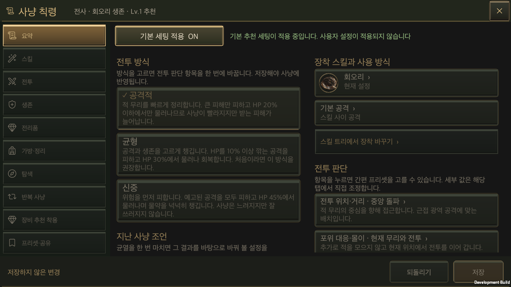
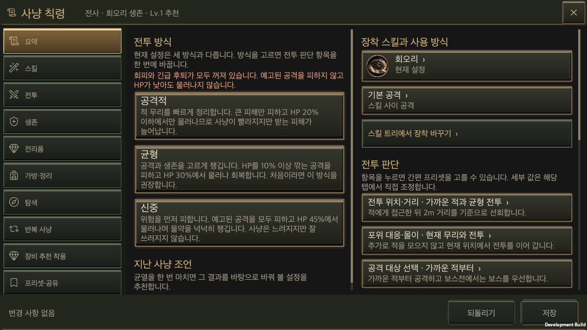
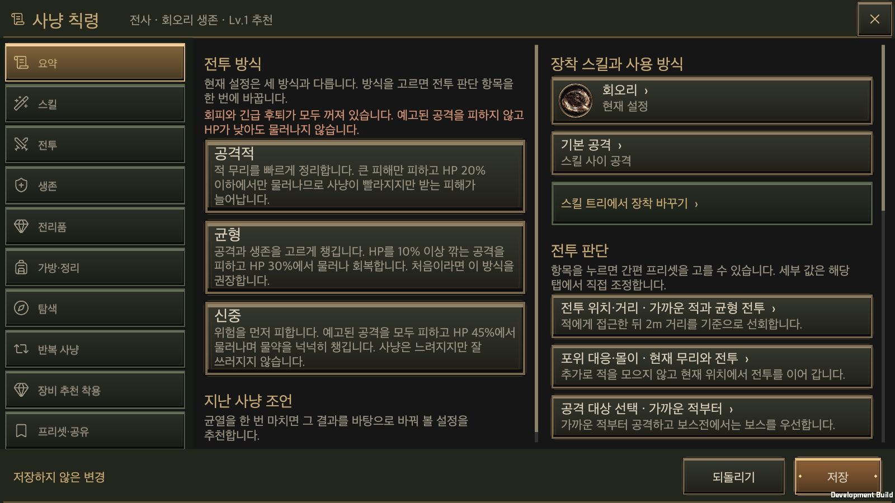
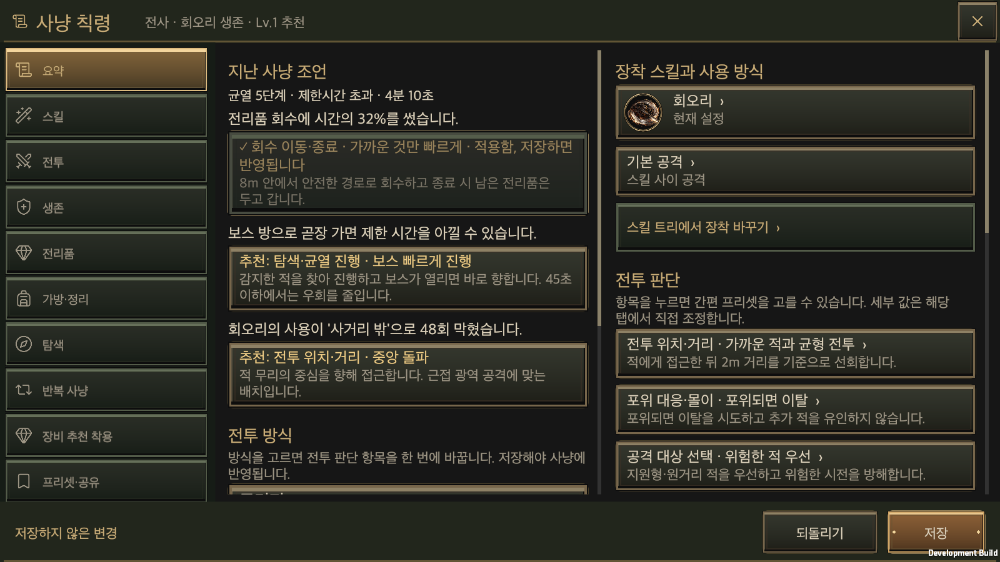
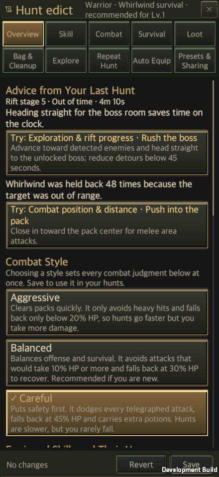

# 사냥 칙령 요약 화면 구현

작성일: 2026-09-28 · [English](Hunt_Edict_Overview.en.md)

## 2026-10-01: 전투 방식만 남긴 요약

요약 본문에는 **공격적·균형·신중** 버튼과 각 방식의 설명만 표시합니다. 장착 스킬·사용 방식, 전투 판단 묶음, 자동 관리 상태, 지난 사냥 조언·추가 경고를 제거했습니다. 각 설정은 원래 분류 탭에서 접근합니다. 넓은 화면은 세 카드를 나란히, 좁은 화면은 세로로 표시합니다.

상단의 **기본 세팅 적용 ON/OFF**와 기존 저장·되돌리기는 유지합니다. 추천 모드가 켜져 있을 때의 흐림·편집 잠금과 편집본 보존 규칙도 그대로 적용합니다. 전투 방식의 실제 설정 묶음과 설명은 기존 `HuntEdictQuickPresets.Styles`를 공유합니다.

[현재 동작과 검증](Hunt_Edict_Simple_Skill_Actions.md). 아래의 상세 목록·지난 사냥 조언과 과거 화면·글자 크기별 검증은 당시 구현 기록이며 현재 UI가 아닙니다. 이후에는 기본 글자 크기만 검사합니다.

[사냥 칙령 UX 재설계](../Design/Hunt_Edict_UX_Redesign.md)의 요약 탭·전투 방식·지난 사냥 조언을 실제 게임 창에 구현한 기록입니다. 설계 배경과 규칙은 설계 문서를 따르고, 이 문서에는 소유 코드, 동작, 성능 개선, 검증 결과를 적습니다.

## 기본 세팅 적용

2026-09-29 갱신: 프리셋·공유 페이지에 있던 ‘자동 판단 사용’ 영역을 요약 탭 상단으로 옮겼습니다. **기본 세팅 적용 ON/OFF** 버튼과 짧은 상태 문구만 표시합니다. 넓은 화면에서는 나란히, 좁은 화면에서는 위아래로 배치하며 본문 스크롤과 분리합니다.

- On: **기본 추천 세팅이 적용 중입니다. 사용자 설정이 적용되지 않습니다**
- Off: **사용자 설정이 적용되고 있습니다.**

이 버튼은 자동 사냥을 끄는 스위치가 아닙니다. `GameStore.SetRecommendedEdict`가 영웅의 `useRecommendedEdict`를 저장하고, 성공한 뒤 화면과 진행 중인 전투를 갱신합니다. 파일 쓰기에 실패하면 이전 상태를 유지합니다. 새 필드가 없는 기존 저장은 사용자 설정 모드를 유지합니다.

On일 때 `HuntEdictDefaults`는 기본 옵션과 신규 영웅의 균형 전투 방식으로 실행용 복사본을 만듭니다. 스킬 등급·장착은 유지하고, 사용 조건·공격 순서·전역 정책은 기본값을 적용합니다. 전투·전리품·탐색·반복 사냥은 같은 실행 문서를 읽으며, 성소 물약 보충과 추천 장비 착용도 같은 기본 정책을 사용합니다. 기본 추천 착용은 꺼져 있으므로 사용자 설정만 켜 둔 추천 착용은 이 모드에서 실행되지 않습니다.

Off로 바꾸면 보관된 사용자 정책을 다시 읽습니다. 사용자가 작성한 스킬 설정·프리셋·미저장 편집본을 덮어쓰지 않습니다. 모드는 영웅의 실행 설정이며 공유 코드에 포함하지 않습니다. 훈련·비교의 복사본에서는 실제 영웅의 모드를 변경할 수 없습니다.

### 기본 세팅 사용 중 편집 잠금

On일 때는 요약을 제외한 분류 탭, 요약의 모든 본문, 하단 저장·되돌리기를 흐리게 표시하고 조작을 막습니다. 본문의 스크롤과 남아 있던 스크롤 관성도 멈춥니다. 요약 탭과 **기본 세팅 적용** 버튼, 창의 닫기·뒤로가기는 유지합니다. 상태 문구는 흐려지지 않아 현재 사용 중인 설정을 읽을 수 있습니다.

기본 세팅을 Off로 바꾸면 분류·본문·스크롤이 다시 활성화되고, 저장·되돌리기는 기존 미저장 여부에 맞게 복원됩니다. 모드 전환으로 편집본을 저장하거나 버리지 않습니다. 닫을 때 미저장 내용이 있으면 기존 확인 창을 사용합니다. 기본 세팅 On 상태로 창을 다시 열거나 스킬·공유 화면으로 바로 진입해도 요약에 머물러 모드 버튼을 찾을 수 있습니다.

표시와 입력 잠금은 `HuntEdictWindow`가 기존 `CanvasGroup`·공통 `UiButton` 동작으로 처리합니다. 비활성 조작은 포인터와 키보드 실행을 거부하며, 기본 세팅의 저장·실행 정책은 앞서 구현한 거래를 그대로 사용합니다.

2026-09-29 macOS 개발 빌드에서 440×956·956×440·1600×900·1600×1000·2100×900, 한국어·영어, 글자 100%·150%의 20개 조합을 확인했습니다. 실제 uGUI 레이캐스트·포인터 조작과 키보드 실행 이벤트로 비활성 입력 차단, 본문 배치 유지, Off 후 복원, 미저장 편집본 보존을 검증했습니다. 별도 프로세스 재실행과 공유 화면 바로가기도 On 상태를 유지합니다. 모바일 실기기 검증은 하지 않았습니다. [조작 결과](HuntEdictDefaultLockEvidence/sections-runtime.txt) · [재실행 결과](HuntEdictDefaultLockEvidence/sections-restart.txt)

기본 정책·요약·스킬 프리셋·공통 UI·번역의 Edit Mode 검사 98개와 공통 UI 계약 검사 9개도 통과했습니다. [Edit Mode 결과](HuntEdictDefaultLockEvidence/editmode.xml)

- [Off: 편집 복원](HuntEdictDefaultLockEvidence/overview-custom.png) · [세로·영어 150%](HuntEdictDefaultLockEvidence/locked-440x956-en-150.png) · [가로·한국어 150%](HuntEdictDefaultLockEvidence/locked-956x440-ko-150.png)

원본: [기본 정책 해석](../../Assets/HELLSCRIPT/Runtime/Core/HuntEdictDefaults.cs), [저장 거래](../../Assets/HELLSCRIPT/Runtime/Core/GameStore.Edict.cs), [전투 적용](../../Assets/HELLSCRIPT/Runtime/Core/CombatSimulation.EdictDrive.cs).

## 소유 구조

| 영역 | 소유 코드 | 책임 |
|---|---|---|
| 탭 목록 | `HuntEdictUiCatalog.Tabs`, `AutomationTabs` | 요약 탭을 첫 번째로 추가하고, 자동 관리로 묶을 5개 탭을 정합니다. |
| 전투 방식 | `Resources/HuntEdictQuickPresets.json`의 `styles`, `HuntEdictQuickPresets.ApplyStyle`·`MatchStyle`·`StyleScopes` | 기존 간편 프리셋의 조합으로 방식을 정의하고 적용·판정합니다. 새 옵션 값이나 저장 필드를 만들지 않습니다. |
| 지난 사냥 조언 | `HuntEdictCoach`, `EdictCoachTip` | 해당 영웅의 최근 `RunRecord`를 읽어 조언을 만듭니다. 전투를 다시 계산하거나 영웅을 바꾸지 않습니다. |
| 화면 | `HuntEdictWindow.Overview.cs` | 기존 창의 스크롤·버튼·테마·스킬 아이콘과 간편 프리셋 선택 창을 재사용합니다. 편집본은 `HuntEdictEditSession`, 저장은 기존 `GameStore.CommitHuntEdict`가 담당합니다. |
| 진입 경로 | `GameUI.RiftVictory.cs`, `GameUI.Tutorials.cs`, `GameUI.ShowDefeatAnalysis`, `HuntEdictWindow.SelectSkillPage`·`OpenSkillPolicy` | 결과 화면과 예전 기록의 사망 원인 분석은 요약 탭을 열고, 튜토리얼은 안내 대상 탭을 엽니다. 스킬 하위 화면을 여는 호출은 스킬 탭으로 전환합니다. |

새 창이나 캔버스, 글꼴, 저장 형식은 만들지 않았습니다. 요약 탭은 기존 `HuntEdictWindow`의 탭 하나이며, 공통 UI 계약서의 사냥 칙령 항목에 규칙을 추가했습니다.

## 동작

- 창을 열면 요약 탭이 먼저 나옵니다. 세로 화면의 탭 10개는 5열×2행, 가로 화면은 왼쪽 1열입니다.
- 전투 방식 카드를 누르면 7개 묶음의 간편 프리셋을 차례로 적용한 편집본이 만들어집니다. 저장 전에는 영웅과 계정이 바뀌지 않습니다. 되돌리기는 마지막 저장본으로 돌아갑니다.
- 현재 값이 세 방식 중 어느 것과도 다르면 그 사실을 알립니다. 회피 3종과 체력 위기 후퇴가 모두 꺼져 있으면 경고 문구를 표시합니다. 새 영웅은 균형 방식으로 시작하므로(아래 참고), 이 경고는 예전에 만든 영웅이 기본값을 그대로 둔 경우에 나타납니다.
- 조언은 `review.heroId`가 해당 영웅인 가장 최근의 기록을 사용합니다. 사망·제한 시간 초과·스킬 대기 사유·여유 있는 정복을 판정하며, 저장된 칙령이 이미 따르는 조언은 제외합니다. 기준 수치는 `HuntEdictCoach`의 상수입니다.
- 조언을 적용하면 카드가 "적용함, 저장하면 반영됩니다" 상태로 바뀝니다. 저장하면 조언 목록에서 빠집니다.
- 판단 항목을 누르면 기존 간편 프리셋 선택 창이 열립니다. 그 창에서 직접 설정을 고르면 해당 탭의 묶음 상세로 이동하며, 값은 바뀌지 않습니다.

## 편집 성능 개선

첫 스모크 실행에서 요약 화면을 한 번 다시 그리는 데 평균 454ms가 걸렸습니다(macOS 개발 빌드, 1600×900). 원인은 요약 화면이 아니라 공통 정규화 경로에 있었습니다.

- `ClassSkillLoadout.ProjectEdict`와 `ClassSkillOptions.ProjectLegacy`는 옵션 하나를 쓸 때마다 `HuntEdictV2.WithOption`을 불러, 칙령 문서 전체를 매번 다시 정규화했습니다.
- `EdictOptions.Canonical`은 전역 옵션 151개를 서로 찾는 O(n²) 탐색을 했습니다.
- 간편 프리셋의 일치 판정은 프리셋을 실제로 적용한 복사본을 만든 뒤 비교했습니다.

다음과 같이 고쳤습니다. 결과 값은 바뀌지 않습니다.

- `HuntEdictV2.SetOption`을 추가했습니다. 두 투영 함수는 문서를 한 번만 정규화한 뒤 이 함수로 옵션을 씁니다. `WithOption`도 같은 함수를 사용합니다.
- `EdictOptions.Canonical`은 사전으로 값을 찾습니다. 누락·중복·알 수 없는 ID를 거부하는 조건은 같습니다.
- 전역 묶음의 일치 판정은 프리셋이 쓸 값을 적용 코드와 같은 함수(`GlobalValue`)로 계산해 현재 값과 비교합니다. 모든 호출자가 정규화된 편집본을 넘기므로 결과가 같으며, 이 동일성을 `GlobalMatchingAgreesWithApplyingTheRecipe`가 세 직업의 모든 전역 프리셋 조합에서 확인합니다.

| 측정(편집기 20회 평균, `MatchStyle`은 5회 평균) | 이전 | 이후 |
|---|---:|---:|
| 편집본 정규화 `HuntEdictLoadout.Canonical` | 12.8ms | 2.0ms |
| 전역 간편 프리셋 적용 | 26.6ms | 4.1ms |
| 스킬 간편 프리셋 적용 | 31.5ms | 5.4ms |
| 전투 방식 판정 `MatchStyle` | 188.6ms | 0.28ms |
| 요약 화면 다시 그리기(개발 빌드, 5회 평균) | 454.5ms | 40.1ms |

요약 화면 다시 그리기 시간은 다른 Unity 작업이 없을 때 측정한 값입니다. 이후 빌드에서도 같은 조건으로 42.7ms(`4c85f5e7`), 47.3ms(새 영웅 균형 기본값 반영)였습니다. 이 개선은 요약 화면뿐 아니라 기존 탭의 묶음 목록, 스킬 사용 설정, 저장 전 검증에도 적용됩니다. 모바일 기기에서의 시간은 측정하지 않았습니다.

## 기존 스모크 수정

- `RuntimeSkillTreeSmoke`: 창을 연 직후 스킬 트리를 검사하므로, 창을 연 뒤 스킬 탭을 선택하도록 고쳤습니다.
- `RuntimeRiftVictorySmoke`: 결과 화면의 **사냥 칙령 편집**이 요약 탭을 여는지 확인하도록 기대값을 바꿨습니다.
- `RuntimeEdictQuickPresetSmoke`: 새 계정이 필수 튜토리얼에 막히지 않도록 `mapComplete` 설정을 추가했습니다. 이 스모크가 처음으로 끝까지 진행되면서, 창고 공간 부족 묶음이 이전 작업(`bc71ab3f`)에서 간편 프리셋 선택기 대신 전용 조작으로 바뀐 사실이 드러났습니다. 이 묶음을 반복 검사 대상에서 제외했습니다. 해당 묶음의 프리셋 값은 편집 모드 검사가 계속 확인합니다.

## 새 영웅 기본값: 균형 방식

2026-09-28 사용자 결정에 따라, 새로 만드는 영웅은 균형 방식으로 시작합니다. `HuntEdictStorage.InitializeNewHero`가 새 영웅의 칙령 문서에 `HuntEdictQuickPresets.NewHeroStyle`(균형)을 적용합니다. 스킬 트리로 전환할 때는 이 문서를 그대로 복사하므로, 전환한 뒤에도 균형 방식이 유지됩니다.

- **바뀌는 값**: 긴급 대응은 체력 위기 후퇴(HP 30%에서 후퇴, 55%에서 복귀)와 치명적 피해 대응이 켜집니다. 피해 유형별 회피는 세 종류 모두 예상 HP 손실이 10% 이상일 때 피합니다. 특수 위험 회피는 기절·빙결과 겹치는 공격의 합산 피해 25%에 대응합니다. 교전 위치·포위 대응·공격 대상·자동 물약은 기존 기본값이 이미 균형 방식과 같습니다.
- **바꾸지 않은 것**: 옵션 정의의 기본값(`EdictOptions`)은 그대로입니다. 간편 프리셋 249개가 이 기본값을 기준으로 작성되어 있기 때문입니다. 이미 만든 영웅의 설정도 바꾸지 않았습니다. 예전에 만든 영웅이 기본값을 그대로 두었다면 요약 화면이 계속 경고합니다.
- **검사**: `ANewHeroStartsOnTheBalancedStyleBeforeAndAfterTheSkillTree`가 세 직업에서 새 영웅이 균형 방식으로 시작하고, 균형 방식의 묶음 밖 옵션은 기본값 그대로이며, 스킬 트리 전환 뒤에도 방식이 유지되는지 확인합니다. 새 영웅의 긴급 후퇴가 꺼져 있다고 가정하던 `EdictShareTests` 두 곳은 현재 값을 뒤집도록 고쳤습니다.

### 초반 밸런스 비교

`NaturalRiftProgressionAudit.RunEarlyClasses`로 새 계정의 자동 진행을 두 번 실행했습니다. 기준은 현재 `main`(`bfaf2ddc`)의 기존 기본값이고, 비교 대상은 균형 기본값입니다. 전사는 균열 10, 궁수와 마법사는 균열 5까지 진행했고, 직업마다 같은 시드 3개(20260924~20260926)를 사용했습니다. 여러 시드를 한 번에 실행하도록 측정 도구에 `-hellscriptNaturalSeeds` 선택 인자를 추가했으며, 인자를 주지 않으면 기존과 같이 동작합니다. 저장소의 원장 검증 도구(`tools/report_natural_rift_progression.py`)로 18개 경로를 모두 확인했습니다.

| 직업 | 시드 | 기준: 도전/사망/시간 초과 | 균형: 도전/사망/시간 초과 | 기준 균열 시간 | 균형 균열 시간 | 기준 물약 | 균형 물약 |
|---|---|---|---|---:|---:|---:|---:|
| 전사 R10 | 20260924 | 11/1/0 | 10/0/0 | 25:10.80 | 22:32.05 | 111 | 102 |
| 전사 R10 | 20260925 | 10/0/0 | 10/0/0 | 23:20.50 | 23:28.25 | 108 | 107 |
| 전사 R10 | 20260926 | 10/0/0 | 11/1/0 | 23:40.00 | 26:30.05 | 99 | 110 |
| 궁수 R5 | 20260924 | 5/0/0 | 5/0/0 | 8:40.45 | 8:45.50 | 32 | 30 |
| 궁수 R5 | 20260925 | 5/0/0 | 5/0/0 | 9:58.60 | 9:58.50 | 42 | 36 |
| 궁수 R5 | 20260926 | 5/0/0 | 5/0/0 | 9:46.35 | 9:21.60 | 37 | 36 |
| 마법사 R5 | 20260924 | 5/0/0 | 5/0/0 | 9:11.50 | 9:11.50 | 44 | 44 |
| 마법사 R5 | 20260925 | 5/0/0 | 5/0/0 | 10:04.00 | 9:38.55 | 47 | 42 |
| 마법사 R5 | 20260926 | 5/0/0 | 5/0/0 | 10:09.10 | 10:09.10 | 45 | 45 |
| 합계 | 9개 경로 | 61/1/0 | 61/1/0 | 130:01.30 | 129:35.10 | 565 | 552 |

- 합계로는 도전 61회, 사망 1회, 시간 초과 0회로 같았습니다. 균열 시간은 26초, 물약 사용은 13개 줄었습니다. 모든 경로의 최종 레벨도 같았습니다(전사 13, 궁수·마법사 8).
- 사망한 경로는 바뀌었습니다. 기준은 전사 첫 시드의 균열 7에서, 균형은 전사 세 번째 시드의 균열 6 보스(묘지의 집행자)에게서 쓰러졌습니다. 두 경우 모두 한 번의 큰 피해로 HP가 후퇴 기준(30%)을 한꺼번에 지나쳐 사망했습니다. 균형 방식도 순간적인 큰 피해까지 막지는 못합니다.
- 사망이 없는 경로에서 균열 시간 차이는 −25초에서 +8초 사이였습니다. 마법사의 두 경로는 결과가 완전히 같았는데, 이 경로에서는 후퇴나 회피 조건이 한 번도 발생하지 않았다는 뜻입니다.
- 이 표본에서 균형 기본값은 초반 진행 속도와 난이도를 거의 바꾸지 않았습니다. 9개 경로는 작은 표본이므로 사망률의 차이를 판단하기에는 부족합니다.

근거: [비교 표](HuntEdictOverviewEvidence/balanced-default/compare.txt) · [경로별 요약과 원장 검증](HuntEdictOverviewEvidence/balanced-default/audit-summary.json) · [사망 기록](HuntEdictOverviewEvidence/balanced-default/deaths.txt). 이전 측정 기록은 [균열 1~10 자연 성장 검증](../Design/HELLSCRIPT_Rift_1_10_Playtest.md)에 있습니다.

## 검증

검증은 최신 `main`(`672e4a0c`)에서 만든 작업 폴더를 APFS로 복제한 Unity 프로젝트에서 수행했습니다. 작업 중에 `main`이 두 번 바뀌어(`40e601c4`, `b418de72`) 매번 병합한 뒤 다시 검증했습니다. 새 영웅 기본값 변경은 병합된 `main`(`bfaf2ddc`)에서 이어서 진행하고 같은 검증을 다시 수행했습니다. 사용자가 열어 둔 Unity 편집기와 실제 계정 저장은 사용하지 않았습니다.

### 편집 모드 검사

- 새 검사 `HuntEdictOverviewTests` 19개가 통과했습니다. 전투 방식의 적용·판정·공유 코드 왕복·다른 옵션 보존, 설명문에 적힌 수치, 전역 판정과 실제 적용의 동일성, 조언 규칙(기록 없음·사망·시간 초과·사거리·자원·여유 있는 정복·저장 후 제외), 세 직업의 새 영웅 기본값을 확인합니다. 이 문서의 이전 판에는 17개로 적었으나, 새 영웅 검사 3개를 추가하기 전의 실제 수는 16개였습니다.
- 관련 검사 23개 클래스, 874개가 새 영웅 균형 기본값을 반영한 상태에서 모두 통과했습니다. 칙령·간편 프리셋·번역·튜토리얼·첫 플레이·공통 UI·스킬 트리·스킬 사용 방식·전투 기록과 새로 병합된 적 공격·경고 게이지 검사를 포함하며, 투영 함수를 바꾼 영향은 스킬 런타임·사용 방식 검사가 확인합니다. [결과 XML](HuntEdictOverviewEvidence/editmode-related.xml)
- 전체 검사는 병합 전 4,567개 중 4,520개, `40e601c4`를 병합한 뒤 4,594개 중 4,547개, 새 영웅 균형 기본값을 반영한 뒤 4,620개 중 4,573개가 통과했습니다. 세 번 모두 실패한 47개는 이 작업 전부터 실패하던 검사와 정확히 같으며, 새로 실패한 검사는 없습니다. 적 공격만 바꾼 `b418de72` 병합 뒤에는 전체 검사 대신 관련 검사로 확인했습니다. [전체 검사 요약](HuntEdictOverviewEvidence/editmode-full.txt)

### macOS 개발 빌드와 런타임 스모크

새 영웅 균형 기본값을 반영한 macOS 개발 빌드가 오류 없이 성공했습니다. 다른 Unity 작업 없이 실제 uGUI 레이캐스트와 포인터 누름·놓음·클릭으로 다음 스모크를 실행했습니다. [실행 요약](HuntEdictOverviewEvidence/smokes.txt)

| 스모크 | 결과 |
|---|---|
| `RuntimeEdictOverviewSmoke`(신규) | 통과. 새 영웅의 균형 방식 시작, 예전 기본값의 안전장치 경고, 전투 방식 적용·되돌리기·저장, 판단 프리셋, 직접 설정 이동, 스킬·트리·자동 관리 이동, 시간 초과 기록의 조언 3개 표시·적용·저장 후 제외를 확인했습니다. 5개 화면 크기×한국어·영어×글자 100%·150%의 20개 조합에서 탭 10개와 저장·되돌리기가 창 안에 있고 포인터가 닿으며, 글자가 잘리지 않는지 확인했습니다. 별도 프로세스에서 저장한 방식과 조언이 복원되는 것도 확인했습니다. [조작 결과](HuntEdictOverviewEvidence/runtime.txt) · [재실행 결과](HuntEdictOverviewEvidence/restart.txt) |
| `RuntimeSkillTreeSmoke` | 통과(첫 실행과 재실행). |
| `RuntimeEdictQuickPresetSmoke` | 통과(첫 실행과 재실행). |
| `RuntimeTutorialSmoke` | 통과(1단계와 재개). 새 영웅이 균형 방식으로 필수 튜토리얼 맵과 첫 균열을 끝까지 진행하며, 튜토리얼의 칙령 저장(F05)과 새 스킬 장착(F06) 경로를 포함합니다. 앞선 병합 상태에서 전체 검사와 동시에 실행한 한 번은 재개 단계가 첫 균열 도중 결과 기록 없이 종료되었습니다. 예외나 실패 기록은 남지 않았으며, 단독 재실행과 최신 병합 상태의 실행에서는 모두 통과했습니다. |
| `RuntimeRiftVictorySmoke` | 통과. 결과 화면의 칙령 편집이 요약 탭을 엽니다. |

### 화면

- [새 영웅: 균형 방식으로 시작](HuntEdictOverviewEvidence/overview-new-hero-1600x900-ko.png) · [공격적 방식 선택(저장 전)](HuntEdictOverviewEvidence/overview-aggressive-1600x900-ko.png) · [예전 기본값: 안전장치 경고](HuntEdictOverviewEvidence/overview-safety-warning-1600x900-ko.png) · [시간 초과 기록의 조언과 적용 상태](HuntEdictOverviewEvidence/overview-advice-1600x900-ko.png)
- 세로 440×956: [한국어 100%](HuntEdictOverviewEvidence/overview-440x956-ko-100.png) · [한국어 150%](HuntEdictOverviewEvidence/overview-440x956-ko-150.png) · [영어 150%](HuntEdictOverviewEvidence/overview-440x956-en-150.png)
- 가로 956×440: [한국어 100%](HuntEdictOverviewEvidence/overview-956x440-ko-100.png) · [한국어 150%](HuntEdictOverviewEvidence/overview-956x440-ko-150.png) · [영어 150%](HuntEdictOverviewEvidence/overview-956x440-en-150.png)
- PC: [16:9 1600×900](HuntEdictOverviewEvidence/overview-1600x900-ko-100.png) · [16:10 1600×1000](HuntEdictOverviewEvidence/overview-1600x1000-ko-100.png) · [21:9 2100×900](HuntEdictOverviewEvidence/overview-2100x900-ko-100.png)

### 검증하지 않은 것

- 휴대폰·태블릿 실기기에서 보지 않았습니다. 세로·가로 배치는 macOS 창 크기로만 확인했습니다. 모바일 기기의 다시 그리기 시간도 측정하지 않았습니다.
- Android·iOS 빌드는 만들지 않았습니다.
- 처음 시작한 플레이어가 실제로 더 빨리 이해하는지는 사람을 대상으로 검증하지 않았습니다.
- 조언의 기준 수치는 실제 플레이 기록으로 보정하지 않았습니다.

## 퍼즐 튜토리얼의 요약 탭 — 2026-10-08

퍼즐 튜토리얼 계정에서는 `요약` 탭이 전투 방식 카드가 열리는 레벨(L4)부터 보이고 그 전에는 `스킬 · 전투 · 생존`만 보인다. 대기실 하단 메뉴에서 스킬이 빠졌기 때문에 스킬은 이 창의 `스킬` 탭이 맡는다. 처음 열리는 탭은 그 레벨의 스킬을 아직 익히지 않았으면 `스킬`, 익혔으면 첫 규칙 탭이다. 일반 계정의 창은 그대로다. 자세한 내용은 [튜토리얼 대기실 후속 정리와 영웅별 튜토리얼](Tutorial_Hub_Followup_20261008.md)에 있다.
