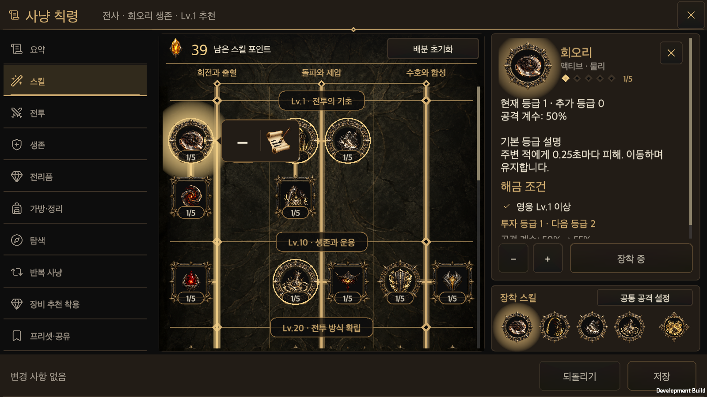
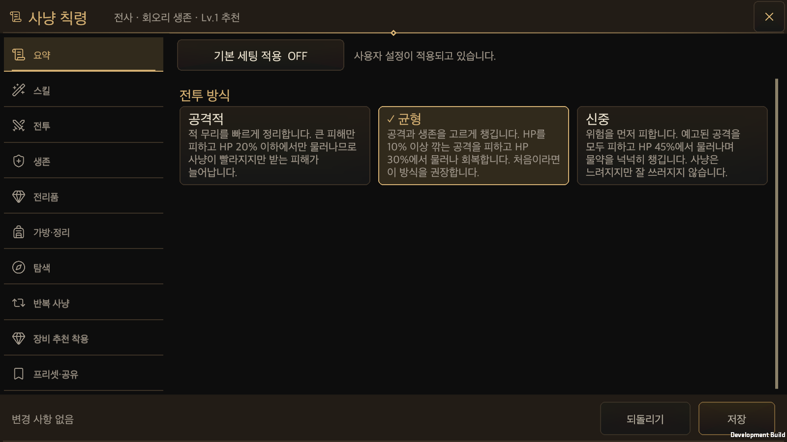

# Hunt Edict buttons and parchment editing art

Updated: 2026-10-01 · [한국어](Hunt_Edict_Polished_Actions.md)

## Layout

Hunt Edict uses matte dark buttons, one bronze or gold edge and small rounded corners. The double border, flanking diamonds and strong rising glow are removed. Tabs use a thin baseline and a restrained selected surface. Primary actions use a gold edge. The shared `UiButton` still owns normal, selected, hover, press, keyboard focus and disabled states.

The skill speech bubble places remove and edit side by side on one small surface with a thin separator. An unequipped skill shows only plus. At the default size the equipped bubble is 88×48 logical units and the unequipped bubble is 48×48. Existing hit areas, equipment and policy transactions remain the owners.

Overview retains the Aggressive, Balanced and Careful titles and descriptions. All three cards use the same option role; a gold edge and check mark identify the selection. The default-settings switch, save/revert actions and responsive layouts are retained.

## Generated artwork

The parchment and brush PNG was made with the **built-in image-generation tool**. The code-drawn `edict-edit` glyph is removed. The original PNG is copied unchanged and its native alpha is preserved.

- Runtime sprite: [`edict-edit-scroll-brush.png`](../../Assets/HELLSCRIPT/Resources/Art/HuntEdict/Actions/edict-edit-scroll-brush.png)
- Exact prompt, hash and provenance: [`action-icon-provenance.json`](../../Assets/HELLSCRIPT/Art/HuntEdict/action-icon-provenance.json)
- Source: 1254×1254 RGBA, 860,568 fully transparent pixels and alpha 0 at all four corners. No background removal, chroma key or SVG replacement is used.
- Unity imports input alpha, a full-rect sprite, Clamp, Bilinear and no mipmaps. Standalone/WebGL are capped at 256; Android at 128. The UI draws it at 32×32 logical units with raycasts disabled.

The callable tool returns no model name. No specific model or final art approval is claimed; provenance remains `candidate_model_unknown`. Runtime integration and art/model approval are separate facts.

## Shared components and ownership

`UiButtonChrome.Minimal` is an optional shared button appearance. Only Hunt Edict's button factory opts in. Other screens retain their existing default appearance. Colours and fonts remain in `UiTheme` and `UiFonts`; input states are not duplicated in the screen. Equipment, policy saves, defaults and the draft continue to use the existing models and transactions.

## Validation

Validated on 2026-10-01 against integrated code `f9d028c6`. Originals: [validation record](HuntEdictPolishedActionsEvidence/validation.json), [Edit Mode XML](HuntEdictPolishedActionsEvidence/editmode.xml), [native input record](HuntEdictPolishedActionsEvidence/menu-runtime.txt), and [fresh-process persistence record](HuntEdictPolishedActionsEvidence/menu-restart.txt).

- Shared UI contract check and 11 Python contract tests passed.
- `UiButtonTests` and `HuntEdictOverviewTests`: 38 passed, 0 failed, 0 skipped. No unrelated full combat suite was run.
- The macOS development build succeeded with 0 errors. One final combined native smoke was followed by a fresh-process persistence leg using the same isolated save. There are 38 PNG captures.
- Overview, bubbles, seal outlines and direct policy navigation were checked at 440×956, 956×440, 1600×900, 1600×1000 and 2100×900 in Korean and English at the default text size. Combat and preset-sharing button appearances were also captured in portrait and PC layouts.
- Real native Player raycasts and synthetic uGUI pointer events exercised plus, remove, edit, replacement, ultimate removal, outside/back dismissal, safe area/reflow, revert/save and defaults On/Off. Browsing preserved the draft and saved owner. This is not physical-mobile or OS mouse acceptance.
- The running primary Editor refreshed the integrated code and reported the artwork at the same GUID. No new compile errors were found. Five existing Unity AI `NoSubscription` exceptions remain and are not attributed to this UI.

These are native game screens. The [complete archive of 38 original captures](HuntEdictPolishedActionsEvidence/native-captures.zip) is preserved separately.

Additional screens: [portrait skills](HuntEdictPolishedActionsEvidence/tree-bubble-440x956-ko.png), [English landscape presets](HuntEdictPolishedActionsEvidence/policy-buttons-956x440-en.png), [combat](HuntEdictPolishedActionsEvidence/combat-buttons-1600x900.png), [preset sharing](HuntEdictPolishedActionsEvidence/preset-buttons-1600x900.png), [disabled controls with defaults On](HuntEdictPolishedActionsEvidence/overview-defaults-on.png).
