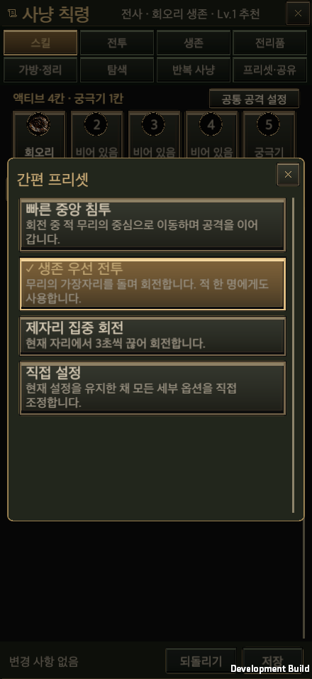
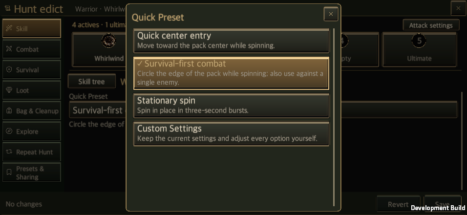
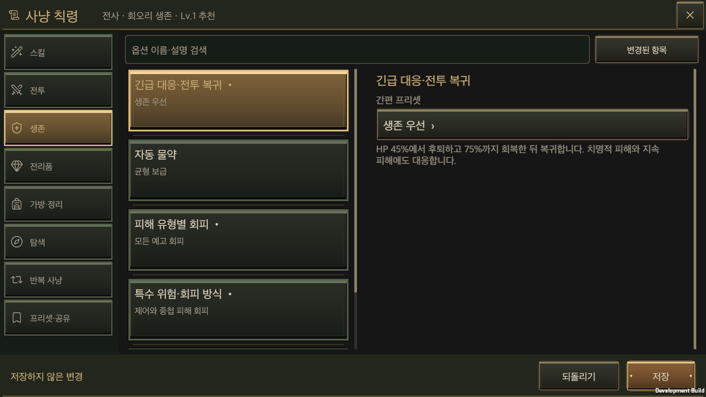

# 사냥 칙령 항목별 간편 프리셋

갱신일: 2026-09-24

설정 항목마다 목적이 분명한 프리셋을 제공하고, 선택 목록의 마지막에 **직접 설정**을 둡니다. 프리셋을 고르면 해당 항목의 편집본만 바뀌며, 기존 **저장** 버튼으로 확정합니다. 직접 설정은 현재 값을 유지하면서 모든 세부 옵션을 펼칩니다. 선택 창에서 각 프리셋의 설명을 먼저 확인할 수 있습니다.

## 적용 범위와 동작

- 전역 설정 25개 묶음의 기존 옵션 130개를 모두 포함합니다. 여기에 액티브·궁극기 54종, 직업별 기본 공격 3종, 공통 공격 순서 1종을 더해 세 직업 전체에 83개 항목, 249개 프리셋을 제공합니다.
- 화면에는 장착한 스킬만 표시합니다. 상시 적용되며 별도 칙령 옵션이 없는 패시브에는 불필요한 선택기를 만들지 않습니다.
- 프리셋은 자기 항목의 모든 값을 정하며, 별도 값이 지정되지 않은 필드는 옵션 정의의 기본값을 사용합니다. 다른 항목, 스킬 장착, 투자 포인트, 다른 스킬의 사용 방침은 유지합니다. 생존기 참조는 장착 중인 사용 가능 스킬로 채우며, 해당 스킬이 없으면 미지정 상태를 유지합니다.
- 직접 설정은 항상 마지막에 있습니다. 직접 설정을 고르는 것만으로 값이 바뀌거나 미저장 상태가 되지 않습니다. 기존 값이 어느 프리셋과도 일치하지 않으면 처음에는 현재 설정으로 표시하며 세부 옵션을 접어 둡니다. 목록에서 직접 설정을 선택해야 세부 옵션을 펼칩니다. 검색한 항목을 열 때는 직접 설정으로 펼쳐 검색 결과에 해당하는 옵션을 바로 찾을 수 있습니다.
- 창을 다시 열면 실제 값과 일치하는 프리셋을 표시합니다. 직접 설정의 화면 상태는 새 계정 필드로 저장하지 않습니다. 저장·되돌리기·5칸 프리셋·HED5 공유는 기존 소유 코드가 처리합니다. 프리셋 이름을 별도의 전투 규칙으로 저장하지 않습니다.
- 회오리의 **빠른 중앙 침투**는 스킬 전용 `CENTER` 이동을 사용합니다. 선택한 대상에서 5m 이내에 있는 관측된 적들의 중심과 가까운, 이동 가능한 빈자리로 이동합니다. **생존 우선 전투**는 기존 외곽 선회를 사용합니다. 두 방식 모두 위험 판정, 추적 제한, 이동 가능 여부를 확인하며 전역 위치 설정과 이동 속도를 바꾸지 않습니다.

## 구현 소유자

`HuntEdictQuickPresets`는 `Resources/HuntEdictQuickPresets.json`의 설정 세트를 읽습니다. 신규 스킬은 `Resources/Data/ClassSkills.json`의 한국어·영어 사용 방침을 재사용하며, 마나 충전은 사용 방침과 회복 목표를 함께 지정합니다. `HuntEdictWindow.QuickPresets`는 기존 공통 버튼·테마·선택 창·스크롤을 사용합니다. 편집본은 `HuntEdictEditSession`, 저장은 `GameStore.CommitHuntEdict`가 담당합니다. 저장 필드, 포인트 변경 경로, 재화 소비, 이미지 리소스, 창 프레임워크는 새로 만들지 않습니다.

원본: [프리셋 설정표](../../Assets/HELLSCRIPT/Resources/HuntEdictQuickPresets.json), [항목 범위와 적용 코드](../../Assets/HELLSCRIPT/Runtime/Core/HuntEdictQuickPresets.cs), [화면 어댑터](../../Assets/HELLSCRIPT/Runtime/Presentation/HuntEdictWindow.QuickPresets.cs), [회오리 이동 코드](../../Assets/HELLSCRIPT/Runtime/Core/CombatSimulation.EdictWhirlwindMovement.cs).

## 항목별 프리셋 목록

아래 모든 항목은 표에 적힌 프리셋 뒤에 직접 설정을 제공합니다.

| 항목 | 프리셋 |
| --- | --- |
| 전투 위치·거리 (6) | 가까운 적과 균형 전투 · 중앙 돌파 · 안전 거리 유지 |
| 포위 대응·몰이 (5) | 현재 무리와 전투 · 포위되면 이탈 · 세 마리씩 몰이 |
| 공격 대상 선택 (5) | 가까운 적부터 · 위험한 적 우선 · 밀집 무리 정리 |
| 대상 유지·추적 (7) | 일반 추적 · 짧게 추적 · 한 대상 마무리 |
| 행동 우선순위 (1) | 생존 후 전투 · 전투 후 회수 · 회수 먼저 정리 |
| 긴급 대응·전투 복귀 (6) | 생존 우선 · 균형 생존 · 위급할 때만 후퇴 |
| 자동 물약 (13) | 균형 보급 · 넉넉한 생존 보급 · 물약 절약 |
| 피해 유형별 회피 (6) | 모든 예고 회피 · 큰 피해 위주 회피 · 공격 유지 우선 |
| 특수 위험·회피 방식 (6) | 제어와 중첩 피해 회피 · 걷기 우선 회피 · 현재 공격 마무리 |
| 생존 수단·보존 (7) | 보행 후퇴 · 방어 후 이탈 · 이탈기 우선 |
| 등급별 장비 회수 (5) | 전투 후 모두 회수 · 희귀 이상 회수 · 전설·세트 집중 |
| 장비 필터·예외 (6) | 모든 장비 확인 · 내 직업 중심 · 무기 성장 집중 |
| 금화·재료 회수 (5) | 이동과 회수 균형 · 자원 우선 회수 · 가는 길에서만 |
| 회수 이동·종료 (3) | 전투 후 안전 회수 · 가까운 것만 빠르게 · 남김없이 회수 |
| 가방 공간 부족 (5) | 가득 차면 귀환 · 미리 공간 확보 · 가치 높은 장비로 교체 |
| 자동 정리 (7) | 모두 보관 · 일반·마법 장비 판매 · 일반·마법 장비 분해 |
| 장비 보호 (4) | 투자한 장비 보호 · 전설·세트까지 보호 · 기본 보호만 적용 |
| 정리 실패 대응 (2) | 보관 후 중단 · 정리 화면에서 대기 · 획득을 줄이고 계속 |
| 탐색·균열 진행 (6) | 오른쪽 벽 따라 탐색 · 보스 빠르게 진행 · 구석까지 탐색 |
| 일반·봉인 상자 (5) | 이동 경로에서 개봉 · 상자 우선 탐색 · 상자 우회 생략 |
| 저주 상자 (4) | 저주 상자 피하기 · 여유 있을 때 도전 · 전투 후 도전 |
| 성소 (4) | 발견한 성소 이용 · 필요할 때만 이용 · 성소 우회 생략 |
| 반복·다음 단계 (3) | 한 판씩 플레이 · 같은 단계 반복 · 성장 단계 도전 |
| 종료 조건·목표 (7) | 다섯 판 짧게 · 30분 사냥 · 시간·횟수 제한 없음 |
| 다음 판 준비 (2) | 일반 준비 · 가방 여유 확보 · 빠른 다음 판 |
| 회오리 | 빠른 중앙 침투 · 생존 우선 전투 · 제자리 집중 회전 |
| 도약 내려찍기 | 무리 중심 진입 · 생존 이탈용 보존 · 공격과 이탈 겸용 |
| 분쇄 일격 | 무리 한 번에 분쇄 · 정예 집중 타격 · 충전 연계 분쇄 |
| 지면 강타 | 무리 제어 · 위험 시전 차단 · 후퇴 지원 |
| 철벽 | 위험 미리 대비 · 방어 시간 늘리기 · 긴급 생존용 |
| 전투 함성 | 자원과 공격 보완 · 자원 보충 집중 · 보스 공격 준비 |
| 관통 사격 | 한 명도 빠르게 관통 · 두 명 이상 관통 · 정예 집중 관통 |
| 다중 사격 | 무리 정리 · 한 대상 집중 · 먼 거리 사격 |
| 맹독 덫 | 무리 중심 매복 · 덫 위치 갱신 · 추격 경로 차단 |
| 후퇴 도약 | 안전 거리 복구 · 자기 덫으로 유도 · 생존용 보존 |
| 사냥꾼의 표식 | 강한 적 표식 유지 · 대상마다 빠른 표식 · 체력 높은 적 공략 |
| 그림자 화살 | 평소 사격 강화 · 정예 관통 연계 · 독 전염 사격 |
| 화염구 | 꾸준히 발사 · 폭발 효율 우선 · 정예 집중 화력 |
| 눈보라 | 새 영역 확보 · 대상 위 눈보라 유지 · 접근 경로 차단 |
| 연쇄 번개 | 단독 적도 공격 · 연결 무리 집중 · 충전 낭비 줄이기 |
| 순간이동 | 생존용 보존 · 거리 조정 겸용 · 빈 공간으로 이탈 |
| 원소 보호막 | 위험 미리 대비 · 보호막 이어 쓰기 · 긴급 생존용 |
| 서리 폭발 | 제자리 빙결 · 무리로 접근 후 빙결 · 연쇄 충전 연계 |
| 도발의 낙인 | 기본 칙령 · 자원 50% 이하에서 · 공격 예고에 대응 |
| 꿰뚫는 갈고리 | 기본 칙령 · 가능하면 바로 사용 · 먼 적에게 사용 |
| 찢어낸 상처 | 기본 칙령 · 새 대상에게 분배 · 정예·보스에게 사용 |
| 피의 회수 | 기본 칙령 · 출혈 즉시 회수 · 출혈 종료·회복에 맞추기 |
| 결연한 전진 | 기본 칙령 · 가능하면 바로 사용 · 먼 적에게 사용 |
| 무쇠 자세 | 기본 칙령 · 공격 예고에 대응 · HP가 낮을 때 사용 |
| 전장의 고리 | 기본 칙령 · 가능하면 바로 사용 · 여러 적을 기다리기 |
| 전율의 파동 | 기본 칙령 · 가능하면 바로 사용 · 여러 적을 기다리기 |
| 결전의 호흡 | 기본 칙령 · 자원 30% 이하에서 · 자원 75% 이하에서 |
| 수호의 맹약 | 기본 칙령 · 보호막이 없을 때 · 둔화 해제용 보존 |
| 선조의 전쟁 | 기본 칙령 · 정예·보스에게 사용 · HP가 낮을 때 사용 |
| 거인의 심판 | 기본 칙령 · 여러 적을 기다리기 · 함성 강화에 맞추기 |
| 잇단 사격 | 기본 칙령 · 가능하면 바로 사용 · 사용 후 자원 40% 보존 |
| 응시 사격 | 기본 칙령 · 가능하면 바로 사용 · 표식과 긴 거리 확보 |
| 가시 덫 | 기본 칙령 · 가능하면 바로 사용 · 새로운 제어 우선 |
| 서리 올가미 | 기본 칙령 · 가능하면 바로 사용 · 중독 후 빙결 |
| 미끼 투영 | 기본 칙령 · 근접한 적에 대응 · 여러 적을 기다리기 |
| 연막 엄폐 | 기본 칙령 · 근접한 적에 대응 · HP가 낮을 때 사용 |
| 독화살 | 기본 칙령 · 새 대상에게 분배 · 표식 대상 집중 |
| 갈라지는 화살 | 기본 칙령 · 가능하면 바로 사용 · 여러 적을 기다리기 |
| 경계 쇠뇌 | 기본 칙령 · 가능하면 바로 사용 · 정예·보스에게 사용 |
| 사냥 준비 | 기본 칙령 · 자원 30% 이하에서 · 유료 스킬 직전에 |
| 일제 소탕 | 기본 칙령 · 정예·보스에게 사용 · 제어된 무리 기다리기 |
| 그림자 추격 | 기본 칙령 · 가능하면 바로 사용 · 사용 후 자원 70% 보존 |
| 잿불창 | 기본 칙령 · 가능하면 바로 사용 · 여러 적을 기다리기 |
| 화염 장벽 | 기본 칙령 · 가능하면 바로 사용 · 제어된 적 기다리기 |
| 빙하창 | 기본 칙령 · 가능하면 바로 사용 · 둔화 후 빙결 |
| 서리 구체 | 기본 칙령 · 가능하면 바로 사용 · 제어된 적 기다리기 |
| 축전 구체 | 기본 칙령 · 가능하면 바로 사용 · 연쇄 번개 준비 후 |
| 번개 창 | 기본 칙령 · 가능하면 바로 사용 · 연쇄 번개 적중 후 |
| 마력 회수 | 기본 충전 · 제자리 빠른 충전 · 안전 확보 후 충분히 충전 |
| 균열 결계 | 기본 칙령 · 보호막이 없을 때 · HP가 낮을 때 사용 |
| 원소 나침반 | 기본 칙령 · 자원 30% 이하에서 · 세 원소 빌드에서 사용 |
| 자력 소용돌이 | 기본 칙령 · 가능하면 바로 사용 · 여러 적을 기다리기 |
| 삼원소 붕괴 | 기본 칙령 · 정예·보스에게 사용 · 원소 강화 기다리기 |
| 현자의 화신 | 기본 칙령 · 정예·보스에게 사용 · 세 원소 순환 준비 후 |
| 전사 기본 공격 | 스킬 사이 공격 · 자원 보충 우선 · 약한 적 마무리 |
| 궁수 기본 공격 | 스킬 사이 공격 · 자원 보충 우선 · 약한 적 마무리 |
| 마법사 기본 공격 | 스킬 사이 공격 · 자원 보충 우선 · 약한 적 마무리 |
| 공통 공격 순서 | 장착 순서대로 · 궁극기 우선 · 기본 공격 우선 |

## 검증

- [집중 Edit Mode 검사 477개가 통과했습니다.](HuntEdictQuickPresetEvidence/editmode.xml) 실패와 건너뜀은 없습니다. 모든 프리셋의 값, 다른 항목과의 독립성, 반복 적용, 공유, 저장·되돌리기, 실제 회오리 이동과 기존 직업 스킬 동작을 확인했습니다. 전체 검사 결과는 아닙니다.
- [macOS 개발 빌드가 성공했으며](HuntEdictQuickPresetEvidence/build.txt) 컴파일 오류는 없습니다.
- [실행 화면의 포인터 조작 검증을 통과했습니다.](HuntEdictQuickPresetEvidence/runtime.txt) 전역 25개 묶음에서 직접 설정으로 옵션 130개를 모두 열 수 있고, 프리셋을 고르면 세부 항목이 접힙니다. 직접 설정 전환 시 값과 미저장 상태 유지, 되돌리기, 저장·재열기, 공통 순서와 신규 스킬 방침도 확인했습니다. 다섯 화면 크기, 한국어·영어, 글자 크기 100%·150%와 선택 창이 열린 상태의 화면 회전을 확인했습니다.
- [새 프로세스를 실행해 회오리와 생존 프리셋의 저장 값이 복원되는 것도 확인했습니다.](HuntEdictQuickPresetEvidence/restart.txt) 휴대전화·태블릿 실기기와 모바일 성능은 검증하지 않았습니다.

