# 사냥 칙령 항목별 간편 프리셋

갱신일: 2026-09-30 · [English](Hunt_Edict_Quick_Presets.en.md)

설정 항목마다 목적이 분명한 프리셋을 제공하고, 마지막에 **직접 설정**을 둡니다. 스킬·기본 공격·공통 공격 순서는 탭에서 설명과 전투 예시를 살펴본 뒤 **프리셋 활성화**로 적용합니다. 활성화와 직접 설정의 옵션 변경은 즉시 저장합니다. 전역 옵션 묶음은 기존 선택 창과 저장·되돌리기를 유지합니다.

## 2026-09-29 진행 균열이 있을 때 저장

마을에 저장된 균열이 남아 있으면 스킬 프리셋 변경을 거부하던 문제를 수정했습니다. 이제 `GameStore.CommitHuntEdict`가 캐릭터 설정과 같은 캐릭터의 진행 균열을 한 번에 저장합니다. 실제 균열을 재개하거나 초기화하지 않고 분리된 복사본에서 기존 칙령 변경 처리를 실행합니다.

- 프리셋을 바꾸어도 균열 ID, 경과 시간, 난수 상태, 위치, 체력 비율, 자원, 재사용 대기시간, 몬스터·전리품·물약 기록을 유지합니다.
- 도약 내려찍기나 마력 회수의 이동 준비 중 사용 방식을 바꾸면 이전 이동 계획만 취소합니다. 발동한 효과는 유지하며, 사용 방식이 같으면 진행 중인 이동 계획도 유지합니다. 전투 중 편집과 성소 편집에 같은 규칙을 적용합니다.
- 저장에 실패하면 캐릭터, 진행 균열, 편집본, 디스크 파일 모두 이전 상태를 유지합니다. 다른 포인트 배분이나 전역 옵션의 미저장 변경은 함께 확정하지 않습니다.
- 종료된 균열의 결과와 다른 캐릭터의 균열은 수정하지 않습니다. 훈련은 기존 전용 저장 경로를 사용합니다.
- [포탈 복귀와 새 균열 시작](Rift_Entry.md) 뒤에도 같은 저장 처리를 사용합니다.

수정 전 저장 거부를 재현한 뒤 관련 Edit Mode **140개**와 macOS 독립 프로세스 저장·재개 검사를 통과했습니다. [전체 검증 범위와 기존 실패 기준선](Rift_Entry.md#포탈프리셋-저장-검증-2026-09-29) · [실제 활성화 화면](EdictPortalSaveEvidence/portal-preset-saved.png).

## 전역 분류 탭과 프리셋 보관함

2026-09-29 갱신: 전투·생존·전리품·가방 정리·탐색·반복 사냥·장비 추천 착용의 내부 묶음을 상단 가로 탭으로 표시합니다. 총 35개 묶음은 기존 옵션 소유를 유지합니다. 전투에는 요청한 네 묶음 외에 기존 **행동 우선순위**도 남겨 모든 옵션에 접근할 수 있습니다.

- 각 묶음은 목적을 나타내는 선 아이콘과 한국어·영어 설명을 갖습니다. 좁은 화면이나 확대 글자에서는 탭을 여러 줄로 배치하고 선택한 본문만 스크롤합니다.
- 검색은 모든 분류의 일치 결과를 본문에 표시하며, 결과를 누르면 해당 분류 탭으로 이동합니다. **변경된 항목** 필터와 묶음별 스크롤 위치를 유지합니다.
- 프리셋·공유 페이지는 스크롤 없이 다섯 슬롯을 표시합니다. 저장된 슬롯은 번호·짧은 이름 입력 영역·디스크 저장 아이콘·공유 코드 보기의 한 줄입니다. 선택한 슬롯은 초록색, 다른 저장 슬롯은 베이지 계열로 구분하고 ‘적용·편집 중’ 문구는 표시하지 않습니다.
- 이름을 처음 누르면 편집할 프리셋을 선택합니다. 선택된 이름을 다시 누르면 그 자리에서 입력할 수 있으며, 입력을 확정하면 `RenameHuntEdictPreset` 거래로 저장합니다. 긴 이름은 입력 영역 안에서만 표시합니다.
- 디스크 버튼은 현재 설정을 해당 슬롯에 보관합니다. 기존 슬롯을 덮어쓰려면 확인이 필요합니다. 슬롯의 공유 코드는 그 슬롯의 저장본을 사용합니다. 코드 가져오기의 검증·다섯 목적지·덮어쓰기 확인 절차도 유지합니다.
- 전체 설정의 적용·되돌리기는 기존 하단 버튼을 사용합니다. 스킬별 프리셋의 즉시 저장 규칙은 아래와 같습니다.
- **기본 세팅 적용** 버튼은 [요약 탭](Hunt_Edict_Overview.md)에 있습니다. 프리셋·공유 페이지에는 중복해서 표시하지 않습니다.

표시 정의는 [HuntEdictUi.json](../../Assets/HELLSCRIPT/Resources/HuntEdictUi.json), 화면은 `HuntEdictWindow.Summary`, `HuntEdictWindow.Presets`, 선 아이콘은 `HuntEdictWindow.Glyphs`와 공통 `SkillTreeGraphic`이 소유합니다. 신규 래스터 리소스는 없습니다.

## 스킬 프리셋 탭과 전투 예시

- 스킬마다 프리셋 두세 개와 **직접 설정**을 고정 탭으로 표시합니다. 가로에서는 한 줄, 세로에서는 두 줄로 배치하며 탭 자체는 스크롤하지 않습니다. 설명과 세부 설정 본문만 스크롤합니다.
- 황동색 탭은 지금 보고 있는 페이지이고, 초록색 체크는 실제 저장되어 활성화된 프리셋입니다. 탭을 눌러 둘러보는 것만으로 설정을 바꾸거나 저장하지 않습니다.
- 모든 탭의 같은 위치에 활성화 버튼을 둡니다. 이미 적용한 탭은 **활성 중**으로 표시합니다. 저장에 실패하면 이전 활성 표시와 값이 유지되고 오류를 알려 줍니다.
- 액티브·궁극기 54종은 **장비 의존 없는 프리셋 122개**를 제공합니다. 전사 41개, 궁수 40개, 마법사 41개입니다. 실제 캐릭터·몬스터·애니메이션·효과와 기존 전투 판단을 사용하는 독립 전투로 보여 줍니다. 기본 공격과 공통 공격 순서는 기존 도해를 유지합니다.
- 전투 예시에는 **시간 제한이나 자동 초기화가 없습니다.** 재실행, 일시정지/재생, 0.5배속/1배속/2배속으로 조작합니다. 전투가 끝나면 결과를 유지하며 재실행으로 다시 볼 수 있습니다. 탭 탐색은 저장하지 않으며, 활성화와 직접 설정은 기존 거래로 즉시 저장합니다. [예시의 소유 구조·상황·검증](Skill_Preset_Combat_Previews.md)을 참고하세요.
- **직접 설정에는 예시 그림을 표시하지 않습니다.** 활성화 전에도 현재 세부 옵션을 볼 수 있고, 활성화하면 값을 바꿀 수 있습니다. 이후 옵션 선택·숫자 확정·공통 공격 순서 드래그가 끝날 때 해당 내용을 즉시 저장합니다.
- 스킬 옵션 화면에는 저장·되돌리기 하단 영역을 두지 않습니다. 가로에서는 장착 스킬을 오른쪽 세로 열에, 세로에서는 아래에 고정합니다. 스킬 트리의 포인트 배분·장착과 다른 분류의 편집은 기존 저장 방식을 유지합니다.

## 적용 범위와 저장

- 전역 설정 25개 묶음의 기존 옵션 130개를 포함합니다. 액티브·궁극기 54종, 직업별 기본 공격 3종, 공통 공격 순서 1종을 더하면 전체 정의는 83개 항목, 249개 프리셋입니다. 창고 부족 대응 묶음은 후속 개편에서 전용 조작으로 표시하며, 전역 선택 창이 있는 묶음은 24개입니다.
- 화면에는 장착한 스킬만 표시합니다. 상시 적용되며 별도 칙령 옵션이 없는 패시브에는 프리셋을 만들지 않습니다.
- 프리셋은 자기 항목의 모든 값을 정하며, 별도 값이 지정되지 않은 필드는 옵션 정의의 기본값을 사용합니다. 생존기 참조는 장착 중인 사용 가능 스킬로 채우며, 해당 스킬이 없으면 미지정 상태를 유지합니다.
- 스킬의 즉시 저장은 실제 소유 구성에 해당 스킬의 사용 방침만 복사한 별도 거래를 사용합니다. 다른 스킬, 미저장 포인트 배분·장착, 전역 옵션과 선택 중인 전체 프리셋 슬롯은 함께 확정하지 않습니다. 편집본에 남아 있던 다른 변경은 유지하고, 되돌리기를 해도 이미 저장한 스킬 방침은 취소하지 않습니다. 편집본에서만 장착한 스킬도 방침을 먼저 저장할 수 있으며, 실제 소유 구성에 그 스킬을 배우거나 장착하지 않습니다.
- 현재 적용 중인 전체 프리셋 슬롯이 있으면 기존 `GameStore.CommitHuntEdict`가 그 슬롯도 갱신합니다. 다른 슬롯을 미리 선택해 둔 상태는 별도로 남깁니다. 실제 전투 중에는 기존 거래가 체력 비율·소비한 재사용 대기시간·일시정지를 보존합니다. 훈련과 비교 구성은 기존 전용 소유자에게 전달합니다.
- 선택한 스킬 탭은 `ClassSkillLoadout.presetSelections`에 선택 사항으로 저장합니다. **직접 설정**을 명시적으로 활성화하면 값이 기존 프리셋과 같더라도 재실행·공유 후 직접 설정으로 돌아옵니다. 이전 저장과 공유 코드에는 이 필드가 없어도 됩니다. 기존 값이 어느 프리셋에도 맞지 않을 때는 그 값을 유지하면서 첫 프리셋을 미리 보여 주고, 직접 설정 탭에 활성 표시를 둡니다.
- 전역 묶음의 직접 설정은 기존대로 현재 값을 유지하며 옵션을 펼칩니다. 검색은 해당 옵션을 직접 설정으로 엽니다. 전역 선택 창의 화면 상태는 저장하지 않습니다.
- 회오리의 **빠른 중앙 침투**는 스킬 전용 `CENTER` 이동을 사용합니다. 선택한 대상에서 5m 이내에 있는 관측된 적들의 중심과 가까운, 이동 가능한 빈자리로 이동합니다. **생존 우선 전투**는 기존 외곽 선회를 사용합니다. 두 방식 모두 위험 판정, 추적 제한, 이동 가능 여부를 확인하며 전역 위치 설정과 이동 속도를 바꾸지 않습니다.

## 구현 소유자

프리셋 값은 `HuntEdictQuickPresets`와 `Resources/HuntEdictQuickPresets.json`이 소유합니다. 신규 스킬은 `Resources/Data/ClassSkills.json`의 한국어·영어 사용 방침을 재사용하며, 마력 회수는 사용 방침과 회복 목표를 함께 지정합니다. `HuntEdictSkillPresets`가 활성 탭 검증과 해당 항목만 복사하는 처리를 담당합니다. `HuntEdictEditSession.SaveSkillPolicy`는 기존 저장 콜백으로 원자적 거래를 실행하며 실패하면 실제 구성과 편집본을 모두 유지합니다.

화면은 기존 `HuntEdictWindow` 안의 어댑터입니다. `HuntEdictWindow.SkillPresets`가 공통 버튼·테마·글꼴·스크롤을 사용하고, `SkillCombatPreviewPresenter`가 독립 전투와 렌더링 자원을 소유합니다. 기본 공격·공통 순서는 `SkillPresetExampleView`의 도해를 유지합니다. 표시 부품은 계정 저장에 접근하지 않습니다. HED4·HED5는 선택한 탭을 함께 보존하되 기존 코드의 읽기를 유지하며, 알 수 없는 필드는 계속 거부합니다.

원본: [프리셋 설정표](../../Assets/HELLSCRIPT/Resources/HuntEdictQuickPresets.json), [범위와 적용](../../Assets/HELLSCRIPT/Runtime/Core/HuntEdictQuickPresets.cs), [활성 탭과 정책 복사](../../Assets/HELLSCRIPT/Runtime/Core/HuntEdictSkillPresets.cs), [스킬 프리셋 화면](../../Assets/HELLSCRIPT/Runtime/Presentation/HuntEdictWindow.SkillPresets.cs), [예시 그림](../../Assets/HELLSCRIPT/Runtime/Presentation/SkillPresetExampleView.cs), [회오리 이동](../../Assets/HELLSCRIPT/Runtime/Core/CombatSimulation.EdictWhirlwindMovement.cs).

## 2026-09-29 탭·즉시 저장 검증

관련 Unity Edit Mode 검사 **146개**, 공통 UI 소유 검사와 회귀 **9개**가 통과했습니다. macOS 개발 빌드의 컴파일 오류는 0개입니다. 전체 게임 검사 결과는 아니며, 이번 UI·프리셋·저장·공유·직업 스킬·번역 범위의 결과입니다.

실제 게임 창에서 uGUI 레이캐스트와 포인터 누름·놓음·클릭으로 프리셋 예시 **174개**를 열고 활성화해 저장했습니다. 세로 440×956, 가로 956×440, PC 1600×900·1600×1000·2100×900에서 한국어·영어, 글자 100%·150%를 조합한 **20개 화면**을 확인했습니다. 네 프리셋 탭과 활성화 버튼·주요 분류가 스크롤 없이 보이고, 탭을 바꿔도 활성화 버튼의 위치가 같았습니다. 직접 설정에는 그림 없이 옵션이 표시됩니다.

저장 실패를 의도적으로 발생시켜 이전 활성 탭과 값이 유지되고 재시도할 수 있음을 확인했습니다. 다른 포인트 배분·전역 옵션이 편집 중이어도 함께 저장되지 않았으며, 공통 공격 순서 카드를 드래그해 놓는 즉시 저장됐고, 별도 게임 프로세스로 재실행해 마지막 직접 설정 값·활성 탭·공격 순서를 복원했습니다. 전역 설정 24개 묶음, 새로 장착한 스킬의 방침 저장, 스킬 장착 메뉴와 포인트 배분의 기존 저장·재실행도 회귀 검사했습니다. 저장 실패 검사의 오류 로그는 보존했고 캡처에서 개발용 콘솔만 숨겼습니다.

현재 연결된 Unity 편집기 인스턴스가 없어 프로젝트의 기존 배치 검사·빌드와 macOS 플레이어를 사용했습니다. 실제 사용자 계정 저장은 건드리지 않았습니다. 휴대전화·태블릿의 터치 입력과 성능은 검증하지 않았습니다.

- [검사 결과](HuntEdictSkillPresetEvidence/editmode.xml) · [빌드](HuntEdictSkillPresetEvidence/build.txt) · [실제 조작](HuntEdictSkillPresetEvidence/runtime.txt) · [재실행](HuntEdictSkillPresetEvidence/restart.txt)
- [전역·미저장 장착 회귀](HuntEdictSkillPresetEvidence/quick-regression.txt) · [장착 메뉴](HuntEdictSkillPresetEvidence/menu-regression.txt) · [스킬 트리](HuntEdictSkillPresetEvidence/tree-regression.txt)
- [174개 예시 목록과 원본 해시](HuntEdictSkillPresetEvidence/examples.json)

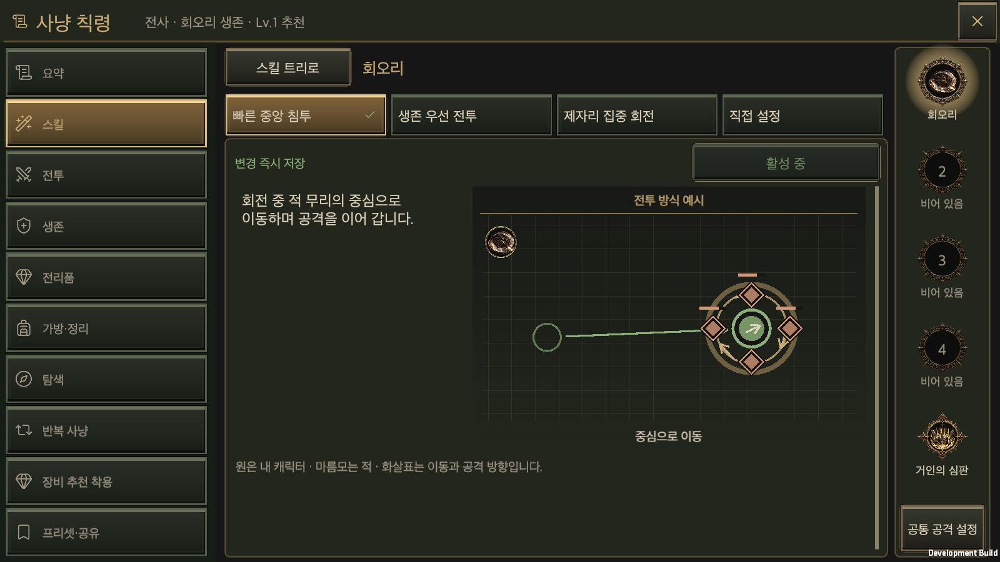

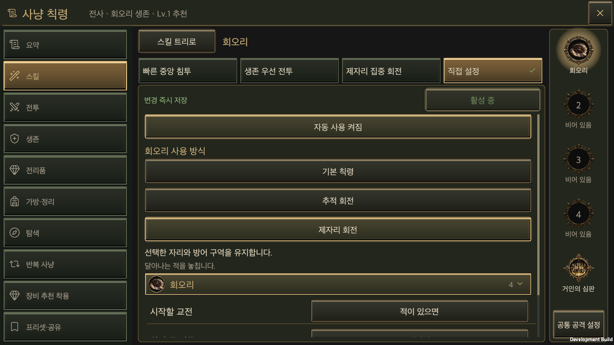

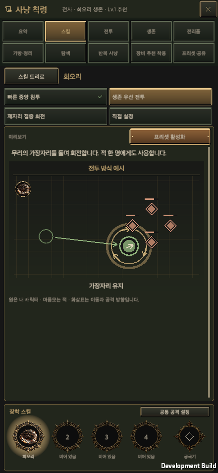

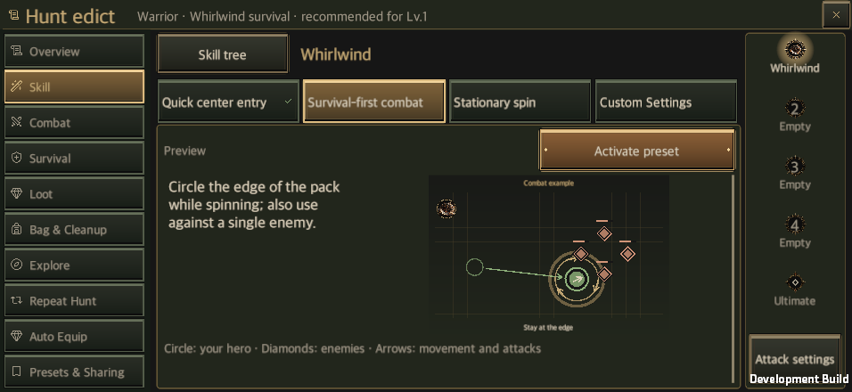

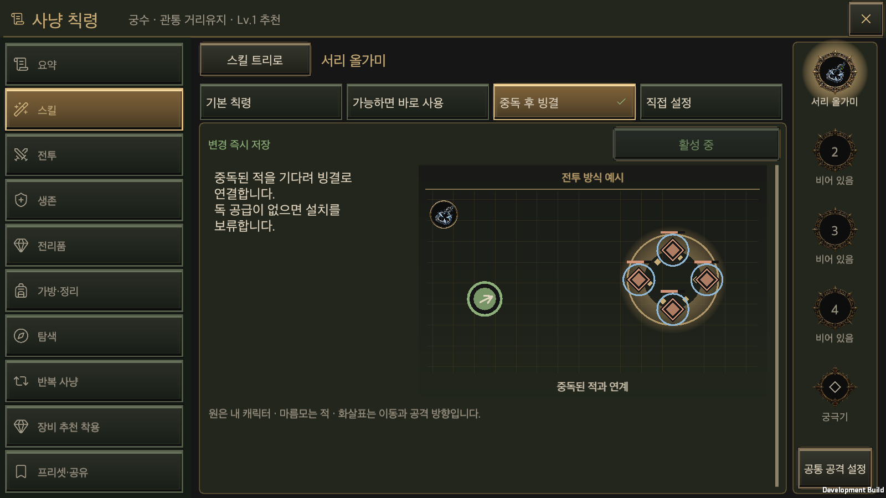

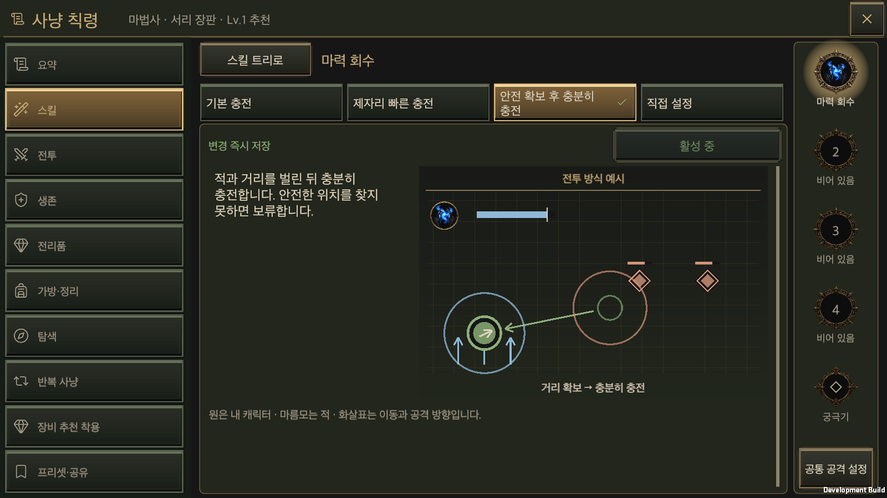

## 항목별 프리셋 목록

아래 모든 항목은 표에 적힌 프리셋 뒤에 직접 설정을 제공합니다.

| 항목 | 프리셋 |
| --- | --- |
| 전투 위치·거리 (6) | 가까운 적과 균형 전투 · 중앙 돌파 · 안전 거리 유지 |
| 포위 대응·몰이 (5) | 현재 무리와 전투 · 포위되면 이탈 · 세 마리씩 몰이 |
| 공격 대상 선택 (5) | 가까운 적부터 · 위험한 적 우선 · 밀집 무리 정리 |
| 대상 유지·추적 (7) | 일반 추적 · 짧게 추적 · 한 대상 마무리 |
| 행동 우선순위 (1) | 생존 후 전투 · 전투 후 회수 · 회수 먼저 정리 |
| 긴급 대응·전투 복귀 (6) | 생존 우선 · 균형 생존 · 위급할 때만 후퇴 |
| 자동 물약 (13) | 균형 보급 · 넉넉한 생존 보급 · 물약 절약 |
| 피해 유형별 회피 (6) | 모든 예고 회피 · 큰 피해 위주 회피 · 공격 유지 우선 |
| 특수 위험·회피 방식 (6) | 제어와 중첩 피해 회피 · 걷기 우선 회피 · 현재 공격 마무리 |
| 생존 수단·보존 (7) | 보행 후퇴 · 방어 후 이탈 · 이탈기 우선 |
| 등급별 장비 회수 (5) | 전투 후 모두 회수 · 희귀 이상 회수 · 전설·세트 집중 |
| 장비 필터·예외 (6) | 모든 장비 확인 · 내 직업 중심 · 무기 성장 집중 |
| 금화·재료 회수 (5) | 이동과 회수 균형 · 자원 우선 회수 · 가는 길에서만 |
| 회수 이동·종료 (3) | 전투 후 안전 회수 · 가까운 것만 빠르게 · 남김없이 회수 |
| 가방 공간 부족 (5) | 가득 차면 귀환 · 미리 공간 확보 · 가치 높은 장비로 교체 |
| 자동 정리 (7) | 모두 보관 · 일반·마법 장비 판매 · 일반·마법 장비 분해 |
| 장비 보호 (4) | 투자한 장비 보호 · 전설·세트까지 보호 · 기본 보호만 적용 |
| 정리 실패 대응 (2) | 보관 후 중단 · 정리 화면에서 대기 · 획득을 줄이고 계속 |
| 탐색·균열 진행 (6) | 오른쪽 벽 따라 탐색 · 보스 빠르게 진행 · 구석까지 탐색 |
| 일반·봉인 상자 (5) | 이동 경로에서 개봉 · 상자 우선 탐색 · 상자 우회 생략 |
| 저주 상자 (4) | 저주 상자 피하기 · 여유 있을 때 도전 · 전투 후 도전 |
| 성소 (4) | 발견한 성소 이용 · 필요할 때만 이용 · 성소 우회 생략 |
| 반복·다음 단계 (3) | 한 판씩 플레이 · 같은 단계 반복 · 성장 단계 도전 |
| 종료 조건·목표 (7) | 다섯 판 짧게 · 30분 사냥 · 시간·횟수 제한 없음 |
| 다음 판 준비 (2) | 일반 준비 · 가방 여유 확보 · 빠른 다음 판 |
| 회오리 | 빠른 중앙 침투 / 생존 우선 전투 / 제자리 집중 회전 |
| 도약 내려찍기 | 빠른 무리 진입 / 거리 확보 후 강타 / 긴급 이탈용 보존 |
| 분쇄 일격 | 무리 한 번에 분쇄 / 강적 우선 타격 |
| 지면 강타 | 무리 제어 / 위험 시전 차단 / 후퇴 지원 |
| 철벽 | 위험 미리 대비 / 보호막 이어 쓰기 / 긴급 생존용 보존 |
| 전투 함성 | 자원 보충 집중 / 강적전 공격 강화 |
| 관통 사격 | 한 명도 빠르게 관통 / 두 명 이상 관통 / 강적 우선 관통 |
| 다중 사격 | 무리 정리 / 먼 거리 사격 |
| 맹독 덫 | 무리 중심 설치 / 대상 발밑 설치 / 추격 경로에 설치 |
| 후퇴 도약 | 안전 거리 복구 / 기존 덫 방향으로 후퇴 / 긴급 이탈용 보존 |
| 사냥꾼의 표식 | 강적 표식 유지 / 현재 대상에 표식 / 체력 높은 적에 표식 |
| 그림자 화살 | 평소 사격 강화 / 정예 관통 연계 |
| 화염구 | 꾸준히 발사 / 폭발 효율 우선 / 강적 우선 화력 |
| 눈보라 | 새 영역 확보 / 대상 위치에 재설치 / 접근 경로에 설치 |
| 연쇄 번개 | 단독 적도 공격 / 연결 무리 집중 |
| 순간이동 | 위기 탈출용 보존 / 교전 거리 복구 / 적이 적은 곳으로 탈출 |
| 원소 보호막 | 피격 미리 대비 / 보호막 이어 쓰기 / 긴급 생존용 보존 |
| 서리 폭발 | 제자리 위기 제어 / 접근 후 무리 빙결 |
| 도발의 낙인 | 낙인 유지 / 자원 부족 시 낙인 |
| 꿰뚫는 갈고리 | 가까운 적도 즉시 끌기 / 먼 적을 끌어오기 |
| 찢어낸 상처 | 무리·강적 우선 출혈 / 한 명부터 출혈 |
| 피의 회수 | 출혈 즉시 회수 / 출혈 끝·위기에 회수 |
| 결연한 전진 | 근거리에서도 돌파 / 먼 적에게 접근 |
| 무쇠 자세 | 공격 예고에 맞춰 방어 / 체력 절반에서 방어 |
| 전장의 고리 | 한 명부터 끌어모으기 / 세 명 이상 모으기 |
| 전율의 파동 | 즉시 파동 발사 / 세 명 관통 대기 |
| 결전의 호흡 | 자원 부족할 때 회복 / 자원 미리 보충 |
| 수호의 맹약 | 보호막이 없을 때 사용 / 둔화 해제용 보존 |
| 선조의 전쟁 | 강적전 지원 / 위기 생존 지원 |
| 거인의 심판 | 강적 집중 심판 / 네 명 이상 광역 심판 / 함성 후 심판 |
| 잇단 사격 | 연속 사격 우선 / 자원 40% 남기기 |
| 응시 사격 | 기회가 생기면 조준 / 표식·먼 거리 조준 |
| 가시 덫 | 바로 이동 봉쇄 / 제어 없는 적 우선 |
| 서리 올가미 | 먼저 둔화시키기 / 중독 후 빙결 |
| 미끼 투영 | 근접 위협 떼어내기 / 무리의 시선 끌기 |
| 연막 엄폐 | 근접 위협에서 벗어나기 / 체력 위기 대응 |
| 독화살 | 중독 없는 적에게 사용 / 표식 대상 집중 중독 |
| 갈라지는 화살 | 한 명부터 발사 / 세 명 모이면 분열 |
| 경계 쇠뇌 | 교전마다 설치 / 강적전용 설치 |
| 사냥 준비 | 자원 부족 시 보충 / 유료 사격 전에 준비 |
| 일제 소탕 | 강적 집중 소탕 / 제어된 무리 소탕 |
| 그림자 추격 | 즉시 추격 강화 / 자원 충분할 때 강화 |
| 잿불창 | 즉시 관통 발사 / 세 명 관통 대기 |
| 화염 장벽 | 바로 화염 지대 만들기 / 제어된 적에게 겹치기 |
| 빙하창 | 먼저 둔화시키기 / 둔화 후 빙결 |
| 서리 구체 | 바로 구체 발사 / 제어된 적에게 발사 |
| 축전 구체 | 지속 피해용 설치 / 연쇄 번개 준비 후 설치 |
| 번개 창 | 즉시 관통 공격 / 연쇄 번개 후 연계 |
| 마력 회수 | 안전한 자리에서 짧게 회복 / 피격 감수 빠른 회복 / 거리 확보 후 충분히 회복 |
| 균열 결계 | 보호막이 없을 때 설치 / 체력 위기 때 설치 |
| 원소 나침반 | 자원 부족 시 보충 / 세 원소 할인 준비 |
| 자력 소용돌이 | 한 명부터 끌어모으기 / 세 명 이상 집결 |
| 삼원소 붕괴 | 강적 집중 붕괴 / 네 명 이상 광역 붕괴 |
| 현자의 화신 | 강적 앞에서 즉시 강화 / 세 원소 준비 후 강화 |

## 2026-09-24 최초 구현 검증

- [집중 Edit Mode 검사 477개가 통과했습니다.](HuntEdictQuickPresetEvidence/editmode.xml) 실패와 건너뜀은 없습니다. 모든 프리셋의 값, 다른 항목과의 독립성, 반복 적용, 공유, 저장·되돌리기, 실제 회오리 이동과 기존 직업 스킬 동작을 확인했습니다. 전체 검사 결과는 아닙니다.
- [macOS 개발 빌드가 성공했으며](HuntEdictQuickPresetEvidence/build.txt) 컴파일 오류는 없습니다.
- [실행 화면의 포인터 조작 검증을 통과했습니다.](HuntEdictQuickPresetEvidence/runtime.txt) 전역 25개 묶음에서 직접 설정으로 옵션 130개를 모두 열 수 있고, 프리셋을 고르면 세부 항목이 접힙니다. 직접 설정 전환 시 값과 미저장 상태 유지, 되돌리기, 저장·재열기, 공통 순서와 신규 스킬 방침도 확인했습니다. 다섯 화면 크기, 한국어·영어, 글자 크기 100%·150%와 선택 창이 열린 상태의 화면 회전을 확인했습니다.
- [새 프로세스를 실행해 회오리와 생존 프리셋의 저장 값이 복원되는 것도 확인했습니다.](HuntEdictQuickPresetEvidence/restart.txt) 휴대전화·태블릿 실기기와 모바일 성능은 검증하지 않았습니다.

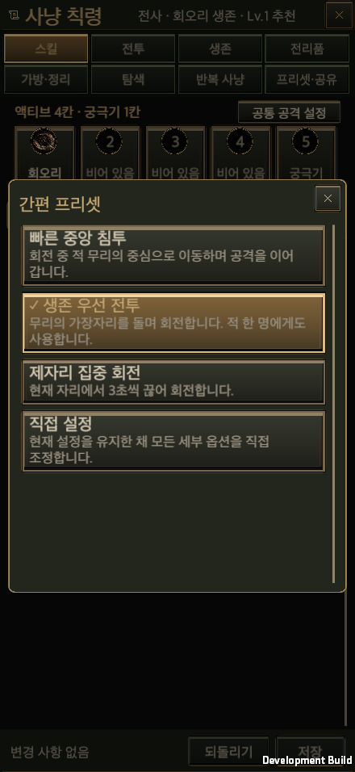

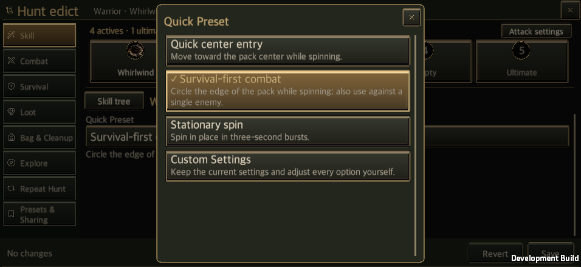

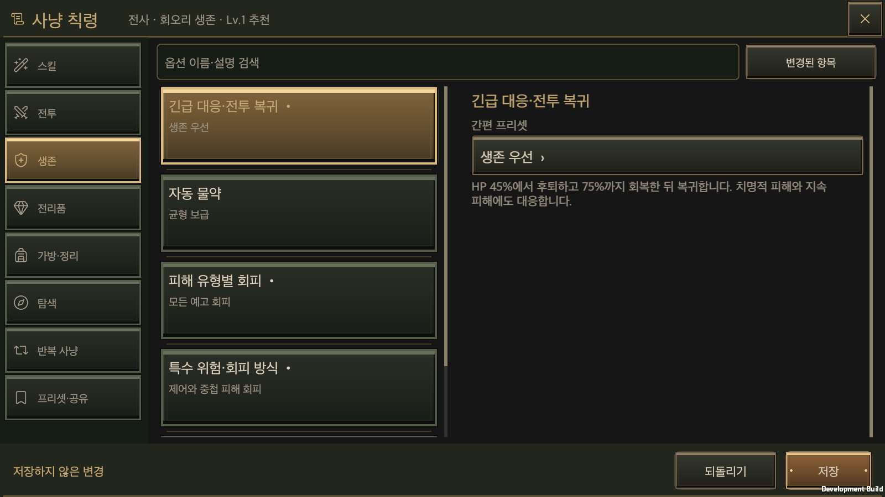

## 2026-09-29 분류 탭·프리셋 보관함 검증

- Unity 6000.6.0f1 Edit Mode 관련 검사 223개가 통과했습니다. 129개 검사와 기본 모드·장비 추천·훈련 회귀 101개 검사에서 중복 7개를 제외한 수입니다. 실패·건너뜀은 없습니다. 공통 UI 소유 검사와 검사기 회귀 9개도 통과했습니다.
- macOS 개발 빌드의 오류는 0개입니다. 연결된 Unity MCP 인스턴스가 없어 기존 프로젝트 배치 검사·빌더를 사용했습니다.
- macOS 실행 화면에서 440×956, 956×440, 1600×900, 1600×1000, 2100×900 × 한국어·영어 × 글자 100%·150%의 20개 조합을 확인했습니다. 모든 35개 탭에 실제 uGUI 포인터 이벤트로 접근했고 아이콘·설명·탭 영역·본문 높이를 검사했습니다. 안전 영역을 적용한 가로 화면도 확인했습니다.
- 다섯 슬롯을 모두 저장한 상태에서 페이지 스크롤이 없고 각 슬롯이 한 줄임을 검사했습니다. 이름 두 번 선택 후 입력 확정, 디스크 저장, 슬롯별 공유, 가져오기 목적지의 덮어쓰기 확인·취소, 기존 슬롯 덮어쓰기와 새 프로세스의 재로딩을 확인했습니다.
- 기본 모드 On/Off, 원본 설정 보존, 저장 실패 복구, 전투의 실행용 스킬 정책, 물약·추천 착용 정책 일치를 검사했습니다. 기존 간편 프리셋이 있는 전역 묶음 24개의 직접 설정 옵션 접근과 저장·재실행도 통과했습니다.
- 모바일 화면 크기는 macOS 창에서 검증했습니다. 물리 모바일 기기 검증은 포함하지 않습니다.

[Edit Mode](HuntEdictSectionEvidence/editmode.xml) · [모드 회귀](HuntEdictSectionEvidence/mode-regression.xml) · [빌드](HuntEdictSectionEvidence/build.txt) · [조작](HuntEdictSectionEvidence/runtime.txt) · [재실행](HuntEdictSectionEvidence/restart.txt) · [간편 프리셋 회귀](HuntEdictSectionEvidence/quick-regression.txt) · [회귀 재실행](HuntEdictSectionEvidence/quick-restart.txt)

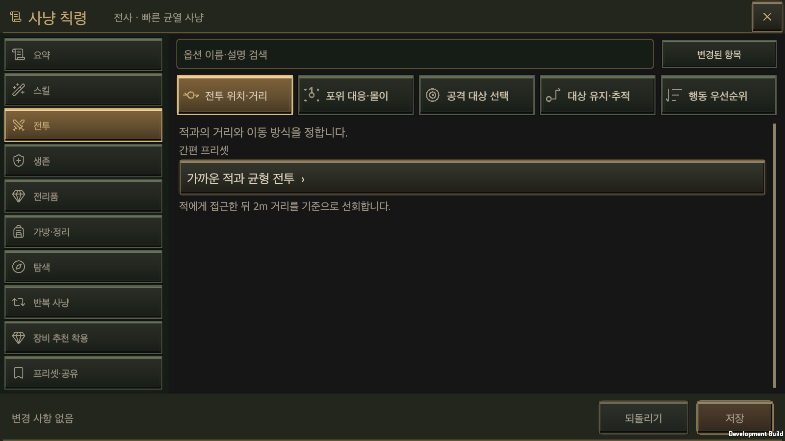

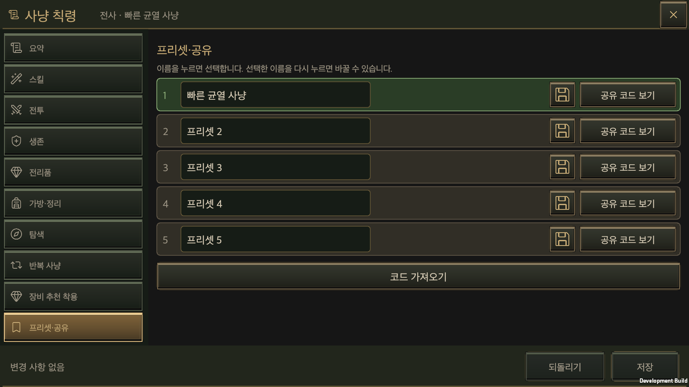

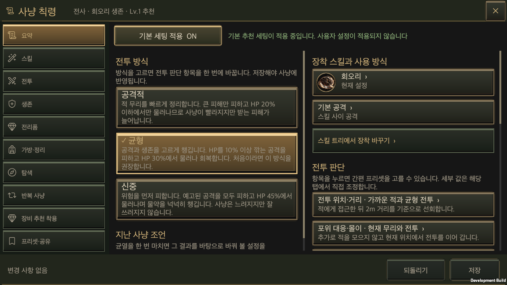

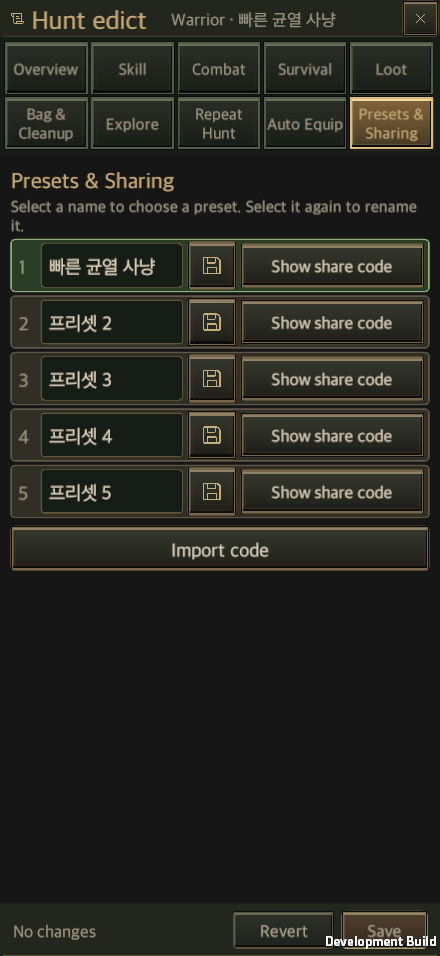

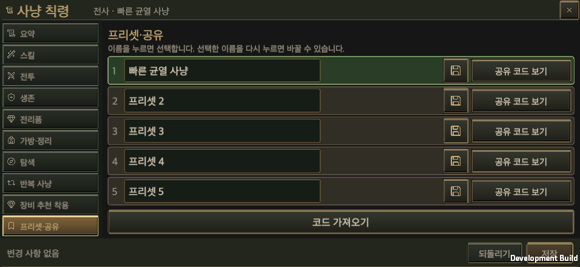

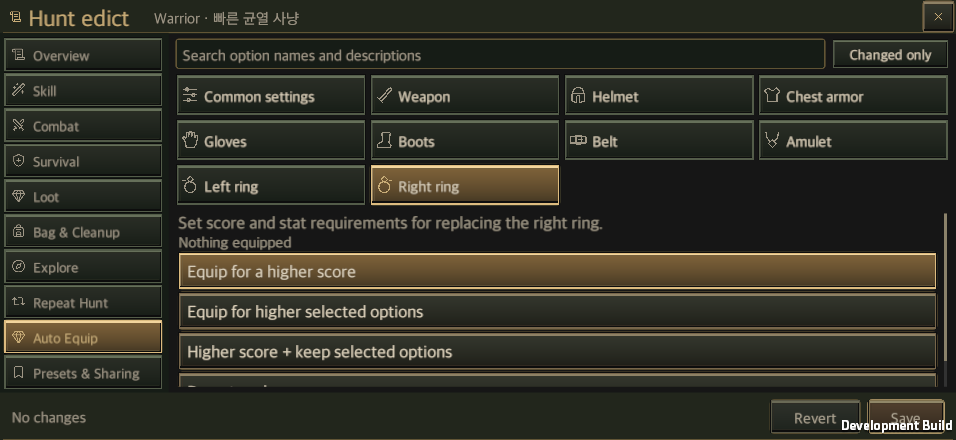
