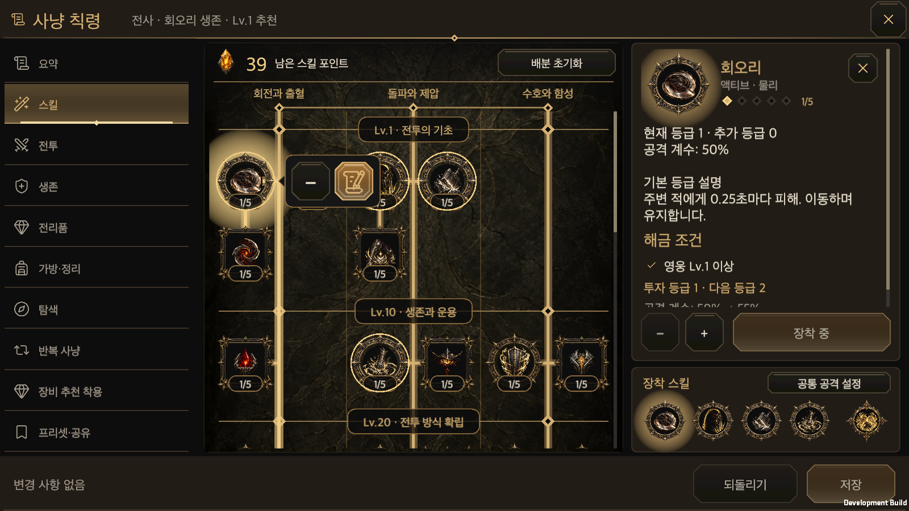
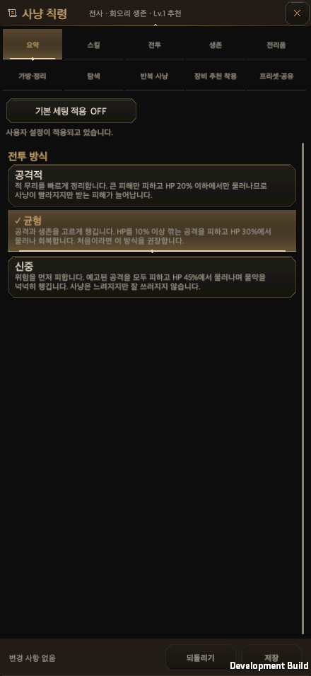
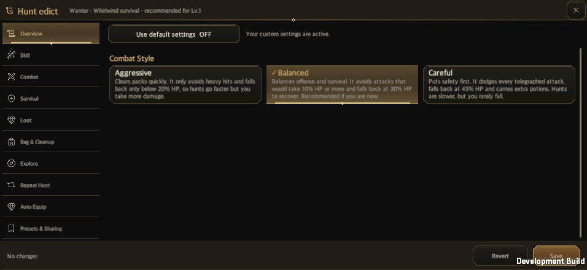

# 사냥 칙령의 단순한 요약과 스킬 조작

갱신일: 2026-10-01 · [English](Hunt_Edict_Simple_Skill_Actions.en.md)

## 변경한 화면

- 요약 본문은 공격적·균형·신중의 세 버튼과 설명만 표시합니다. 장착 스킬, 사용 방식, 전투 판단, 자동 관리, 지난 사냥 조언을 나열하지 않습니다. 기본 세팅 적용 On/Off는 상단에 유지합니다.
- 장착된 액티브·궁극기는 인장 둘레선으로 표시합니다. 슬롯 번호 배지를 없애고 실제 등급/최대 등급은 인장 아래에 남깁니다. 빈 장착 칸도 숫자를 표시하지 않습니다.
- 트리의 액티브·궁극기를 누르면 아이콘 옆 말풍선에 미장착 + 또는 장착 −·편집 아이콘을 표시합니다. 편집 아이콘은 두루마리에 붓으로 쓰는 선형 그림입니다. 실제 게임의 기존 벡터 아이콘 렌더러와 공통 색상을 쓰며 별도 래스터 에셋이나 캔버스를 추가하지 않습니다.
- 패시브는 투자 등급으로 항상 적용합니다. 별도 장착 버튼을 만들지 않습니다. 배우지 않은 액티브의 +는 비활성화하고 기존 해금 조건을 설명 패널에서 보여 줍니다.
- 세부 프리셋 화면에서 다른 장착 스킬을 누르면 그 스킬로 바로 이동합니다. 장착 관리 팝업은 나오지 않습니다.

## 상태와 입력

`HuntEdictWindow`가 기존 편집본을 소유합니다. 열기, 보기, 언어·방향 변경은 저장하지 않습니다. 장착·해제·전투 방식 선택은 편집본을 바꾸며 기존 저장·되돌리기를 따릅니다. 정책 활성화와 직접 설정의 항목별 즉시 저장은 기존 거래를 유지합니다. 전투 예시는 기존 격리 실행기를 재사용합니다.

말풍선은 눌렀던 노드나 장착 칸의 현재 좌표를 읽습니다. 트리의 첫 선택으로 세로 설명 패널이 열릴 때는 선택한 노드를 본문 안에 유지합니다. 회전·언어 변경 뒤에는 재생성된 같은 노드를 읽습니다. 투명한 바깥 누르기 영역은 뒤의 버튼을 실행하지 않고 말풍선만 닫습니다. 뒤로가기도 말풍선을 먼저 닫습니다.

기본 세팅 적용 On일 때는 기존처럼 요약의 카드와 다른 분류·저장·되돌리기가 흐려지고 입력을 받지 않습니다. Off로 돌아오면 기존 편집본과 입력 가능 상태를 복원합니다.

## 검증

최종 단계에서 공통 UI 계약 검사와 관련 Edit Mode 검사 83개를 통과했습니다(실패 0, 건너뜀 0). Unity 6000.6.0f1의 격리된 macOS 개발 빌드는 오류 0으로 완료했습니다.

한 묶음의 네이티브 검증에서 기본 글자 크기의 세로 440×956, 가로 956×440, PC 16:9·16:10·21:9와 한국어·영어 10개 조합을 확인했습니다. 세 요약 카드의 설명과 버튼 경계, 숫자 없는 장착 표시, 트리·궁극기 말풍선, 두루마리·붓 아이콘, 프리셋 장착 칸의 즉시 이동, 보기만 했을 때 편집본·저장본 불변을 확인했습니다. 장착 +·빈칸 채우기·가득 찬 칸 교체, 액티브/궁극기 −, 되돌리기·저장, 말풍선 뒤로/바깥 누르기, 회전·언어 변경·안전 영역, 기본 세팅 On/Off도 통과했습니다. 새 플레이어 프로세스에서 해제한 장착 칸과 신중 전투 방식이 복원됐습니다.

[검증 목록](HuntEdictSimpleActionsEvidence/menu-runtime.txt) · [재실행 결과](HuntEdictSimpleActionsEvidence/menu-restart.txt) · [범위와 해시](HuntEdictSimpleActionsEvidence/validation.json)

입력 근거는 macOS 네이티브 플레이어의 uGUI 레이캐스트와 포인터 이벤트이며 모바일 실기기 결과가 아닙니다. 글자 크기별 검사와 전체 전투 예시 갤러리는 실행하지 않았습니다. 기존 URP 후처리 셰이더 경고는 관찰했지만 이번 UI의 C# 예외나 조작 실패는 없었습니다. 관련 코드·설정이 바뀌지 않은 병합과 문서 갱신 뒤에는 성공한 검증을 반복하지 않습니다.
