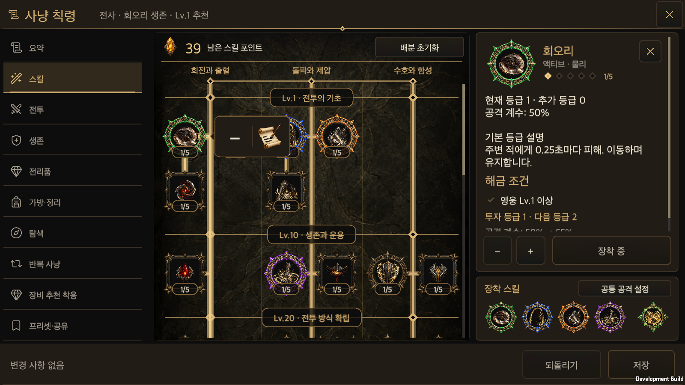
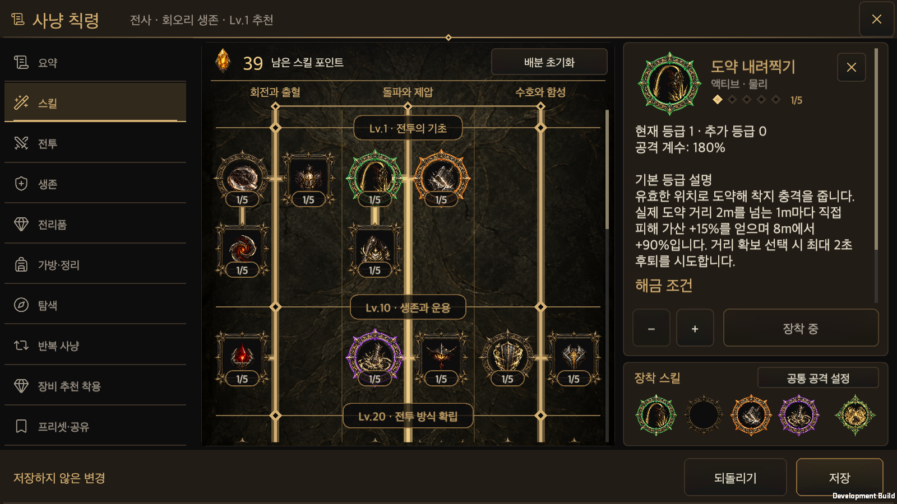

# Slot colors for equipped Hunt Edict seals

Updated: 2026-10-01 · [한국어](Hunt_Edict_Slot_Seals.md)

## Four equipment colors

The four regular active slots have fixed colors. The skill tree, equipment sockets, inspector heading and detailed-policy rail use the same image for a given slot. These colors identify equipment positions, not skill rank, element or preset activation.

| Active slot | Color | Image |
| --- | --- | --- |
| First | Green | [Existing green seal](../../Assets/HELLSCRIPT/Resources/Art/SkillTree/node-frame-active-equipped.png) |
| Second | Blue | [Blue seal](../../Assets/HELLSCRIPT/Resources/Art/SkillTree/node-frame-active-equipped-blue.png) |
| Third | Amber | [Amber seal](../../Assets/HELLSCRIPT/Resources/Art/SkillTree/node-frame-active-equipped-amber.png) |
| Fourth | Violet | [Violet seal](../../Assets/HELLSCRIPT/Resources/Art/SkillTree/node-frame-active-equipped-violet.png) |

An empty slot uses the bronze seal. Empty positions never compact the colors of later slots. A replacement inherits its destination color; re-equipping a skill in another slot changes its tree frame accordingly. The separate ultimate retains its existing green crest. Passives remain always-applied allocated skills with square frames. No equipment-number badges are added.

## Artwork and ownership

The three additional PNGs are native image-generator edits using the existing green seal as reference. Generated alpha is copied unchanged; code neither redraws nor recolors the frames. Each uses the same 1254×1254 registration and centered layout. Measured aperture ratios are 0.649–0.651, within 0.015 of the existing 0.66 layout constant.

[Prompts, hashes, transparency and provenance](../Art/SkillTreeUi/slot-frame-provenance.json) retain the complete generation prompts. The built-in surface provides no verifiable model name, so provenance is `candidate_model_unknown`; no particular model or final art approval is claimed.

`HuntEdictWindow.Skills` derives the color from the actual draft `classSkills.actives` position. No additional account color preference is saved. All displays use `NodeFrame` and retain the existing icon/frame center, dimensions and input targets. Equipment, removal, revert and save remain owned by `ClassSkillTree`, `HuntEdictEditSession` and `GameStore`.

## Validation

Final validation ran once on integrated commit `743d6c87` on 2026-10-01. The shared UI contract check, 11 contract tests and five seal-resource Edit Mode cases passed. The Unity 6000.6.0f1 macOS Development build succeeded with zero errors. Import and readiness were also verified in the actual main Editor. Five Unity AI `NoSubscription` Console entries were preserved and distinguished from C# compilation failures.

The existing native menu batch and fresh-process recovery passed at 440×956, 956×440, 1600×900, 1600×1000 and 2100×900 in Korean/English, including safe-area checks. Frames match across the tree, sockets, inspector and policy rail, retaining their centers. Empty positions, replacements, moving a blue-slot skill to the green slot, revert/save and reopening were verified. Selected originals from the 40 native captures are retained below.

[Portrait](HuntEdictSlotSealsEvidence/tree-bubble-440x956-ko.png) · [English landscape](HuntEdictSlotSealsEvidence/tree-bubble-956x440-en.png) · [Policy rail](HuntEdictSlotSealsEvidence/policy-buttons-1600x900-ko.png) · [Fresh-process recovery](HuntEdictSlotSealsEvidence/menu-restart.png) · [Results and scope](HuntEdictSlotSealsEvidence/validation.json) · [Edit Mode](HuntEdictSlotSealsEvidence/editmode.xml) · [Interaction log](HuntEdictSlotSealsEvidence/menu-runtime.txt)

Interaction evidence uses real native macOS player raycasts and synthetic uGUI pointer events; it is not OS-mouse or physical-mobile evidence. Only default text size was used. Full combat suites and text-size matrices were not run.
