# 사냥 칙령 UI 개편 — 튜토리얼 연결 기록 (Phase 4)

갱신일: 2026-10-05 · [English](Hunt_Edict_Tutorial_Wiring.en.md) · [네이티브 이식 기록](Hunt_Edict_UI_Overhaul_Native.md) · [설계 문서](../Design/Hunt_Edict_UI_Overhaul.md) · [튜토리얼 UI 입력 문서](../Design/Tutorial_Hunt_Edict_UI_Brief.md)

상태: 설계 문서 10장의 튜토리얼 측 요청 T1~T7을 반영했다. 네이티브 이식(Phase 3)이 마련한 슬롯(안내 캡션·3박자 띠·저장 후 버튼)에 튜토리얼 코드(`GameUI`)를 연결했고, 게이트가 스크롤 밖 컨트롤에 갇히지 않게 했다. 이슈 NPC·장 대본·두루마리 창(장 구성 D~I)은 이 작업이 아니며, 캡션은 시스템 문장이다. 저장 필드·공개 판정·저장 경로·컨트롤 이름은 바꾸지 않았다.

## 1. 한눈에

| 항목 | 내용 |
| --- | --- |
| 브랜치와 기준 | `claude/hunt-edict-tutorial-wiring`. 네이티브 이식 브랜치(`claude/hunt-edict-native-port`, PR #53)의 `46523f6a`에 `main`(`a94bb636`)을 병합한 `1ae06fb8` 위에 쌓았다 |
| 커밋 | `a3186981` 튜토리얼 연결(코드·테스트·스모크), `1ae06fb8` 이식 브랜치에 `main`(PR #55, 스킬 트리 계보) 병합, `0637026d` 그 이식 브랜치를 이 브랜치에 병합, 이어서 이 기록과 증거 |
| 규모 | `Assets` 아래 18개 파일(.meta 제외), +885 / −53줄. 새 파일은 Core 1개(`EdictGuidance`), `GameUI` partial 1개, 표시 도우미 1개(`UiVisibility`), EditMode 테스트 2개, 스모크 1개와 스모크 partial 1개다 |
| 바꾸지 않은 것 | 저장 필드, 공개 판정(`HuntEdictProgression`), 저장 경로(`CommitHuntEdict`), 탭 id 10개와 `edict-*` 이름, `Option area`·`Preset explanation` 등 영역 이름, `HasDialog`의 뜻, 프롤로그 레슨 단계 판정(`SkillLessonStep`·`SurvivalLessonStep`·`Progressive*Step`) |
| 새 이름 | 없다. Phase 3의 `Guide caption`·`edict-beat-strip`·`edict-save-next`를 그대로 쓴다. 프롤로그 캡션의 둥근 표식(`Guide halo`)에 칙령 글리프를 넣었을 뿐이다 |

## 2. 요청별 구현

| 요청 | 구현 | 주요 파일 |
| --- | --- | --- |
| T1 게이트가 닿을 수 없는 컨트롤을 "없음"으로 | 게이트의 구멍을 컨트롤의 화면 사각형이 아니라 **포인터가 닿는 부분**(마스크·스크롤 뷰포트·안전 영역으로 자른 사각형)으로 계산한다. 닿는 부분이 4분의 1 미만이면 없는 것으로 보고 2초 뒤 가림막을 푼다. `LessonTarget`은 지정 컨트롤이 일부라도 가려져 있으면 스크롤해 들여온다(초당 4번까지) | `UiVisibility.cs`, `PrologueGate.cs`, `GameUI.EdictGuidance.cs`, `GameUI.TutorialStaging.cs` |
| T2 변경이 생기면 링을 저장으로 | 규칙 안내의 링 순서를 한곳(`EdictGuidance.RingNames`)에서 정한다. 안내가 가르치는 옵션의 값이 편집본에서 저장본과 달라지면 `edict-save`가 맨 앞이다. 숫자 입력창의 `edict-number-apply`는 창이 나머지를 덮으므로 항상 맨 앞이다 | `Core/EdictGuidance.cs`, `GameUI.Tutorials.cs`, `HuntEdictWindow.Guide.cs` |
| T3 기본 세팅 잠금 | 잠긴 동안 규칙 안내의 링은 `edict-default-settings` 하나이고 캡션이 그 이유를 말한다. 안내가 시작될 때 잠겨 있었다면 옵션을 기억해 두었다가 스위치를 끈 직후 그 옵션을 연다 | `EdictGuidance.cs`, `GameUI.EdictGuidance.cs`, `HuntEdictWindow.Guide.cs`(`DefaultsLocked`) |
| T4 캡션을 창의 띠에 | 프롤로그 레슨의 하늘의 목소리 문장을 `Guide caption` 띠(`Hard`)에 쓰고 떠 있는 카드를 숨긴다. 게이트는 띠를 어둡게 하지 않는다. 규칙 안내도 링이 놓인 컨트롤에 맞는 한 문장을 같은 띠에 쓴다 | `GameUI.TutorialStaging.cs`, `GameUI.EdictGuidance.cs`, `PrologueGate.cs`, `HuntEdictWindow.Guide.cs` |
| T5 3박자와 저장 후 행동 | 지난 전투를 인용할 수 있는 안내(F05·E05)만 띠를 채운다. 저장하면 세 번째 칸이 바뀐 옵션을 적는다. 저장 직후 푸터가 한 걸음을 권한다: 훈련장이 열려 있으면 "훈련장에서 확인", 아니면 "다음 사냥에서 관찰", 전투 중에는 권하지 않는다 | `EdictGuidance.cs`, `GameUI.EdictGuidance.cs`, `GameUI.HuntEdict.cs` |
| T6 "수행" 판정은 공개된 규칙만 | 이미 지켜지고 있다(`TutorialProgress.EdictSaved`가 `GuideVisible`을 확인). 바꾸지 않았고 기존 `HuntEdictSentenceTests`의 한 건이 고정한다 | `HuntEdictSentenceTests` |
| T7 카드 순서 | 목록 순서로는 위치(균열 5)가 낮은 HP 대응(균열 3)보다 먼저 안내된다. 카드를 공개 단계 순서로 고른다 | `EdictGuidance.NoticeRank`, `GameUI.EdictNotices.cs` |

## 3. 링과 캡션이 움직이는 방식

규칙 안내(`설정해보기`)가 열리면 0.25초마다 아래 순서에서 **처음 있는 눌릴 수 있는 컨트롤**에 링이 붙고, 캡션 띠는 그 컨트롤에 맞는 문장을 말한다. 띠는 안내가 시작될 때 한 번 나타나고 끝날 때 사라지며, 문장이 바뀔 때는 띠 안의 글만 바뀐다(창을 다시 그리지 않는다).

| 상황 | 링이 붙는 컨트롤 | 캡션 |
| --- | --- | --- |
| 기본 세팅이 켜져 있음 | `edict-default-settings` | 기본 세팅이 켜져 있어 이 설정은 바꿀 수 없습니다. 기본 세팅을 먼저 끄세요. |
| 숫자 입력창이 열려 있음 | `edict-number-apply` | 값을 정한 뒤 '적용'을 누르세요. |
| 안내가 가르치는 옵션이 바뀜(저장 전) | `edict-save` | 바꾼 값을 저장하세요. |
| 옵션 또는 간편 선택기가 보임 | `edict-option-<옵션>` 또는 `edict-quick-picker-<범위>` | '라벨'을(를) 눌러 값을 바꿔 보세요. / '묶음'의 선택을 눌러 바꿔 보세요. |
| 다른 그룹·탭에 있음 | `edict-group-<그룹>` → `edict-tab-<탭>` | '묶음' 묶음을 여세요. / '탭' 탭을 여세요. |
| 전투 성향(E02) | 아직 고르지 않은 성향 카드 → 저장 | 전투 성향 카드 하나를 고르세요. |
| 새 스킬(F06) | `edict-skill-equip` → 저장 → `edict-tab-skills` | 새 스킬을 슬롯에 장착하세요. / 저장 / 탭 |

프롤로그에서는 `TickPrologueLesson`이 매 프레임 같은 방식으로 문장을 띠에 넣는다. 창이 아직 없는 첫 단계(도크의 칙령 버튼)에서는 떠 있는 카드가 말한다. **대화상자가 열린 동안**은 창 전체가 어두워져 띠도 어두워지므로 떠 있는 카드가 함께 말한다.

## 4. 계획과 다른 점, 결정

1. **캡션은 시스템 문장이다.** 라벨은 "안내"이고 프롤로그만 "하늘의 목소리"다. 이슈의 대사는 장 구현(D~I)에서 같은 자리에 넣는다. 코드는 문장만 바꾸면 된다.
2. **3박자는 F05·E05만 채운다.** 지난 전투 5초의 HP와 받은 피해를 인용할 수 있는 안내가 이 둘뿐이고, 나머지는 장 대본이 문장을 쓴다. 빈 띠는 자리를 차지하지 않는다.
3. **저장 후 행동.** 훈련장 열기를 실제 이동으로 연결했다(설계 문서 15장 6번의 기본값). 푸터 버튼이 있으면 기존 토스트("다음 사냥에서 방금 바꾼 설정의 행동을…")는 같은 말을 되풀이하므로 내지 않는다. 전투 중 저장은 버튼이 없어서 토스트를 그대로 둔다.
4. **카드 순서(T7).** 규칙 안내는 열리는 단계 순, 전투 성향(E02)은 2, 저주 상자(E08C)는 8, 반복 사냥(H11)은 15로 놓았다. 스킬 안내(F06·H07·H08)와 F07·H10은 지금처럼 가장 앞이다.
5. **기본 세팅 잠금은 옵션 규칙 안내와 전투 성향 안내에만 적용한다.** 잠긴 창에서도 스킬 관리는 열려 있어 F06은 자기 길을 쓴다. 잠금을 거는 스위치는 균열 20(또는 레거시 계정)부터 보이므로 이 경우는 사실상 레거시 계정의 일이다.
6. **프롤로그의 숫자 대화상자 단계.** 대화상자는 창을 어둡게 해서 띠가 읽히지 않으므로 그동안은 떠 있는 카드를 함께 쓴다. 대화상자가 열려 있는 동안 띠의 문장을 바꿔도 대화상자와 입력값은 그대로다(`CaptionKeepsTheDialog`).
7. **게이트의 구멍.** 지금까지 구멍은 컨트롤의 잘리지 않은 사각형이었다. 이제는 닿는 부분이다. 지정 컨트롤이 일부만 보여도 눌리는 곳이 정확히 구멍이다.
8. **프롤로그 진행 스모크가 멈추던 이유.** Phase 3 기록은 "마을 안내 카드 단계에서 시간 초과"라고 적었다. 원인은 그 자리에서 열리는 **일일 출석 이벤트 창**이 카드를 덮는 것이었다(`timeout.png`, 변경 전 기준선과 같다). 스모크 픽스처가 그날 출석 창을 숨기도록 고쳤다.
9. **전투 성향 저장은 다른 안내도 수행으로 만든다(기존 동작, 바꾸지 않음).** 성향 프리셋은 낮은 HP·대상·위치의 값도 쓰므로 `EdictSaved`가 공개된 그 규칙의 안내(E05·E04·E03)를 수행으로 기록하고, 그 값이 맞던 성향도 달라져 E02도 수행이 된다. 그래서 스모크는 성향 안내를 마지막에 돌리고 그 기록을 되돌려 시작한다.

## 5. 스모크·테스트 영향

| 대상 | 변경 | 이유 |
| --- | --- | --- |
| `EdictGuidanceTests`(신규) | 링 순서·잠금·캡션·카드 순서·3박자·결과·저장 후 단계 | 순수 로직이라 장면 없이 확인한다 |
| `PrologueGateTests`(신규) | 마스크·스크롤·안전 영역으로 자른 가시 사각형, 어둡게 하는 사각형 분할 | 게이트가 의존하는 기하 |
| `RuntimeEdictGuideSmoke`(신규) | 실제 안내 카드로 사다리 순서, 캡션·링·저장 이동, 변경 없는 자동 저장이 링 아래 창을 다시 짓지 않는지, 잠금, 대화상자 보존, 게이트 해제 | 튜토리얼 측 연결의 계약 |
| `RuntimeTutorialSmoke`(`CheckLessonCaption`) | 레슨 대상이 창 안에 있으면 띠에 문장이 있고 떠 있는 카드는 숨고 띠는 어둡지 않으며 레슨 컨트롤을 가리지 않는지 | 프롤로그 캡션 이동 |
| `RuntimeTutorialSmoke.Progression` | 도착 대화가 닫힌 뒤 출석 창을 그날 숨김 | 위 8번 |

## 6. 검증 결과

검증은 통합된 트리(`0637026d`: 이 브랜치의 코드 `a3186981`에 이식 브랜치와 그 안에 병합된 `main` `a94bb636`, 곧 PR #55의 스킬 트리 계보를 합친 것) 기준이다. 6.1은 작업 중 관련 검사, 6.2는 마지막 전체 검사다. 실기기와 사람 이해도는 확인하지 않았다.

### 6.1 작업 중 관련 검사

- 관련 EditMode 162개 통과(`EdictGuidanceTests`, `PrologueGateTests`, `HuntEdictSentenceTests`, `LocalizationTests`, `HuntEdictProgressionTests`, `TutorialProgressionTests`, `TutorialChapterTests`, `StoreViewBindingTests`, `HuntEdictOverviewTests`). `LocalizationTests`는 새 한국어 리터럴과 `en.txt`가 양쪽 방향으로 맞는지 본다. 한국어가 없는 형식 문자열(`'{0}' {1} → {2}`)은 거부되어 `Loc`을 거치지 않게 고쳤다. 그 뒤 `EdictGuidanceTests`에 한 건을 더했고 아래 전체 검사가 포함한다.
- `python3 tools/check_ui_contract.py`, `python3 tools/test_ui_contract.py`(11개), `python3 tools/check_ui_refresh.py` 통과(구독 12개 보호, UI 소스 160개 목록화).

### 6.2 마지막 전체 검사(`0637026d`)

- **전체 EditMode 5204개 중 5203개 통과, 실패 0, 건너뜀 1**(2119초). 건너뛴 한 건은 다른 작업의 측정 도구(`ClassSkillPassiveMeasurement.MeasureEveryDesignBuild`)다. 작업 폴더의 복제본에서 실행해 그동안의 문서 편집이 섞이지 않았다. 이 작업의 새 테스트 17개(`EdictGuidanceTests` 9, `PrologueGateTests` 8)가 모두 통과했다.
- **macOS 개발 빌드 스모크**(같은 커밋, 크기는 스모크가 직접 돌린다):

| 스모크 | 결과 | 비고 |
| --- | --- | --- |
| `EdictGuideSmoke`(신규) | 통과 | 실제 안내 카드로 사다리 순서(미룬 성향 카드 → 낮은 HP → 대상 → 위치 → 되살린 성향), 캡션·링·저장 이동, 변경 없는 자동 저장, 잠금과 해제, 대화상자 보존, 게이트 해제와 복귀 |
| `EdictProgression` 클래스 0·1·2 | 통과 | 프롤로그 레슨(10개 크기·언어 조합의 캡션 검사 포함)에서 마을 안내 카드까지 끝까지. 출석 창 때문에 멈추던 이 스모크가 처음으로 끝까지 통과했다 |
| `RuneUnlockSmoke` | 통과 | 같은 게이트를 쓰는 룬 소개. 가로·세로 × 한국어·영어 4회 |
| `EdictContractSmoke` | 통과 | 9단계 × 5크기 × 한국어·영어 |
| `EdictOverviewSmoke` · `EdictSaveLayoutSmoke` · `EdictSectionsSmoke` | 통과 | |
| `SkillPresetSmoke` · `SkillMenuSmoke` · `QuickPresetSmoke` | 통과 | 병합된 스킬 트리 계보 위에서 |
| `ButtonUxSmoke` · `UiStyleSmoke` | 통과 | |
| `SharedUiSmoke` | 실패 | 장비 상점의 `Nonstandard slot on Equipment shop`(40×40)에서 멈춘다. 칙령 창 밖이다. 변경 전 플레이어는 더 앞의 낡은 픽스처에서 멈춰 비교하지 못했으므로 변경 전부터인지는 확인하지 못했다 |
| `RecommendedEquipmentSmoke` · `LanguageSmoke` · `RiftEntrySmoke` | 실패 | 변경 전 기준선과 같은 메시지(`edict-tab-autoEquip` 없음, NullReference, `Missing pointer target`). 이번 변경과 무관 |

- 전체 검사 뒤에는 문서와 증거 이미지만 바뀌었고 코드는 바뀌지 않았다.
- **실행하지 않음:** 게임 전체 스모크 묶음(칙령 창과 무관한 100여 개), v2 튜토리얼 스모크(로컬 LiveOps 서버 필요)와 `EdictControlsSmoke`, 전사 외 직업의 계약 스모크, **F06(새 스킬) 링 길의 런타임 확인**(단위 테스트로만 확인), Android·웹·실기기, 성능과 같은 조건의 이전·이후 저장 갱신 측정, 사람 이해도. 추가된 프레임 단위 일은 게이트가 켜져 있을 때(프롤로그, 룬 소개)의 `GetComponent` 몇 번이고 새 갱신 주기는 없지만 측정은 하지 않았다.

## 7. 증거

기준 이미지는 `HuntEdictTutorialEvidence/`에 있고 SHA-256은 [SHA256SUMS.txt](HuntEdictTutorialEvidence/SHA256SUMS.txt)에 적었다. 전체 21장이다. 스모크가 직접 찍은 화면이며 실기기 화면이 아니다.

**프롤로그 정책 화면: 하늘의 목소리 문장이 캡션 띠에 있고 프리셋 탭을 가리지 않는다**(가로·세로, 한국어·영어)

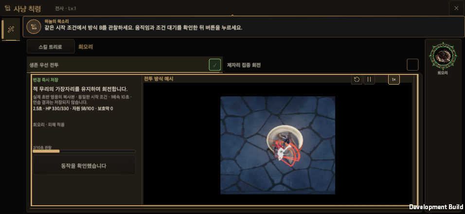 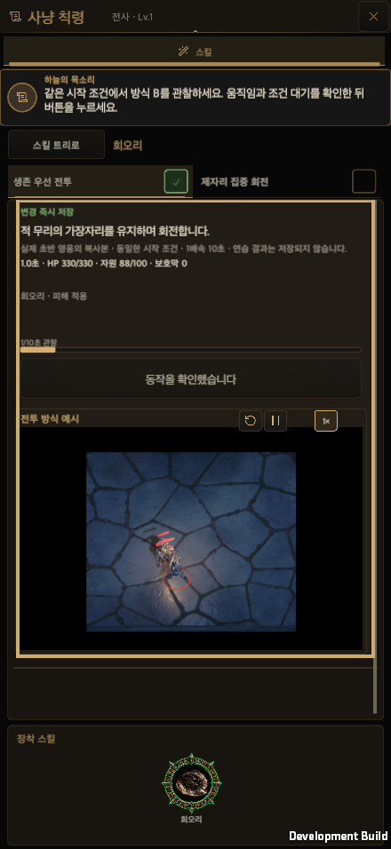 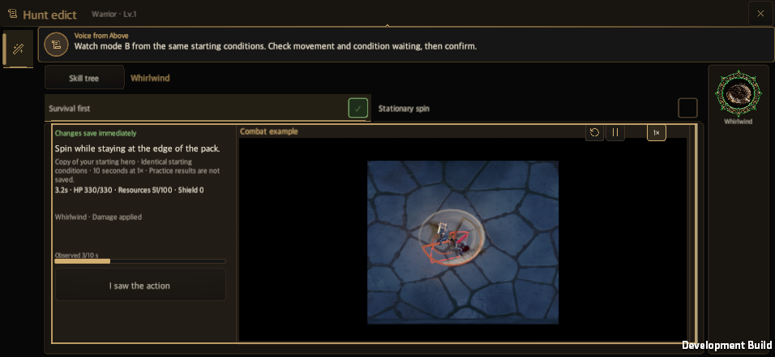 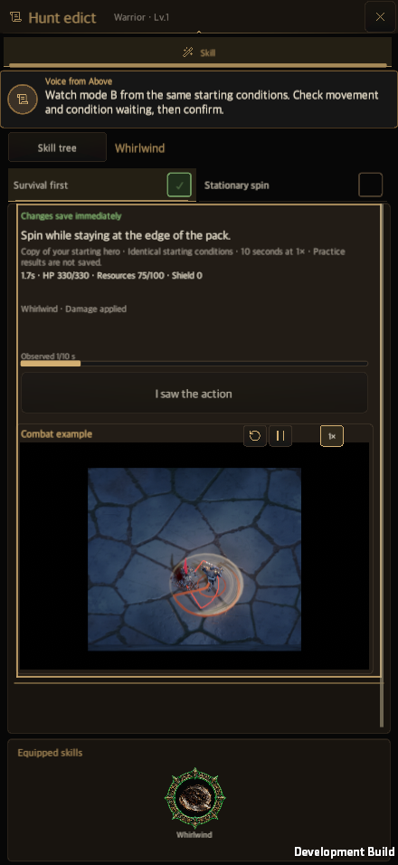

**프롤로그 생존 레슨: 옵션 단계는 띠가 밝고, 숫자 대화상자 단계는 창이 어두워져 떠 있는 카드가 함께 말한다**

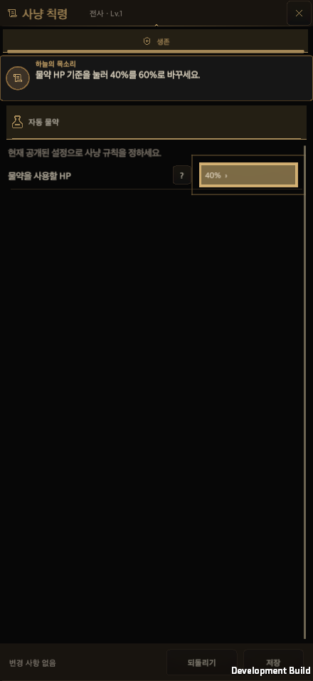 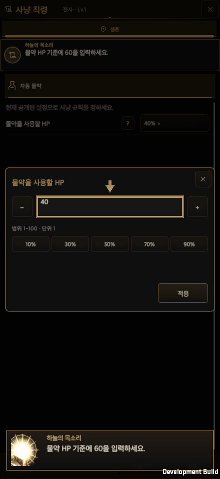

**규칙 안내 E05(세로·한국어): 시작 → 바꾼 뒤 링이 저장으로 → 저장 후(세 번째 칸과 다음 걸음)**

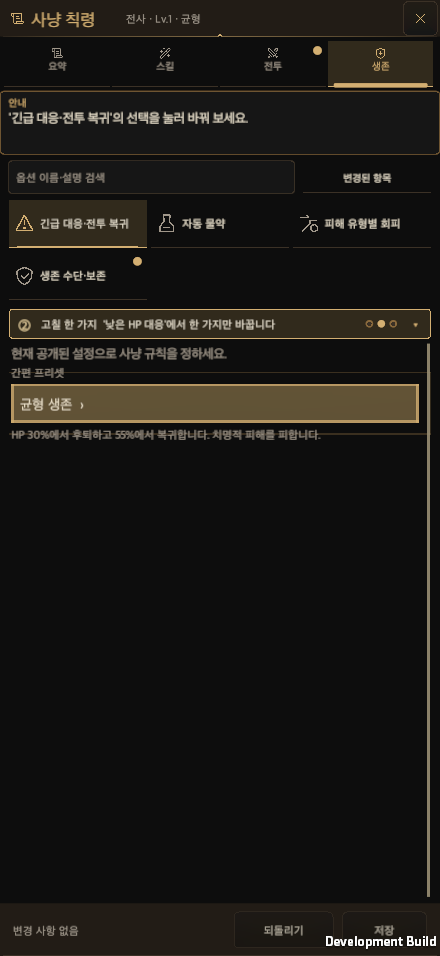 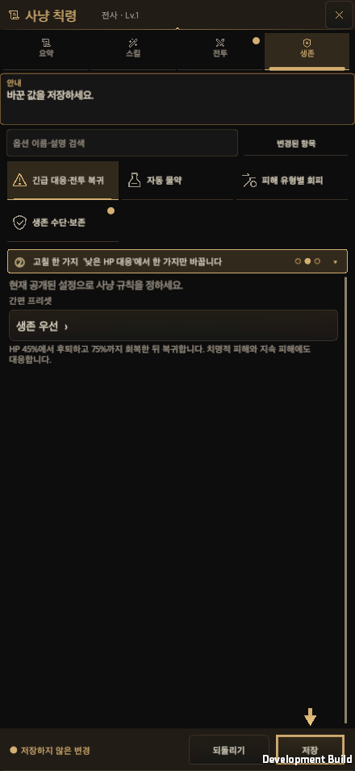 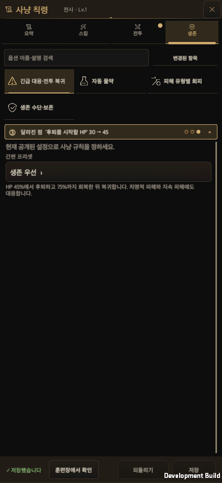

**규칙 안내 E04(가로·영어)와 E03(세로·영어)**

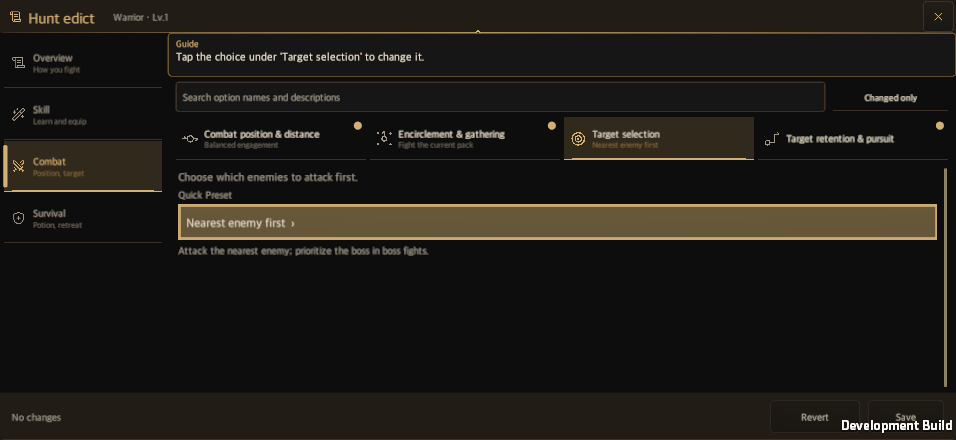 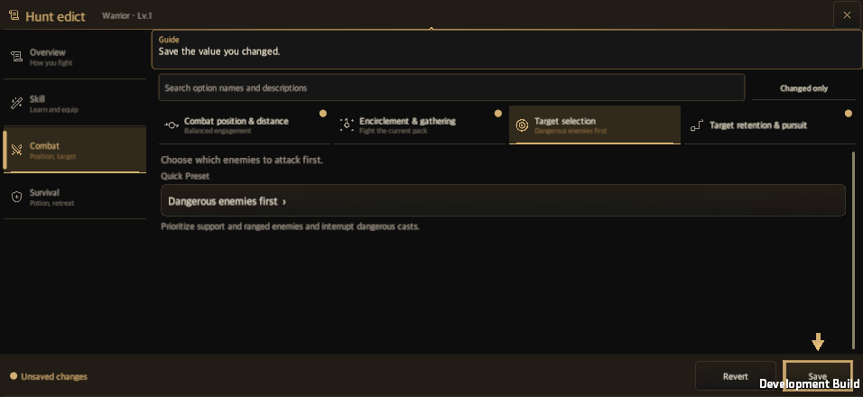 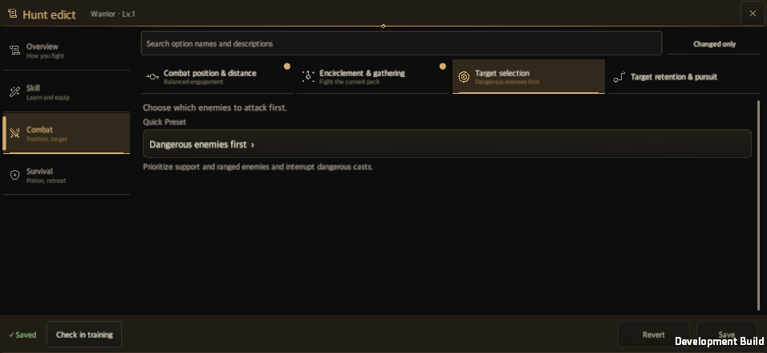 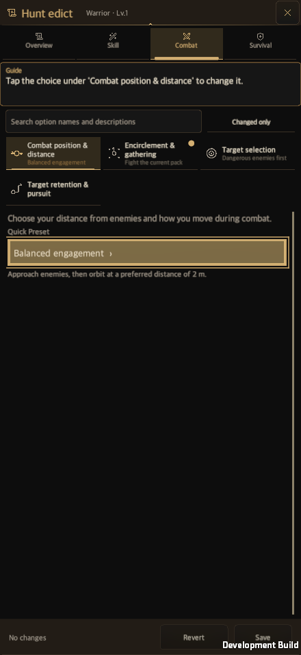 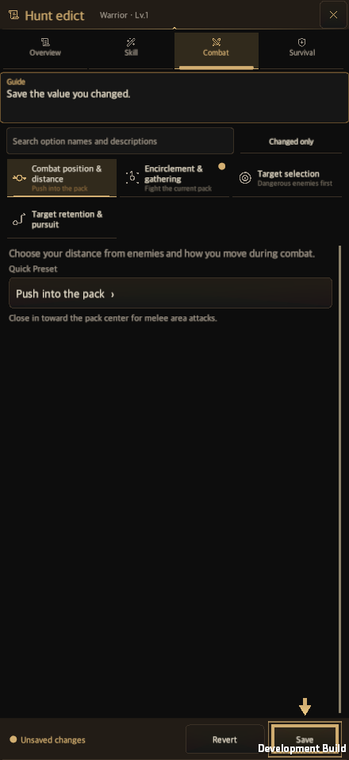 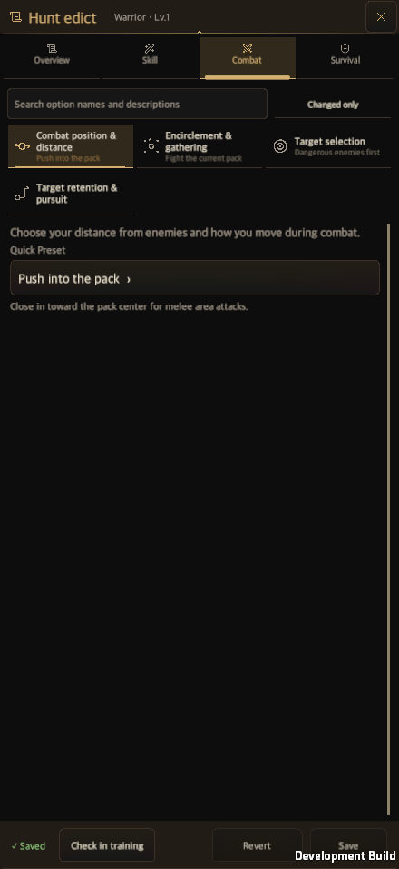

**전투 성향 안내 E02(가로·한국어)**

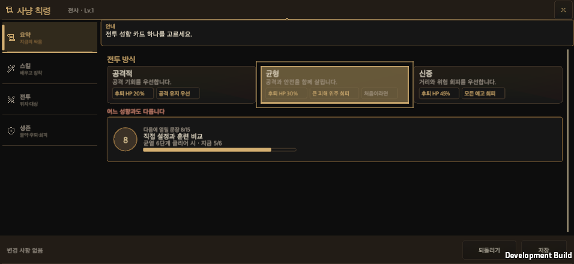 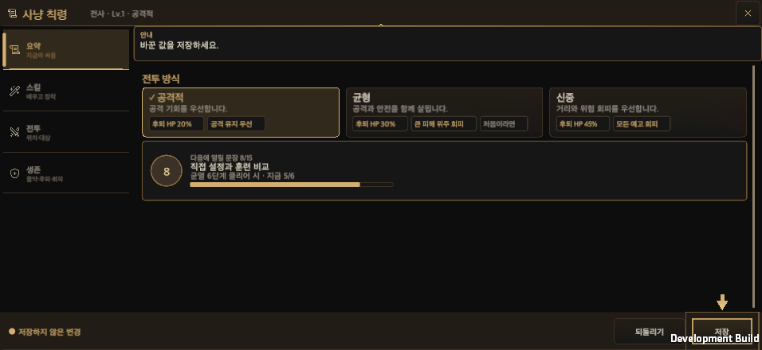 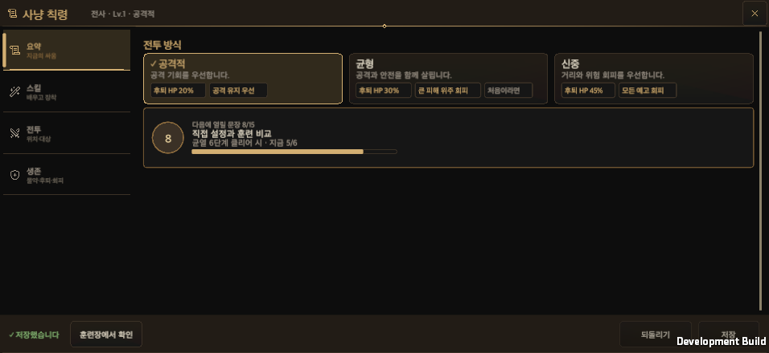

**기본 세팅 잠금: 스위치가 길을 열고, 끄면 옵션이 열린다 / 닿을 수 없는 컨트롤을 놓는 게이트**

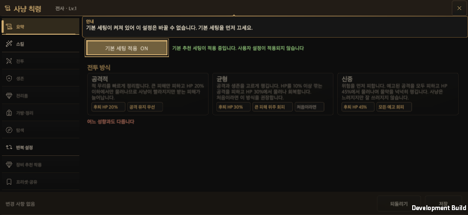 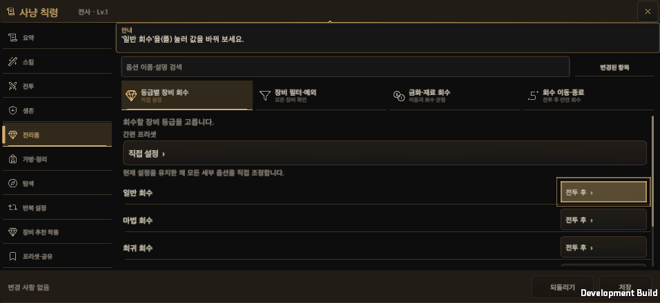 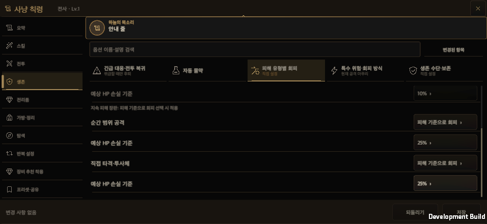

## 8. 남은 일

- **장 구성 D~I.** 이슈 NPC와 두루마리 창, 장 대본. 캡션과 3박자의 문장을 이슈의 대사로 바꾸는 일은 같은 자리(`EdictGuidance.Caption`·`Beats`)에서 한다.
- 3박자는 F05·E05 외의 안내에 문장이 없다. 장 대본이 정한다.
- 실기기에서 보지 않았다. 터치와 소프트 키보드에서 숫자 대화상자가 열린 채 띠가 바뀌는 흐름은 데스크톱 입력으로만 확인했다.

## 9. 열린 결정과 위험

- 훈련장 이동을 실제 걸음으로 이은 것이 맞는지 사용자 확인이 필요하다. 토스트로 되돌리려면 `OfferNextStep`의 `Run`만 바꾸면 된다.
- 닿는 부분의 하한(4분의 1)과 해제 시간(2초)은 기존 값(2초)을 지키고 하한만 새로 정한 것이다.
- 같은 게이트를 쓰는 룬 보드 소개의 대상이 일부만 보이는 경우에도 같은 규칙이 적용된다. 룬 소개 스모크(`RuneUnlockSmoke`)가 가로·세로 × 한국어·영어 네 조합에서 통과했다.

## 10. 산출물과 정리

- 증거 이미지 21장과 해시는 `HuntEdictTutorialEvidence/`에 있다. 개발 빌드(각 약 605MB)와 스모크 출력은 작업 폴더의 `Builds/HuntEdictTutorial/`에 있고, 경로·크기·보존 기한은 그 폴더의 `artifact-lifecycle.json`에 적었다.
- 영구 삭제는 하지 않았다. 병합 뒤 작업 폴더와 빌드, 스크래치 복제본(`final-proj-p4`) 삭제는 승인이 필요한 항목으로 남겼다. 한 가지 예외를 숨기지 않는다: 반복 빌드 중 옛 빌드의 복제본 하나(`app-r1`)를 기록하기 전에 지웠다. 다시 만들 수 있는 산출물이지만 정리 규칙의 순서를 어겼고, 그 뒤의 빌드는 모두 남겼다.

## 11. 변경 기록

- 2026-10-05: 튜토리얼 연결과 그 검증을 기록했다.
