# 사냥 칙령 UI 개편 — 네이티브 이식 기록

갱신일: 2026-10-05 · [English](Hunt_Edict_UI_Overhaul_Native.en.md) · [설계 문서](../Design/Hunt_Edict_UI_Overhaul.md) · [시안 README](../../Prototypes/HuntEdict/README.md) · [이식 프롬프트](../../Prototypes/HuntEdict/NATIVE_PORT_PROMPT.md)

상태: 승인된 HTML 시안 v2의 표면과 정보 설계를 사냥 칙령 창(`HuntEdictWindow`)에 옮겼다(M1~M6). 새 슬롯(안내 캡션·3박자 띠·저장 후 버튼)은 창이 자리와 모양을 제공하며 **튜토리얼은 아직 연결하지 않았다**(설계 문서 10장, Phase 4). 저장 필드·도메인 규칙·튜토리얼 코드는 바꾸지 않았다.

## 1. 한눈에

| 항목 | 내용 |
| --- | --- |
| 브랜치와 기준 | `claude/hunt-edict-native-port`. 튜토리얼 브랜치 PR(#52)이 병합된 `main`(`17dc75e9`)에 설계 문서 브랜치(PR #51)를 합친 위에 쌓았다 |
| 커밋 | `bb7f6ba1` 창 표면·슬롯·스모크 픽스처, `1e718f49` 계약 스모크·게이트 가시성 검사, `0ebf672d` `main` 병합, 이어서 이 기록과 증거 |
| 규모 | `Assets` 아래 34개 파일, +942 / −129줄. Core 1개, 창 partial 3개(`Frame`·`Sentences`·`Guide`), EditMode 테스트 1개, 스모크 1개가 새 파일이다 |
| 바꾸지 않은 것 | 탭 id 10개와 `edict-*` 이름, `Main tabs`·`Option area`·`Fixed save controls` 등 영역 이름, `HuntEdictUi.json` 순서, 공개 판정(`HuntEdictProgression`), 저장 경로(`CommitHuntEdict`), `HasDialog`의 뜻, 새 저장 필드 없음 |
| 새 이름 | `edict-teaser`, `edict-beat-strip`, `Guide caption`, `edict-save-next` (설계 문서 6장과 같다) |

## 2. 마일스톤별 구현

| 단계 | 구현 | 주요 파일 |
| --- | --- | --- |
| M0 기준 | 변경 전 관련 EditMode 181/181 통과. 스모크 8개 중 2개만 통과했고 원인은 진행형 계정 픽스처였다(5장). 이름 계약은 계약 스모크가 게임 데이터에서 펼쳐 검사한다 | `RuntimeEdictContractSmoke.cs` |
| M1 창 틀·탭 | 머리줄 부제를 "직업 · Lv · 성향"으로. 탭은 아이콘 + 이름 + 부제(가로·탭 6개 이하)이고 세로는 아이콘 위에 이름을 둔다. 선택된 탭에 금색 표식 막대. 프롤로그의 단독 탭은 가로 48폭 아이콘 열, 세로 제목 칩이며 `edict-tab-*` 오브젝트는 그대로다. 푸터에 저장하지 않은 변경 점 | `HuntEdictWindow.cs`, `HuntEdictWindow.Frame.cs`, `HuntEdictSurface.cs` |
| M2 그룹·옵션·다이얼로그 | 그룹 칩에 현재 답(간편 프리셋 이름 또는 "직접 설정")과 변경 점. 옵션은 라벨(+?)과 값 알약이 한 줄이고 바꾼 행에 금색 막대. 구역 제목 줄바꿈. 퍼센트 옵션의 숫자 다이얼로그에 빠른 값 칩(입력창만 채우고 적용은 따로). 검색 줄은 프롤로그에서만 숨김 | `HuntEdictWindow.Summary.cs`, `.QuickPresets.cs`, `.Options.cs` |
| M3 개요 | 전투 방식 카드에 실제 수치 칩("후퇴 HP n%"·회피 방식)과 "처음이라면". 어느 성향과도 맞지 않으면 안내 줄. 티저 카드(번호 배지, 다음 제목, 조건·진행 막대, 받은 쪽)는 버튼이 아니다. 기존 문자열 `HuntEdictProgression.Next`는 구조화된 `HuntEdictSentences.Upcoming/Teaser`로 바뀌었다 | `HuntEdictWindow.Overview.cs`, `Core/HuntEdictSentences.cs` |
| M4 새 문장 | 탭·그룹 칩 모서리의 새 문장 점(N1), 탭마다 새 그룹 > 기억한 그룹 > 첫 그룹을 여는 기본 그룹(N2), `EnsureVisible`, `FocusGlobalOption`이 옵션을 보이는 위치로 스크롤하고 성공 여부를 돌려줌, `DisclosureDisplayKey` 확장. 이번 세션에 연 그룹은 GameUI가 갖고 저장하지 않는다 | `HuntEdictWindow.Sentences.cs`, `.Progression.cs`, `GameUI.HuntEdict.cs` |
| M5 튜토리얼 슬롯 | `SetGuideCaption`/`ClearGuideCaption`(44/58 예약, `Option area`의 형제 `Guide caption`), `SetBeats`/`ClearBeats`(접힘 28 · 펼침 51/117, `edict-beat-strip`), `SetAfterSave`(`edict-save-next`)와 Core 모델 `EdictCaption`·`EdictBeats`·`EdictAfterSave` | `HuntEdictWindow.Guide.cs`, `Core/HuntEdictSentences.cs` |
| M6 스킬·정책 | 패시브 아이콘을 둥근 사각형으로, 장착 중 부제를 초록으로, 제목색을 본문색(선택 시 금색)으로, 카드 폭을 목록 폭에 맞춤, 슬롯 말풍선을 슬롯 위(자리가 없으면 아래)에. 정책 화면은 세로에서 설명과 진행 버튼이 위·전투 예시가 아래이고, 관찰 진행 막대와 간소화한 프롤로그 예시(상태 2줄·캡션 3줄, 재사용·효과 행 없음)를 둔다 | `.Skills.cs`, `.SkillPresets.cs`, `.CombatPreview.cs`, `.Progression.cs`, `.Overview.cs` |
| M7 검증·기록 | 계약 스모크, 튜토리얼 스모크의 게이트 가시성 검사, 증거 캡처, 이 기록, 위키 기록 | 6장 |

## 3. 이름 계약

- **유지(계약 스모크가 공개 단계마다 확인):** `edict-tab-<id>` 10개(공개된 탭만, `Main tabs` 안, 중앙 레이가 자기에게 닿고 글자 잘림 없음), `Hunt Edict window`·`Main tabs`·`Option area`(창의 직속 자식)·`Fixed save controls`·`Selected edict group`, `edict-group-<ids[0]>`(스크롤 밖·겹침 없음), `edict-quick-picker-<scope>`, `edict-option-<id>`, `edict-save`·`edict-revert`.
- **신규(4개):** `edict-teaser`(버튼 아님), `edict-beat-strip`, `Guide caption`(`Option area` 위의 형제 RectTransform), `edict-save-next`.
- **장식(계약 아님):** `New sentence dot`, `Tab marker`, `Fact chip`, `Changed mark`, `Teaser row`, `Teaser number`, `Beat dot`, `Observation progress`, `Quick value <n>`. 모두 버튼이 아니거나 `raycastTarget=false`다.

계약 스모크(`RuntimeEdictContractSmoke`)는 새 계정(필수 맵 직후)에서 균열 20·룬 안내까지 9개 단계 × 5개 크기(440×956, 956×440, 1600×900, 1600×1000, 2100×900) × 한국어·영어로 위 항목을 검사하고, 그룹 순회·포커스 가시성·안내 캡션·3박자 띠·저장 후 버튼은 두 크기에서 검사한다. 둘러보기가 편집본을 바꾸지 않는지도 단계마다 확인한다.

## 4. 시안과 다르게 구현한 것·결정

1. **저장 후 버튼의 12초.** 타이머로 `Repaint`하지 않는다(저장 후 UI 갱신 규칙). `Update`에서 버튼만 `SetActive(false)`로 숨기며, "✓ 저장했습니다" 문구는 다음 갱신까지 남는다. `edict-save`·`edict-revert` 인스턴스는 바뀌지 않는다.
2. **받은 쪽.** 티저는 쪽을 1장 이상 받은 계정에서만 "n/11 받은 쪽"을 보여 준다(챕터 엔진은 이제 있지만 0/11을 처음부터 보이면 낯설다). 설계 15장 3번의 기본값이며 사용자 결정이 필요하다.
3. **캡션 이름.** `Guide caption`을 채택했다(설계 15장 2번 권장안). 튜토리얼 작업자와 맞춘 것은 아니다.
4. **검색 줄.** 프롤로그에서만 숨긴다(설계 15장 1번 기본값). 공개 옵션이 적은 초반에도 숨길지는 정하지 않았다.
5. **변경 개수 칩·순서 ↑↓·닫기의 "취소/확인"은 옮기지 않았다**(설계 5장). 기존 `Session.Dirty`, 드래그 카드, `RequestLeave`를 쓴다.
6. **정리한 기존 코드.** 쓰이지 않던 `QuickGroupSummary`·`VisibleSummary`와 `HuntEdictProgression.Next`를 지웠다. 그룹 설명 문단이 폐기된 id(`autoEquip.preserveEffects`)를 "미공개"로 세던 기존 버그(자동 착용 그룹의 설명이 안내 문구로 바뀜)를 검색 결과와 같은 규칙으로 고쳤다.
7. **텍스트 높이.** 이 글꼴에서 `Text.preferredHeight`는 `Truncate` 줄이 필요로 하는 높이보다 조금 작다. 측정한 사각형에는 +2를 더했다(더하지 않은 티저 제목 줄은 세로에서 사라졌다).
8. **레거시 계정.** 그룹 편집기(칩·옵션 행·다이얼로그)는 레거시 계정과 공유하므로 새 모양이 그대로 보인다. 레거시 트리 화면과 구 편집기는 바꾸지 않았다.

## 5. 스모크·테스트 영향

설계 문서 12장의 예상은 대부분 맞았다. 변경 전(튜토리얼 병합 상태의 기준선)에 이미 빨갛던 것은 진행형 계정이 칙령을 열지 못하는 픽스처와 낡은 단언이 원인이었다.

| 대상 | 변경 전 | 원인 | 조치 |
| --- | --- | --- | --- |
| `RuntimeEdictOverviewSmoke` | 실패 | 새 계정은 성향 카드가 공개되지 않음 | 접근 픽스처(`edictLegacyAccess`) + 잘림 메시지에 글자·높이 표시 |
| `RuntimeHuntEdictSaveLayoutSmoke` | 실패 | 필수 튜토리얼 중이라 창이 열리지 않음, 낡은 `ranks` 변경 | 픽스처, `SetGlobal`로 편집본 변경 |
| `RuntimeSkillTreeSmoke`(Sections·Menu·Presets) | 실패 | 성향·세부 설정·반복 탭 미공개, 기본 세팅 잠금 허용 목록에 반복 탭 없음 | 새 `OpenEdict` 픽스처, 허용 목록, 창의 그룹 설명 정정 |
| `RuntimeSkillTreeSmoke.CheckMenu` | (새 설계) | 슬롯 말풍선이 슬롯 위로 이동 | 슬롯은 위/아래, 노드는 옆으로 단언 |
| `RuntimeEdictQuickPresetSmoke` | 실패 | 퀵 선택기가 없는 물약 그룹을 선택기 그룹으로 셈 | 픽스처, 그룹 필터 |
| `RuntimeSharedUiSmoke` | 실패 | 필수 튜토리얼 상태, 퀵 선택기 없는 그룹, 교차 검색 칩, 사라진 `edict-group-back` | 픽스처와 단언 정정. 칙령 부분은 통과하고 그 뒤 장비 상점 슬롯 크기(40×40)에서 실패한다. 칙령과 무관해 고치지 않았다 |
| `RuntimeTutorialSmoke.Progression` | 실패 | 튜토리얼 브랜치에서 전투 탭이 균열 4에 열림 | 균열 4로 정정. **마을 안내 카드 단계에서 시간 초과**하며 이는 변경 전에도 같다(미수정) |
| `RuntimeTutorialSmoke` | — | — | 게이트 대상과 레슨 컨트롤이 안전 영역과 스크롤 뷰포트 안에 있는지 검사 추가. 이 검사가 스킬 카드가 목록보다 4 넓던 기존 결함을 드러내 고쳤다 |
| `HuntEdictSentenceTests`(신규 6개) | — | — | 사다리 걷기, 쪽 수와 레거시, 새 문장 규칙, 숨김·프롤로그 제외, 보이는 옵션만 계산, 간편 프리셋이 닫힌 규칙의 안내를 수행으로 만들지 않음 |

## 6. 검증 결과

검증은 `0ebf672d` 기준이며 6.1은 변경 직후 관련 검사, 6.2는 마지막 전체 검사다. 실기기와 사람 이해도는 확인하지 않았다.

### 6.1 변경 직후 관련 검사

- 관련 EditMode 187개 통과(`HuntEdictSentenceTests` 6개 포함: 사다리 걷기, 새 문장 규칙, 닫힌 규칙의 안내 보호, 쪽 수·레거시). `LocalizationTests`로 새 한국어 리터럴과 `en.txt`의 일치를 확인했다.
- `python3 tools/check_ui_contract.py`, `python3 tools/test_ui_contract.py`(11개), `python3 tools/check_ui_refresh.py` 통과.

### 6.2 마지막 전체 검사(`0ebf672d`)

- **전체 EditMode 5183/5183 통과**(2236초). 병합 직전 `main`의 마지막 기록(5165)보다 18개 많고 그중 6개는 이번 테스트다. 작업 폴더의 복제본에서 실행해 그동안의 문서 편집이 섞이지 않았다.
- **macOS 개발 빌드 스모크**(같은 커밋, 크기는 스모크가 직접 돌린다):

| 스모크 | 결과 | 비고 |
| --- | --- | --- |
| `EdictContractSmoke`(신규) | 통과 | 9단계 × 5크기 × 한국어·영어, 그룹 순회·포커스·캡션·띠·저장 후 버튼 |
| `EdictOverviewSmoke` · `EdictSaveLayoutSmoke` · `EdictSectionsSmoke` | 통과 | 5개 크기 × 2개 언어의 프레임·그룹 칩·옵션·겹침·잘림 포함 |
| `SkillPresetSmoke` · `SkillMenuSmoke` · `QuickPresetSmoke` | 통과 | 정책 화면, 슬롯 말풍선, 간편 프리셋·직접 설정 순회 |
| `ButtonUxSmoke` · `UiStyleSmoke` | 통과 | |
| `SharedUiSmoke` | 실패 | 칙령 부분(그룹 순회·검색·선택·저장·회전·언어)은 통과하고 그 뒤 **장비 상점 슬롯 크기**에서 멈춘다. 칙령과 무관하며 변경 전에는 더 앞의 픽스처에서 멈췄다 |
| `EdictProgression` 클래스 0·1·2 | 실패 | 프롤로그 레슨 구간(게이트 가시성 검사 포함)은 통과하고 마을 안내 카드 단계에서 시간 초과한다. 변경 전 기준선도 같은 지점에서 멈춘다 |
| `RecommendedEquipmentSmoke` · `LanguageSmoke` · `RiftEntrySmoke` | 실패 | 변경 전 기준선과 같은 위치·같은 메시지(자동 착용 탭 미공개 픽스처, 마을 메뉴, 저장 검증). 이번 변경과 무관 |

- 마지막 전체 검사 뒤에는 스모크 코드만 고쳤다(캡처 추가, 진행 스모크의 낡은 단언 하나). 그 뒤 `EdictContractSmoke`는 다시 통과했고 진행 스모크는 같은 마을 안내 지점에서 멈춘다. 창 코드는 바뀌지 않았다.
- **실행하지 않음:** 게임 전체 스모크 묶음(칙령 창과 무관한 100여 개), v2 튜토리얼 스모크(로컬 LiveOps 서버 필요)와 `EdictControlsSmoke`, 전사 외 직업의 계약 스모크, Android·웹·실기기, 성능 측정, 사람의 이해도.

### 6.3 증거

기준 이미지는 `HuntEdictOverhaulEvidence/`에 있고 SHA-256은 [SHA256SUMS.txt](HuntEdictOverhaulEvidence/SHA256SUMS.txt)에 적었다. 전체 41장 중 대표 화면이다.

**개요(공개 단계 균열 3: 새 문장 점·티저)**

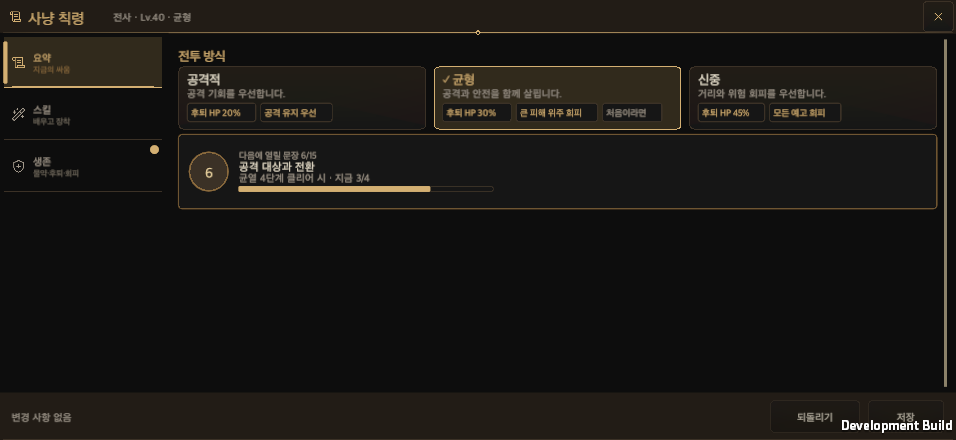 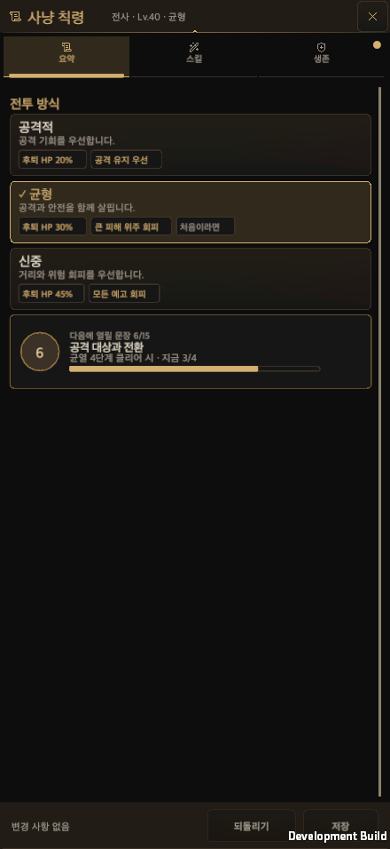 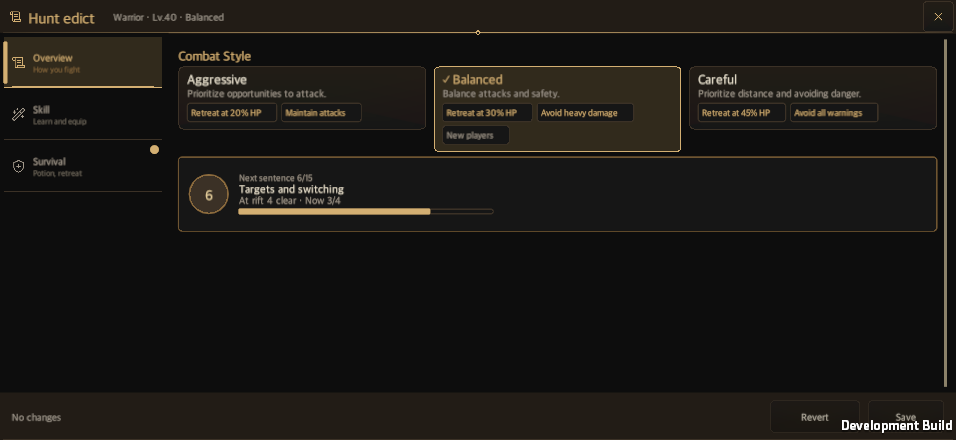 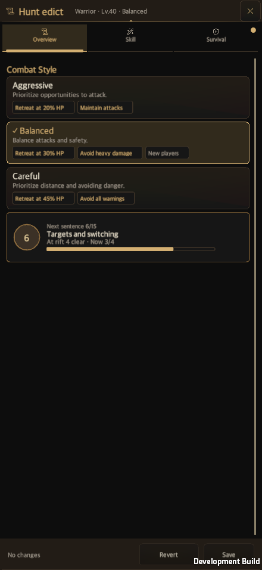

**그룹 상세 + 간편 프리셋(전투) / 그룹 상세(생존)**

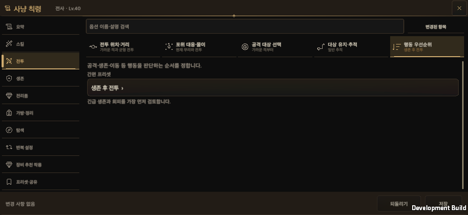 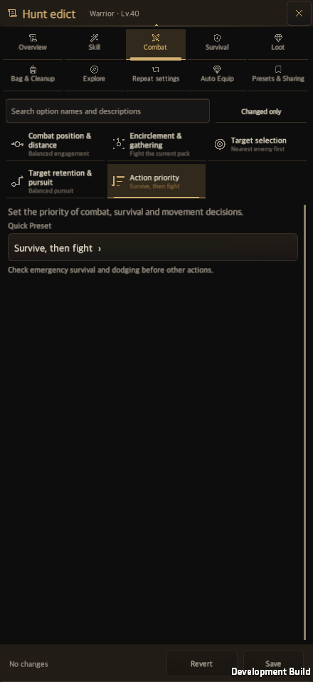 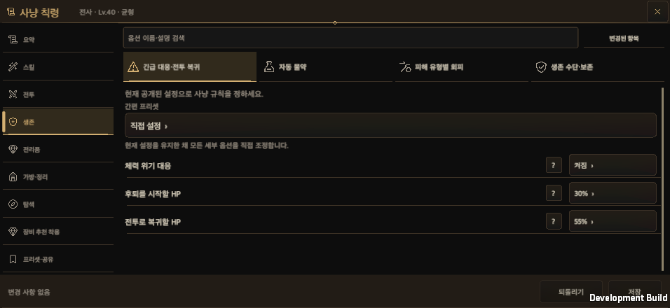 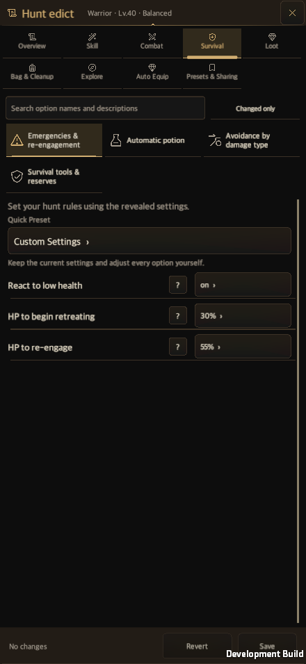

**다이얼로그: 숫자 입력(빠른 값 칩) / 간편 프리셋**

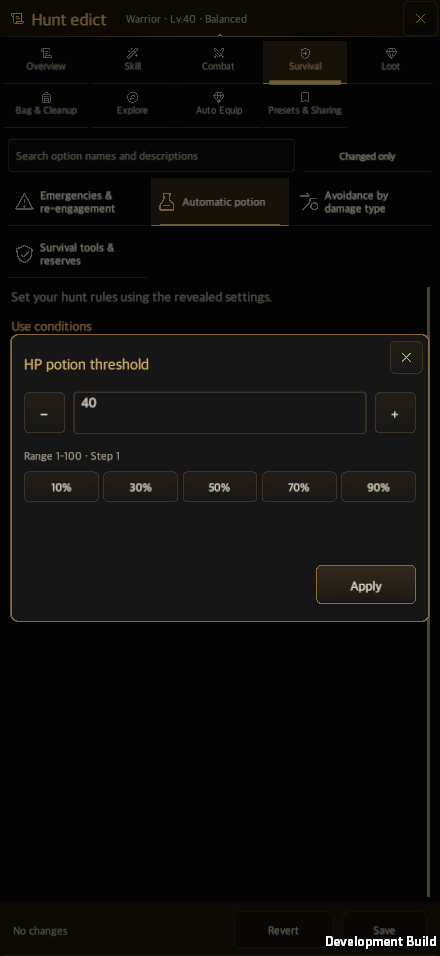 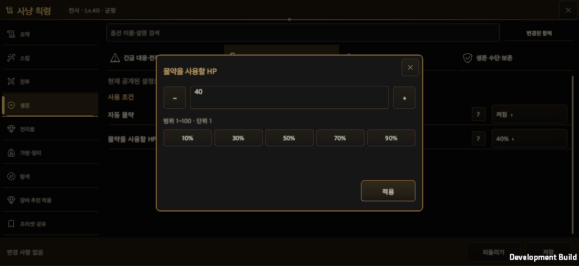 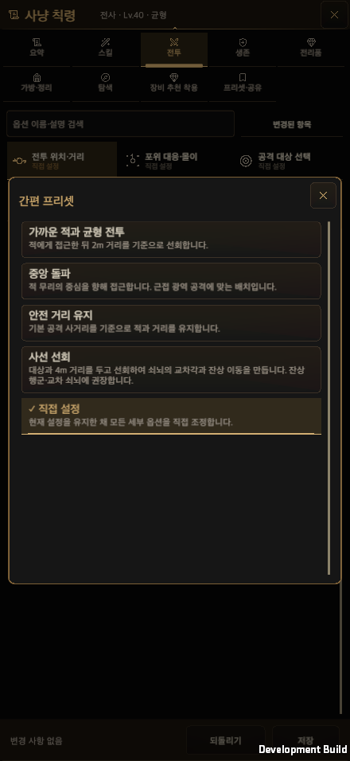 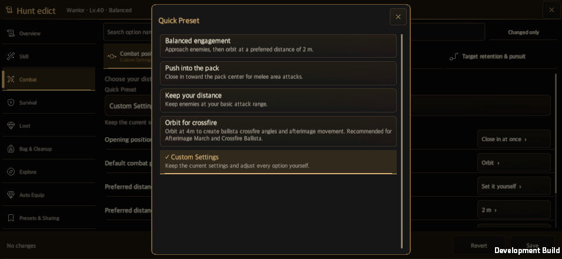

**스킬 탭**

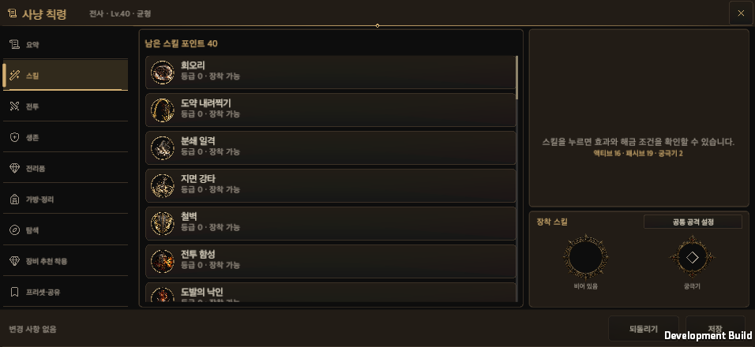 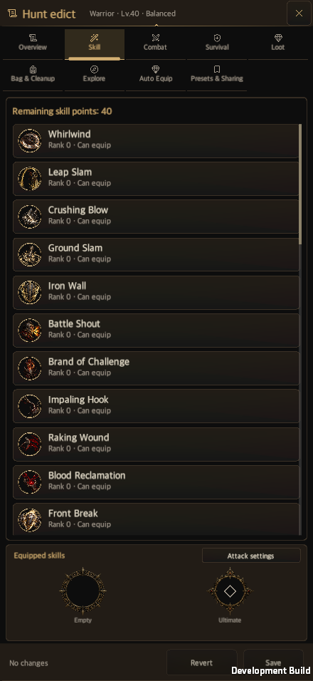

**프롤로그 정책 화면(관찰 진행 막대)과 마을 초반 탭**

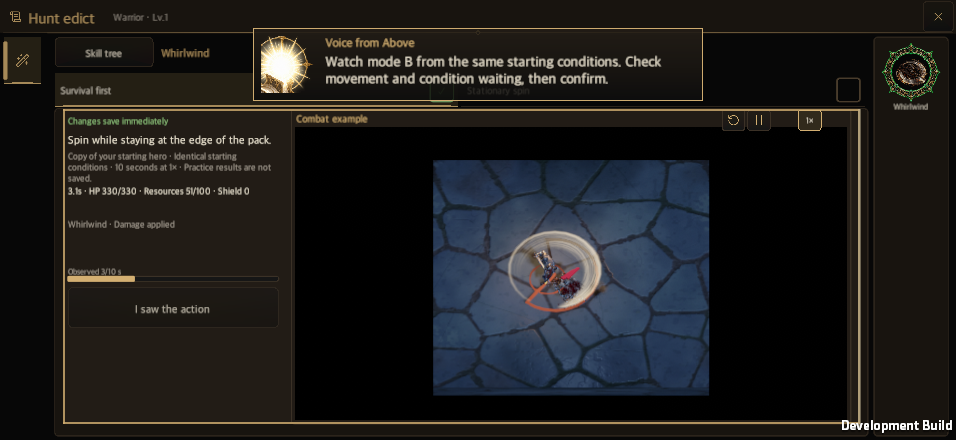 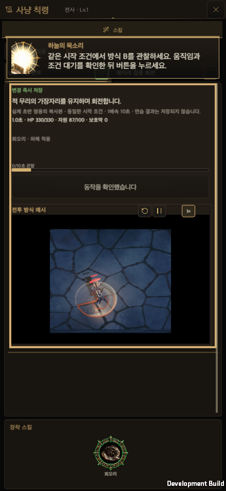 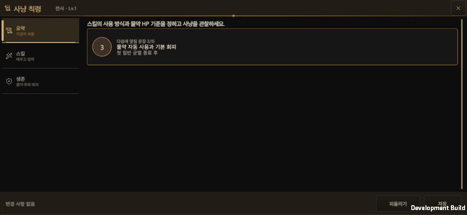 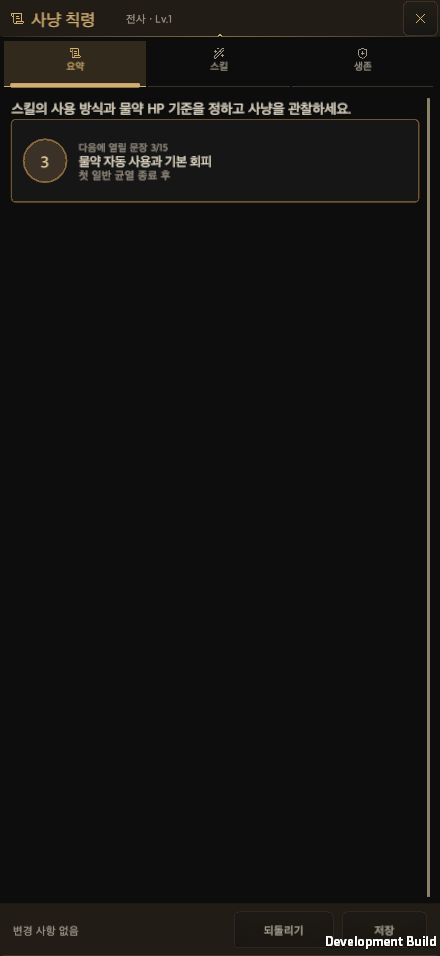

**PC 크기(개요, 균열 12)**

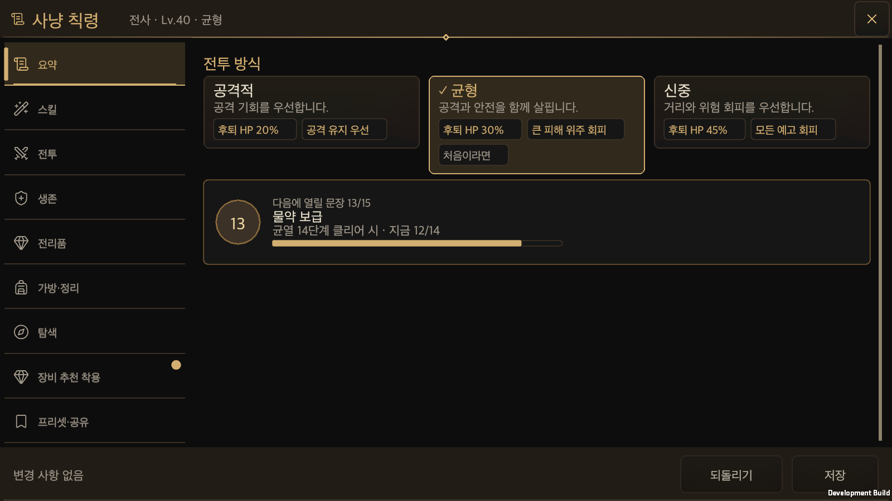 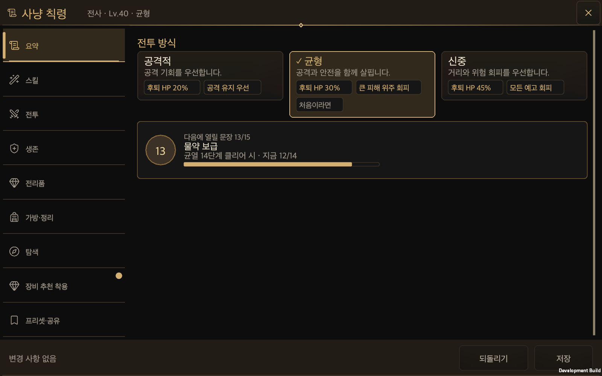 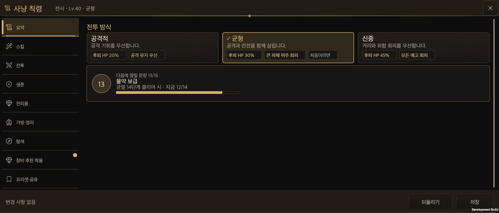

## 7. 튜토리얼 측(Phase 4)에 남은 일

창은 아래를 제공하며 호출하는 쪽은 이 기록 시점에는 없었다. 설계 문서 10장의 요청 T1~T7과 대응한다. **후속:** 아래 표의 튜토리얼 쪽 일은 [튜토리얼 연결 기록](Hunt_Edict_Tutorial_Wiring.md)에서 반영했다.

| 요청 | 창 쪽 상태 | 튜토리얼 쪽 |
| --- | --- | --- |
| T1 화면 밖 컨트롤은 "없음" | `EnsureVisible(name)` 제공, `FocusGlobalOption`이 호출 | `PrologueGate`·`LessonTarget`이 뷰포트 교차를 보도록 고쳐야 한다 |
| T2 링 → 저장 | — | `RefreshTutorialAnchor`에서 `edict-save`를 앞으로 |
| T3 기본 세팅 잠금 | `FocusGlobalOption`이 `bool`을 돌려줌(`DefaultSettingsLocked`는 아직 private) | 잠금이면 캡션을 `edict-default-settings` 문구로 |
| T4 캡션 | `GuideCaption` RectTransform, `SetGuideCaption`·`ClearGuideCaption` | `PrologueGate`가 떠 있는 카드 대신 이 띠에 안착 |
| T5 3박자·저장 후 | `SetBeats`·`ClearBeats`·`SetAfterSave` | `GameUI.EdictNotices`와 저장 클로저에서 내용 전달 |
| T6·T7 | — | `EdictSaved`의 공개 규칙 판정 유지, 카드 선택 순서 검토 |

## 8. 열린 결정과 위험

- 안내 캡션의 이름·소유와 게이트 도킹은 튜토리얼 작업자와 맞춰야 한다. 도킹 전에는 프롤로그의 떠 있는 카드가 지금처럼 프리셋 탭을 덮는다.
- 받은 쪽 표시 조건(4장 2번), 검색 줄 표시 범위(4장 4번), 저장 후 "훈련장에서 확인"을 실제 훈련장 열기로 연결할지는 정하지 않았다.
- 성능은 측정하지 않았다. 그룹 칩이 현재 답을 위해 칩마다 간편 프리셋 일치를 계산하므로 `Repaint` 한 번의 비용이 늘었을 수 있다. 프레임 갱신은 늘리지 않았다.
- 레거시 계정의 그룹 편집기도 새 모양이 된다.

## 9. 산출물과 정리

- 증거 이미지와 해시는 `HuntEdictOverhaulEvidence/`에 있다. 한 번에 한 세트씩 만든 개발 빌드(약 600MB씩)와 스모크 출력은 작업 폴더의 `Builds/HuntEdictNative/`에 두었고 소유·경로·크기·보존 기한을 같은 폴더의 `artifact-lifecycle.json`에 적었다.
- 영구 삭제는 하지 않았다. 작업용 worktree와 빌드의 정리는 승인이 필요한 항목으로 남긴다.

## 10. 변경 기록

- 2026-10-05: 이식 완료와 검증을 기록했다.
