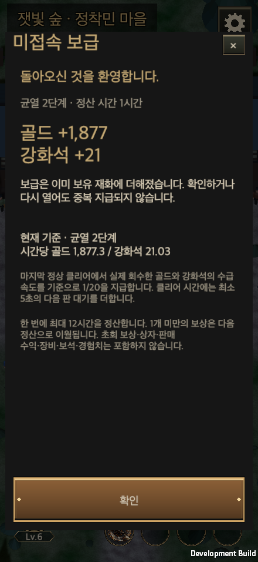
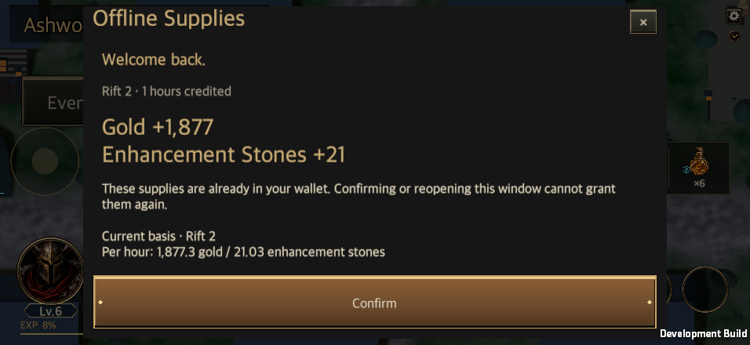

# Idle hunting and Offline Supplies

Updated: 2026-09-24 · [한국어](Idle_Offline_Supplies.md)

Online **idle hunting** earns the same rewards as normal combat. **Offline Supplies** grant only gold and enhancement stones at **1/20** of the recorded hunting rate. The same time interval must never earn both.

## Real online hunting

The existing `GameController` continues its 0.05-second `CombatSimulation`: movement, exploration, skills, potions, chests, pickup, bosses and leveling remain real. Dimming reduces presentation only. Peek reveals the current simulation and returns to the dimmed view after ten seconds.

`RepeatHunt` applies the saved Hunt Edict: repetition, same/next tier after success, same/lower tier/stop after failure, failure limits, and count/time/gold/equipment/tier goals. The completed result and rewards are saved before cleanup, potion preparation, the result delay and the next admission. Invalid configuration, full storage, fatigue exhaustion and save failures stop the loop visibly. Entering idle does not silently enable repetition or change loot policy.

Desktop players keep executing when focus changes. OS suspension is not online hunting. App suspension preserves the fight and requires an explicit resume. A new attendance day cannot automatically open an attendance popup during idle hunting.

## Offline economy

Offline Supplies unlock after Rift 1. The account stores the **hero and tier of the last normal clear**. Selecting another hero or a higher tier, or failing a run, does not replace this basis. Training, sweeps and abandoning the loot phase do not replace it either.

| Parameter | Value |
| --- | --- |
| Gold basis | Field gold actually collected during the last normal clear, including enemies, the boss and a treasure goblin if collected |
| Stone basis | Enhancement stones actually collected in that run |
| Cycle time | `max(simulated combat time, real combat elapsed time) + max(5 seconds, configured result delay)` |
| Payout rate | 5% of that recorded rate |
| Cap | 12 hours between settlements |
| Interval | From the later of the last saved presence time and content activation to reconnect |
| Fractions | Fractional gold and stones carry into the next settlement |
| Excluded | First-clear grants, ordinary chests and reward boxes, sales/salvage, materials, equipment, gems, runes, cores, Abyssal Coins and XP |

`grant = floor(previous fraction + recorded amount × eligible offline seconds / (recorded cycle seconds × 20))`

For a 200-second cycle yielding 2,000 gold and 20 stones, the active reference is 36,000 gold and 360 stones per hour. One offline hour grants **1,800 gold and 18 stones**; twelve hours grant **21,600 gold and 216 stones**. Twelve offline hours equal 36 minutes at the same reference rate: 30% of two hours of successful cycles under matching conditions. Failures and cleanup time change the realized comparison. This does not apply to equipment, gems or XP.

There is no universal fixed rate for all characters at a tier. Actual kills, pickup rules, gold bonuses and clear speed update the basis after every normal clear. A random event such as a goblin in the last run affects the next supply rate. A minimum five-second transition avoids assuming zero turnaround between runs.

### Existing saves

Schema 14 introduces the dedicated ledger. Older completed reviews have no resource ledger, so migration prefers the last normal clear's hero and tier; if unavailable, it uses the selected hero's highest clear. The UI labels this estimate until a new normal clear replaces it.

The temporary estimate uses basic gold from enemies equivalent to 100 boss-gate points, plus boss gold and the existing boss stone formula. Rifts 1–5 account for doubled gate gain and use a 105-second cycle; later tiers use 185 seconds. A longer recorded clear time takes precedence. These are **migration estimates**, not a fixed payout table for new runs.

| Rift | Gold / 1h | Stones / 1h | Gold / 12h | Stones / 12h |
| --- | ---: | ---: | ---: | ---: |
| 1 | 1,971.43 | 20.57 | 23,657.14 | 246.86 |
| 5 | 2,657.14 | 34.29 | 31,885.71 | 411.43 |
| 10 | 2,724.32 | 29.19 | 32,691.89 | 350.27 |
| 25 | 4,913.51 | 58.38 | 58,962.16 | 700.54 |
| 30 | 5,643.24 | 68.11 | 67,718.92 | 817.30 |
| 100 | 15,859.46 | 204.32 | 190,313.51 | 2,451.89 |
| 250 | 37,751.35 | 496.22 | 453,016.22 | 5,954.59 |
| 500 | 74,237.84 | 982.70 | 890,854.05 | 11,792.43 |
| 1000 | 147,210.81 | 1,955.68 | 1,766,529.73 | 23,468.11 |

## Persistence and presentation

The payout, cursor, fractions and receipt commit in one transaction. Failure pins the interval and prevents other writes from skipping it. Presence timestamps cannot move backwards. Reconnecting, repeating a settlement, reopening the window or acknowledging its receipt cannot award twice. At the integer wallet cap, overflowing whole rewards are discarded rather than trapping the account in a permanent failed transaction.

The town now saves a presence checkpoint every three seconds too, preventing time spent with the town open from becoming offline time after a crash. Normal exit and app suspension also save. A forced termination uses the last successful checkpoint and retains a checkpoint-sized timing uncertainty.

The return popup displays already credited currency, eligible time, tier and current hourly rate. It can be reopened from the sanctuary menu. `OfflineSuppliesWindow` uses the shared `ContentWindowView`, theme, fonts, scroll body and fixed confirmation area. Rendering never grants rewards; confirmation only acknowledges the receipt through `GameStore`.

## Server module and deployment boundary

There is no production account authentication, backend or server clock yet. The development client still uses local storage and device time. It is not secure against local file or clock tampering.

`AuthoritativeRiftVerifier` is included only in Editor tests and `UNITY_SERVER` builds. Its host supplies an authenticated account's **server-owned, admitted run checkpoint**. It replays the same `CombatSimulation`. Requests contain a lease ID, run ID, sequence and cumulative tick count. They contain no damage, rewards, equipment, tier, seed or clock claims.

- Excess ticks relative to server time, foreign owners/leases/runs, sequence gaps and changed replay payloads are rejected.
- Requests are limited to 200 ticks, with a 30-second lease timeout after the last acceptance. Expired intervals cannot become catch-up combat.
- `IHuntAuthorityRepository.CompareExchange` atomically stores the account, rewards, tick cursor and sequence. Stale writers and failed writes do not adopt the result.
- Terminal runs use the same `RepeatHunt` next-tier and stop calculation. Rewards and offline rates come only from the replay.

**Not yet deployed:** host authentication, exclusive account lease issuance/handoff, server seed/admission issuance, the actual transactional database, transport, portal cleanup/potion/new-run command wiring, and server-time disconnect/reconnect settlement. Running this module inside a client is not anti-cheat protection. Production must never accept uploaded client saves as authoritative account data. It must run the shared `OfflineSupplies` calculation against trusted time and intervals that do not overlap an online lease.

## Validation

All **276 focused Edit Mode tests passed** (179 core checks, 45 build/preset persistence regressions and 52 reward/outcome regressions) in Unity 6000.6.0f1, covering supplies, authority replay, repeats, clocks, unlocks, fatigue, attendance and core crafting. Replaying and restarting the authority every ten seconds matched normal combat: 43 kills, 2,288 gold, 12 stones, XP, clear status and reward RNG. Fault cases cover failed saves, altered/replayed requests, foreign owners, excess speed, expired leases and clock rollback.

A native macOS development Player started with a fresh level-one Warrior and starter equipment. **224.33 seconds at real 1x** cleared Rifts 1 and 2 with zero failures, reaching level 6 and earning 4,704 gold, 26 enhancement stones and 30 materials. There were no gear upgrades or progression grants. The saved NEXT/count-two edict and an attendance date rollover were exercised; attendance rewards were not claimed.

The last R2 basis was 1,250 field gold and 14 stones over **119.85 seconds**, including roughly 114.85 seconds of combat and the five-second transition. An injected one-hour offline interval granted **1,877 gold and 21 stones**, retaining approximately 0.34668 gold and 0.02628 stones. The OS clock was not changed. Pointer acknowledgement, reopening and save reload did not duplicate rewards.

All **20 layout combinations** passed scroll, text-height, fixed-button and native UI pointer checks: 440×956, 956×440, 1600×900, 1600×1000 and 2100×900; Korean/English; 100%/150% text. After capture, the English time label was shortened from `hours credited` to `h credited`; behavior and layout are unchanged. Physical mobile suspension, thermal and battery validation remains separate.

The R1–1000 forecast also removes offline materials and uses 5% of proposed recurring field gold/stones. All 23 model tests passed, with no modeled gold/material/stone shortage under the 180-day, two-active-hours/day scenario. This validates a planning model, not an actual R1000 playthrough.

[Numeric evidence](IdleOfflineEvidence/validation.json) · [Native checks](IdleOfflineEvidence/runtime.txt) · [Edit Mode XML](IdleOfflineEvidence/editmode.xml) · [Save regression XML](IdleOfflineEvidence/save-regression.xml) · [Reward regression XML](IdleOfflineEvidence/reward-regression.xml) · [Source hashes](IdleOfflineEvidence/source-hashes.json)

Owners: [combat](../../Assets/HELLSCRIPT/Runtime/Core/CombatSimulation.cs), [repeat policy](../../Assets/HELLSCRIPT/Runtime/Core/RepeatHunt.cs), [supply calculation](../../Assets/HELLSCRIPT/Runtime/Core/OfflineSupplies.cs), [persistence](../../Assets/HELLSCRIPT/Runtime/Core/GameStore.cs), [authority replay](../../Assets/HELLSCRIPT/Runtime/Core/AuthoritativeRiftVerifier.cs).
