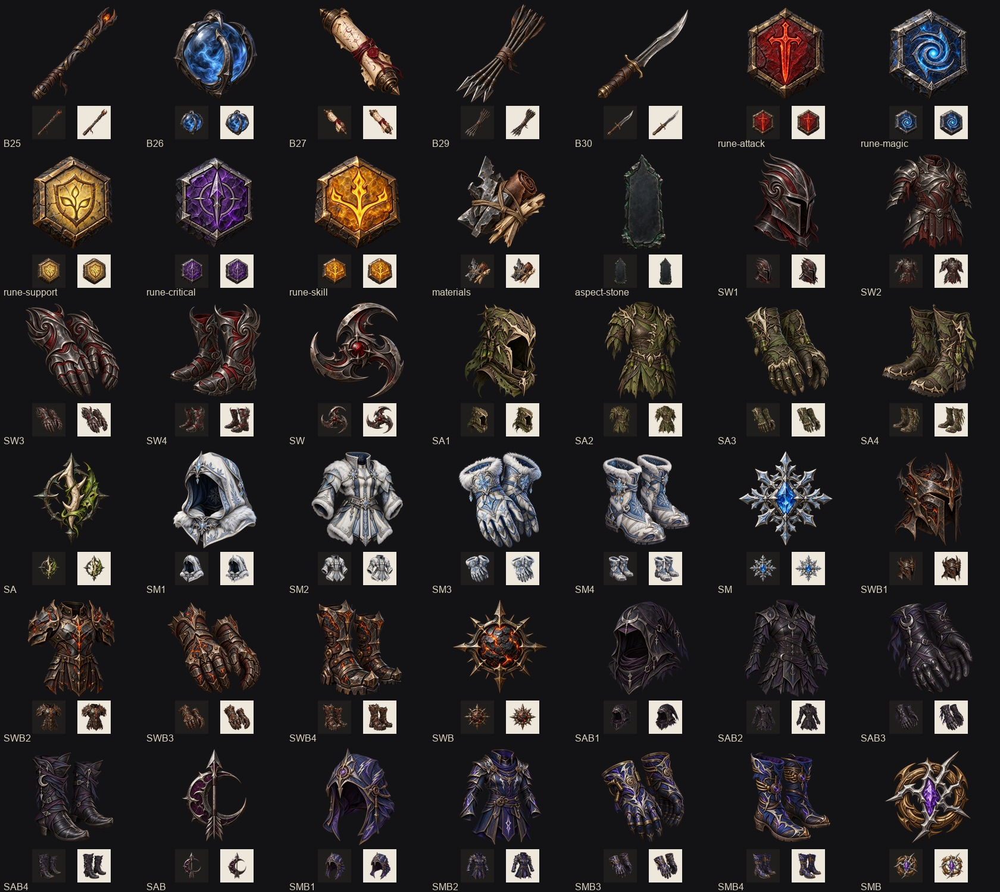
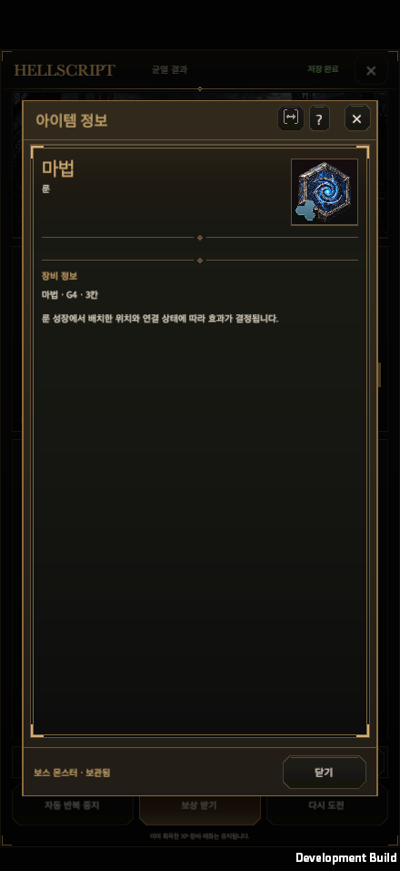
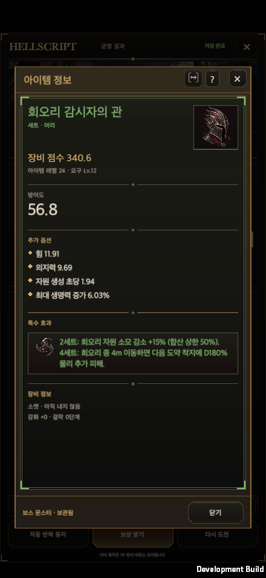

# 아이템 이미지 누락 보완

갱신일: 2026-09-30

영어판: [Item artwork coverage](Item_Art_Coverage.en.md)

## 발견한 문제

균열 결과의 룬은 능력치용 선 아이콘을 사용했다. 마법 룬에 하트가 붙는 등 실제 다섯 계열과 문양이 맞지 않았다. 일반 재료와 강화석은 같은 마름모로 표시됐고, 전설 코어는 부위를 구분하는 기존 그림이 연결되지 않았다.

전체 아이템 목록을 대조하니 기본 장비 5개와 기존 6세트의 장비 24개도 전용 이미지가 없었다. 기본 장비는 벡터 도형을 사용했고, 세트 장비는 일반 장비 그림으로 대체되고 있었다. 기존 세트의 문양 6개도 미제작 상태였다. 이전 기록의 전설 141개·신규 세트 장비 105개 연결과 이번 누락 보완은 별개다.

## 제작 및 연결 범위

| 구분 | 수량 | 처리 |
| --- | ---: | --- |
| 기본 장비 B25·B26·B27·B29·B30 | 5 | 한손 지팡이·오브·스크롤·화살·단검을 새로 제작했다. |
| 기존 세트 SW·SA·SM·SWB·SAB·SMB | 24 | 각 세트의 머리·몸통·손·발 그림을 새로 제작했다. |
| 기존 세트 문양 | 6 | 세트별 재질·색·문양을 장비와 맞춰 제작했다. |
| 룬 5계열 | 5 | 공격은 빨강, 마법은 파랑, 보조는 노랑, 치명타는 보라, 스킬 보너스는 금색으로 구분했다. |
| 일반 제작 재료 | 1 | 금속·가죽·목재를 묶은 재료 그림을 제작했다. |
| 위상 각인석 바탕 | 1 | 실제 돌의 질감을 그렸으며, 위상별 고유 문양은 기존 코드로 겹쳐 표시한다. |
| 강화석·부위별 코어·골드 | 기존 그림 | 보상과 지갑에서 공통 이미지 조회를 사용하도록 연결했다. |

신규 PNG는 총 42개다. 정상적으로 사용 중인 기존 아틀라스 24칸, 전설·신규 세트 그림, 보석·물약·보상 상자 그림은 그대로 사용한다.

## 공통 표시와 데이터 소유

- 기본·전설·세트 장비는 EquipmentArt와 EquipmentSlotView를 사용한다. 인벤토리·창고·상점·대장간·보상·상세·비교에서 원래 장비 ID에 해당하는 그림을 표시한다.
- CurrencyIconView.ForResource가 재료·강화석·8부위 코어·보석을 구분한다. 보상 슬롯과 상세창은 같은 조회 결과를 사용한다. 골드와 일반 재료는 지갑에서도 래스터 이미지를 사용한다.
- RuneItemArt는 RuneV13Catalog.TypeIds로 그림을 찾는다. 보상에서는 실제 소유 룬의 모양을 작은 표식으로 함께 보여 주고, 룬 보관함·선택 상세·합성·변환에서는 배치용 모양 옆에 계열 그림을 붙인다.
- 룬 보드의 육각 점유·회전·연결과 능력치 기호는 배치 정보를 전달하는 기존 그래픽이다. 이 기능을 그림으로 대체하지 않는다. 위상 각인석도 위상 ID별 문양을 유지한다.
- ItemDetailView.CreateDefinition에 표시 전용 그림 콜백을 추가했다. 비장비 보상의 상세도 공통 카드 안에서 그림을 표시하며 RewardSnapshot 출처를 유지한다.
- 이미지와 문양은 입력을 가로채지 않는다. 저장·획득·장착·분해·드롭 확률·능력치 계산은 기존 도메인 거래가 담당한다.

## 원본과 출처

[생성 요청](../Art/ItemIcons/requests.json), [기존 세트 요청](../Art/ItemIcons/legacy-set-requests.json), [이미지 명세](../Art/ItemIcons/manifest.json)에 ID·경로·프롬프트·원본 파일명·해시를 기록한다. 내장 imagegen을 사용해 투명 PNG를 생성했으며, 원본 픽셀과 알파를 변경하지 않고 복사했다. 배경 제거·크로마키는 사용하지 않았다.

기본 요청 모델은 gpt-image-2이지만 내장 도구가 실제 모델명을 반환하지 않는다. 따라서 확인된 모델로 표기하지 않으며 모든 신규 파일은 candidate_model_unknown으로 기록한다. 게임 연결 여부와 생성 모델 확인·최종 아트 승인 여부는 구분한다.

Unity에서는 새 아이템 그림을 최대 512픽셀로 가져오며 알파·Clamp·Bilinear를 사용하고 밉맵은 끈다. 기존 GUID와 자산은 보존한다.

## 검증

python3 tools/audit_item_art.py는 기본 장비·전설·세트·문양·룬·보석·물약·보상 상자·재화를 실제 파일과 대조한다. 기능상 필요한 룬 도형, 위상 식별 문양, 월드 드롭 위치 표식, 조작 버튼과 빈 슬롯은 누락 이미지로 세지 않는다.

[파일 조사](ItemArtEvidence/file-audit.json)는 614개 항목의 이미지 누락 0개를 확인했다. [원본 알파 검사](ItemArtEvidence/native-alpha.json)는 신규 42개 모두 RGBA·완전 투명 픽셀·원본 바이트 보존을 확인했다. 아래 미리보기의 밝고 어두운 48픽셀 배경에서 테두리와 식별성을 확인했다.

전체 Edit Mode 검사는 한 번 실행했다. 4,747개 중 4,699개 통과, 48개 실패, 건너뜀 0개였다. 47개는 기존 main 재현 기록과 같은 저장·복원 실패 항목이며 이번 작업은 해당 도메인 코드를 바꾸지 않았다. 나머지 1개는 제작 중이던 기존 세트 이미지 누락이었다. 42개 제작 완료 후 [이미지 관련 검사 15개](ItemArtEvidence/art-final.xml)가 모두 통과했고, 위상석 비율 유지 보완 후 [해당 검사 1개](ItemArtEvidence/aspect-final.xml)도 통과했다. 전체 검사를 다시 통과한 것으로 표시하지 않는다. [전체 결과와 기존 실패 대조](ItemArtEvidence/full-suite.json)

macOS Metal 개발 빌드는 오류 0으로 생성했다. 실제 실행본에서 세로 440×956·가로 956×440·PC 1600×900·1600×1000·2100×900, 한국어·영어, 글자 크기 100%·120%의 20개 보상 표시·클릭 조합을 확인했다. 세트 상세 6종과 지갑 3개 크기도 확인했다. 실제 uGUI 레이캐스트를 거친 합성 포인터로 룬·코어·세트 상세를 열었고, 소유 데이터가 유지되는지 비교했다.

검증 준비 중 발견한 스킬 미습득·부모 객체 형 변환 문제는 개발용 검사 코드에서 수정했다. 이미 통과한 20개 조합과 세트·지갑 검사는 반복하지 않았다. 남은 각인석·룬 보관함은 첫 방문의 출석·안내 기록을 먼저 처리하고, 룬 창을 닫아 일시 정지 상태가 복원된 뒤 계정 전체가 같은지 확인했다. [실행 범위와 결과](ItemArtEvidence/runtime-validation.json) · [마지막 두 화면 기록](ItemArtEvidence/secondary-runtime.txt)

추가 macOS 운영체제 포인터 확인은 cua_repl의 noWindowsAvailable 오류로 완료하지 못했다. 앱 경로 재선택·창 활성화 후에도 같았다. 위 결과는 macOS 실행본의 uGUI 합성 입력 검증이며, 운영체제 마우스 입력이나 모바일 실기기 검증으로 표시하지 않는다.

위키 생성·무결성 검사는 통과했다. Python 검사 11개 중 예전 벡터 아이콘을 기대하던 1개는 새 PNG와 원본 해시·공개 이미지 사본을 확인하도록 수정한 뒤 해당 검사만 다시 통과했다. JavaScript 검사는 문서 444개·DB 32개·상세 4,298개와 검색·필터·이력·공개 읽기 전용 사본·날짜 표시를 통과했다. [위키 검사 기록](ItemArtEvidence/wiki-validation.json)

공개 위키 게시는 병합된 main에서 수행한다. 작업 브랜치의 생성 결과를 공개 배포 완료로 표시하지 않는다.

