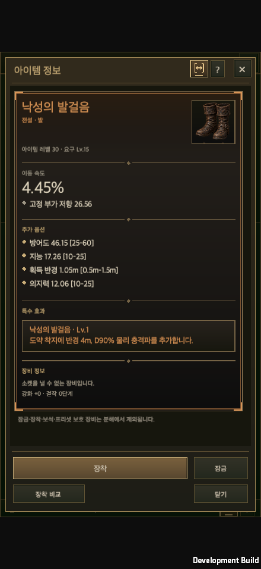
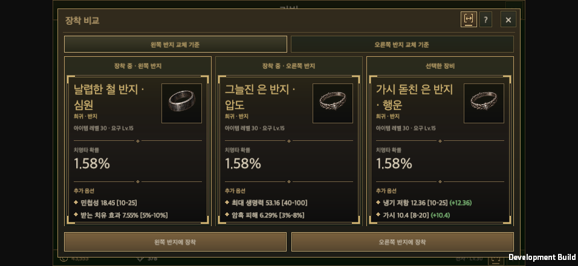
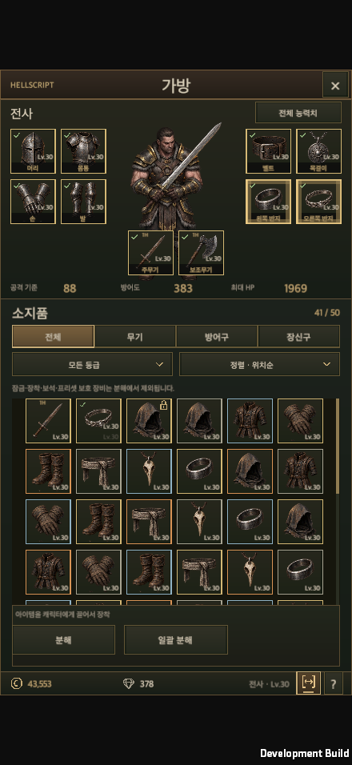
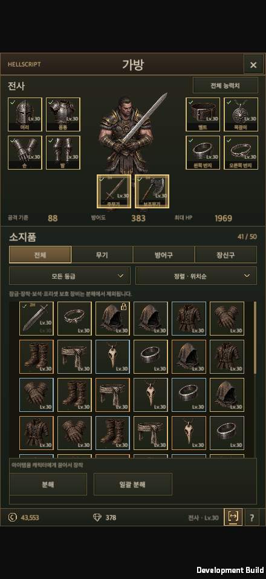
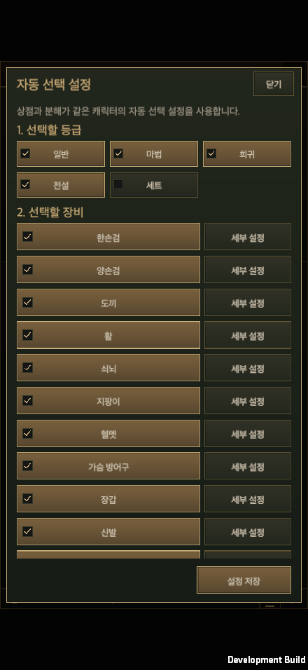
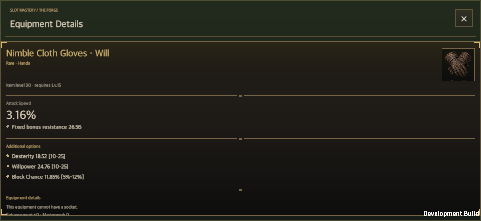

# Item cards and drag-to-equip guidance

Date: 2026-09-22 · [한국어](Item_Card_Polish.md)

## Changes

Shared `ItemDetailView` now uses rarity-tinted corner metalwork, a dark surface, dividers, a prominent primary value, affix markers and a special-power inset. Existing identity, values, ranges, sockets, progression, lock/equipped states, comparison deltas and lost properties remain intact. Detail/comparison bounds are fixed; long content scrolls inside them.

Dragging inventory equipment illuminates eligible character slots. Two-handed weapons indicate both hands and accept either as the drop target while retaining one main-hand instance. Rings, warrior dual wield, mage/ranger and offhand compatibility, level and bag-space conditions use `EquipmentSlots.PlanDrop` and the existing transaction path. Drop, cancellation, focus loss and reflow clear the highlight.

Auto-selection settings no longer show the disabled Unique option. The game has Normal, Magic, Rare, Legendary and Set rarities; `UniqueItemDefinition` defines legendary powers, not an independent rarity. Reserved mask bit 4 and Set bit 5 remain unchanged for saved data. Remove the redundant settings button from the inventory footer while preserving the bulk-salvage entry.

The [shared comparison contract](../Design/Equipment_Comparison_Rules.en.md) records the presentation and references.

## Validation

- Unity 6000.6.0f1 Edit Mode: **108 passed, 0 failed, 0 skipped**. Equipment/drop planning, saved-mask compatibility, comparison, shared UI and localization. [XML report](../../Artifacts/Validation/item-card-polish/editmode.xml)
- macOS development build succeeded. An isolated save uses actual uGUI events, raycasts and transactions. Tested 440×956 portrait, 956×440 landscape, and 1440×810, 1440×900, 1680×720 desktop windows in Korean/English at 100%/150% text, capturing 41 screenshots. [Runtime result](../../Artifacts/Validation/item-card-polish/runtime-result.txt)
- Verified shared cards and preserved content in details, three-card ring comparisons, salvage inspection, storage, shop and forge. A separate range run covered inventory/storage/shop/acquisition details and comparisons, both Ctrl keys, preference persistence/reload, stable rows and scroll. [Range results](../../Artifacts/Validation/item-card-polish/ranges-result.txt)
- Shared UI ownership check and 9 contract regression tests passed. Ran wiki build/check, 10 Python tests and JavaScript route checks.
- These are isolated native macOS tests, separate from the user's open Editor save. Mobile dimensions are simulated in a desktop player. **Physical-mobile touch/performance was not tested.**

## Representative captures

