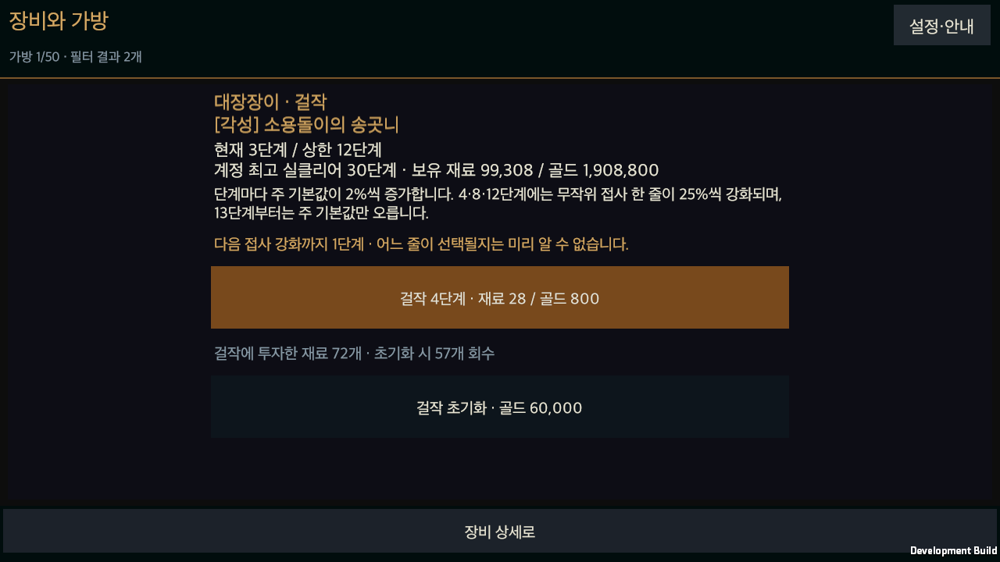
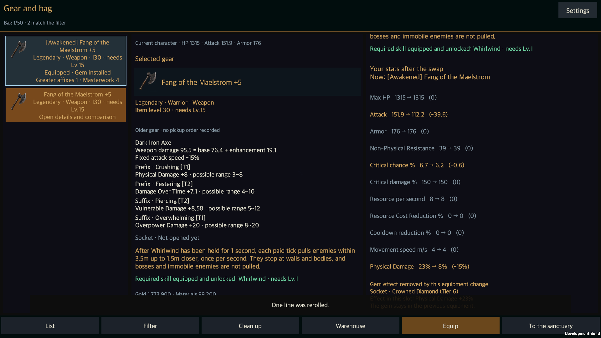

# 각성·상위 접사·걸작 장비 품질

작성일: 2026-09-13 · [English](Item_Quality_Expansion.en.md)

상태: 기능·저장·macOS 화면 검증을 마쳤다. 1,800회 전투 비교는 진행 중이며, 이 기록을 전체 밸런스나 게임 개발 완료로 해석하지 않는다.

## 장비 생성과 전투 수치

[장비 품질 상세안](../Design/HELLSCRIPT_Item_Quality_Detail.md)의 세 층을 기존 일반·마법·희귀·전설 등급 위에 연결했다. 희귀 이상 균열 장비는 20단계부터 각성할 수 있다. 확률은 `min(0.5, max(0, 0.02 × (R − 19)))`이며, 각성 시 주 기본값에 1.25를 곱하고 접사 품질 하한을 4000으로 올린다. 각 접사는 독립적인 10% 추첨으로 상위 접사가 될 수 있다. 상위 접사는 품질 10000·T1·일반 최고값의 1.5배를 사용한다.

몬스터·보스의 공통 장비 드롭, 자동 생성 상자의 장비 보상과 소탕에 실제 균열 단계를 전달한다. 상점과 두 제작 서비스는 각성 추첨을 하지 않는다. 모든 신규 생성 경로의 아이템 레벨은 60으로 제한한다. 기존 저장에 있는 레벨 60 초과 장비는 수치와 레벨을 보존한다. 신규 획득 상한을 적용하기 위해 이미 보유한 장비를 낮추지는 않는다.

주 기본값은 강화·각성·걸작 배율을 각각 한 번씩 곱한다. 무기 피해, 방어구 방어도, 목걸이 HP와 반지 저항에 같은 계산을 적용한다. 베이스의 고정 부가 저항과 공격속도에는 각성·걸작을 다시 곱하지 않는다. 상위 접사와 걸작 접사 강화도 저장된 원래 접사 값에서 한 번씩 계산한다.

## 대장장이와 장비 화면

강화 +5를 마친 장비를 한 단계씩 걸작으로 올릴 수 있다. 상한은 계정의 최고 실클리어 `H`에 따라 `min(200, 12 + 3 × max(0, H − 30))`으로 정한다. 단계마다 주 기본값에 1.02를 곱하고, 4·8·12단계에서만 무작위 접사 한 줄을 25% 강화한다. 같은 줄이 여러 번 선택되면 `1 + 0.25 × 횟수`로 합산한다. 13단계부터 접사 강화 횟수는 늘지 않는다.

다음 단계 `k`의 비용은 재료 `20 + 2k`와 골드 `200k`다. 걸작 12단계까지는 재료 396개와 15,600골드가 든다. 200단계까지는 재료 44,200개와 4,020,000골드가 든다. 강화·걸작 거래는 장비의 소유권, 균열 진행 여부, 견적 이후의 장비 변경과 저장 성공을 확인한다. 실패한 저장을 재시도할 때 걸작의 무작위 접사 선택도 같은 요청을 사용한다.

초기화는 `2,000 × max(1,I)`골드를 받고 **실제로 걸작에 투입한 재료만** 80% 내림하여 돌려준다. 걸작 단계와 강화된 접사 목록을 지우고 일반 강화, 각성, 상위 접사와 보석은 유지한다. 초기화 이후 분해할 때 일반 강화 재료를 중복으로 돌려주지 않는다.

장비 목록과 상세에 각성 이름 표지·별도 테두리·상위 접사 개수·걸작 단계를 표시한다. 각성 장비 필터, 품질을 포함한 교체 후 능력치, 기본값의 개별 배율과 접사의 실제 범위도 연결했다. 대장장이 화면에는 현재 상한, 다음 비용, 다음 접사 강화까지의 단계와 지금까지 강화된 줄을 표시한다. 상위 접사 재설정은 줄 선택 화면과 최종 확인 화면에서 상위 효과가 사라진다는 사실을 안내한다.

[화면 배치 상세안](../Design/HELLSCRIPT_Screen_Layout_Detail.md)에 맞춰 기존 장비 화면의 세로·가로 배치와 하단 확인 버튼을 사용한다. 문구는 한국어·영어를 함께 제공한다. 이번 기능에 이미지, 모델, 씬·프리팹·패키지를 추가하거나 변경하지 않았다.

## 저장 계약과 복구

장비 데이터 버전은 4다. `awakened`, `masterwork`, `masterworkLines`, `AffixRoll.greater`를 저장한다. 총투입 재료인 `investedMaterials`에는 일반 강화와 걸작을 함께 기록하고, `masterworkInvestedMaterials`에 실제 걸작 투입분을 따로 기록한다. 이 보조 원장으로 초기화와 분해의 환급 범위를 구분한다.

품질 정보 또는 버전 4의 전투 기록 장비가 있는 계정은 저장 형식 버전 3을 사용한다. 장비 가방과 창고가 모두 비어 있어도 이전 실행 파일이 전투 기록의 품질 필드를 지우지 못하도록 계정 수준에서 차단한다. 한번 높인 저장 버전은 장비와 기록을 없애도 낮추지 않는다. 정상적인 기존 버전 1·2 저장은 계속 읽는다.

걸작 단계가 0~200 밖이거나 강화 조건이 깨지면 걸작을 0으로 복구한다. 현재 진행도로 열린 상한보다 높은 정상 걸작은 보존하고 추가 진행만 막는다. 없는 접사 ID와 허용 개수 밖의 접사 강화 기록은 해당 항목만 제거한다. 상위 표시와 품질 값이 모순되면 원래 접사 값을 유지하고 상위 효과를 제거한다. 잘못된 각성 조건은 각성 효과를 제거하여 읽는다. 복구 시 장비 자체는 유지한다.

복구값을 저장하기 전에 원본을 `*.quality-recovery-*.json`으로 보관한다. 보석 오류를 함께 고친 경우에는 기존 `*.gem-recovery-*.json` 원본 하나를 두 복구 기록에서 공유한다. 원본 보관에 실패하면 불러오기를 중단한다. 보유 장비뿐 아니라 공유 창고, 중단된 균열의 드롭·상자, 반복 사냥의 대기 결과와 전투 기록 사본도 같은 품질 복구를 적용한다.

## 완료한 검증과 진행 중인 확인

최종 소스의 [Unity Edit Mode 전체 검사](../../Artifacts/Validation/item-quality-editmode.xml) **2,442개가 모두 통과**했다. 품질 전용 62개에는 실제 드롭·상자·소탕 경로, 상점·제작 제외, 200단계 비용, 8부위 수치, 초기화 환급, 저장 실패·중복 요청·재시작과 기존 저장 보호를 포함한다. 전투 기록에만 품질 장비가 남고 모든 가방이 비어 있는 계정도 저장 형식 버전 3으로 보호한다.

같은 소스로 만든 `Builds/macOS-ItemQuality/HELLSCRIPT.app`의 초기 실행·재시작·손상 복구 **세 프로세스가 모두 통과**했다. 별도 저장에서 재화와 장비를 명시적으로 준비한 뒤 실제 화면 버튼 이벤트로 걸작 진행, 중복 클릭, 실패한 저장의 재시도, 오래된 견적 차단, 상한, 초기화와 상위 접사 재설정을 검사했다. 손상 복구 후 원본 보관 파일이 수정 전 바이트와 같은 것도 확인했다. 사용자의 기존 저장은 사용하지 않았다.

한국어·영어 화면 15장을 직접 검토했다. 140% 글자 크기의 세로·짧은 가로 화면, 비용과 환급, 저장 오류, 장비 교체 수치, 각성 필터와 상점의 레벨 60 표시를 확인했다. 스크롤 영역 밖 내용은 의도적으로 잘리며 짧은 가로 화면은 서비스 버튼까지 스크롤한 상태로 검사했다. OS 입력·모바일 터치 시험은 아니다. [검증 요약](../../Artifacts/Validation/ItemQuality/validation-summary.json), [소스·빌드 근거](../../Artifacts/Validation/ItemQuality/validated-source.json), [화면 검토 목록](../../Artifacts/Validation/ItemQuality/visual-review.json)을 함께 보관한다.

30단계의 실제 장비 생성 100,000회에서 각성 장비는 21,944개, 상위 접사는 8,809줄, 상위 접사가 하나 이상 있는 각성 장비는 7,550개였다. 별도의 20·25·30·40·44·100단계별 100,000회 추첨도 고정 시드에서 기획 확률과 비교했다. 확률 보장과 개별 획득 보장을 혼동하지 않는다.

기획서 5.2의 조건을 분리한 실제 타격 계산은 기본 피해 153.5032, 품질 적용 피해 278.3303으로 **1.813189배**였다. 아이템 레벨 30·강화 +5, 각성·걸작 12와 무기의 6단계 금강석을 사용했다. 기존 가산 피해 60% 조건을 명시적으로 맞춘 시험이므로 모든 빌드의 평균 피해 증가율을 뜻하지 않는다. 상위 접사와 무작위 걸작 접사 강화의 추가 효과는 별도의 검사에서 확인한다.

30·45·60·75·90단계, 여섯 빌드, 시드 30개, 품질 유무를 조합한 **1,800회 전투 비교를 실행 중**이다. 품질 장비는 실제 생성기의 각성 결과와 상위 접사 추첨을 사용하며, 일반 강화와 걸작 서비스로 상한까지 올린다. 대조 장비는 같은 베이스·고유 효과·원래 접사 값을 유지하고 품질 층만 제거한다. 각 쌍의 지형과 적 배치는 같아야 한다. 보석·룬 보드는 넣지 않는다. 영웅 레벨·계정 진행도·투자 재화는 명시적으로 배치한 시험 조건이며 자연 성장이나 파밍 소요 시간의 측정값이 아니다.

전투 비교는 `Focus5-inputs.json`의 고정 소스로 실행 중이다. 이후 변경은 저장 버전 보호·오류 문구·화면·번역·검사 보강이며, 비교에 쓰는 장비 생성·걸작·전투 계산은 바꾸지 않았다. 최종 앱·전체 검사는 `Build3-inputs.json`과 `Full4-inputs.json`이 같은 소스를 사용했음을 확인했다. 진행 중인 비교 파일을 최종 앱의 완료 결과로 바꿔 적지 않는다.

남은 작업은 전투 비교 종료와 결과 분석, 자연 성장·파밍 비용 검증이다. 실제 모바일 입력과 장시간 성능, 보석 보관 방식의 사용자 결정과 획득·서비스 연결은 별도 미완료 항목으로 유지한다. 메인과 공개 위키에는 기능 검증 결과를 먼저 반영하고, 전투 비교의 최종 판정은 완료 후 별도 기록한다.

## 화면 검증 근거

| 검사 화면 | 원본 |
|---|---|
| 초기 장비 상세 | [PNG](../../Artifacts/Validation/ItemQuality/Native3/initial-01-quality-detail-ko.png) |
| 걸작 한국어 | [PNG](../../Artifacts/Validation/ItemQuality/Native3/initial-02-masterwork-ko.png) |
| 세로·큰 글자 | [PNG](../../Artifacts/Validation/ItemQuality/Native3/initial-03-masterwork-en-portrait.png) |
| 짧은 가로 | [PNG](../../Artifacts/Validation/ItemQuality/Native3/initial-04-masterwork-en-short-landscape.png) |
| 접사 강화 확인 | [PNG](../../Artifacts/Validation/ItemQuality/Native3/initial-05-milestone-confirm-en.png) |
| 저장 실패 | [PNG](../../Artifacts/Validation/ItemQuality/Native3/initial-06-save-failure-en.png) |
| 상한·접사 강화 | [PNG](../../Artifacts/Validation/ItemQuality/Native3/initial-07-cap-and-affix-boosts-en.png) |
| 초기화 환급 | [PNG](../../Artifacts/Validation/ItemQuality/Native3/initial-08-reset-confirm-en.png) |
| 상위 접사 경고 | [PNG](../../Artifacts/Validation/ItemQuality/Native3/initial-09-greater-reroll-warning-en.png) |
| 교체 후 능력치 | [PNG](../../Artifacts/Validation/ItemQuality/Native3/initial-10-quality-comparison-en.png) |
| 각성 필터 | [PNG](../../Artifacts/Validation/ItemQuality/Native3/initial-11-awakened-filter-en.png) |
| 상점 레벨 60 | [PNG](../../Artifacts/Validation/ItemQuality/Native3/initial-12-shop-level-cap-en.png) |
| 재시작 복원 | [PNG](../../Artifacts/Validation/ItemQuality/Native3/restart-01-restored-masterwork-en.png) |
| 손상 복구 안내 | [PNG](../../Artifacts/Validation/ItemQuality/Native3/recover-01-quality-recovery-notice-en.png) |
| 투입 재료 보존 | [PNG](../../Artifacts/Validation/ItemQuality/Native3/recover-02-recovered-investment-en.png) |

구현 근거: [품질 계산과 서비스](../../Assets/HELLSCRIPT/Runtime/Core/ItemQuality.cs), [장비 화면](../../Assets/HELLSCRIPT/Runtime/Presentation/GameUI.ItemQuality.cs), [품질 검사](../../Assets/HELLSCRIPT/Tests/Editor/ItemQualityTests.cs), [전투 비교 실행기](../../Assets/HELLSCRIPT/Editor/BuildIntegrationValidation.ItemQuality.cs), [앱 검증 조건](../../Assets/HELLSCRIPT/Runtime/Presentation/RuntimeItemQualitySmoke.cs).
