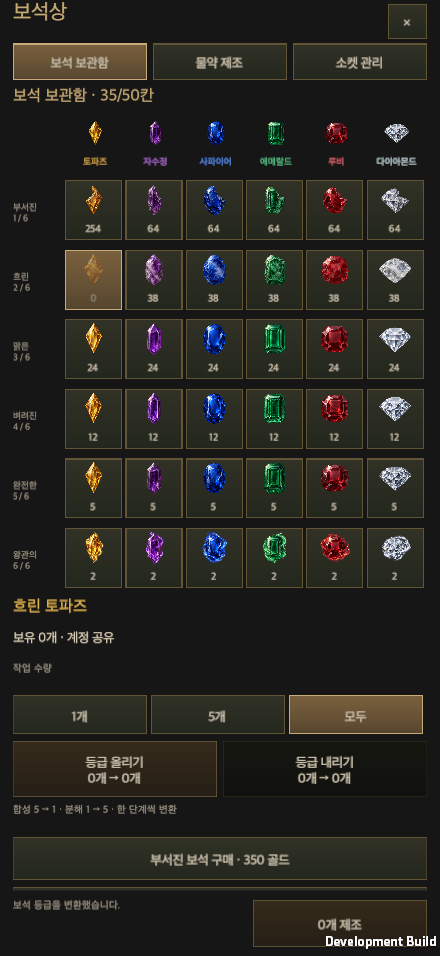
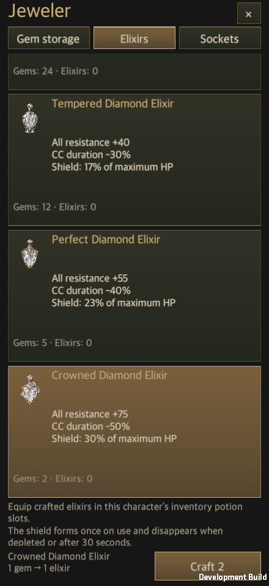
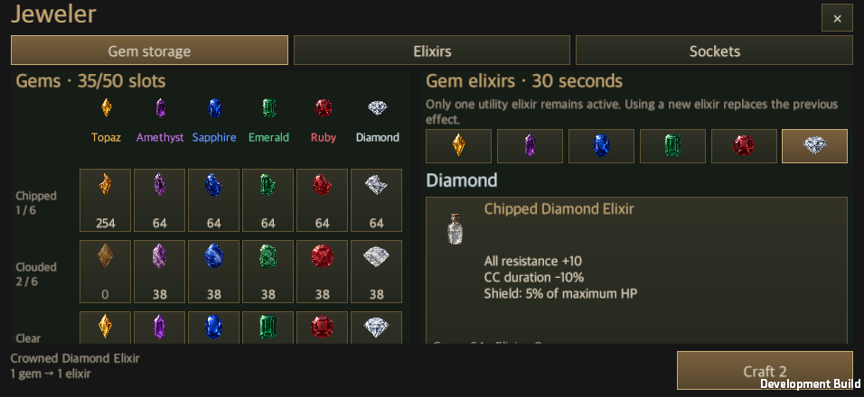
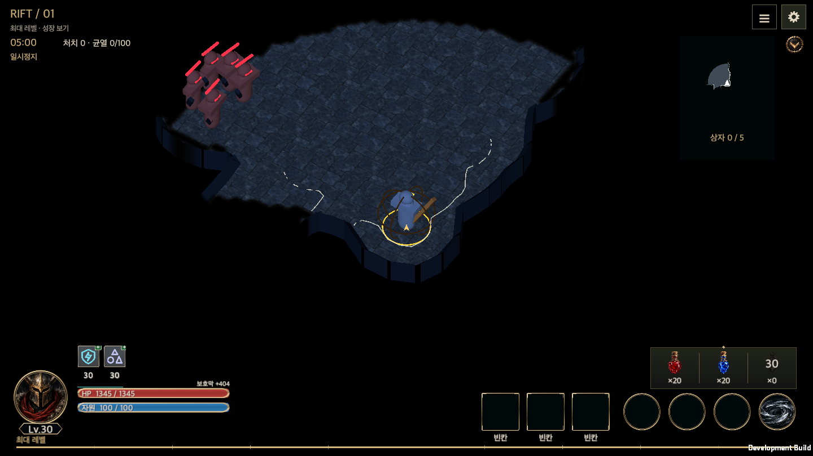

# 보석상 NPC 콘텐츠

갱신일: 2026-09-23
영어판: [Jeweler runtime](Jeweler_Runtime.en.md)

마을의 **보석 상인**에게 접근해 **보석상 열기**를 누르면 보석 변환과 물약 제조 창을 연다. 보석 구매와 소켓 관리는 같은 창에서 이어진다. 보석을 처음 얻으면 기존 보석 콘텐츠 해금 규칙을 적용한다. 이동 중인 캐릭터를 멈추고, 창을 닫으면 같은 NPC 앞에서 조작을 재개한다.

## 거래와 보관

- 보석은 기존 계정 공용 보관함을 사용한다. 한 묶음에 최대 999개이며 기존 보관 칸 수를 유지한다.
- 같은 종류·등급의 보석 **5개 → 바로 위 등급 1개**, **1개 → 바로 아래 등급 5개**로 변환한다. 골드는 들지 않는다. 기존 보관함·귀환 포털의 합성도 5:1로 통일한다.
- `1개`, `5개`, `모두`는 변환 작업 횟수다. 합성 5회는 25개를 소비해 5개를 만든다. `모두`는 재료와 실제 출력 공간으로 가능한 최대 횟수이며 한 단계만 변환한다. 나머지는 보존한다.
- 최하위 분해·최상위 합성·불충분한 재료·출력 공간 부족은 실행하지 않는다. 마지막 입력 묶음을 소비해 생긴 빈칸도 출력 공간으로 계산한다.
- 같은 종류·등급의 보석 **1개 → 같은 색상·등급 물약 1개**로 제조한다. 물약은 현재 캐릭터의 기존 물약 보관함에 들어가며 종류당 최대 9,999개다. 1개·5개·모두 제조도 같은 한도를 적용한다.
- 제조 전용 물약은 자동 구매하지 않는다. 인벤토리의 기존 물약 슬롯에서 장착하고, 재고가 떨어졌을 때의 등급·획득 순서 대체 규칙은 같은 색상의 물약끼리 적용한다.
- `GameStore`의 저장 거래가 재료 차감과 결과 지급을 함께 처리한다. 저장 실패, 중복 요청, 다른 내용으로 재사용한 요청, 전투 중 제조, 다른 캐릭터 대상 제조를 검증한다. NPC 거리는 창을 열 때와 거래를 실행할 때 다시 확인한다.
- 해골 보석은 물약 제조 대상에 포함하지 않는다. 기존 구매·보관·소켓 기능은 유지한다.

## 물약 수치

등급 순서는 **부서진 → 흐린 → 맑은 → 벼려진 → 완전한 → 왕관의**다. 아래 숫자는 이 순서다. 모든 보석 물약의 지속시간은 **30초**, 기본 공용 보조 물약 재사용 대기시간도 **30초**다. 기존 룬의 물약 재사용 감소는 유지한다.

| 보석 | 효과 1 | 효과 2 | 효과 3 |
| --- | --- | --- | --- |
| 토파즈 | 매직찬스 +5/10/15/22/30/40%p | 이동 속도 +5/7/10/13/17/22% | 획득 반경 +10/15/25/35/50/70% |
| 자수정 | 힘 +10/20/35/55/80/120 | 최대 생명력 +5/8/12/17/23/30% | 생명력 훔침 +0.5/1/1.5/2/3/4%p |
| 사파이어 | 마법력 +10/20/35/55/80/120 | 최대 마나 +5/8/12/17/23/30% | 마나 훔침 +0.5/1/1.5/2/3/4%p |
| 에메랄드 | 민첩력 +10/20/35/55/80/120 | 회피 +2/3/5/7/10/14%p | 공격 속도 +5/8/12/17/23/30% |
| 루비 | 방어력 +10/16/24/34/46/60% | 최대 HP의 0.5/0.8/1.2/1.8/2.5/3.5%/초 회복 | 완벽한 방어 +2/3/5/7/10/14%p |
| 다이아몬드 | 모든 저항력 +10/18/28/40/55/75 | CC 지속시간 -10/15/22/30/40/50% | 최대 HP의 5/8/12/17/23/30% 보호막 |

수치의 원본은 `GemElixirs`이며 화면·전투·위키 DB가 이 표를 사용한다. 위키 물약 DB는 기존 8종과 새 보석 물약 36종을 함께 제공한다.

## 전투 적용

- 보조 물약은 한 종류만 활성화한다. 자동 사용은 기존 효과가 끝날 때까지 기다린다. HUD에서 보석 물약을 눌러 `지금 사용`을 선택하면, 공용 재사용 대기가 끝난 뒤 기존 보조 효과를 교체할 수 있다.
- 토파즈 매직찬스는 일반 등급 확률에서 해당 %p를 매직 등급으로 옮긴다. 일반 등급 확률보다 많이 옮기지 않으며 희귀·전설 확률, 드롭 개수, 난수 소비 횟수는 바꾸지 않는다.
- 힘·민첩·마법력은 기존 능력치 파생 공식을 적용한다. 마법력은 지능에 더하고, 마나 효과는 각 직업의 전투 자원에 적용한다. 이동·공격 속도, 회피, 획득 반경, CC 감소의 기존 상한을 유지한다.
- 생명력·마나 훔침은 실제로 깎은 적 HP를 기준으로 회복한다. 회복량은 현재 최대치를 넘지 않는다. 최대 생명력·자원 증가가 끝나거나 다른 물약으로 바뀌면 현재 수치를 원래 최대치까지 제한한다.
- 루비의 완벽한 방어는 직접 공격 피해를 무효화한다. 지속 피해에는 적용하지 않는다. 기존 일반 방어 확률·피해 감소와 별도로 판정한다.
- 다이아몬드는 적의 감속 지속시간을 줄이고, 즉시 끌어당김에는 같은 비율로 이동 거리를 줄인다.
- 다이아몬드 보호막은 사용 시 최대 HP 기준으로 한 번 생성한다. 보호막 생성 배율로 추가 증폭하지 않으며 기존 전체 보호막 상한을 지킨다. 소진·30초 만료·다른 보조 물약 사용 시 제거한다. 다시 사용하면 남은 보호막을 새 값으로 교체하며 더하지 않는다. 저장·재개는 남은 시간과 흡수량을 유지하고 보호막을 새로 만들지 않는다.
- 물약으로 늘어난 생명력·자원의 상한은 전투 중 룬 배치를 저장하거나 중단된 전투의 룬을 바꿀 때도 유지한다.
- 효과 시간은 기존 전투 시간에 맞춘다. 일시정지·포털에서는 멈추며 전리품 정리 중에도 남은 시간을 줄인다.

## 화면과 리소스

`JewelerWindow`는 신규 창 생성기로 시작한 `ContentWindowView`이며 `EquipmentViewSource.Owned`를 전달한다. `UiTheme`, `UiFonts`, 안전 영역, 고정 행동 영역, `ContentWindowHost`, `StoreViewBinding`을 공유한다. 가로는 보석 목록·물약 목록의 두 열에 독립 스크롤을 두고, 세로는 탭으로 전환한다. 선택한 색상·등급·작업 수량은 방향·언어·읽기 배율 변경에도 유지한다.

보석 셀은 장비 슬롯이 아닌 종류·등급별 수량 표이므로 자체 행렬을 사용한다. 장비 소켓 상세는 기존 공통 장비 표시 경로로 연결한다. 물약 이미지는 보석상·인벤토리·HUD에서 `PotionArt`가 공용으로 표시한다.

보석 36개와 별도 물약 작업에서 만든 물약 36개를 원본 PNG와 동일한 바이트로 복사했다. 기존 이미지·GUID를 덮어쓰지 않는다. `Prototypes/Jeweler/runtime-art-manifest.json`에 원본·해시·알파·생성 출처를 기록한다. **생성 모델은 확인되지 않았으며 개발 검토용 이미지 상태를 유지한다.** 원본의 낮은 알파 흔적을 임의로 제거하지 않았다. 이는 이미지의 모델 출처나 최종 제작 승인을 검증했다는 뜻이 아니다.

## 검증

- Unity 6000.6.0f1의 관련 Edit Mode 검사 **556개 통과, 실패·건너뜀 0개**: [검사 원본](JewelerEvidence/editmode.xml).
- macOS 개발 실행본에서 NPC 접근·거리 제한, 1개/5개/모두 양방향 변환, 제조, 인벤토리 장착, 전투 중 사용을 실제 상태 변화와 함께 검사한다. 합성 uGUI 포인터는 실제 레이캐스트로 버튼을 확인한 뒤 입력한다.
- 440×956, 956×440, 1440×810, 1440×900, 1680×720 각각에서 한국어·영어와 100%·150% 글자를 조합한 **20개 조건**을 확인한다. 안전 영역, 고정 행동 영역, 문구 높이, 등급명 줄바꿈과 이미지 로드를 검사한다.
- 별도 프로세스로 저장을 다시 열어 재료 차감, 장착 슬롯, 소비된 수량, 남은 물약 효과와 보호막을 확인한다. 실제 전투 시뮬레이션을 진행해 30초 후 종료되는지도 확인한다.
- [실행·재개 결과와 소스 해시](JewelerEvidence/validation.json)에 검사 범위와 빌드 결과를 기록한다. 모바일 실기기는 검사하지 않았다. 실행 로그의 URP 후처리 셰이더 미포함 경고는 보석상 기능 검사와 구분한다.

