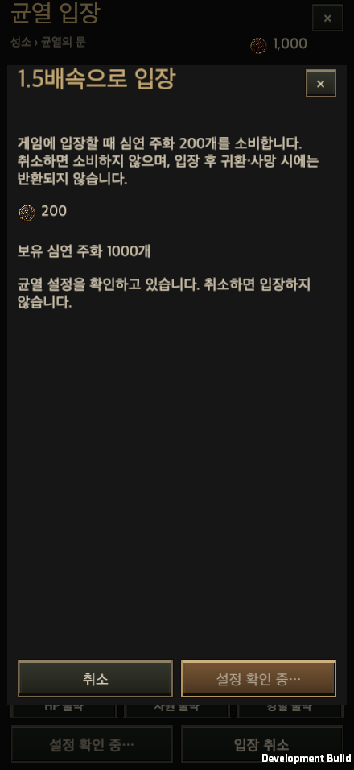
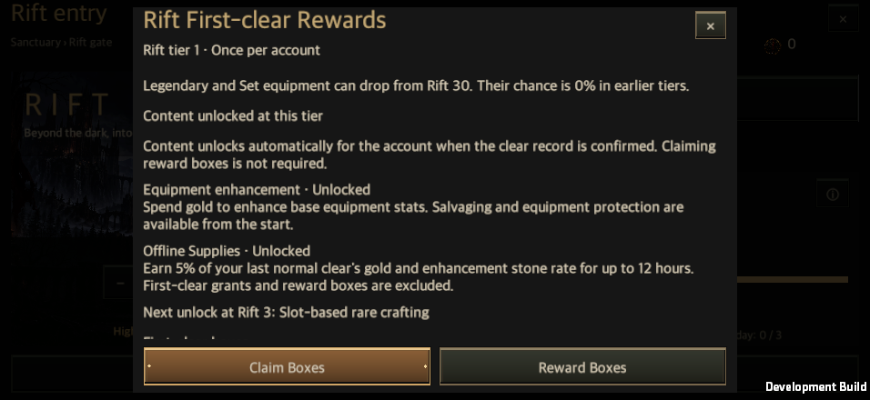

# Live operations and server configuration releases

Updated: 2026-09-30

[한국어](Live_Operations.md) · [Open operations tool](https://hellscript-player-logs.hoosung.chatgpt.site/ops) · [Combat journals and server ingestion](Combat_Journal_Server.en.md)

The public wiki links to the operations tool. Editing requires a separate operator login on the same Site; the public wiki remains a read-only document and database mirror. Operator credentials do not belong in the wiki, game builds or account saves.

## Operator workflow

1. Sign in with an issued operator key and check the server address and published version.
2. Open the relevant tab: monsters, boss, map and packs, equipment drops, rarity, gems/runes/stones, combat earnings, clear rewards or first-clear rewards.
3. Edit global defaults or add a stage range. A range copies the selected settings and becomes independent of global defaults. Ranges cannot overlap. For first-clear boxes, look up an exact stage, inspect its default rewards, and choose **Edit this configuration**. Every default box is copied into the draft.
4. Enter a reason, save the draft and validate it. Saving a draft does not change the game.
5. Review the old and new values, publish, and confirm the new version number.
6. To roll back, open **View and compare** for a previous release and choose **Restore this version**. Review the changes, enter a reason and confirm restoration. This publishes a new version without overwriting earlier releases or their numbers; the server draft is also reset to the restored configuration.

Draft revision and published base-version checks prevent concurrent operators from silently overwriting each other. Browser edits survive a conflict. Server audit records retain actor, reason, timestamp and before/after values. Sessions last eight hours and become unusable on logout or credential revocation.

## Supported tuning

| Category | Editable settings | Behavior |
| --- | --- | --- |
| Normal monsters and elites | Independent health, attack and movement-speed multipliers | Applied to existing stage-based calculations. |
| Boss | Health, attack and movement speed | Independent of normal monster settings. |
| Map and packs | Map scale, within-pack spacing, normal density, time limit | Map scale is limited to 0.95–1.05; existing traversal and placement checks remain active. |
| Equipment | Normal/elite drop chance, boss per-slot chance and slot count | Drop occurrence and item rarity are separate. |
| Rarity | Per-source common/magic/rare/legendary weights, legendary cap and growth span | Weights total 100%; existing legendary unlock and source-specific rarity floors remain. |
| Gems, runes and stones | Normal/elite chances, boss per-slot chances/counts, boss stone multiplier | Existing grant, collection and duplicate-prevention transactions are reused. |
| Combat earnings | Gold and experience multipliers | Applied at the existing combat award points. |
| Clear rewards | Base gold, gold per stage, base materials, material stage divisor | Gold is base + stage × rate; materials are base + floor(stage / divisor). |
| First-clear extra rewards | Additional gold/material bases and stage scaling | Existing per-character first-clear eligibility remains. |
| First-clear boxes | Exact-stage box types, counts and minimum quality | Select existing catalog definitions. Minimum quality is entered as 0–100% and affects equipment-box affixes. Missing stage entries use bundled defaults. To disable boxes, explicitly remove all grants from that stage, then review and publish the empty list. |

The [server contract](../../server/liveops_schema.py) supplies ranges and descriptions to the form. [Client validation](../../Assets/HELLSCRIPT/Runtime/Core/LiveOpsConfig.cs) checks the same contract. Unsupported fields, duplicate keys, overlapping ranges, invalid probabilities and unknown boxes are rejected. This tool does not transport executable code or replace skill/item-effect implementations.

## Admission and persistence

New rift admissions, including automatic repeats, fetch the current release. The client checks the SHA-256 of the supplied canonical JSON, persists it locally, and copies the resolved stage settings, first-clear grants, version, hash and source into `RunState.liveOps`. The existing `GameStore.CommitRiftEntry` atomically saves this snapshot with admission and fatigue consumption. Cancelling entry, closing the entry window or returning to the sanctuary while settings load invalidates the request. A cancelled response cannot admit the player or consume fatigue or the 200-coin accelerated-entry fee.

An in-progress or resumed run keeps its admitted configuration. Publishing or rolling back does not change its health, drops or rewards midway. On the first successful clear, the account stores the promised box grants, so delayed claims keep the cleared run's reward composition. Claimed stages cannot be paid again. Legacy unclaimed rewards are preserved using their bundled composition.

When fetching fails, the client uses its last verified cache for that server, or bundled defaults if no cache exists. Caches are separated by endpoint. Journals record `published` versus `builtin`, version and hash for analysis. Existing snapshots and retry behavior do not require network availability.

Client-reported references remain observations. Hashes identify documents and detect transmission mismatches; they are not anti-cheat signatures or proof of authoritative adjudication. Server-owned admission, replay and reward authority remain separate. [Analytics SQL](../../server/combat_analytics.sql) includes win rate, duration and earnings grouped by configuration release.

## Deployment and QA connection

From 2026-10-01, Google sign-in, operations and combat ingestion use one Site. See [backend migration](Sites_Player_Logs.en.md) for cutover and final evidence. The historical verification below describes the earlier host.

| Item | Configuration |
| --- | --- |
| Origin and operations | https://hellscript-player-logs.hoosung.chatgpt.site · `/ops` |
| Storage | Site D1 `DB` and private R2 `LOGS` |
| Health | `GET /healthz` checks completed migration and account/settings/log storage. |
| Published reads | `GET /v1/liveops/current`, `/v1/liveops/releases/{version}` |
| Operator authentication | Existing operator key, HttpOnly/Secure/SameSite cookie, Origin and CSRF checks |
| Player and QA ingestion | `POST /v1/combat-runs`; local session verification and separate QA keys |
| Persistence | Atomic D1 batch, immutable release/audit, revision comparison |
| Deployment | Open the existing Site and publish its verified source. No external container or authentication host. |

Both `baseUrl` and `telemetryBaseUrl` use this Site. QA files must match that origin and upload purpose. Operator and QA keys remain separate and absent from game builds, Git and wiki. Ordinary Google players use in-memory game sessions. Stable account IDs, exact release JSON/hash, drafts and earlier combat data are retained.

All three source SQLite databases are frozen for cutover and copied with their online backup API to private local storage and R2. Accounts/settings use their real D1 owners; combat payloads use R2 and D1 summaries. Legacy events, drops, authority evidence and audit remain in `legacy_telemetry_rows` and the original backups. Public evidence contains only counts/hashes. A one-time migration backup is separate from automated backups and scheduled restore checks.

## Verification record

The following scopes were verified separately on 2026-09-25. These are focused checks, not a claim that the entire repository suite or physical mobile devices passed.

| Scope | Result |
| --- | --- |
| Server | Python 66/66 passed, including real Gunicorn, authorization, Origin/CSRF, draft conflicts, publication/rollback, existing database migration and fail-closed storage recovery. [Results](../../Artifacts/Validation/live-operations-20260925/server-tests.txt) |
| Web model | Node 15/15 passed: probability/quality conversions, detached ranges, default first-clear grants, conflict preservation and no credential storage. |
| Local browser UI | 100 checks passed across 440×956, 956×440, 1600×900, 1600×1000 and 2100×900; KO/EN; 100/140% text. Numbers, first-clear grants, history, dialogs, login, fixed actions and scrolling were inspected. There were no console warnings or errors. A portrait 140% dialog footer overflow was fixed and rechecked. [Evidence](../../Artifacts/Validation/live-operations-20260925/web-acceptance.json) |
| Unity Edit Mode | An operations/admission/reward/map/replay run passed 131/131. A subsequent material-cap/chest/drop run passed 68/68. The runs overlap and are not presented as a summed full-suite count. [Admission tests](../../Artifacts/Validation/live-operations-20260925/editmode-admission.xml), [cap tests](../../Artifacts/Validation/live-operations-20260925/editmode-material-cap.xml) |
| Local server and native macOS game | A real v1 admission was suspended before v2 publication. A separate process resumed with v1 and naturally cleared in about 105.65 seconds; the next admission pinned v2. Both actual journals received matching runId/SHA-256 acknowledgments before outbox removal. [Resume](../../Artifacts/Validation/live-operations-20260925/resumed-combat.txt), [next admission](../../Artifacts/Validation/live-operations-20260925/next-admission.txt) |
| First-clear rewards | The naturally earned, unclaimed v1 package remained visible and claimable after v2 publication. Claim, opening, duplicate prevention, 20 list/detail layout combinations, an explicit empty package and a third-process reload passed. Input evidence is macOS raycast/pointer automation, not physical mobile testing. [Rewards](../../Artifacts/Validation/live-operations-20260925/reward-ui.txt), [restart](../../Artifacts/Validation/live-operations-20260925/restart.txt) |
| Paid-entry cancellation | Delayed configuration responses were tested in a macOS development build across five sizes, KO/EN and 100/140% text: 20 combinations. Actual pointer input confirmed 1.5× admission and then cancelled it; premium currency, fatigue and suspended combat remained unchanged after late responses. Closing normal admission also invalidated its request. A fresh admission during the older request committed exactly one normal-speed run without a currency charge. Only an isolated QA wallet was set to 1,000 to expose paid-entry controls; combat and reward results were not injected. [Results](../../Artifacts/Validation/live-operations-20260925/cancellation.txt) |
| Railway deployment and public UI | Merged `main` commit `9c12e808` from [PR #10](https://github.com/dakrdong/HELLSCRIPT/pull/10) was deployed successfully as `8af0a425-a2c1-40c5-9cce-7b88992365ee`. HTTPS checks returned HTTP 200 for public `/healthz` and `/ops`. The in-app browser displayed the public `/ops` Korean login screen with no console warnings or errors. `/healthz` was checked as an HTTP response, not as a rendered browser page. |
| Public server APIs | Synthetic QA data verified anonymous operator/upload rejection, operator sign-in, Origin/CSRF/configuration checks and logout invalidation. A predeployment receipt survived, and an identical retry returned the matching runId/SHA-256 acknowledgment. The API exposed 52 tuning fields and defaults for 1,000 first-clear stages. No production configuration was published or changed. [API results](../../Artifacts/Validation/live-operations-20260925/cloud/acceptance.json) |
| Public server and native macOS game | The actual game used its original `GameServerConnection` and an external QA session to fetch published version 0. Admission and the journal pinned that version and hash. After real-time combat, an explicit ReturnTown abandonment produced a matching runId/SHA-256 acknowledgment and outbox removal. No operator credential, endpoint override, combat fixture or reward fixture was used. This does not establish a cloud victory or reward-grant test. [Game connectivity](../../Artifacts/Validation/live-operations-20260925/cloud/cloud.txt) |
| Public database retention and backup | The predeployment QA record retained its runId, hash and original receipt timestamp. The actual macOS game's stored `run_configuration` contained published version 0 and its matching configuration hash. Both databases were backed up once through the online backup API, then independent copies were checked. At inspection, the copies contained two telemetry rows and one operations release; both `quick_check` results were `ok`. No production restore or automatic/scheduled backup was performed. [Evidence](../../Artifacts/Validation/live-operations-20260925/cloud-storage-backup.json) |

The public server retained bootstrap release **0**, with SHA-256 `f47285789d2f990942e8ad2937a9eee0c3cd2769120cd83908764d6f9423b4f5`. Server API reads and the actual game's admission and journal agreed. The local v1/v2 test balance was not published to production.

