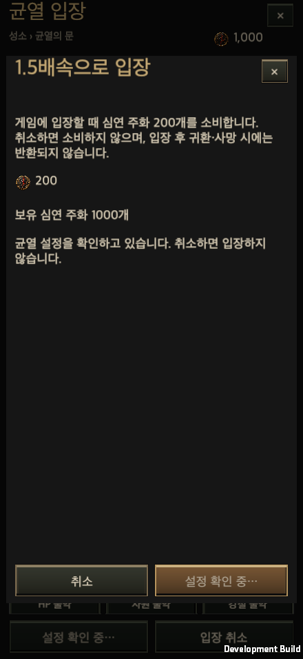
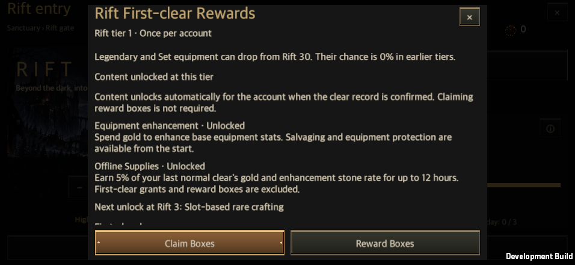

# 게임 운영툴과 서버 설정 게시

갱신일: 2026-09-26

[English](Live_Operations.en.md) · [운영툴 열기](https://hellscript-production.up.railway.app/ops) · [전투 기록과 서버 수집](Combat_Journal_Server.md)

공개 위키에서 운영툴 접속 안내를 열 수 있다. 수정 화면은 Railway의 별도 운영자 로그인 뒤에 있으며, 공개 위키는 문서·DB를 조회하는 읽기 전용 상태를 유지한다. 운영자 키는 위키, 게임 빌드, 계정 저장 파일에 넣지 않는다.

## 사용하는 순서

1. 운영툴에 접속해 발급받은 운영자 키로 로그인한다. 상단의 접속 서버와 현재 게시 버전을 확인한다.
2. 몬스터, 보스, 맵과 군집, 장비 드랍, 장비 등급, 보석·룬·강화석, 전투 수입, 클리어 보상, 최초 보상 중 목적에 맞는 탭을 연다.
3. 전체 공통 설정을 수정하거나 적용할 단계 구간을 추가한다. 새 구간은 현재 선택한 설정을 복사한 독립 설정이며, 서로 겹칠 수 없다. 최초 보상 상자는 정확한 균열 단계를 조회해 기본 구성을 확인한 뒤 **이 구성으로 수정 시작**을 누른다. 이때 기본 상자 목록을 모두 초안에 복사한다.
4. 변경 사유를 적고 **초안 저장**과 **설정 검사**를 실행한다. 초안 저장만으로 게임에 반영되지는 않는다.
5. **변경 검토·게시**에서 현재 값과 게시할 값을 확인한 뒤 **게임에 게시**한다. 게시 성공과 새 버전 번호를 확인한다.
6. 되돌릴 때는 **게시 이력**에서 이전 버전의 **내용·차이 보기**를 열고 **이 버전으로 복원**을 누른다. 전후 내용을 검토하고 사유를 입력해 복원을 확정하면 새 버전으로 게시한다. 이전 버전이나 번호를 덮어쓰지 않으며, 서버 초안도 복원한 내용으로 바뀐다.

여러 운영자가 동시에 편집하면 초안 번호와 게시 기준 버전을 검사한다. 다른 사람이 먼저 저장하거나 게시한 경우 충돌을 알려 주며, 브라우저에서 편집하던 내용을 보존한다. 변경자·사유·시각·전후값은 서버 감사 기록에 남는다. 운영 세션은 8시간이며 로그아웃이나 운영 키 철회로 더 이상 사용할 수 없게 된다.

## 조정할 수 있는 내용

| 분류 | 운영 항목 | 적용 방식 |
| --- | --- | --- |
| 일반 몬스터·정예 | 각각의 생명력, 공격력, 이동 속도 | 기존 단계별 계산에 독립 배율을 적용한다. |
| 보스 | 생명력, 공격력, 이동 속도 | 일반 몬스터 설정과 분리한다. |
| 맵·군집 | 맵 크기, 군집 내부 간격, 일반 몬스터 밀도, 제한 시간 | 맵 크기는 0.95~1.05배이며, 기존 통행·배치 검사를 유지하고 새 맵을 생성한다. |
| 장비 드랍 | 일반·정예 드랍 확률, 보스 슬롯별 드랍 확률과 슬롯 수 | 드랍 여부와 장비 등급을 별도로 조정한다. |
| 장비 등급 | 일반·정예·보스별 일반/마법/희귀/전설 비율, 전설 상한과 성장 구간 | 확률 합은 100%이며 기존 전설 해금과 정예·보스 최소 등급을 유지한다. |
| 보석·룬·강화석 | 일반·정예 확률, 보스 슬롯별 확률과 개수, 보스 강화석 배율 | 기존 지급·회수·중복 방지 거래를 재사용한다. |
| 전투 수입 | 전투 골드·경험치 배율 | 처치와 기존 전투 지급 지점의 수치를 조정한다. |
| 클리어 보상 | 기본 골드, 단계당 골드, 기본 재료, 재료 증가 간격 | 골드는 `기본값 + 단계 × 단계당 값`, 재료는 `기본값 + floor(단계 / 증가 간격)`이다. |
| 최초 클리어 추가 보상 | 추가 골드·재료의 기본값과 단계별 증가 | 캐릭터별 최초 클리어 판정을 유지한다. |
| 최초 보상 상자 | 단계별 상자 종류·수량·최소 품질 | 원본 보상 상자 카탈로그에서 선택한다. 최소 품질은 화면에서 0~100%로 입력하며 장비 상자 옵션에 적용된다. 단계에 설정이 없으면 기본 구성을 사용한다. 지급을 끄려면 해당 단계의 상자를 모두 삭제한 빈 목록을 검토·게시한다. |

지원하는 수치 범위와 설명은 서버의 [설정 계약](../../server/liveops_schema.py)이 운영 화면에 제공하고, 게임의 [설정 검증](../../Assets/HELLSCRIPT/Runtime/Core/LiveOpsConfig.cs)이 같은 범위를 검사한다. 허용하지 않는 필드·중복 키·겹치는 구간·비정상 확률·알 수 없는 상자는 게시할 수 없다. 보상 상자의 품목 정의와 장비/스킬 효과 코드 자체를 원격 코드로 바꾸는 기능은 아니다.

## 게임에 반영되는 시점

새 균열 입장과 자동 반복의 다음 입장 전에 현재 게시본을 조회한다. 정상 응답의 원문 JSON과 SHA-256을 검증하고 기기에 저장한 뒤, 해당 단계의 설정·최초 보상·버전·해시·출처를 `RunState.liveOps`에 복사한다. 기존 `GameStore.CommitRiftEntry`가 피로도와 전투 스냅샷을 함께 저장한다. 설정 확인 중 입장 취소·창 닫기·성소 복귀를 실행하면 요청을 취소한다. 취소된 응답은 입장 거래를 실행하지 않으며, 피로도나 1.5배속 입장 비용 200 주화를 소비하지 않는다.

진행 중인 균열, 일시 중단 후 재개, 보스 보상과 최초 보상은 입장 때 확정한 값을 사용한다. 게시·롤백이 이미 시작한 전투의 체력·드랍·보상을 도중에 바꾸지 않는다. 최초 정상 클리어 시 계정의 미수령 상자 구성을 확정하므로, 나중에 수령하더라도 당시 약속한 보상을 받는다. 이미 수령한 단계는 다시 지급하지 않는다. 기존 저장의 미수령 보상은 기존 기본 구성으로 보존한다.

조회에 실패하면 해당 서버에서 검증해 둔 캐시를 사용하고, 캐시가 없으면 게임 내장 기본값을 사용한다. 캐시는 서버 주소별로 분리한다. 전투 기록은 `published` 또는 `builtin` 출처와 버전·해시를 남기므로 어떤 설정으로 플레이했는지 구분할 수 있다. 진행 중인 전투 설정의 고정과 재시도는 네트워크 연결 여부에 의존하지 않는다.

전투 기록에 포함된 운영 설정 식별자와 전투 수치는 클라이언트가 보고한 관측값이다. 해시는 설정·본문 식별과 전송 무결성 검사에 사용하며, 치팅 방지 서명이나 서버 판정의 증거로 취급하지 않는다. 서버의 권한 있는 입장·재연산·보상 확정 경로와는 분리한다. 분석 예시는 [서버 SQL](../../server/combat_analytics.sql)의 설정 버전별 승률·시간·골드 조회를 참고한다.

## 서버와 QA 연결

아래 표는 통합 서버의 구성 기준이다. 실제 배포·업로드·게임 적용 여부는 이 문서의 [검증 기록](#검증-기록)에서 각각 확인한다.

| 항목 | 구성 |
| --- | --- |
| 서비스 | Railway `dazzling-love / production / HELLSCRIPT`, 단일 인스턴스 |
| 접속 | `https://hellscript-production.up.railway.app` |
| 저장소 | 500 MB 볼륨의 `/data/hellscript/telemetry.sqlite`, `liveops.sqlite`, `accounts.sqlite` |
| 자동 배포 | GitHub `main`의 `server/**`, `Dockerfile`, `.dockerignore`, 원본 `RewardBoxes.json` 변경을 감지한다. 문서만 바꾸면 서버를 재시작하지 않는다. |
| 상태 확인 | `GET /healthz`; 전투·운영 DB와 활성화된 Google 계정 DB를 읽을 수 있어야 정상이다. |
| 게임 설정 조회 | `GET /v1/liveops/current`, `GET /v1/liveops/releases/{version}`; 게시된 설정만 읽는다. |
| 운영자 | `/ops`; 별도 `HELLSCRIPT_OPS_TOKENS`, 정확한 `HELLSCRIPT_OPS_ORIGIN` |
| 전투 업로드 | `POST /v1/combat-runs`; `HELLSCRIPT_TELEMETRY_TOKENS`의 QA 계정별 키 |
| 게시·감사 | SQLite 트랜잭션, 변경 불가능한 게시본·감사 기록, 초안과 기준 버전 비교 |

게임의 `Resources/Data/ServerConnection.json`에는 공개 서버 주소만 들어간다. 운영 설정 조회는 자동으로 연결된다. 개발 빌드와 Editor의 전투 업로드는 운영자가 발급한 별도 QA 세션 파일을 기기의 저장 폴더에 `qa-session.json`으로 두거나 `-hellscriptQaSessionFile`로 경로를 전달하면 연결된다. 파일의 대상 서버와 업로드 용도를 검사하며 웹 운영자 키와 별도의 QA 토큰을 사용한다. 서버가 두 자격 증명의 권한을 구분한다. 일반 배포 빌드에는 이 개발용 세션 파일 연결 경로를 포함하지 않는다. Google 플레이어 인증과 별도로 QA 계정별 식별에 사용하는 연결이며, 세션 파일의 실제 값이나 개인 경로는 공개하지 않는다.

서버 환경 변수·운영자 키·QA 세션 파일은 Git과 공개 위키에 포함하지 않는다. 로그인한 운영 화면은 HttpOnly/Secure/SameSite 쿠키와 Origin·CSRF 검사를 사용하며, 공개 페이지에서 인증 없이 운영 데이터를 변경할 수 없다. 운영 키가 없으면 운영 API는 닫힌 상태로 시작한다. 요청 크기·시간과 로그인 시도 횟수를 제한한다.

설정 당시 Railway 체험 계정의 Backups 화면은 Pro 플랜을 요구했다. 요금제를 변경하지 않았으며 플랫폼 자동 백업과 예약 백업은 설정하지 않았다. 두 DB는 SQLite online backup API로 한 번 백업해 비공개 로컬 저장소에 보관했고, 독립 복사본의 `quick_check`가 모두 `ok`임을 확인했다. 운영 DB 복원은 실행하지 않았다. 영구 볼륨의 데이터 보존, 1회 백업과 복사본 검사는 자동 백업·운영 복원 검증과 구분한다. [저장소·백업 확인 기록](../../Artifacts/Validation/live-operations-20260925/cloud-storage-backup.json)을 참고하고, 사용 가능한 백업 방식·주기와 복원 절차는 [Railway 백업 문서](https://docs.railway.com/volumes/backups)를 확인해 별도로 설정한다. 실행 중인 SQLite DB를 백업할 때는 각 DB의 backup API를 사용하며, WAL을 제외한 DB 파일 복사로 대체하지 않는다.

Google 계정의 고정 ID와 세션은 별도의 `accounts.sqlite`에 저장한다. [Google 로그인](Google_Login.md)은 운영자 권한이나 QA 업로드 권한을 부여하지 않는다. 위의 1회 백업 기록은 Google 로그인 추가 전의 전투·운영 DB 두 개만 대상으로 하며, 새 계정 DB의 백업·복원 검증을 포함하지 않는다.

## 검증 기록

2026-09-25에 아래 범위를 각각 검증했다. 전체 저장소 테스트 통과나 물리 모바일 기기 검증을 뜻하지 않는다.

| 범위 | 확인 결과 |
| --- | --- |
| 서버 | Python 66/66 통과. 실제 Gunicorn, 권한·Origin·CSRF, 초안 충돌, 게시·복원, 기존 DB 이전, 저장소 손실 시 실패 처리와 재시도를 포함한다. [결과](../../Artifacts/Validation/live-operations-20260925/server-tests.txt) |
| 웹 모델 | Node 15/15 통과. 확률·품질 표시 변환, 구간 복사, 최초 보상 기본값, 충돌 시 편집 보존과 키 저장 금지를 검사했다. |
| 로컬 운영 화면 | 내장 브라우저에서 440×956, 956×440, 1600×900, 1600×1000, 2100×900, KO/EN, 글자 100/140%를 조합한 100개 검사 통과. 숫자·최초 보상·이력·비교창·로그인 화면, 고정 버튼과 스크롤을 확인했고 Console 경고·오류는 0건이었다. 세로 140% 비교창의 버튼 잘림을 수정한 뒤 재검사했다. [기록](../../Artifacts/Validation/live-operations-20260925/web-acceptance.json) |
| Unity Edit Mode | 운영 계약·QA 연결·입장 취소·보상·지도·재연산 관련 실행 131/131 통과. 이후 재료 상한·상자·드랍 관련 실행 68/68 통과. 서로 겹치는 실행이므로 합산한 전체 테스트 수로 표시하지 않는다. [입장 검사](../../Artifacts/Validation/live-operations-20260925/editmode-admission.xml), [상한 검사](../../Artifacts/Validation/live-operations-20260925/editmode-material-cap.xml) |
| 로컬 서버와 macOS 게임 | 실제 v1 입장·중단 저장 후 v2를 게시했다. 별도 프로세스의 전투 재개는 v1을 유지하며 약 105.65초에 자연 클리어했고, 다음 입장은 v2를 적용했다. 두 실제 기록은 서버의 동일 runId·SHA-256 ACK를 받은 뒤 outbox에서 제거됐다. [재개](../../Artifacts/Validation/live-operations-20260925/resumed-combat.txt), [다음 입장](../../Artifacts/Validation/live-operations-20260925/next-admission.txt) |
| 최초 보상 | 실제 자연 클리어의 미수령 v1 보상을 v2 게시 뒤 조회·수령·개봉하고 중복 지급을 차단했다. 보상 목록·상세 20조합과 빈 보상, 세 번째 프로세스의 저장 복원을 확인했다. macOS raycast와 pointer 입력 증거이며 물리 모바일 입력 검사는 아니다. [보상 검사](../../Artifacts/Validation/live-operations-20260925/reward-ui.txt), [재시작](../../Artifacts/Validation/live-operations-20260925/restart.txt) |
| 유료 입장 취소 | 설정 응답을 지연시킨 macOS 개발 빌드에서 다섯 화면 크기·KO/EN·100/140%의 20조합을 검사했다. 실제 pointer 입력으로 1.5배속 입장을 확인한 뒤 취소했으며, 늦은 응답 후에도 주화·피로도·중단 전투가 그대로였다. 일반 입장 창을 닫아도 요청이 무효화됐다. 이전 요청이 진행 중일 때 새 입장을 하면 일반 속도 전투 하나만 생성되고 주화는 소비하지 않았다. 유료 조작을 열기 위해 격리 QA 지갑만 1,000으로 설정했으며 전투·보상 결과는 주입하지 않았다. [검사 결과](../../Artifacts/Validation/live-operations-20260925/cancellation.txt) |
| Railway 배포·공개 화면 | [PR #10](https://github.com/dakrdong/HELLSCRIPT/pull/10)을 병합한 `main` 커밋 `9c12e808`을 배포했다. 배포 `8af0a425-a2c1-40c5-9cce-7b88992365ee`가 성공했고, HTTPS 검사에서 공개 `/healthz`와 `/ops`가 HTTP 200을 반환했다. 내장 브라우저에서는 공개 `/ops`의 한국어 로그인 화면과 Console 경고·오류 0건을 확인했다. `/healthz`는 HTTP 응답 검증이며 브라우저 페이지 표시 검증은 아니다. |
| 공개 서버 API | 합성 QA 자료로 익명 운영·업로드 요청 거절, 운영자 로그인·Origin·CSRF·설정 검사, 로그아웃 후 세션 무효화를 확인했다. 배포 전 수신 자료가 남아 있었고 동일 원문 재전송의 runId·SHA-256 ACK가 일치했다. 운영 항목 52개와 최초 보상 기본값 1,000단계를 조회했다. 공개 설정을 게시하거나 변경하지 않았다. [API 검사 결과](../../Artifacts/Validation/live-operations-20260925/cloud/acceptance.json) |
| 공개 서버와 macOS 게임 | 실제 게임이 원래 `GameServerConnection`과 외부 QA 세션으로 공개 서버의 게시 버전 0을 조회했다. 입장·전투 기록에 같은 버전과 해시를 고정하고 실시간 전투를 진행한 뒤, 명시적 성소 귀환으로 포기한 기록의 동일 runId·SHA-256 ACK를 받아 outbox에서 제거했다. 운영자 키·서버 주소 덮어쓰기·전투나 보상 결과 주입 없이 확인했으며, 공개 서버에서 승리·보상 지급을 검증한 것으로 해석하지 않는다. [게임 연결 결과](../../Artifacts/Validation/live-operations-20260925/cloud/cloud.txt) |
| 공개 DB 보존·백업 | 배포 전 QA 기록의 runId·해시·최초 수신 시각이 그대로 보존됐고, 실제 macOS 게임 기록의 `run_configuration`에 게시 버전 0과 동일한 설정 해시가 저장됐다. 두 DB를 online backup API로 한 번 백업한 뒤 독립 복사본을 검사했다. 당시 전투 기록 2행과 운영 게시본 1행을 확인했으며 두 `quick_check` 결과가 모두 `ok`였다. 운영 DB 복원과 자동·예약 백업은 실행하지 않았다. [확인 기록](../../Artifacts/Validation/live-operations-20260925/cloud-storage-backup.json) |

공개 서버는 초기 기본 설정인 게시 버전 **0**을 유지했다. 해당 설정의 SHA-256은 `f47285789d2f990942e8ad2937a9eee0c3cd2769120cd83908764d6f9423b4f5`이며, 서버 API 조회와 실제 게임 입장·기록에서 일치했다. 검증용 로컬 v1/v2 밸런스를 공개 서버에 게시하지 않았다.

