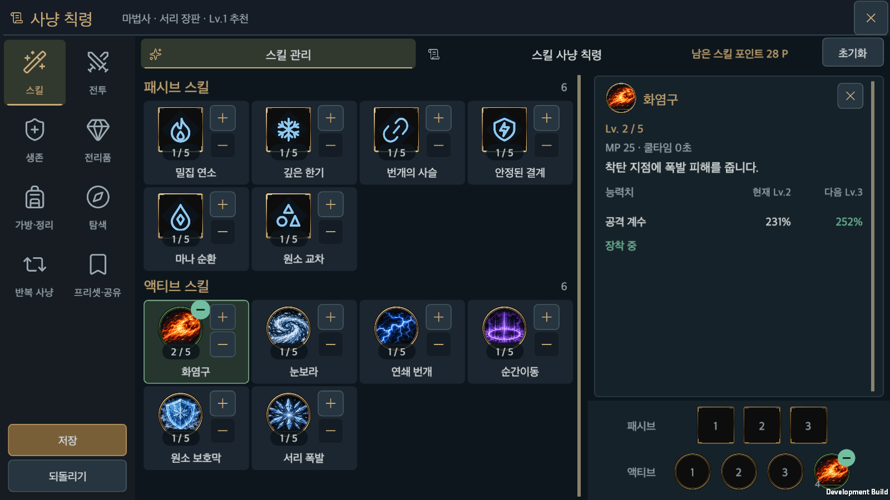
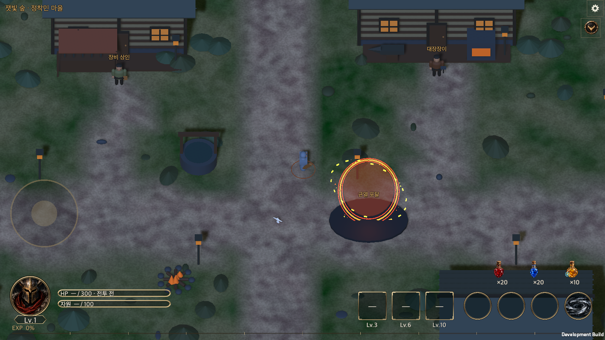
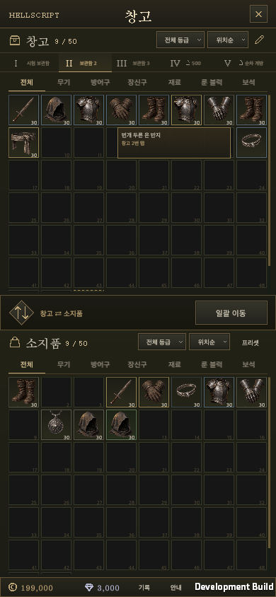
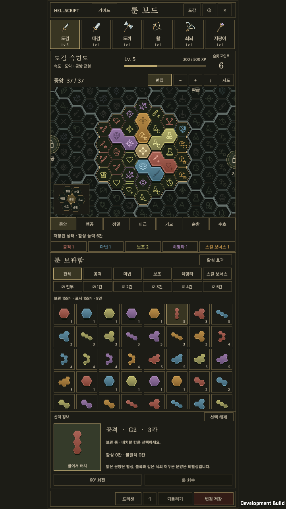
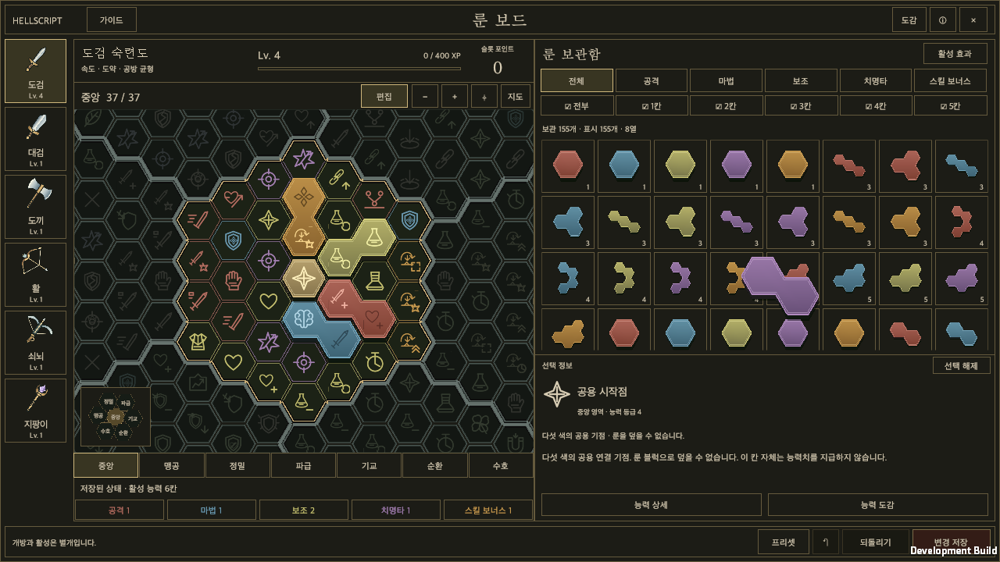

# Completed work integrated into main

Date: 2026-09-20

[한국어](Main_Integration_20260920.md)

## Integrated scope

All completed branches and worktrees were audited, and the remaining changes were merged into `main`. The game commit validated here is `9b202bb0719279175369b1bf16e7c3cfe1a0550a`. Subsequent additions contain verification records and wiki history only.

| Work | Included in main |
|---|---|
| Hunt Edict | Quiet surfaces and controls, distinct selected and expandable states, larger centered landscape navigation icons |
| Runes | v13 boards, clear weapon artwork and names, rotated-cell pointer tracking, detail/inventory dragging and recovery |
| Storage | Reference layout and interactions, immediate pickup, pointer tracking and simplified empty-slot hints |
| Town HUD | Responsive joystick, held/idle opacity, potion placement, NPC names and compact header |
| Equipment shop | Proposal, interactive mockups, Korean/English and landscape/portrait captures. This is design delivery, not completed game runtime implementation. |
| Unity MCP | Committed the manifest and lock entries for the already installed 10.2.0 package |

Rune, storage and town HUD work was already in `main`. The remaining Hunt Edict and equipment shop branches merged without conflicts. All 25 local/remote branch references were ancestors of the integrated commit; see the [ancestry audit](MainIntegration20260920Evidence/branch-audit.json). No branches or worktrees were deleted.

Related records: [Hunt Edict](Hunt_Edict_Game_UI.md), [runes](Rune_V13_Implementation.en.md), [town HUD](Town_Hud_Responsive.en.md), [equipment shop proposal](../Design/HELLSCRIPT_Equipment_Shop_Proposal.en.md).

## Verification

Unity 6000.6.0f1 passed all **2,755 Edit Mode tests** in the `Hellscript.Tests` assembly, with zero failures or skipped tests. The [complete XML](MainIntegration20260920Evidence/editmode.xml) is retained.

A macOS development player built from the same source succeeded with zero errors. See the [build record](MainIntegration20260920Evidence/build.txt) and [verified source trees and scope](MainIntegration20260920Evidence/validation.json). The batch-only Unity Connect setting change was restored.

Each runtime suite used an isolated save directory. All five suites passed and produced 66 captures; representative images and complete suite reports are retained below.

| Runtime suite | Coverage | Captures | Result |
|---|---|---:|---|
| Hunt Edict | Skill ranks, equipment, saving/reload, presets/sharing, order dragging, all eight tab hit targets, portrait/landscape, English and larger type | 24 | [Passed](MainIntegration20260920Evidence/hunt-edict.txt) |
| Town HUD | 18 resolution/type combinations, safe area, movement/release/pointer ownership, opacity and storage shortcut | 8 | [Passed](MainIntegration20260920Evidence/town-hud.txt) |
| Storage | Real items, gems and runes; immediate pickup, drop/swap/cancel, tab navigation, saving and responsive layouts | 24 | [Passed](MainIntegration20260920Evidence/storage.txt) |
| Rune clarity/rotation | Matching card/detail/pickup rotation, rotated-cell tracking, placement/recovery/undo, disk reload and complete weapon labels | 7 | [Passed](MainIntegration20260920Evidence/rune-clarity.txt) |
| Rune dragging | Visibility over storage, immediate pickup, pointer tracking, recovery/placement/cancel/reload and the actual UI input module path | 3 | [Passed](MainIntegration20260920Evidence/rune-drag.txt) |

[Runtime summary](MainIntegration20260920Evidence/runtime-summary.json) · [Rune fixture](MainIntegration20260920Evidence/rune-fixture.json)

Rune suites reused an isolated verification save containing 160 owned runes and five placements. The real user account was untouched. Input checks used automated events and input-system state in the macOS player. Human physical input, physical iOS/Android devices, builds for those platforms and Unity Test Runner Play Mode tests were not part of this validation.

## Representative captures

