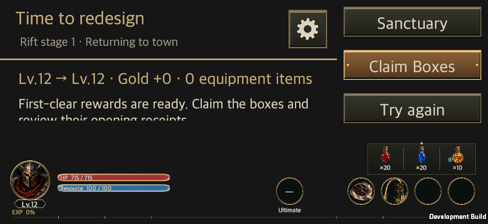
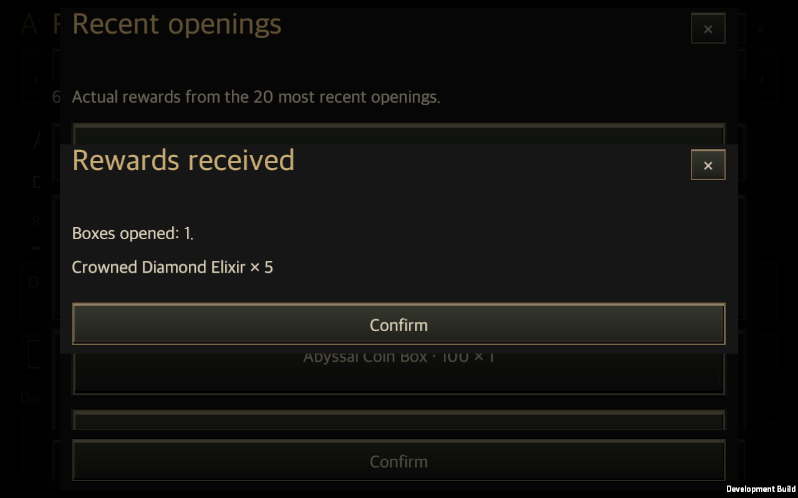

# 완료된 개발의 main 통합 — 2026-09-27

작성일: 2026-09-27 · [English](Main_Integration_20260927.en.md)

첫 플레이 개선, 운영 보상, APK 용량 최적화를 이미 main에 있는 효과음과 함께 통합했다. 새로 진행 중인 ElevenLabs 음원 제작은 이번 완료 개발 묶음에 포함하지 않는다.

## 통합 대상

| 개발 내용 | 원본 커밋 | 범위 |
| --- | --- | --- |
| 첫 플레이 복구·개선 | `522ea02a`, `a62a12cb` | D01–D09 구현과 집중 검사. 세 직업 균열 20 자연 성장 검증은 진행 중이다. |
| 운영 보상 | `a1bc4825` | 상자 148종, 운영 패키지 22개, 예비 품목 30개. 자동 배포나 서버 발송은 활성화하지 않는다. |
| APK 용량 최적화 | `0e8f095b` | 텍스처 가져오기 설정, 사용하지 않는 빌드 자원·패키지 정리, 배포 APK 경로. |
| 기존 효과음 | `d238fa0e`, main `dc5770b6` | 이미 병합된 283종 효과음의 실제 재생 연결을 유지한다. |

코드 통합 커밋은 `138ba4b1`이다. 개봉 내역의 실제 화면·재실행 검사를 보완한 `928dbf28`, 영문 단·복수 표현을 정리한 `d48a08e0`을 포함한다.

## 병합 과정에서 수정한 연결 문제

보상 상자 화면의 물약 분류·장비 부위 선택과 첫 플레이 개봉 내역을 함께 보존했다. 개봉 내역이 떠 있는 동안 재개봉을 막고, 필요한 선택값을 거래 전에 확인한다. 두 개발에서 추가한 영문 번역도 모두 유지한다.

운영 보상의 `potion` 분기는 실제 물약 ID를 개봉 내역에 기록해야 한다. 이를 기존 물약 도감의 이름 표시와 연결해 HP 물약과 보석 영약의 이름이 비는 문제를 수정했다. 물약 44종의 실제 지급·내역·저장 왕복을 기존 운영 보상 검사에 추가했고, macOS에서 HP 물약 10개와 왕관의 다이아몬드 물약 5개의 표시와 재실행 후 내역을 확인했다.

## 전체 회귀 검사

전체 Edit Mode 검사는 **4,091개 중 4,044개 통과, 47개 실패, 건너뜀 0개**다. 실패 47개는 앞서 별도 기준 작업 폴더에서 재현한 목록과 정확히 같으며, 이번 통합으로 추가된 실패는 0개다. 전체 통과로 표시하지 않는다. [검사 요약](MainIntegration20260927Evidence/validation.json)과 [원문 XML](MainIntegration20260927Evidence/full-editmode.xml)을 보존했다.

전체 검사는 `138ba4b1`에서 실행했다. 이후 변경은 실행 검사 보완과 영문 개봉 수량 문구 한 줄이다. 최종 `d48a08e0`에서 macOS·Android를 빌드하고 보상 화면 20개 조합과 재실행 검사를 다시 통과했다. [소스 범위](MainIntegration20260927Evidence/source.json)를 함께 기록한다.

## 실행과 저장 검증

- [통합 실행 근거](MainIntegration20260927Evidence/native.json): 첫 플레이 화면 20개 조합과 별도 프로세스 재실행, 운영 보상 화면 20개 조합과 개봉 내역 재열기를 통과했다. 해상도는 440×956·956×440·1600×900·1600×1000·2100×900, 언어는 한국어·영어, 글자 크기는 100·150%다.
- [효과음 실행 기록](MainIntegration20260927Evidence/sound.txt): 타이틀·직업 선택·튜토리얼·3직업 전투·주요 시설·설정에서 재생 이벤트 85종과 청취 지점 출력 신호를 확인했다. 누락 음원과 실행 중 기록된 오류는 0개다. 일부 시설 버튼의 직접 호출은 원본 기록에 구분했다.
- [Android 배포 빌드](MainIntegration20260927Evidence/android.json): IL2CPP·ARM64·LZ4HC APK를 오류 0개로 생성했다. 파일 크기는 70,585,750바이트다. 기존 최적화 단독 브랜치의 60,072,342바이트와 합쳐 쓰지 않는다.

macOS 합성 입력과 Android 빌드 생성은 실기기 터치·발열·배터리 검증이나 사람의 청음 승인을 뜻하지 않는다. 화면·보상 검사는 임시 계정에서 수행했고, 자연 성장 계정과 분리했다.

## 작업 폴더와 플레이 기록 보존

병합 전 브랜치·작업 폴더 목록과 변경분을 `Artifacts/Integration20260927/`에 기록했다. 이전 플레이 자료 1,072개를 원본 프로젝트로 복사하고 해시를 대조했다. 검증용 중간 변경은 패치·stash·복구 가능한 보관본으로 보존하며, 실행 중인 다른 작업의 폴더를 제거하지 않는다.

자연 성장 검증은 같은 공유 계정의 정상 1배속을 이어 간다. 통합 직전에는 전사 Lv.8/최고 클리어 5, 궁수 Lv.11/최고 클리어 5, 마법사 Lv.1/최고 클리어 0이었다. 완료 기록은 14건이다. 시도한 단계와 클리어한 단계를 구분하고, 레벨·재화·시간을 주입하지 않는다. 세 직업 균열 20 검증을 완료한 것으로 보고하지 않는다.

[첫 플레이 화면 검사](MainIntegration20260927Evidence/firstplay-checks.txt) · [첫 플레이 재실행](MainIntegration20260927Evidence/firstplay-restart.txt) · [보상 화면 검사](MainIntegration20260927Evidence/operations-checks.txt) · [보상 재실행](MainIntegration20260927Evidence/operations-restart.txt)

