# HELLSCRIPT native inventory and paired weapon slots

Date: 2026-09-21

Updated: 2026-09-22

## Scope

The character shortcut in the play scene now opens the HTML reference inventory implemented in Unity uGUI. It uses real items and the existing `GameStore` account. This window provides equip/unequip, equipment comparisons, the full character sheet, item locking, selected dismantling and bulk dismantling. Storage, gems, rune boards and selling remain in their dedicated management screens.

This completes the design and equipment-system port that was omitted from the earlier shortcut hookup. The HTML is a visual and interaction reference, not a production item database or account service. Account persistence uses the project's existing local development adapter.

## Layout and input

| Property | Landscape | Portrait |
| --- | --- | --- |
| Logical frame | 800×450, 16:9 | 405×720, 9:16 |
| Header | 34 high | 34 high |
| Character panel | 258 wide on the left | 230 high at the top |
| Bag columns | 8 | 6 |
| Equipment and bag cells | Both 54×54 | Both 52×52 |

The frame fits inside the device safe area without changing its aspect ratio. Rotation selects the other layout. Selection, filtering, locks and dismantling never resize the frame. Status text and the selected-dismantle command have reserved positions from the first draw. Dialog sizes are fixed per dialog type; long content scrolls inside them.

The Waist equipment label is now Belt. Rarity and sort buttons open fixed-size overlay lists. Rarity checkboxes allow one or more choices, matching any selected rarity; All rarities restores the full selection. Sorting offers Position, Newest, Oldest, Rarity and Level, applies one choice and closes. New item and Awakened filter buttons are removed. Bag display filters are independent of the character-shared shop and salvage auto-selection settings.

Drag bag items onto the character or a matching equipment cell, or use Equip in the detail window. When both eligible hands or ring positions are occupied, the comparison window offers the destination. Equipped items leave the bag grid. The linked half of a two-handed weapon is a second view of one instance.

Mouse dragging starts normally. On touch, a quick swipe scrolls; holding for at least 0.18 seconds before moving starts an item drag. Selection mode and dismantle previews route cell drags to their scroll area. The drag image preserves the original pointer offset.

## Two weapon positions

These are the user's HELLSCRIPT rules, rather than Diablo IV's complete Barbarian Arsenal or Rogue bow layout.

| Class | Main hand | Off hand |
| --- | --- | --- |
| Warrior | One-handed sword or axe | One-handed sword/axe or shield |
| Warrior | Two-handed greatsword | Same instance occupies both cells |
| Mage | One-handed wand | Orb, magic scroll or shield |
| Mage | Two-handed staff | Same instance occupies both cells |
| Ranger | Bow | Arrows |
| Ranger | Dagger | Shield |
| Ranger | Two-handed crossbow | Same instance occupies both cells |

Replacing the main weapon returns incompatible off-hand gear to the bag. Equipping a two-handed item returns both displaced items. If the bag cannot hold the return, the whole transaction is refused. Unequipping a main weapon also returns dependent orbs, scrolls or arrows. Locking does not prevent equipping.

B01–B24 retain their IDs. Production bases now include B25 Wand, B26 Orb, B27 Magic Scroll, B28 Shield, B29 Arrows and B30 Dagger. They enter normal, magic and rare generation. Off-hand bases are excluded from the existing legendary weapon generator to prevent unrelated legendary weapon effects being assigned to them. New icons extend the established vector icon system.

Dual weapons average their base attack and attack speed. Orb, scroll and arrow base values add to attack; shields add armor. Each item's affixes, socket and special effects are counted once. A two-handed item never contributes twice. Weapon mastery follows the main hand.

## Attributes and comparison

All **57** entries in `StatCatalog` are shown, including zero values. Attributes that gameplay does not yet consume are labeled accordingly. Values and units come from `HeroStats.Sheet` and `FormatSheet`.

An unequipped ring compares against both occupied ring positions. Empty positions do not produce comparison cards. Each destination shows its actual resulting character-stat changes and the equipment returned to the bag. Equipped items have no self-comparison command.

Comparison follows the [shared equipment contract](../Design/Equipment_Comparison_Rules.en.md): **equipped on the left, candidate on the right**. Candidate values show inline deltas; absent outgoing properties appear under Properties lost on equip. Both occupied rings remain visible, with fixed controls choosing the left or right replacement baseline. Card bodies scroll without resizing the dialog. Bottom equip buttons explicitly identify their destination.

## Locking and dismantling

The detail window toggles the item's lock. Locked items are excluded from selection mode and bulk dismantle targets. Existing protection for equipped, socketed and current-build/preset-referenced equipment remains intact.

Dismantle enters selection mode, adds top-right checkboxes and becomes Cancel dismantle. Selecting at least one item reveals Dismantle selected at the fixed lower-right position in the bag. A confirmation dialog displays selected items as slots and commits only on approval. Cancelling clears the selection and its checkboxes.

Bulk dismantling shows shared shop auto-selection settings at the top. Both operations read and edit `Hero.equipmentShop.auto`: rarity, 19 equipment types and attribute exclusions. `ShopAutoSelect.MatchesFilters` supplies the common policy; each transaction separately validates disposal eligibility. Legacy `AccountSave.salvage` remains for save compatibility but is neither an extra filter nor a migration source overwriting shop settings.

Auto-select in dismantle selection mode updates checkboxes only. It neither opens settings/approval nor consumes equipment. Auto-selection settings uses the same draft editor as the shop: explicit Save commits to the character-shared object, while Close discards edits. Other characters keep their own settings. Actual dismantling requires approval in the selected/bulk review dialog. Targets occupy three fixed rows with internal scrolling beyond them, and item taps open a small information popup.

The preview freezes item instances and values. Any ownership, lock, socket, preset or value change before approval rejects the entire transaction. Repeating the same approved request never pays twice. Legendary/set items return slot cores; other grades return their existing materials and enhancement-investment refunds.

## Persistence and existing flows

`Item.equipIndex` distinguishes hands and rings. Other equipment categories use index 0. Presets save positions alongside item IDs, preserving the original hand/ring layout even if those items are later moved. Older presets without position arrays receive compatible free positions. Training equipment copies and historical comparison snapshots support up to ten instances.

The account schema is 7 and item content version is 5. Existing item IDs, enhancements, affixes, locks and acquisition records are retained. Rendering never creates equipment. Detail reading and comparison feed the existing reviewed flag and first-play guide.

The common UI gate stops game time while the inventory is open. It preserves the saved pause flag and town position, then returns to the original screen on close. Equipping during combat refreshes equipment-derived stats without resetting cooldowns or healing. Reduced health/resource caps are persisted in the same transaction.

## Ownership

- `GameUI.PlayInventory` owns the shortcut and return route.
- `InventoryWindow` and its three partial files own layout, dialogs, dismantling and input.
- `EquipmentSlots` owns paired-slot plans and validation.
- `InventoryEquipment` owns account transactions, dismantle previews and combat-stat refresh.
- Existing runtime UI construction is retained; scenes and prefabs are not duplicated.

## Verification

### 2026-09-22 UI feedback

- Applied the Belt label, multi-select rarity list, single-select sort list, removal of New item/Awakened filters, and side-by-side equipment comparison.
- Focused Edit Mode: **71 passed, 0 failed, 0 skipped**, covering equipment/dismantling transactions and Korean/English localization. [Original report](NativeInventoryEvidence/2026-09-22/editmode.xml)
- The macOS development build succeeded. Runtime verification used actual UI raycasts and input handlers at 1600×900 and 810×1440 in Korean and English. It checked multi-rarity results, retaining at least one rarity, sort application, removed buttons, and side-by-side armor and one/two-ring comparisons. List, dialog and bag geometry stayed fixed. Existing equip, dismantle, lock, drag, attributes, persistence and gameplay-return checks also passed. [Runtime result](NativeInventoryEvidence/2026-09-22/runtime.txt) · [Validation scope](NativeInventoryEvidence/2026-09-22/validation.json)
- Rarity selections update existing list controls without rebuilding their input targets. Automated input waits for a rendered frame after language or canvas rebuilds.
- This follow-up did not rerun the full regression suite or physical mobile-device tests.

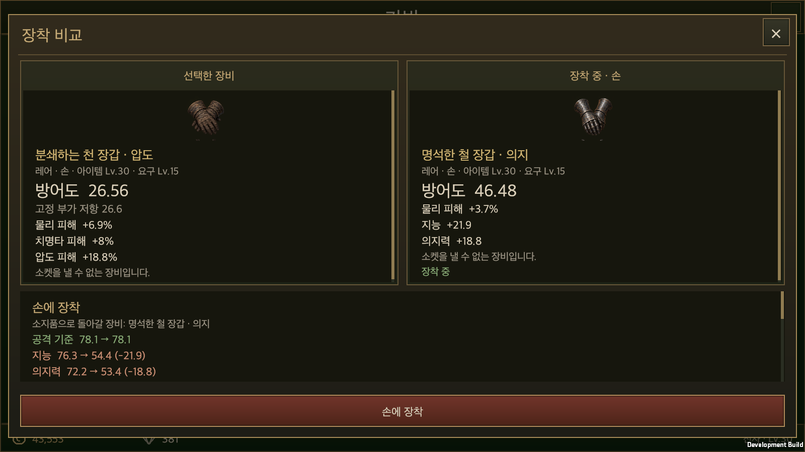

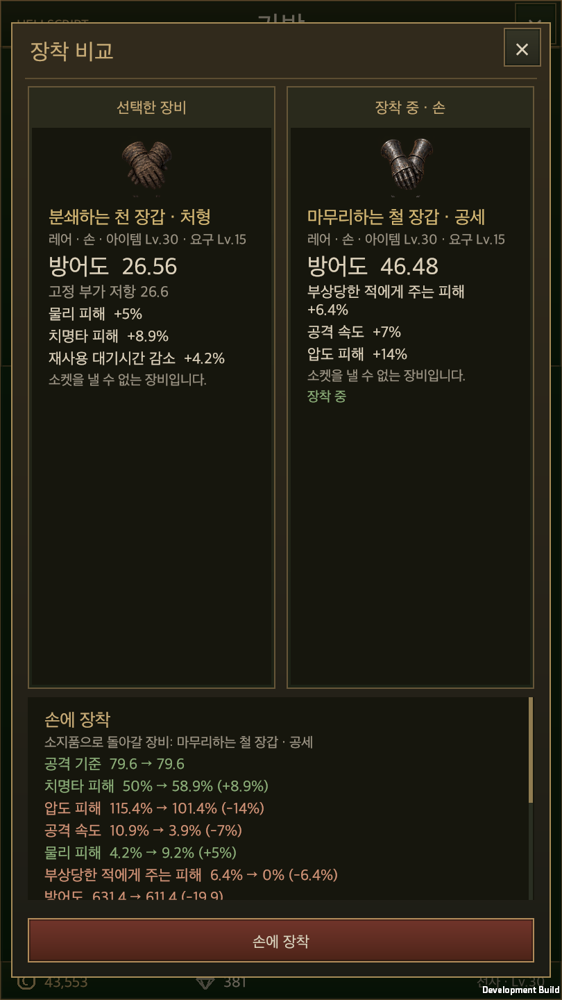

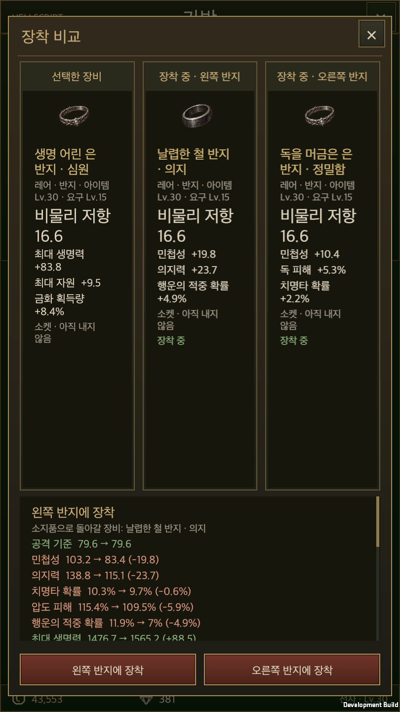

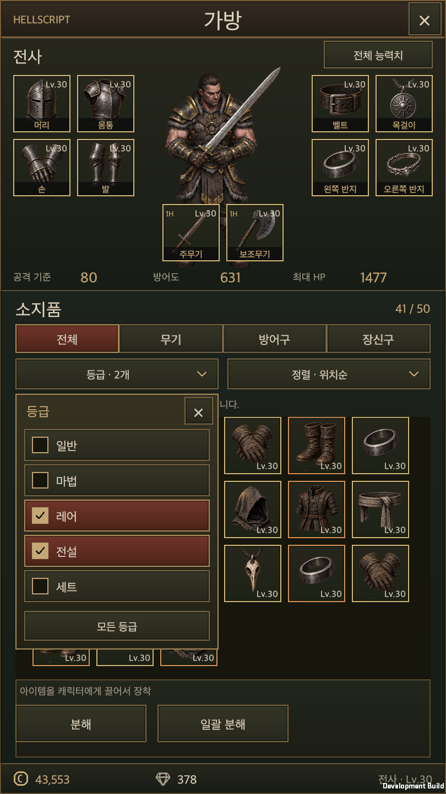

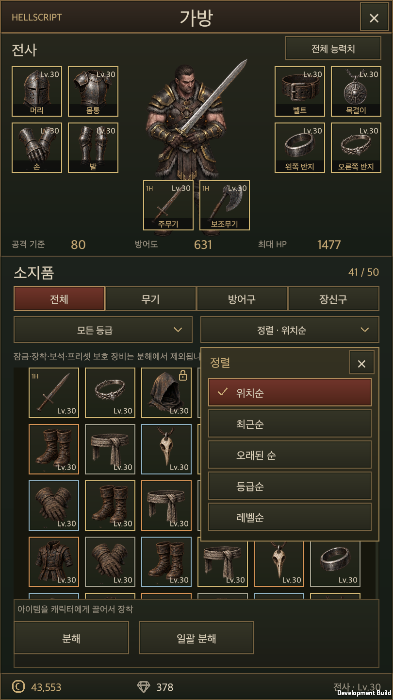

### 2026-09-21 initial port

Verified on 2026-09-21 with Unity 6000.6.0f1.

- Focused Edit Mode: **297 passed, 0 failed, 0 skipped**. Coverage includes paired hands/rings, displacement and capacity, failed-save atomicity, locks, idempotent dismantling, quality calculation, storage, presets, training, shops, gambling and localization. [Original report](NativeInventoryEvidence/editmode.xml)
- The earlier full regression run reported **2,803 passed and 4 failed out of 2,807**. Three outdated fixtures affected by the new weapon bases/content version were corrected and passed in the focused rerun. One pre-existing check remains: four title/character-selection Graphic classes lack automatic CanvasRenderer requirements. Those source files were not changed. This is not a final full-suite pass. [Earlier report](NativeInventoryEvidence/regression-before-final-fixes.xml)
- The macOS development player passed Korean/English, landscape 1600×900, portrait 810×1440, fixed geometry, all 57 attributes with scrolling, lock protection, selected/bulk dismantling, saved filters across reload, two-ring/single-ring comparison, detail equip/unequip, drag offset/equip, quick-touch scrolling, held-touch dragging, battle time gate and return to gameplay. Acceptance uses real uGUI handlers/raycasts and an isolated real account save. [Runtime result](NativeInventoryEvidence/runtime.txt)
- The current Unity Editor project also received a raycast-checked pointer event on the play-scene character shortcut. Inventory opening and returning to the plaza were verified. The test Play session was stopped; Console errors were zero.
- Physical iPhone/Android touch, notches, rotation and performance remain unverified. Desktop window ratios and simulated touch events are not physical-device evidence.

The six new shop type filters start disabled and do not inherit staff auto-sale settings. Shields display armor in storage, training and shops. Shop forecasts use the real paired-slot replacement rules.

[Validation scope](NativeInventoryEvidence/validation.json) · [Shop/gambling integration runtime](NativeInventoryEvidence/shop-runtime.txt)

### Runtime captures

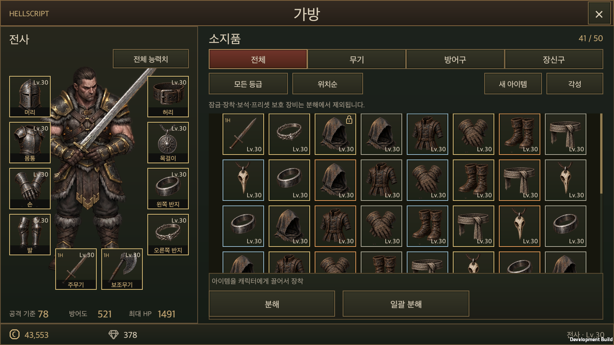

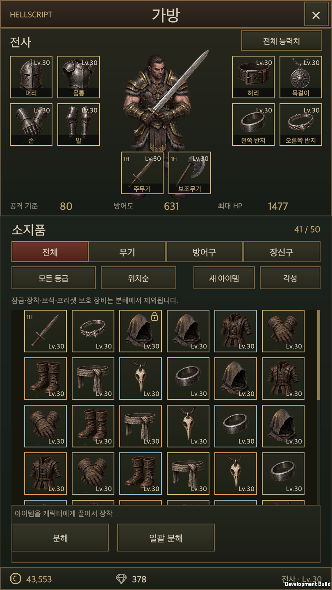

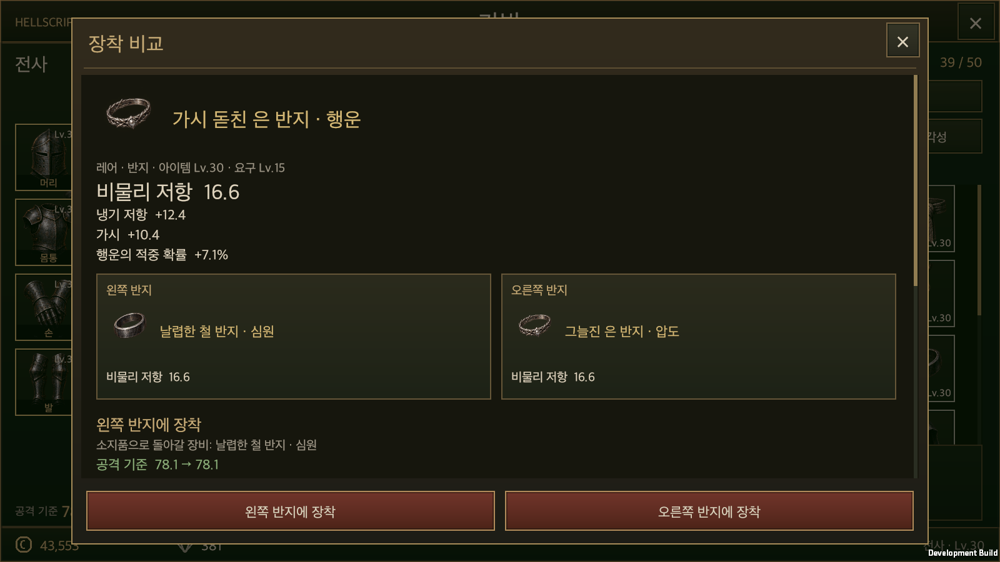

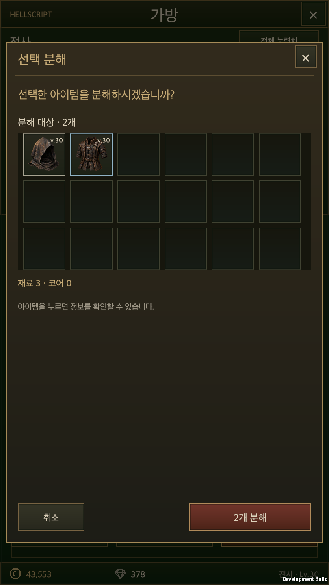

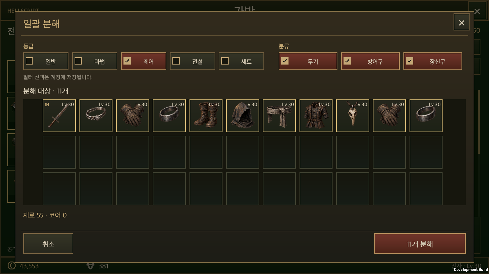

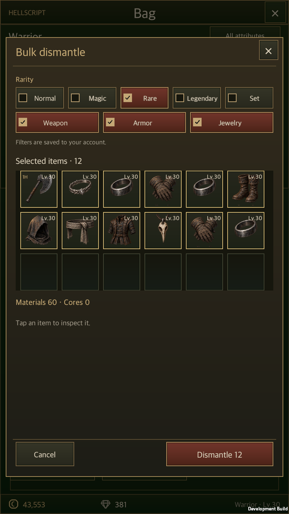

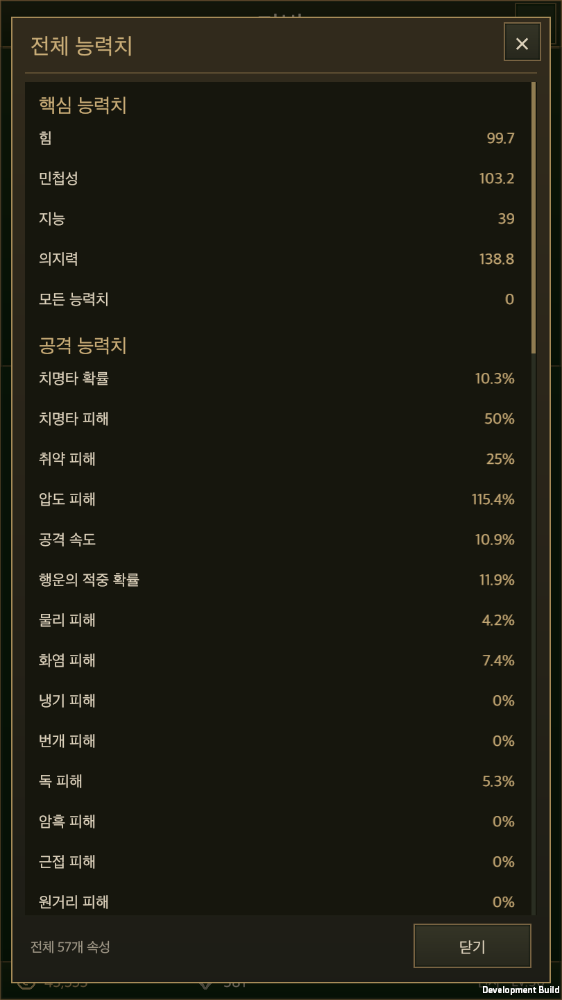

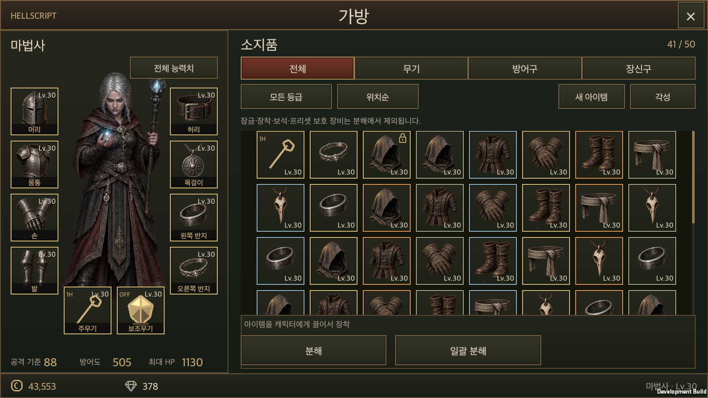

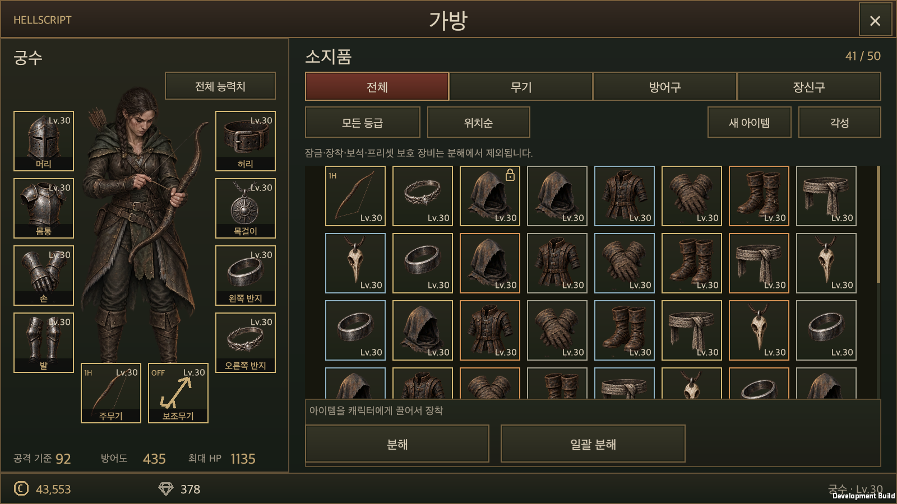

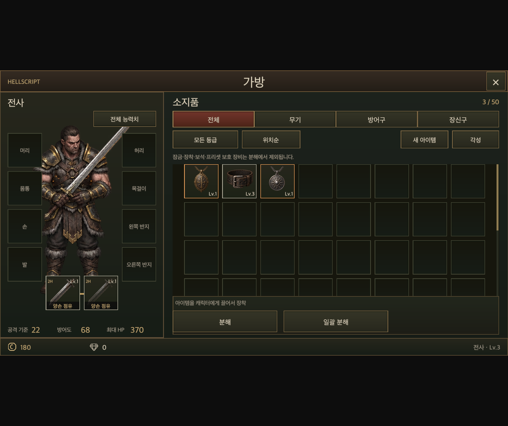

The public wiki is deployed by the person merging this branch into `main`. Local generation and work-branch pushes are not public deployment completion.
