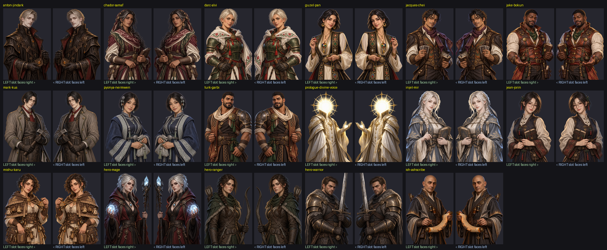
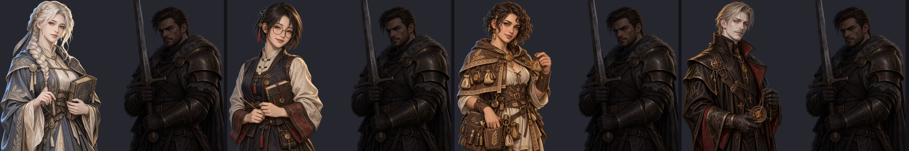
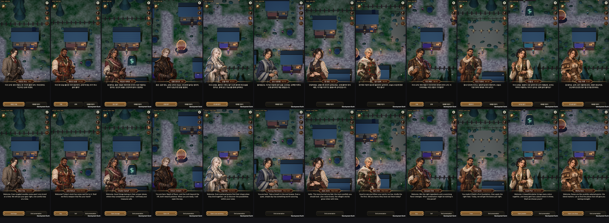
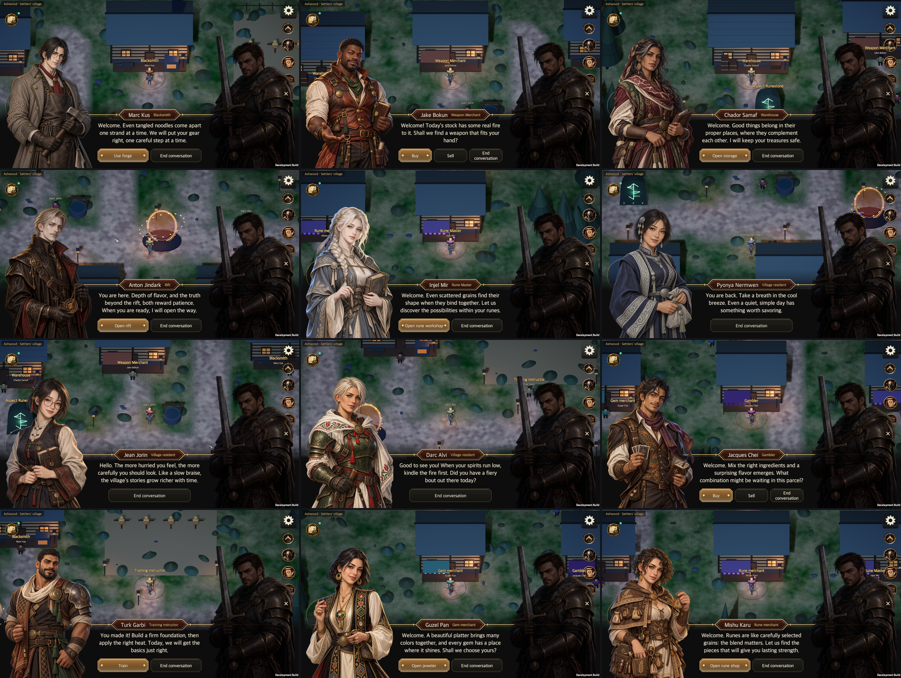
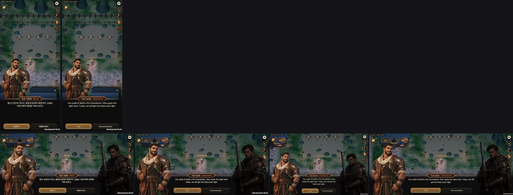
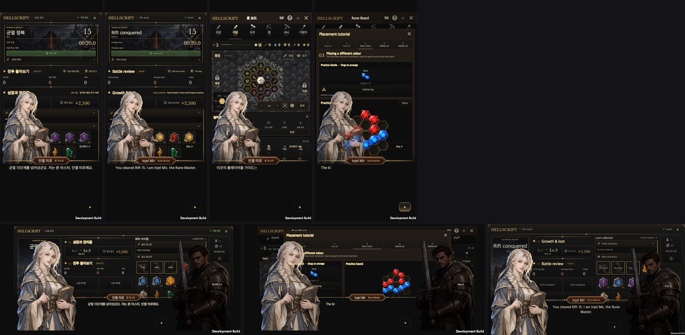
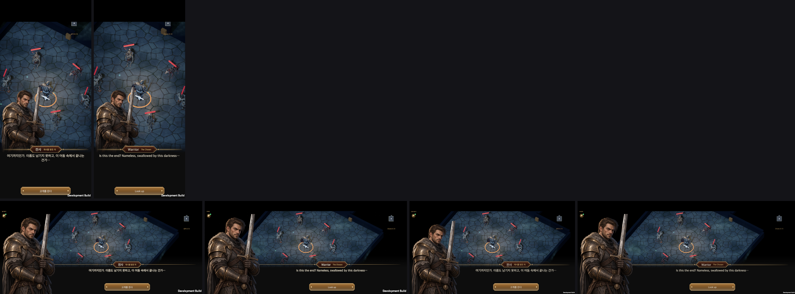
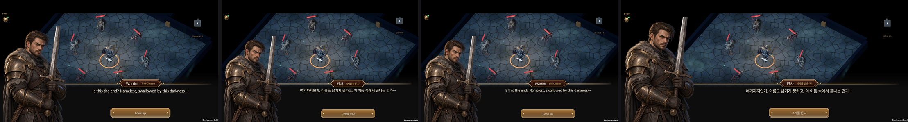
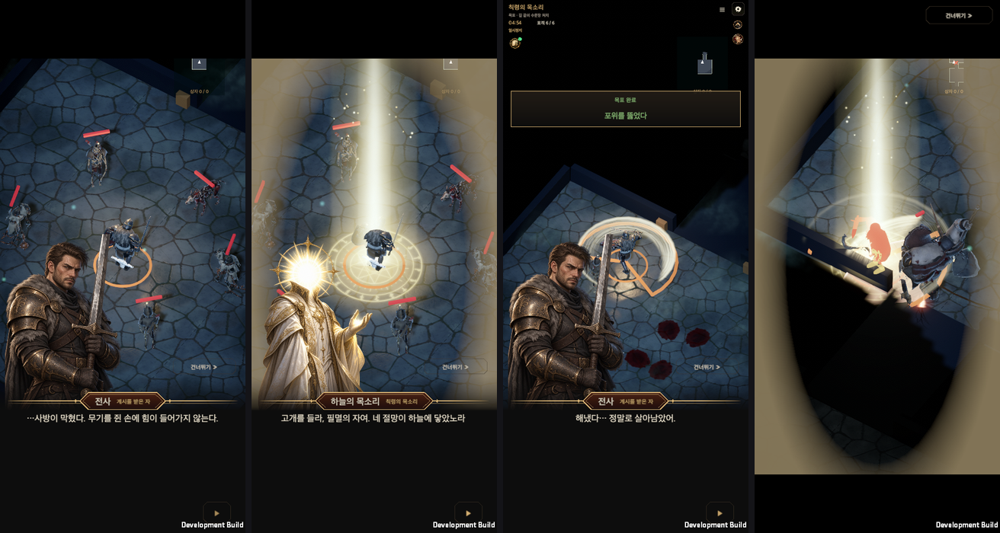

# NPC portraits and food-inspired dialogue

Updated on: 2026-09-28

[한국어](Npc_Dialogue_Portraits.md)

All twelve human NPCs currently placed in the field have individual upper-body portraits and greetings: nine attendants and three residents. The Aspect Stone is a facility, not a person. **Turk Garbi (tteokgalbi)**, selected from the existing name list, is the training instructor.

## Authored identities

The nationality motifs, genders, heritage, skin tones and appearances come from the [original conversation supplied by the user](https://chatgpt.com/s/cx_6ab9076cbfdc8191b39dd57b8bd611bd). Nationalities are fictional design motifs. Food colors and textures inform clothing and accessories, not edible bodies or food costumes.

| Role | Canonical name | Nationality motif | Gender | Dish |
| --- | --- | --- | --- | --- |
| Blacksmith | Mark Kus / 마르크 쿠스 | Germany | Male | Makguksu |
| Weapon merchant | Jake Bokun / 제이크 보쿤 | United States | Male | Jeyuk bokkeum |
| Warehouse | Chador Samaf / 차도르 사마프 | Iran | Female | Chadol samhap |
| Rift keeper | Anton Jindark / 안톤 진다크 | Poland | Male | Andong jjimdak |
| Rune master | Injel Mir / 인젤 미르 | Austria | Female | Injeolmi |
| Resident | Pyonya Nermwen / 표냐 내르뭰 | Kazakhstan | Female | Pyongyang naengmyeon |
| Resident | Jean Jorin / 쟝 죠린 | China | Female | Jangjorim |
| Resident | Darc Alvi / 달크 알뷔 | Hungary | Female | Dakgalbi |
| Gambling merchant | Jacques Chei / 자크 체이 | France | Male | Japchae |
| Training instructor | Turk Garbi / 터크 가르비 | Türkiye | Male | Tteokgalbi |
| Jeweler | Guzel Pan / 구젤 판 | Azerbaijan | Female | Gujeolpan |
| Rune merchant | Mishu Karu / 미슈 카루 | Romania | Female | Misutgaru |

The eight previously placed NPCs retain their final spellings. Earlier candidate spellings are the identity sources for Jake Bokun, Anton Jindark, Jean Jorin and Darc Alvi; their nationalities and genders are not inferred again from their revised names. Four existing candidates fill the previously unnamed gambling, training, jewelry and rune services.

## Interaction and ownership

Selecting an NPC requests movement to a point 1.4 m in front of them, avoiding overlapping bodies. The interaction card keeps the expanded content shortcuts clear. Arrival does not automatically converse or transact. Use **Talk** nearby or press E to see the portrait, name, role and greeting. Existing service shortcuts remain available. Attendants offer their existing services in the dialogue footer; weapon and gambling merchants expose separate Buy/Sell actions, while residents only offer conversation dismissal.

Conversation reach uses the NPC's actual position. Services revalidate reach and the existing service access checks when invoked. The rift attendant and existing portal both retain access. The shared window host blocks movement/background input and handles close/back. Reading a greeting does not change the account, rewards or trades. Language, text scale and orientation changes retain the dialogue identity.

[NpcProfiles.json](../../Assets/HELLSCRIPT/Resources/NpcProfiles.json) owns identities, food concepts, appearances, greetings and portrait resource paths. [NpcProfiles.cs](../../Assets/HELLSCRIPT/Runtime/Core/NpcProfiles.cs) connects these definitions to field placement and range. Town labels use the same names; English uses the existing `Localization/en.txt` table.

`NpcDialogueWindow` was created with `tools/new_content_ui.py NpcDialogue` and uses `ContentWindowView` with `EquipmentViewSource.Catalog`. It never reads or mutates an account. `GameController.NpcDialogue` dispatches existing services. The window reuses `ContentWindowHost`, `UiTheme`, `UiFonts`, scrolling content and fixed actions. The shared bottomDock option anchors the panel to the safe-area bottom and caps its height at 30% of the safe area (about 25% on a normal portrait screen). Including the bottom inset, it remains within the bottom 33%. The full-screen backdrop is transparent, leaving the field undimmed. A small portrait stays on the left; the name sits above the independently scrolling greeting on the right. The portrait, name and actions remain fixed while text scrolls. Landscape keeps the role beside the name; portrait gives actions the full panel width. Art retains its aspect ratio and text scale settings remain active. Shared body sizing and compact spacing leave room for at least two greeting lines even at 150% text. The shared host still blocks background input and movement.

## Art provenance

The user approved using the available built-in image generation surface. Its response does not disclose the actual model, so these files are not claimed as verified `gpt-image-2` outputs. Provenance remains `candidate_model_unknown`, with user approval to use these built-in results recorded separately. Native PNG alpha is preserved without chroma key or background-removal postprocessing. The scoped importer preserves alpha, caps the imported long side at 1024, disables mipmaps and uses uncompressed textures; original PNG files remain intact.

[Prompts](../Art/NpcPortraits/prompts.json) · [Generation results](../Art/NpcPortraits/generation-results.json) · [Alpha checks](../Art/NpcPortraits/alpha-validation.json) · [Portrait gallery](Npc_Dialogue_Portraits.md#초상화)

## Story-scene layout (2026-09-28)

NPC conversations are now drawn with the tutorial's [game dialogue box](Tutorial_Staging.en.md): as in the reference screen the user shared, large character art with transparent surroundings stands out of the text band. This section supersedes the layout described under *Interaction and ownership* below (a small picture inside the frame on the left).

- A full-width band is docked to the bottom of the safe area at no more than 30% of its height. Its top fades in from clear, it is opaque behind text, and a cartouche on a brass rule carries the name and role.
- In landscape the NPC stands on the left to about 80% of the screen height and the hero stands dimmed on the right. On a narrow portrait screen only the NPC stands, on the band. Figures stay inside the safe area and never overlap the greeting or the actions.
- The greeting is centred and written glyph by glyph; one press completes it. Service, sell and goodbye can be pressed at once, even while it is being written. Close, Back, the E key, distance revalidation and service dispatch are unchanged.
- The three hero busts were newly made with GPT; provenance and checks are in [tutorial staging](Tutorial_Staging.en.md).

## Compact bottom layout validation

After the layout revision on 2026-09-27, **48/48 NPC, town movement and shared UI Edit Mode tests** passed. The macOS development build completed with zero errors. [Tests](NpcDialogueCompactEvidence/editmode.xml) · [Build](NpcDialogueCompactEvidence/build.txt)

The native player passed **242 layout checks**, covering all twelve NPCs, five resolutions, Korean/English and 100%/150% text. Assertions verify bottom anchoring, the 30% height cap, transparent field backdrop and fixed portrait/actions. All 76 overflowing greeting cases passed uGUI scroll-to-end, return and pointer-drag checks. The 508 synthetic clicks and 11 service dispatches also passed, including distance gates, dismissal/back and unchanged account state. [Runtime](NpcDialogueCompactEvidence/runtime.txt)

[PC Korean](NpcDialogueCompactEvidence/turk-garbi-1440x810-ko-100.png) · [PC English](NpcDialogueCompactEvidence/turk-garbi-1440x810-en-100.png) · [Portrait Korean 150%](NpcDialogueCompactEvidence/turk-garbi-440x956-ko-150.png) · [Portrait English 150%](NpcDialogueCompactEvidence/turk-garbi-440x956-en-150.png) · [Landscape English 150%](NpcDialogueCompactEvidence/turk-garbi-956x440-en-150.png) · [16:10](NpcDialogueCompactEvidence/turk-garbi-1440x900-en-100.png) · [21:9 at 150%](NpcDialogueCompactEvidence/turk-garbi-1680x720-en-150.png) · [Simulated notch](NpcDialogueCompactEvidence/training-notched-portrait-en-150.png)

Shared UI ownership and nine contract tests, wiki build/check, ten Python tests and the JavaScript checks passed. This is branch validation; physical mobile was not tested.

## Initial feature validation

Unity 6000.6.0f1 passed **25/25 NPC and town movement Edit Mode tests**, covering distinct imported portraits, canonical identities, reachable approach points, distance guards and English dialogue. [Focused report](NpcDialogueEvidence/npc-town-editmode.xml)

The broader localization run passed 57/58 tests. Its single failure reports two existing missing translation keys in `RuntimeFirstPlayAcceptance.cs`: `눈보라 검사 순서` and `눈보라를 공격 순서`. Both exact strings and missing English entries were verified in the unmodified base commit. All new NPC lines passed. These overlapping test runs are not additive. [Combined report](NpcDialogueEvidence/editmode-final.xml) · [Baseline comparison](NpcDialogueEvidence/baseline-localization.json)

The native macOS development build completed with zero build errors. The actual player passed **242 portrait/layout checks, 508 raycast-verified synthetic clicks and 11 service dispatches**: nine facilities plus the two merchants' Sell tabs. Coverage combines all twelve NPCs with 440×956, 956×440, 1440×810, 1440×900 and 1680×720; Korean/English; and 100%/150% text. Further checks cover changing language/scale/orientation while open, a simulated notch, portrait aspect, text fit, safe-area bounds, scrolling/fixed-action separation, unobscured expanded shortcuts, world picking, remote and stale-distance rejection, movement blocking, close/back and unchanged account data while conversing. Dynamic-font wrapping at 150% has an extra line of clearance. The training instructor's field object, nameplate, portrait dialogue and training entry were verified together.

[Build result](NpcDialogueEvidence/build.txt) · [Runtime result](NpcDialogueEvidence/runtime.txt) · [Training field](NpcDialogueEvidence/training-npc-world.png) · [Training entry](NpcDialogueEvidence/training-service.png)

The existing town HUD regression also passed 48 resolution/scale/language combinations, safe areas, joystick input and expanded shortcuts. All nine services and three residents passed the existing nameplate/placement path in Korean landscape and English portrait. [HUD runtime](NpcDialogueEvidence/town-hud-runtime.txt) · [NPC placement](NpcDialogueEvidence/town-hud-npc-runtime.txt)

No MCP Editor instance was connected, so validation used the existing Unity batch tooling and native macOS development player. Phone dimensions are simulated desktop windows; physical mobile touch and performance remain unverified. These are branch validation results, not evidence of a main merge or public wiki deployment.

## Facing each other (2026-10-05)

In a dialogue scene the speaker stands on the left and the listener on the right. The existing art faces a different way for each character, so a figure on the left sometimes looked off-screen. Every character now has art that faces the other way, and the left slot uses art that looks right while the right slot uses art that looks left, so the two figures face each other.

- **Rule:** left slot = art that looks right, right slot = art that looks left. `NpcProfile.PortraitFor(onLeft)` chooses. If the original already looks that way it is used, otherwise `<id>-mirror.png` is used.
- **Data:** `portraitFacing` (the way the original looks) and `portraitMirror` (path of the opposite-facing art) in `NpcProfiles.json`. The three heroes and the Voice from Above carry the same fields in `Speakers` in `NpcProfiles.cs`. The dialogue window asks `PortraitFor(true)` for the speaker and `PortraitFor(false)` for the listener (the `listener` path). Face-crop cards and barks keep the original.
- **Mirror art:** 16 PNGs (about 43 MB in total) that are exact left-right flips of the originals. No generation model or other postprocessing was used, and flipping each one back reproduced every pixel of the original, alpha included. Record: [mirror-manifest.json](../Art/NpcPortraits/mirror-manifest.json). Import settings and platform budgets follow the existing rules of the `NpcPortraits` folder (`NpcPortraitImporter`, `ResourceTextureBudget`).
- **Measuring the direction:** from the macOS Vision face landmarks, by whether the nose centre sits to the right (+) or left (-) of the face-contour centre. The mirrored images gave the opposite sign. The faceless Voice from Above was set by its reaching hand (right). Pyonya (+0.233) and Jean (-0.209) have small values, are close to frontal and are the least certain; what was measured is head direction, and torso direction was only checked by eye.

| Character | Original looks | Nose offset | Left slot art | Right slot art |
| --- | --- | --- | --- | --- |
| Anton Jindark | right | +0.465 | original | mirror |
| Chador Samaf | right | +0.444 | original | mirror |
| Darc Alvi | right | +0.344 | original | mirror |
| Guzel Pan | right | +0.328 | original | mirror |
| Jacques Chei | right | +0.358 | original | mirror |
| Jake Bokun | right | +0.414 | original | mirror |
| Marc Kus | right | +0.307 | original | mirror |
| Pyonya Nermwen | right | +0.233 | original | mirror |
| Turk Garbi | right | +0.306 | original | mirror |
| Voice from Above | right | reaching hand | original | mirror |
| Injel Mir | left | -0.267 | mirror | original |
| Jean Jorin | left | -0.209 | mirror | original |
| Mishu Karu | left | -0.307 | mirror | original |
| Hero Mage | left | -0.521 | mirror | original |
| Hero Ranger | left | -0.516 | mirror | original |
| Hero Warrior | left | -0.499 | mirror | original |
| Ish, Scribe of Ash (not in town yet) | right | +0.328 | original | mirror |

**Validation (2026-10-05).** Checked in two passes. Every run used a disposable save and evidence folder, and no real account save was touched. The record is [verification-20261005.json](NpcDialogueFacingEvidence/verification-20261005.json).

- **Edit Mode:** 134 related tests passed (including the 4 `NpcPortraitFacingTests` and the dialogue, chapter engine, tutorial progression, edict disclosure and localization checks; 0 compile errors).
- **NPC dialogue smoke:** passed in the macOS development build: 12 NPCs, 122 portrait/layout/language checks, 308 synthetic clicks and 11 service entries. The existing smoke's portrait assertion was changed to expect the left-slot art (`PortraitFor(true)`). The summary is in [runtime-claim.txt](NpcDialogueFacingEvidence/runtime-claim.txt).
- **Direction measurement (portrait and English included):** a throwaway clone build (not in the repository) that only widened the smoke's capture condition saved all 120 captures (12 NPCs x 5 viewports x Korean and English), and face detection measured the direction. The speaker looks right in all 120 (nose offset +0.159 to +0.481). Injel (+0.274), Jean (+0.186) and Mishu (+0.298), who originally looked left, now look right. The listener (the hero) looks left in all 96 landscape captures (-0.520 to -0.458). The 24 portrait 440x956 captures draw the speaker only, by design. The portrait and English screens were also checked by eye.
- **Rune board tutorial smoke:** all 10 runs (5 viewports x Korean and English) passed, including the changed Injel assertion. By eye, Injel looks right in portrait, landscape and English, and in landscape the hero faces her.
- **When the hero is the left speaker in the prologue:** checked by eye in the captures of tutorial smoke phase one (passed): 10 intro captures (5 viewports x two languages) and, on the portrait screen, "the way is shut", the Voice's arrival and "I did it…". The Warrior stands on the left in the mirrored art and looks right, toward the field. The empty right slot there is existing behavior: when the hero speaks, the other party (the Voice) is not drawn.

**Existing failure, unrelated to this work.** The resume phase of the tutorial smoke fails in the survival lesson after the boss-fight intervention with "timed out for 120 s because the designated control was not found". A build of the code before this work (`main` at `ee5a949c`) fails at the same step with the same exception, so it is not caused by this work (phase one passes, resume fails, the same three captures). The record from 2026-09-30 shows the smoke passing, and the code was last changed by `93d59959`. It is outside the scope of this work, so it was not fixed and was left as a separate task request.

Not checked: the hero lines after the boss-fight intervention ("Ugh… like this…!", "…I will follow your command.") and the tutorial smoke's town-arrival section (not run because of the existing failure above; the earlier hero lines, and Anton with the hero listening in the NPC dialogue, were checked), the landscape screen where the Voice speaks and the hero listens on the right (the Voice art is the unchanged original), real mobile devices, the APK size and ASTC result of the 16 added images, and the full Edit Mode and smoke suite (planned once at the end).

**Known limits.** Because they are mirrors, asymmetric details flip (which hand holds an item, the hair parting, Jake's left-eyebrow scar landing on the other eyebrow). The light direction flips too. For any character that does not look right, the opposite-facing art can be redrawn with Codex and saved under the same file name; no code needs to change.
