# NPC 초상화와 음식 콘셉트 대화

작성일: 2026-09-27

[English](Npc_Dialogue_Portraits.en.md)

현재 필드에 생성되는 사람 NPC 12명에게 각자의 상반신 초상화와 인사말을 연결한다. 담당자 9명과 행인 3명이며, 위상 각인석은 사람이 아닌 시설이므로 제외한다. 훈련장 담당자는 기존 이름 후보의 **터크 가르비(떡갈비)**다.

## 인물 설정

[사용자가 공유한 원래 설정](https://chatgpt.com/s/cx_6ab9076cbfdc8191b39dd57b8bd611bd)의 국적 모티브·성별·계통·피부색·외형을 유지한다. 국적은 창작 모티브다. 음식의 색과 질감은 의상·장식에 추가하고, 음식 자체를 몸이나 머리로 표현하지 않는다.

| 역할 | 게임 내 이름 | 국적 모티브 | 성별 | 음식 | 주요 시각 요소 |
| --- | --- | --- | --- | --- | --- |
| 대장간 | 마르크 쿠스 | 독일 | 남성 | 막국수 | 메밀빛 회갈색, 붉은 목도리, 면발처럼 엮은 자수 |
| 무기 상인 | 제이크 보쿤 | 미국 | 남성 | 제육볶음 | 짙은 갈색 피부, 적갈색 가죽, 초록색 포인트와 황동 |
| 창고 | 차도르 사마프 | 이란 | 여성 | 차돌 삼합 | 자주색·초록색·크림색 겹옷, 흰 마블링 자수 |
| 균열 | 안톤 진다크 | 폴란드 | 남성 | 안동찜닭 | 간장빛 흑갈색 외투, 호박빛 보석, 붉은 안감 |
| 룬 마스터 | 인젤 미르 | 오스트리아 | 여성 | 인절미 | 은백색 땋은 머리, 청회색 장포, 콩고물빛 금색 자수 |
| 행인 | 표냐 내르뭰 | 카자흐스탄 | 여성 | 평양 냉면 | 남색과 냉청색, 은회색 테두리, 옅은 초록 장식 |
| 행인 | 쟝 죠린 | 중국 | 여성 | 장조림 | 흑발 단발과 안경, 남색 조끼, 상아색 단추와 붉은 자수 |
| 행인 | 달크 알뷔 | 헝가리 | 여성 | 닭갈비 | 백금발, 녹색 갑옷, 붉은 끈과 흰 망토 |
| 갬블 상인 | 자크 체이 | 프랑스 | 남성 | 잡채 | 물결치는 흑발과 콧수염, 자주색 목도리, 여러 색의 자수 |
| 훈련 교관 | 터크 가르비 | 튀르키예 | 남성 | 떡갈비 | 굵은 팔과 수염, 어깨 보호구, 밤갈색과 황동 |
| 보석 상인 | 구젤 판 | 아제르바이잔 | 여성 | 구절판 | 검은 단발과 금귀걸이, 검은색·금색 바탕의 분할 보석 |
| 룬 상인 | 미슈 카루 | 루마니아 | 여성 | 미숫가루 | 흑갈색 곱슬머리와 호박색 눈, 곡물빛 망토와 작은 주머니 |

기존에 배치한 8명의 최종 표기를 유지한다. 원래 후보의 제이크 보쿰·안톤 짐다크·장 조린·다르크 알비는 각각 제이크 보쿤·안톤 진다크·쟝 죠린·달크 알뷔의 설정 근거다. 이름 표기가 달라졌다고 국가나 성별을 다시 추측하지 않는다. 이름이 없던 갬블·훈련·보석·룬 상인에는 기존 후보 4명을 배정했다.

## 게임 동작

- NPC를 누르면 몸이 겹치지 않도록 NPC 앞 1.4m 지점으로 이동하고, 도착만으로 대화나 거래를 실행하지 않는다. 펼친 콘텐츠 바로가기와 대화 버튼 영역은 서로 겹치지 않는다.
- 근처의 **대화하기** 버튼 또는 E키로 초상화·이름·역할·인사말을 표시한다. 기존 서비스 바로가기도 유지한다.
- 담당자 대화창 아래에서 기존 콘텐츠를 열 수 있다. 무기·갬블 상인은 구매와 판매를 구분하며, 행인은 대화 종료만 제공한다.
- 실제 NPC 위치에서 대화 거리를 확인한다. 서비스 실행 시 현재 NPC 거리와 기존 서비스 접근 조건을 다시 확인한다. 균열은 담당자와 기존 포탈 접근을 모두 유지한다.
- 대화 중에는 이동과 배경 클릭을 차단한다. 닫기·대화 종료·뒤로가기는 공통 창 관리자를 사용한다.
- 인사말을 보는 일은 계정 저장·보상·거래를 변경하지 않는다. 한국어·영어, 글자 크기와 화면 방향 변경을 지원한다.

## 소유 코드와 이미지

[NpcProfiles.json](../../Assets/HELLSCRIPT/Resources/NpcProfiles.json)이 인물·음식·외형·인사말·리소스 경로의 원본이다. [NpcProfiles.cs](../../Assets/HELLSCRIPT/Runtime/Core/NpcProfiles.cs)는 배치와 접근 거리를 연결하고, `TownLayout`의 이름표도 같은 정의를 읽는다. 영어 문구는 기존 `Localization/en.txt`를 사용한다.

`NpcDialogueWindow`는 `tools/new_content_ui.py NpcDialogue`로 시작한 `ContentWindowView` 진입점이다. 표시 데이터는 `EquipmentViewSource.Catalog`이며 계정에 접근하지 않는다. `GameController.NpcDialogue`가 실제 서비스 명령을 전달한다. `ContentWindowHost`, `UiTheme`, `UiFonts`, 공통 스크롤·고정 행동 영역을 재사용한다.

대화창은 공통 창의 `bottomDock` 옵션으로 안전 영역 하단에 고정한다. 높이는 안전 영역의 30% 이하로 제한하며, 일반 세로 화면에서는 약 25%를 사용한다. 하단 여백까지 포함해 아래쪽 33% 안에 머물고, 필드 전체를 어둡게 덮던 배경은 투명하게 바꿨다.

작은 상반신 그림은 왼쪽에, 이름과 인사말은 오른쪽에 둔다. 이름과 그림, 서비스·종료 버튼은 고정하고 긴 인사말만 스크롤한다. 가로에서는 이름 옆에 역할도 표시하며, 세로에서는 버튼이 창 전체 너비를 사용한다. 그림의 원래 비율과 확대 글자 설정을 유지하며, 150% 글자에서도 본문 두 줄 이상이 보이도록 공통 본문 크기와 여백을 적용한다. 배경이 보여도 기존 창 관리자가 대화 중 이동과 배경 입력을 차단한다.

이미지는 승인받은 내장 이미지 생성으로 제작했다. 도구가 실제 모델명을 반환하지 않아 `gpt-image-2` 사용을 확인한 것으로 기록하지 않는다. 출처 표시는 `candidate_model_unknown`, 해당 내장 결과의 사용 승인은 별도로 기록한다. 생성된 PNG의 알파를 그대로 보존하며 크로마키나 후처리 배경 제거를 사용하지 않는다. 가져오기에서는 최대 변 1024, 알파 보존, 밉맵 없음, 무압축을 사용한다. 원본 PNG는 별도로 유지한다.

[생성 프롬프트](../Art/NpcPortraits/prompts.json) · [생성 결과](../Art/NpcPortraits/generation-results.json) · [알파 검사](../Art/NpcPortraits/alpha-validation.json)

## 하단 배치 변경 검증

2026-09-27에 창 위치와 크기를 조정한 뒤 NPC·마을 이동·공통 UI Edit Mode 검사 **48개가 모두 통과**했다. macOS 개발 빌드도 오류 0개로 완료했다. [검사 원본](NpcDialogueCompactEvidence/editmode.xml) · [빌드 결과](NpcDialogueCompactEvidence/build.txt)

실제 macOS 실행 파일에서 12명 전원, 5개 해상도, 한국어·영어, 글자 크기 100%·150%를 조합한 **242개 화면 검사**를 통과했다. 창의 하단 고정과 높이 30% 제한, 투명 배경, 초상화와 버튼의 고정 상태를 확인했다. 인사말이 긴 76개 조합에서는 실제 uGUI 스크롤·드래그 처리기로 마지막 줄까지 이동하고 처음으로 돌아오는 것을 검사했다. 508회 합성 클릭과 11개 서비스 진입, 거리 검증·닫기·뒤로가기·계정 상태 불변 검사도 통과했다. [실행 결과](NpcDialogueCompactEvidence/runtime.txt)

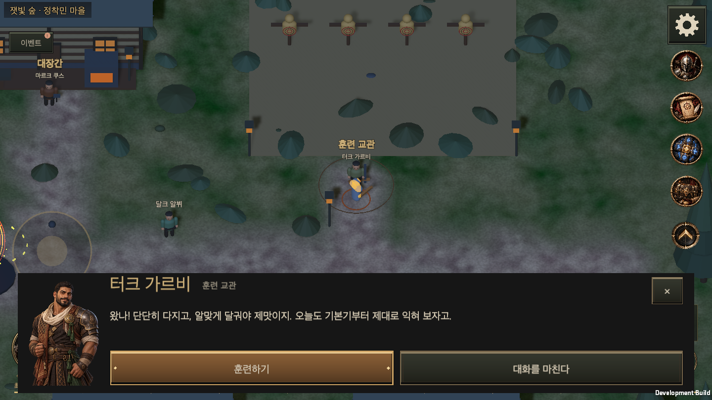
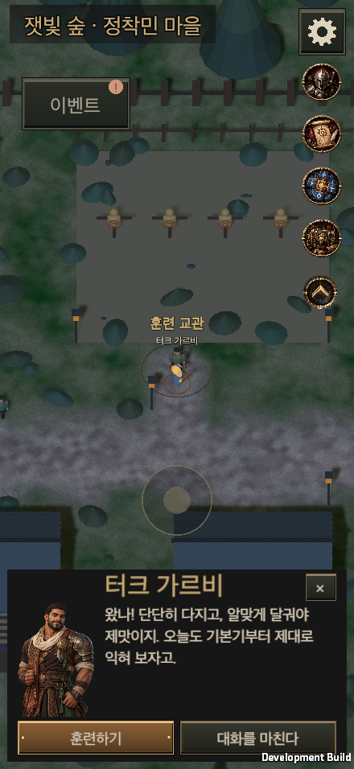

[PC 영어](NpcDialogueCompactEvidence/turk-garbi-1440x810-en-100.png) · [세로 영어 150%](NpcDialogueCompactEvidence/turk-garbi-440x956-en-150.png) · [가로 영어 150%](NpcDialogueCompactEvidence/turk-garbi-956x440-en-150.png) · [PC 16:10](NpcDialogueCompactEvidence/turk-garbi-1440x900-en-100.png) · [PC 21:9, 150%](NpcDialogueCompactEvidence/turk-garbi-1680x720-en-150.png) · [노치 모의](NpcDialogueCompactEvidence/training-notched-portrait-en-150.png)

공통 UI 검사와 9개 계약 검사, 위키 생성·검사와 10개 Python 검사 및 JavaScript 검사도 통과했다. 검증 대상은 이 작업 브랜치이며, 모바일 실기기는 검증하지 않았다.

## 초기 기능 검증

Unity 6000.6.0f1에서 NPC·마을 이동 Edit Mode 검사 **25개가 모두 통과**했다. 초상화 12개 로드·고유 연결, 기존 이름·성별 유지, 도달 가능한 접근 지점, 거리 차단과 영어 문구를 확인했다. [검사 원본](NpcDialogueEvidence/npc-town-editmode.xml)

번역 전체 검사를 함께 실행한 결과는 58개 중 57개 통과, 1개 실패다. 실패한 검사는 기존 `RuntimeFirstPlayAcceptance.cs`의 `눈보라 검사 순서`, `눈보라를 공격 순서` 두 문구가 영어 표에 없는 것을 보고한다. 작업 시작 커밋에서도 같은 문자열과 누락을 확인했으며, 이번 NPC 문구는 모두 통과했다. 두 실행의 검사 수를 합산하지 않는다. [통합 결과](NpcDialogueEvidence/editmode-final.xml) · [기존 누락 비교](NpcDialogueEvidence/baseline-localization.json)

macOS 개발 빌드가 오류 0개로 완료됐고, 실제 실행 파일에서 다음을 확인했다. [빌드 결과](NpcDialogueEvidence/build.txt) · [실행 결과](NpcDialogueEvidence/runtime.txt)

- 440×956, 956×440, 1440×810, 1440×900, 1680×720에서 한국어·영어 및 글자 크기 100%·150%를 조합해 NPC 12명을 검사했다. 대화 중 설정 변경과 노치 모의 검사를 포함해 242개 화면 검사를 통과했다.
- 실제 uGUI 포인터 처리기를 사용하는 508회 합성 클릭으로 대화·종료·시설 이동을 확인했다. 9개 시설 진입과 무기·갬블 상점 판매 탭까지 11개 서비스 진입을 확인했다.
- 초상화 비율, 이름과 인사말, 텍스트 잘림, 안전 영역, 본문과 하단 행동 영역, 펼친 바로가기의 클릭 가능 여부를 검사했다. 150% 글자에서 동적 글꼴의 줄바꿈 여유를 확보했다.
- NPC 선택, 거리 밖 대화 거부, 열린 대화가 오래된 상태가 되었을 때 서비스 진입 거부, 이동 차단, 닫기·뒤로가기, 대화 전후 계정 상태 불변을 확인했다.
- 훈련 교관의 실제 필드 오브젝트·이름표·대화창·훈련장 진입을 함께 확인했다.

기존 마을 HUD 회귀 검사도 48개 해상도·배율·언어 조합과 안전 영역·조이스틱·바로가기를 통과했다. 9개 서비스 NPC와 3명 행인의 기존 이름표·배치 경로도 한국어 가로와 영어 세로에서 확인했다. [HUD 실행 결과](NpcDialogueEvidence/town-hud-runtime.txt) · [NPC 배치 결과](NpcDialogueEvidence/town-hud-npc-runtime.txt)

연결된 MCP Editor 인스턴스가 없어 기존 Unity 배치 검사와 macOS 개발 실행 파일을 사용했다. 모바일 해상도는 macOS 창으로 모의했으며, 모바일 실기기 터치와 성능은 검증하지 않았다. 이 기록은 작업 브랜치의 검증이며 `main` 병합이나 공개 위키 배포의 증거는 아니다.

[초기 훈련장 NPC 배치](NpcDialogueEvidence/training-npc-world.png) · [훈련장 진입](NpcDialogueEvidence/training-service.png). 초기 대화창은 위의 하단 배치로 교체했다.

## 초상화

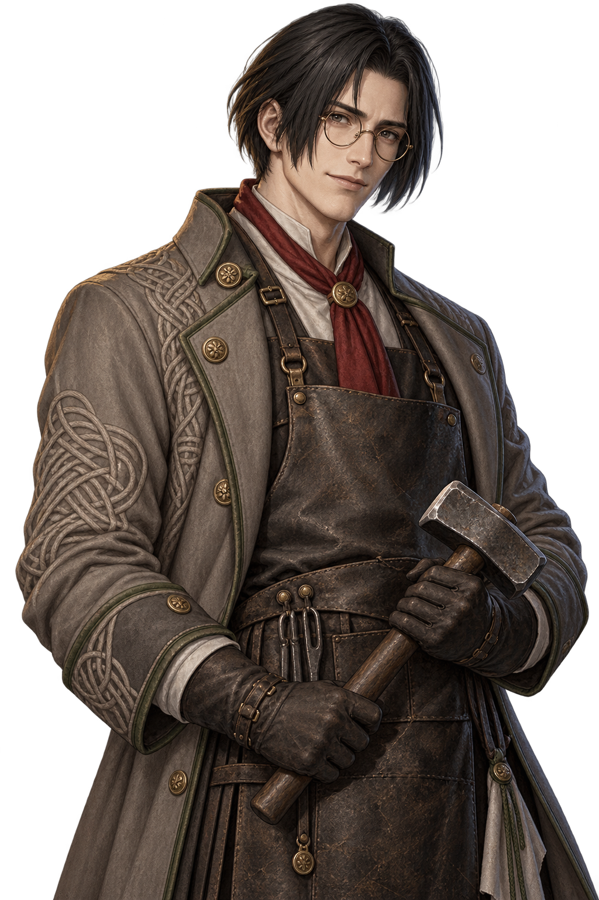
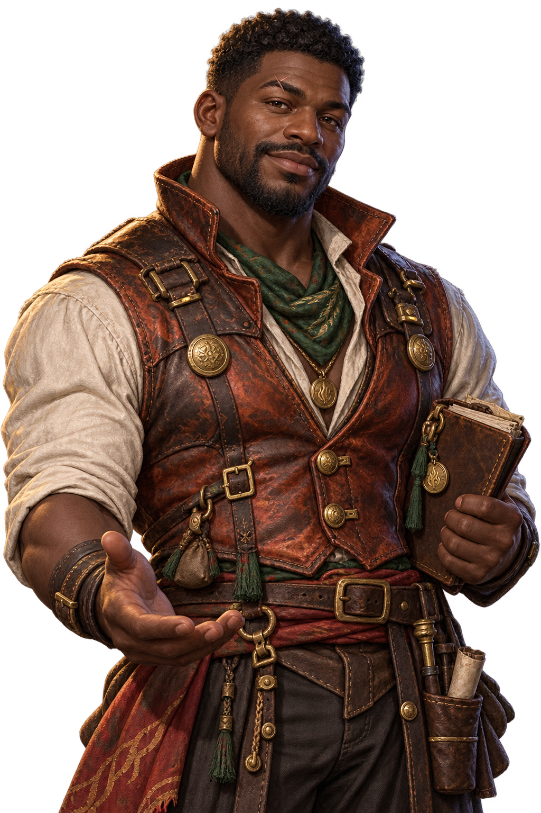
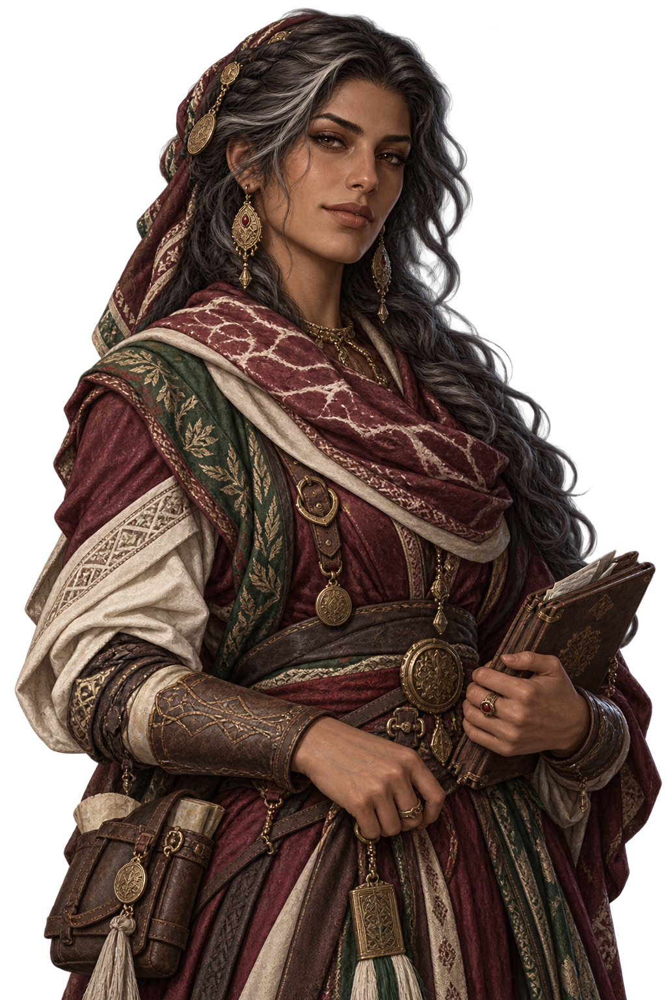
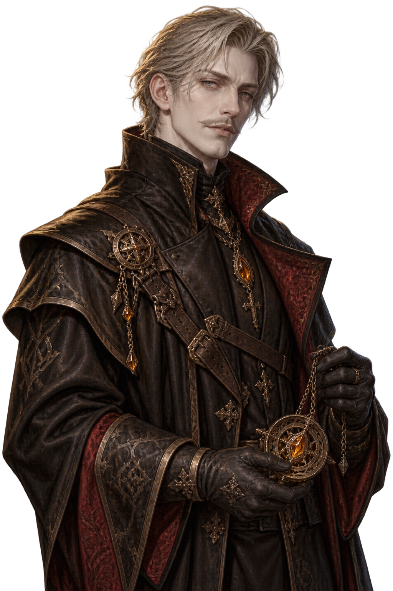
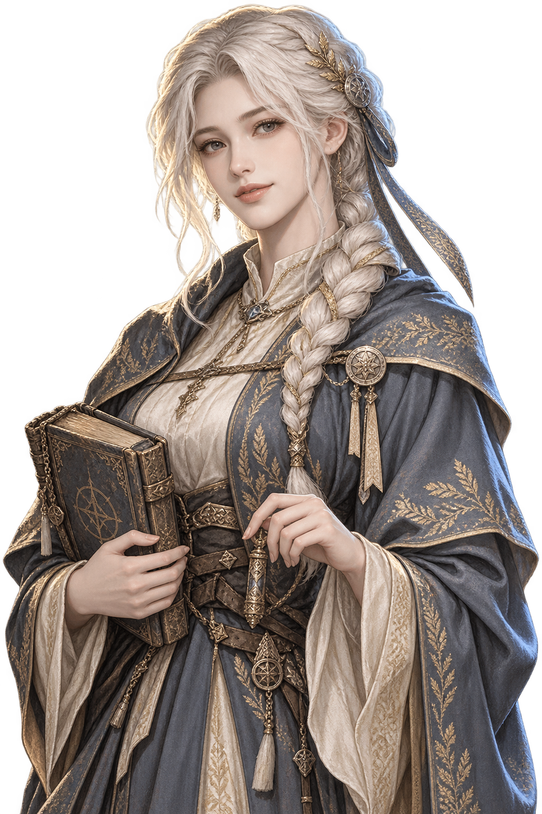
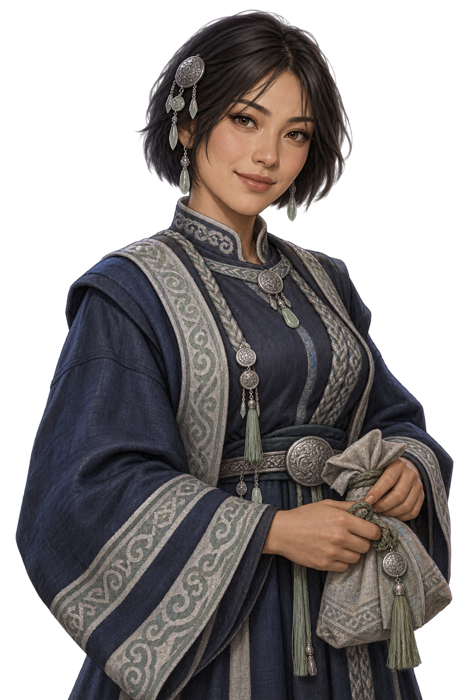
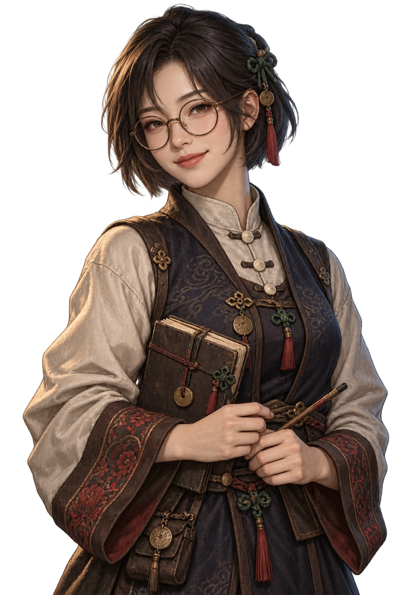
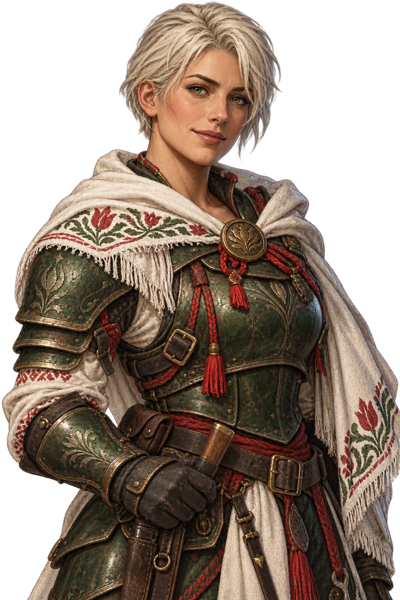
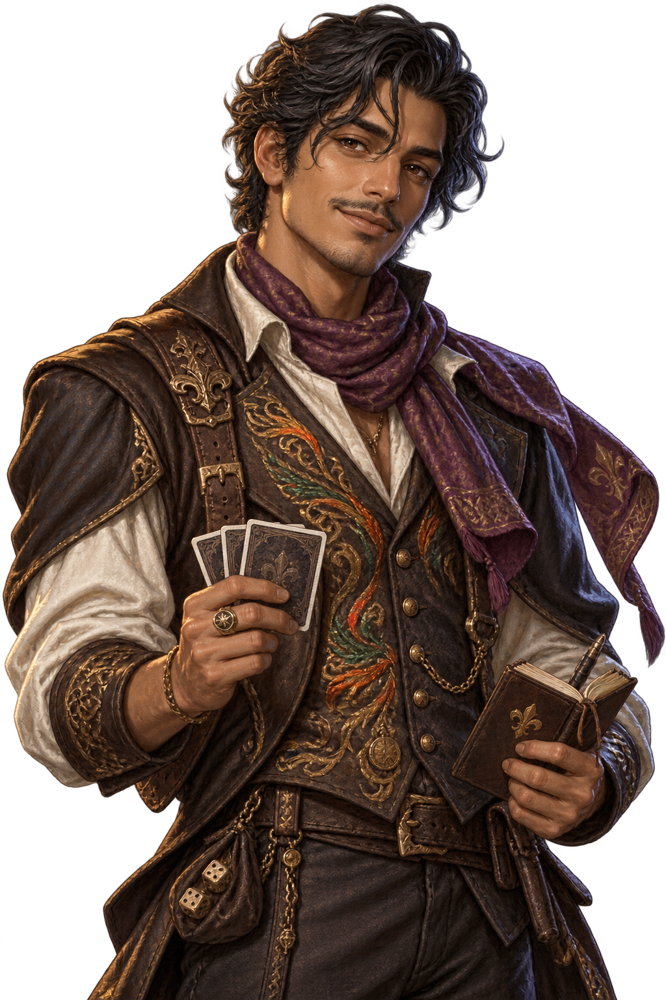
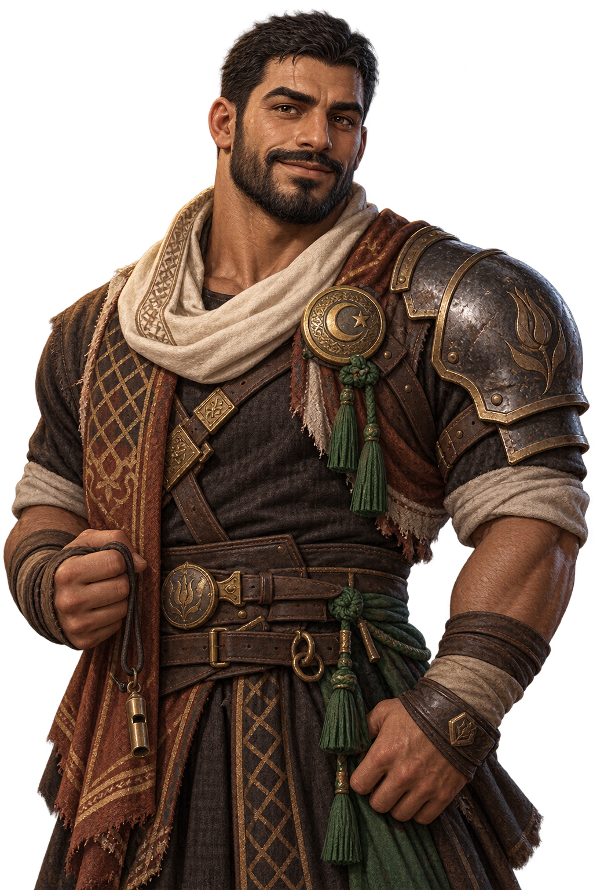
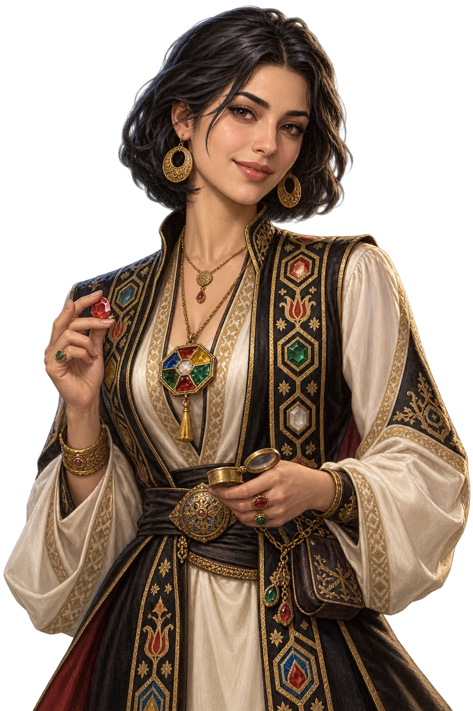
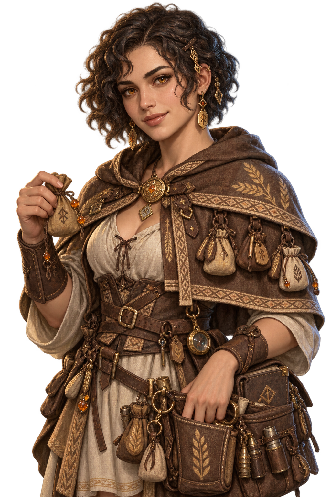
