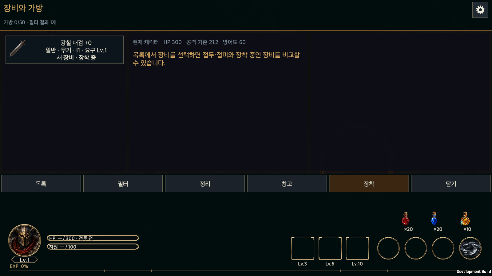
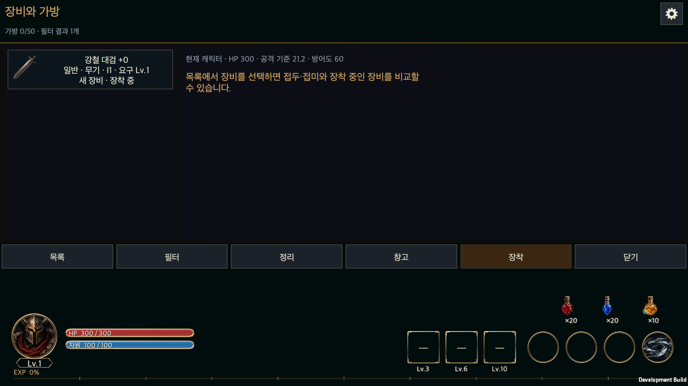

# HELLSCRIPT Play-Screen Content Dock

The follow-up on 2026-09-21 ports the HTML inventory design and paired weapon slots to Unity. See [Native inventory and paired weapon slots](Native_Inventory.en.md) for the current screen and behavior. The old-inventory hookup and captures below document the preceding stage.

From September 20, 2026, the fourth shortcut uses the attached warehouse icon. The town uses a 44-unit header, a 20-unit gear and a dock starting at 48 units from the top. Earlier measurements below are historical; see [Town HUD improvements](Town_Hud_Responsive.en.md).

Date: 2026-09-15
작성일: 2026-09-15

## Goal

A folding group of content shortcuts sits beneath the settings gear in the upper right of the play screens. Folded, only a down-arrow button shows under the gear. Pressing it slides the arrow downward, uncovering the shortcut buttons above it as it travels; when the arrow reaches the bottom it turns 180° into an up arrow. Pressing the up arrow reverses the two steps: the arrow turns back first, then slides up and hides the shortcuts again.

| Order | Button | Connection |
|---|---|---|
| 1 | Character (bag and equipped items) | Since 2026-09-21, `ShowPlayInventory` opens the existing in-game inventory. Closing returns to the originating play screen. |
| 2 | Hunt Edict (skill management and edict editing) | Opens the existing Hunt Edict entry point `ShowEdictEditor`. |
| 3 | Rune Board (rune block placement and management) | Opens the existing Rune Growth screen `ShowRunes` since 2026-09-17. Before that it showed only the notice. |

The Character and Rune Board screens were out of scope for this work: only the buttons and their art were present. The Rune Board was wired to its existing screen on 2026-09-17, and Character on 2026-09-21.

## Character inventory shortcut — 2026-09-21

The first circular shortcut beneath Settings opens the existing inventory using the actual account and owned equipment. `GameUI.ContentDock` calls `GameUI.PlayInventory`, which reuses `ShowBag`. This hookup does not use the HTML prototype data and does not port its slot layout or weapon system to Unity.

In town, input and navigation targets are cleared while the player position and open dock are retained. Close in the inventory footer returns to that same town. In combat, `CommonPanelOpen` suspends the gameplay and repeat clocks without changing the saved pause flag, portal flag or active run object. A previously paused run stays paused; a running one continues after closing.

Leaving for another page releases the inventory entry state. Equipment, comparison, protection, dismantling and storage continue to use the existing transaction services. Older screenshots and validation counts remain historical evidence.

Unity 6000.6.0f1 passed all 81 focused Edit Mode tests covering inventory layout, transactions, localization and a destroyed town joystick reference. The macOS development build completed without errors. Player acceptance covered town entry, language changes within the bag, position and dock retention, battle-clock suspension with the original pause flag retained, existing Hunt Edict/Rune Board routes and landscape/portrait dock layouts. See the [test results](PlayInventoryEvidence/editmode.xml) and [runtime record](PlayInventoryEvidence/runtime.txt). Player acceptance used UI callbacks and raycasts; it is not physical-mobile input verification.

## Screens

The play screens are the town (`plaza`) and rift combat (`battle`). Both have the settings gear in the upper right of the header, and the dock hangs directly under it at the same 12-unit right margin.

| Screen | Settings button | Dock button size | Dock top |
|---|---|---|---|
| Town | 52×52, top 12 | 52 | 70 |
| Rift combat | 44×44, top 8 | 44 | 58 |

Buttons are 6 apart. The dock is anchored to the right edge, so it stays under the gear at any window size or ratio. The open state is remembered across screens: entering a rift with the dock open starts the battle screen open as well, drawn immediately without animation.

In landscape combat the rift minimap, which occupied the upper right, moves 56 units left so it does not overlap the dock column. Its size and vertical position are unchanged. Title, meter, timer, observation menu and settings positions are unchanged.

List-style screens such as the sanctuary menu, equipment or settings do not get the dock: their scroll content begins right under the header, an open dock would cover it, and the same entry buttons already exist in those lists.

## Animation

One `ContentDockView` holds two values. `slide` is the arrow's travel fraction and `turn` its rotation fraction. Opening moves `slide` from 0 to 1 first, then `turn` from 0 to 1 for the 180° rotation. Folding moves `turn` back from 1 to 0 first, then `slide` from 1 to 0. Each step takes 0.22 s of real time and continues while combat is paused.

The shortcut buttons live inside a `RectMask2D` region whose height is `slide × total travel`. The region grows only as far as the arrow has come down, so the buttons appear behind the arrow. Hidden parts are neither drawn nor clickable. There is no separate up-arrow image; the down-arrow image is rotated 180°. The four ornaments on the frame are symmetric, so the rotated frame looks identical.

## Resources

The four PNG files the owner attached in the development chat are used. The originals stay outside the repository; the table below and the [provenance record](PlayContentDockEvidence/provenance.json) keep their hashes and the conversion steps. The game files live in `Assets/HELLSCRIPT/Resources/Art/GlobalHUD/` and inherit the existing global-HUD import settings (sprite, alpha preserved, no mipmaps, uncompressed, clamp).

| Source file | Source size | Game file | Processing |
|---|---|---|---|
| 캐릭터.png | 1254×1254 | menu-character.png | Downscaled to 512×512 |
| 사냥 칙령.png | 1254×1254 | menu-hunt-edict.png | Downscaled to 512×512 |
| 룬 보드.png | 1254×1254 | menu-rune-board.png | Downscaled to 512×512 |
| 화살표 버튼.png | 1774×887, two arrows | menu-toggle.png | Left half (down arrow) cropped, downscaled to 512×512 |

Downscaling used Pillow 11.3.0 LANCZOS; background transparency is the original's, and all four corner pixels have alpha 0. 512 pixels stays above the largest on-screen size: the 52-unit town button at a 4× device scale with 150% reading size. The global-HUD resource test's expected file count rose from 67 to 71.

## Text

New lines were added to the English table with the Korean source as key: `캐릭터`, `룬 보드`, `콘텐츠 메뉴`, `준비 중인 콘텐츠입니다.`; `사냥 칙령` reuses the existing entry. Button object names keep the Korean source; on screen only the art is drawn.

## Changed files

| File | Change |
|---|---|
| `Assets/HELLSCRIPT/Runtime/Presentation/GameUI.ContentDock.cs` | New. Dock construction `AddContentDock`, art button `Emblem`, animation `ContentDockView` |
| `Assets/HELLSCRIPT/Runtime/Presentation/GameUI.BattleLayout.cs` | Dock in the battle header; landscape minimap moved 56 left |
| `Assets/HELLSCRIPT/Runtime/Presentation/GameUI.Plaza.cs` | Dock in the town header |
| `Assets/HELLSCRIPT/Runtime/Presentation/RuntimeContentDockSmoke.cs` | New. Development-build runtime smoke `-hellscriptContentDockSmoke` |
| `Assets/HELLSCRIPT/Resources/Art/GlobalHUD/menu-*.png` | Four new sprites |
| `Assets/HELLSCRIPT/Resources/Localization/en.txt` | Four new lines |
| `Assets/HELLSCRIPT/Tests/Editor/GlobalHudResourceTests.cs` | File count 67 → 71 |

## Verification

Results are in the table below and the [evidence folder](PlayContentDockEvidence/). Nothing was checked on a physical device.

| Item | Result |
|---|---|
| Edit Mode tests (localization, global HUD resources, battle layout; 72) | 71 passed. The one failure, `EveryKoreanLiteralInTheRuntimeHasAnEntry`, lists 82 untranslated lines in `CombatSimulation.HuntEdictChanges.cs` and `SkillProgressionInfo.cs`, uncommitted Hunt Edict work on the same branch; none come from this change. |
| macOS development build | Unity 6000.6.0f1 batch build, [0 errors](PlayContentDockEvidence/build.txt). The player was kept in a working folder outside the repository. |
| Runtime smoke `-hellscriptContentDockSmoke` | [Passed](PlayContentDockEvidence/runtime.txt) with an isolated save directory; exit code 0, `HELLSCRIPT_CONTENT_DOCK_SMOKE_OK`. |

The smoke checked the following. In a 1600×900 window it entered the town, found the dock folded, and confirmed that a real UI raycast at the hidden `캐릭터` button's centre does not hit it. 0.11 s after pressing the down arrow the mask height was between 0 and the full travel with 0° rotation, proving slide precedes turn. After settling, rotation was 180° and all three buttons were hit by raycasts. `캐릭터` produced the notice. Since the 2026-09-17 wiring, `룬 보드` opens the [Rune Growth screen](PlayContentDockEvidence/10-plaza-rune-board.png) and closing it returns to the town with the dock still open, which the smoke now checks. 0.11 s after pressing the up arrow the rotation was intermediate while the mask was still full height, proving turn precedes slide when folding. After folding and reopening, `사냥 칙령` opened the Hunt Edict window, and closing it returned to the town. Entering a rift with the dock open started the battle dock open, and the minimap's right edge did not pass the dock's left edge. Hunt Edict also opened and closed from battle, the dock folded, and it reopened in a 900×1600 portrait window.

| Capture | Content |
|---|---|
| [01](PlayContentDockEvidence/01-plaza-folded.png) | Town, folded dock |
| [02](PlayContentDockEvidence/02-plaza-opening.png) | Town, opening. The 0.2 s capture delay let the slide finish, so the frame shows the arrow mid-turn; slide-first was asserted in code before the capture. |
| [03](PlayContentDockEvidence/03-plaza-open.png) | Town, open dock with up arrow |
| [05](PlayContentDockEvidence/05-plaza-hunt-edict.png) | Hunt Edict window opened from the town dock |
| [06](PlayContentDockEvidence/06-battle-open.png) | Landscape combat, open dock and the relocated minimap |
| [08](PlayContentDockEvidence/08-battle-folded.png) | Landscape combat, folded dock |
| [09](PlayContentDockEvidence/09-battle-portrait-open.png) | Portrait combat, open dock |

The raw Edit Mode result is [editmode-focused.xml](PlayContentDockEvidence/editmode-focused.xml). The full regression suite was not rerun for this change. The Hunt Edict window content reflects separate in-progress work on the same branch and is unchanged here.

## Pre-existing problem exposed in the editor, and its fix

After the dock landed, entering the town in editor Play Mode raised `MissingComponentException: There is no 'CanvasRenderer' attached to the "Town joystick" game object` every frame. The owner's editor log (`Logs/Editor.log`) recorded it [1,417 times](PlayContentDockEvidence/editor-exception-sample.txt) during the second play session. The way of play-testing was normal; the fault was in game code.

The cause: uGUI's `Graphic` requires only a `RectTransform` through `RequireComponent`; `Image`, `Text` and `RawImage` each declare the `CanvasRenderer` requirement themselves. This project's custom graphics `TownCircleGraphic` (town joystick pad, rim and knob), `SettingsGearGraphic` (settings gear) and `RuneBoardGraphic` (rune board) had no such declaration, so `AddComponent` created them without a `CanvasRenderer`. In player builds `Graphic.canvasRenderer` silently adds the missing component, which is why nothing showed up there. In the editor, `GetComponent` returns a placeholder object that gets cached, so `GraphicRaycaster` throws whenever it inspects a raycast-target graphic, and the graphic itself is never drawn. This is unrelated to the dock: the same condition has held whenever the town was entered in the editor since the town screen was added. `RiftMinimap`, `RiftAutomap` and `RiftAutomapHero` were always created with an explicit `CanvasRenderer`, so they were unaffected on screen.

Reproduction used a scratch copy of the project, because the owner's editor held the project open and batch mode could not run there. An editor script in the copy entered Play Mode twice with the owner's Enter Play Mode settings (no domain or scene reload) and opened the town: the joystick object's components were only `RectTransform, TownCircleGraphic, TownJoystick`, and `EventSystem.RaycastAll` threw the same exception. [Record](PlayContentDockEvidence/editor-repro-before.txt)

The fix declares `[RequireComponent(typeof(CanvasRenderer))]` on all six custom graphic classes (`TownCircleGraphic`, `SettingsGearGraphic`, `RuneBoardGraphic`, `RiftMinimap`, `RiftAutomap`, `RiftAutomapHero`); the last three gain no behavior change and only follow the same rule. A new Edit Mode test, `GraphicComponentTests`, adds every `Graphic` subclass in the game assembly to an empty object with `AddComponent` and checks that a `CanvasRenderer` appears. Before the fix it [failed in the copy, listing all six classes](PlayContentDockEvidence/graphic-test-before.xml). With the fix applied to the copy, this test plus the global HUD resource, battle layout, town walk and settings revision tests [all passed, 73 of 73](PlayContentDockEvidence/graphic-test-after.xml), and the same reproduction script [recorded](PlayContentDockEvidence/editor-repro-after.txt) a `CanvasRenderer` on the joystick and successful raycasts in both play sessions. Batch tests and a development build were not rerun on the original project for this fix because the owner's editor held it open; the open editor recompiles on file change.

## Remaining

When the Character screen exists, replace its notice with a real entry point. The Rune Board was replaced on 2026-09-17. In a very small landscape town window (around 360 high) the bottom of the open dock can overlap the NPC interaction card on the right; folding clears it, and the card can be moved if needed.
